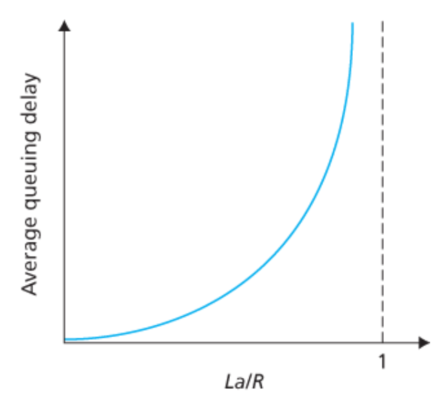
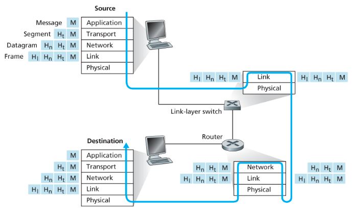

## Chapter 01-02 면접 핵심 정리

### Host(종단 시스템)
> 네트워크의 끝단에서 실제로 애플리케이션을 실행하는 장치

- 예시: 서버, PC, 스마트폰, IoT 기기
- 인터넷의 핵심은 `종단 시스템끼리 통신`한다는 점
- 애플리케이션은 네트워크 코어가 아니라 종단 시스템에서 실행된다

---

### Communication Link
> 호스트와 스위치, 라우터 등을 연결하는 통신 구간

- 패킷은 통신 링크를 통해 이동한다
- 링크마다 전송 가능한 속도 한계가 존재한다

---

### Bandwidth / Transmission Rate / Throughput / Goodput / Latency

#### Bandwidth
> 링크가 이론적으로 낼 수 있는 최대 전송 능력

- 최대치, 상한선, capacity에 가깝다
- 단위: bps

#### Transmission Rate
> 현재 실제로 데이터를 보내는 속도

- 네트워크 혼잡, 손실, RTT, 오버헤드에 영향을 받는다
- 보통 bandwidth보다 작다

#### Throughput
> 단위 시간 동안 실제로 목적지까지 전달된 데이터량

- end-to-end 전체 경로의 영향을 받는다
- 병목 구간의 성능이 전체 처리량을 제한한다

#### Goodput
> 전달된 데이터 중 실제 payload만 계산한 처리량

- 헤더, 재전송, ACK 등은 제외한다
- 항상 throughput보다 작다

#### Latency
> 데이터가 출발지에서 목적지까지 가는 데 걸리는 시간

- 단위: ms
- 대역폭과는 다른 개념이다

면접에서 자주 묻는 비교
- `Bandwidth`: 이론적 최대치
- `Throughput`: 실제 전달량
- `Goodput`: 사용자 입장에서 의미 있는 실제 데이터량

자주 나오는 질문
- 왜 `Transmission Rate < Bandwidth` 인가?
  - 혼잡, 손실, 재전송, 프로토콜 오버헤드 때문
- end-to-end throughput은 무엇에 의해 결정되는가?
  - `bottleneck link bandwidth`에 의해 결정된다

---

### Packet(패킷)
> 네트워크에서 데이터를 전달하기 위해 나눈 전송 단위

- 큰 데이터를 잘게 나눠 전송한다
- 각 패킷에는 헤더가 붙는다
- 목적지에서 다시 원래 데이터로 조립된다

---

### Packet Switch(패킷 스위치)
> 들어온 패킷을 적절한 다음 링크로 전달하는 장비

대표 장비
- `링크 계층 스위치`: 같은 LAN 내부에서 전달
- `라우터`: 서로 다른 네트워크 사이에서 전달

면접에서 자주 묻는 차이
- 스위치: 보통 `같은 네트워크 내부`
- 라우터: `네트워크와 네트워크 사이`

---

### Route / Path(경로)
> 패킷이 출발지에서 목적지까지 가는 동안 거치는 링크와 장비들의 집합

- 패킷은 하나 이상의 스위치/라우터를 거쳐 이동한다
- 경로는 네트워크 상태에 따라 달라질 수 있다

---

### ISP(Internet Service Provider)
> 사용자와 기업에 인터넷 접속을 제공하는 네트워크 사업자

- 가정용 인터넷, 회사 LAN, 모바일 네트워크 접속 등을 제공한다
- 여러 ISP가 서로 연결되어 전체 인터넷이 구성된다
- 하위 ISP는 상위 ISP를 통해 연결되고, 상위 ISP끼리는 직접 연결되기도 한다

---

### TCP / IP

#### IP(Internet Protocol)
> 패킷을 목적지까지 전달하기 위한 규칙

- 주소 지정과 전달을 담당한다

#### TCP(Transmission Control Protocol)
> 신뢰성 있는 전송을 위한 규칙

- 순서 보장
- 손실 시 재전송
- 흐름 제어
- 혼잡 제어

면접에서 핵심
- `IP는 전달`
- `TCP는 신뢰성 보장`

---

### 인터넷은 애플리케이션에 서비스를 제공하는 인프라

- 인터넷은 애플리케이션이 통신할 수 있게 해주는 `infrastructure`다
- 애플리케이션은 종단 시스템에서 실행된다
- 네트워크 코어는 데이터를 전달할 뿐, 애플리케이션 로직을 수행하지 않는다

---

### Socket Interface(소켓)
> 애플리케이션이 네트워크를 통해 다른 프로그램과 통신하기 위해 사용하는 인터페이스

- 프로세스가 네트워크 기능을 사용할 때의 출입구
- 특정 목적지 프로그램으로 데이터를 보내기 위한 방식

---

### Protocol(프로토콜)
> 통신 주체들이 따라야 하는 통신 규약

프로토콜은 다음을 정의한다.
- 메시지 형식
- 메시지 순서
- 이벤트 발생 시 동작 방식

핵심 포인트
- 같은 프로토콜을 따라야 통신 가능
- 단순히 데이터 형식만 정하는 것이 아니라, 통신 절차와 행동 규칙까지 정한다

---

### Packet Switching vs Circuit Switching
#### Packet Switching
> 데이터를 패킷 단위로 나눠서 필요할 때마다 전송하는 방식
- 자원을 예약하지 않음
- 네트워크 자원을 공유
- 지연이 발생할 수 있음 (큐잉)
  - 패킷이 라우터에 대기하면서 발생하는 지연

#### Circuit Switching
> 통신 전에 경로 자원을 미리 확보하는 방식
- 자원을 미리 예약
- 일정한 전송 속도 보장
- 사용하지 않아도 자원 점

#### Store-and-Forward
> 패킷 전체를 수신한 뒤 다음 링크로 전송하는 방식
- 라우터는 패킷을 전부 받아야 전송 시작
- 각 홉마다 전송 지연 발생

#### Packet Loss
> 버퍼가 가득 차서 패킷이 버려지는 현상
- 큐가 꽉 차면 발생
- 재전송 필요 -> 성능 저하

---

### Forwarding vs Routing
#### Forwarding
> 들어온 패킷을 어느 출력 링크로 보낼지 결정
- 라우터 내부 동작
- 매우 빠름

#### Routing
> 전체 네트워크에서 최적 경로를 결정
- 라우팅 프로토콜 사용
- forwarding table 생성

## Delay (지연)
> 패킷이 목적지까지 도달하는 데 걸리는 시간
- Processing Delay : 라우터가 패킷 처리하는 시간
- Queuing Delay : 큐에서 대기하는 시간
- Transmission Delay : 패킷을 링크에 밀어넣는 시간(L/R)
- Propagation Delay : 신호가 물리적으로 이동하는 시간(거리)

> 전체 지연은 4가지 delay의 합이며, 특히 queuing delay가 성능에 큰 영향을 줌

---

### Queuing Delay
> 패킷이 라우터에 대기하면서 발생하는 지연
- 트래픽이 많으면 증가
- 가장 예측 불가능함

### Traffic Intensity (트래픽 강도)
> 네트워크 혼잡도를 나타내는 지표



- La/R
    - 1에 가까워질수록 -> 큐잉 지연 폭발
    - 1초과 -> 시스템 붕괴 수

```
패킷이 규에 도착하는 평균율 : a 패킷/초
전송률(패킷이 큐에서 밀려나는 비율) : R 비트/초
모든 패킷은 L 비트
```

---

### 인터넷 프로토콜 스택
1. Application
    - 사용자와 직접 상호작용
2. Transport
    - 프로세스 간 통신
3. Network
    - 호스트 간 전달
4. Link
    - 노드 간 전달
5. Physical
    - 비트 전송



### Encapsulation (캡슐화)
> 계층을 내려가면서 헤더를 추가하는 과정

message -> segment -> datagram -> frame