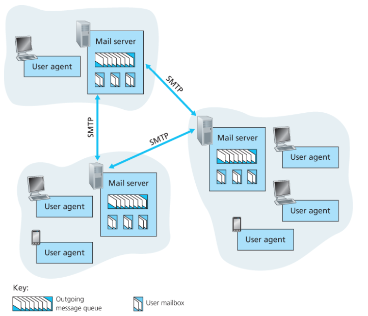
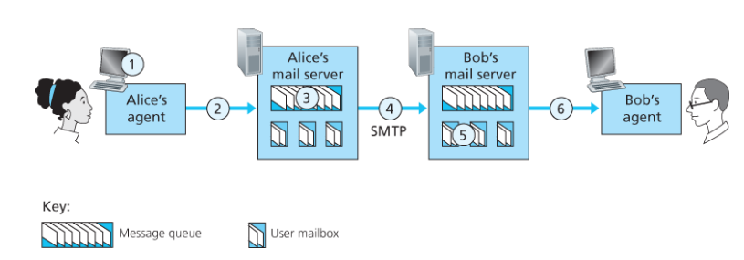
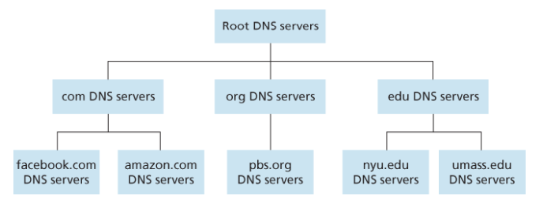

## Network Application 구조
### Client - Server
> 서버가 항상 켜져 있고 클라이언트가 요청
- 서버 중심 구조
- 클라이언트끼리 직접 통신 x
- 서버는 고정된 IP 주소 사용
- 확장 시 데이터센터 기반으로 수평 확장

### P2P
> 클라이언트끼리 직접 통신
- 서버 의존도 낮음
- 확장성 좋음
- 각 피어가 클라이언트 + 서버 역할 수행

### Process Communication (프로세스 통신)
> 실제 통신 주체는 프로그램이 아니라 프로세스
- 프로세스 간 메시지 교환
- 클라이언트 프로세스: 연결 시작
- 서버 프로세스: 연결 대기

### Socket
> 애플리케이션과 트랜스포트 계층 사이의 인터페이스

- 프로세스가 네트워크와 통신하는 출입구
- OS가 제공하는 네트워크 API

### 프로세스 주소 배정
> 프로세스가 다른 패킷으로 프로세스를 보내기 위해서는 수신 프로세스가 주소를 갖고 있어야 한다.
- IP 주소 -> 호스트 식별
- Port 번호 -> 프로세스 식별
- IP + Port = 하나의 통신 endpoint (소켓)

### Transport Layer 서비스 4가지

#### Data Integrity (신뢰성)
- 데이터 손실 없이 전달

#### Throughput (처리율)
- 전송 속도

#### Timing (시간)
- 지연 시간

#### Security (보안)
- 암호화

### TCP VS UDP

#### TCP
- 연결 지향 (3-way handshake)
- 신뢰성 보장 (재전송, 순서 보장)
- 혼잡 제어
- 흐름 제어 (수신자 속도에 맞춤)

#### UDP
- 비연결
- 신뢰성 없음
- 빠름
- 헤더 구조 단순 (오버헤드 적음)

---

## HTTP
> 웹에서 클라이언트와 서버가 통신하는 애플리케이션 계층 프로토콜
- TCP 기반
- Request(요청) / Response(응답) 구조
- 텍스트 기반 프로토콜 (HTTP/1.x)

### HTTP 특징
- Stateless
    - 서버가 클라이언트 상태를 저장하지 않음
- 동작 흐름
    1. TCP 연결
    2. 요청
    3. 응답
    4. 연결 종료 또는 유지

### Non-Persistent vs Persistent

#### Non-Persistent
> 요청마다 TCP 연결 생성
- 매 요청마다 2RTT

- 비효율적

#### Persistent
> 하나의 TCP 연결 재사용
- 성능 향상
- HTTP/1.1 기본
- 파이프라이닝 가능

### HTTP 메시지 구조

#### Request
- Method (GET, POST 등)
- URL
- Header
- Body

#### Response
- Status Code
- Header
- Body

#### 주요 HTTP  Method
- GET -> 데이터 조회
- POST -> 데이터 전송
- PUT -> 수정
- DELETE -> 삭제

#### Status Code
- 200 -> 성공
- 301 -> 이동
- 400 -> 잘못된 요청
- 404 -> 없음
- 500 -> 서버 에러

### Cookie
> Stateless 문제를 해결하기 위한 상태 유지 방법
- 서버가 사용자 식별 가능

#### 동작 핵심
- 서버가 식별자 발급 → 브라우저 저장 → 요청 시 포함

### Web Cache (캐싱)
> 서버 대신 데이터를 저장하고 재사용하는 방식
- 응답 속도 개선
- 트래픽 감소
- 서버 부하 감소

#### 동작
- 캐시에 있으면 -> 바로 응답 (cache hit)
- 없으면 -> 서버 요청 후 저장 (cache miss)

---

## 전자메일 구성 3가지

> 이메일 시스템의 핵심 구성 요소
- User Agent (UA)
- Mail Server
- SMTP

### SMTP
> 메일을 서버 간에 전달하는 프로토콜
- TCP 기반
- `push` 방식
- 서버 -> 서버
- 지속 연결 사용 가능

#### 동작 과정

> SMTP는 중간 서버 없이 송신 서버 → 수신 서버 직접 전달

---

## DNS
> 도메인 이름을 IP 주소로 변환하는 시스템
- 사람 -> domain (google.com)
- 네트워크 -> IP

### DNS 특징
- 분산 시스템
- 계층 구조
- UDP 사용 (port : 53)

#### UDP를 사용하는 이유
- 빠름 (핸드셰이크 없음)
- 요청/응답 작음

### DNS 서버 계층

1. Root DNS
2. TLD DNS (.com, .kr)
3. Authoritative

> DNS는 root -> TLD -> authoritative 구조로 동작

### DNS 동작 흐름
1. 클라이언트 → 로컬 DNS
2. 로컬 DNS → Root
3. Root → TLD
4. TLD → Authoritative
5. IP 반환

### DNS 캐싱
- TTL 기반 저장
- 속도 향상
- 트래픽 감소

### DNS Load Balancing
- 여러 IP를 반환하여 트래픽 분산

### IP + Port 연결
- HTTP 요청 전에 DNS 먼저 수행

---

## P2P
> 중앙 서버 없이 사용자들끼리 직접 데이터를 주고받는 구조
- 서버 의존도 낮음
- 피어들이 서로 데이터 공유

### Client-Server vs P2P

| 구분            | Client-Server        | P2P                          |
|-----------------|----------------------|-------------------------------|
| 구조            | 서버 중심            | 피어 간 직접 통신             |
| 통신 방식       | 클라이언트 → 서버    | 피어 ↔ 피어                   |
| 서버 의존도     | 높음                 | 낮음                          |
| 확장성          | 낮음                 | 높음                          |
| 부하 처리       | 서버 집중            | 분산                          |

### P2P 특징
#### Rarest First
> 가장 적게 퍼진 데이터부터 먼저 다운로드

#### Tit-for-Tat
> 많이 업로드해주는 피어에게 더 많이 보내줌

---

## 스트리밍 & CDN

### Video Streaming
> 네트워크를 통해 비디오를 실시간으로 전송하는 방식
- 높은 대역폭 필요
- 끊김 없이 재생이 중요

### HTTP Streaming
> HTTP 기반으로 비디오 전송
- TCP 기반
- 버퍼링 후 재생

### DASH
> 네트워크 상황에 따라 화질을 자동 조절하는 스트리밍 방식
- 여러 화질 존재
- 클라이언트가 상황에 맞게 선택

### CDN
> 전 세계에 서버를 분산 배치하여 콘텐츠를 빠르게 제공하는 시스템
- 사용자와 가까운 서버에서 제공
- 지연 감소
- 트래픽 분산

#### CDN 목적
- 응답 속도 개선
- 서버 부하 감소
- 병목 제거

#### 동작 핵심
- 사용자 요청 -> DNS -> 가까운 CDN 서버 연결