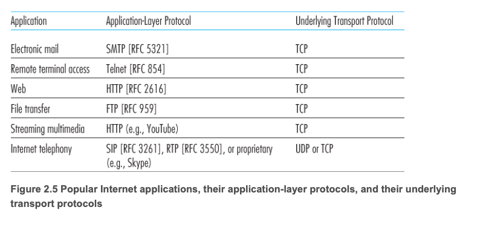
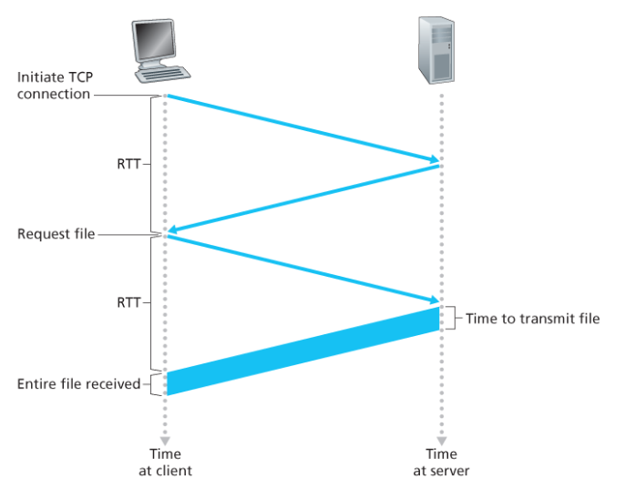

## Network Application 구조
### Client - Server
> 서버가 항상 켜져 있고 클라이언트가 요청
- 서버 중심 구조
- 클라이언트끼리 직접 통신 x

### P2P
> 클라이언트끼리 직접 통신
- 서버 의존도 낮음
- 확장성 좋음

### Process Communication (프로세스 통신)
> 실제 통신 주체는 프로그램이 아니라 프로세스
- 프로세스 간 메시지 교환

### Socket
> 애플리케이션과 트랜스포트 계층 사이의 인터페이스

- 프로세스가 네트워크와 통신하는 출입구

### 프로세스 주소 배정
> 프로세스가 다른 패킷으로 프로세스를 보내기 위해서는 수신 프로세스가 주소를 갖고 있어야 한다.
- IP 주소 -> 호스트 식별
- Port 번호 -> 프로세스 식별

### Transport Layer 서비스 4가지

#### Data Integrity (신뢰성)
- 데이터 손실 없이 전달

#### Throughput (처리율)
- 전송 속도

#### Timing (시간)
- 지연 시간

#### Security (보안)
- 암호화

### TCP VS UDP

#### TCP
- 연결 지향 (3-way handshake)
- 신뢰성 보장
- 혼잡 제어

#### UDP
- 비연결
- 신뢰성 없음
- 빠름

## HTTP
> 웹에서 클라이언트와 서버가 통시하는 애플리케이션 계층 프로토콜
- TCP 기반
- Request(요청) / Response(응답) 구조

### HTTP 특징
- Stateless
    - 서버가 클라이언트 상태를 저장하지 않음
- 동작 흐름
    1. TCP 연결
    2. 요청
    3. 응답
    4. 연결 종료 또는 유지

### Non-Persistent vs Persistent

#### Non-Persistent
> 요청마다 TCP 연결 생성
- 매 요청마다 2RTT

- 비효율적

#### Persistent
> 하나의 TCP 연결 재사용
- 성능 향상
- HTTP/1.1 기본

### HTTP 메시지 구조

#### Request
- Method (GET, POST 등)
- URL
- Header
- Body

#### Response
- Status Code
- Header
- Body

#### 주요 HTTP  Method
- GET -> 데이터 조회
- POST -> 데이터 전송
- PUT -> 수정
- DELETE -> 삭제

#### Status Code
- 200 -> 성공
- 301 -> 이동
- 400 -> 잘못된 요청
- 404 -> 없음
- 500 -> 서버 에러

### Cookie
> Stateless 문제를 해결하기 위한 상태 유지 방법
- 서버가 사용자 식별 가능

#### 동작 과정
1. 웹 서버에 HTTP 요청 메시지를 전달한다.
2. 웹 서버는 식별 번호를 만들고 인덱싱 되는 백엔드 데이터 베이스 안에 엔트리를 만든다.
3. HTTP 응답 메시지에 `Set-cookie: 식별번호`의 헤더를 포함해서 전달한다.
4. 브라우저는 헤더를 보고 관리하는 특정한 쿠키 파일에 그 라인을 덧붙인다.
5. 동일 웹 서버에 요청을 보낼때 브라우저는 쿠키를 참조하고 식별번호를 발췌하여 `Cookie : 식별번호`의 헤더를 요청과 함께 보낸다.

### Web Cache (캐싱)
> 서버 대신 데이터를 저장하고 재사용하는 방식
- 응답 속도 개선
- 트래픽 감소
- 서버 부하 감소

#### 동작
- 캐시에 있으면 -> 바로 응답
- 없으면 -> 서버 요청 후 저장

