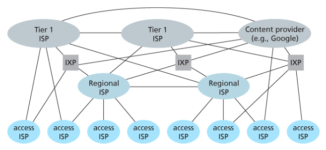
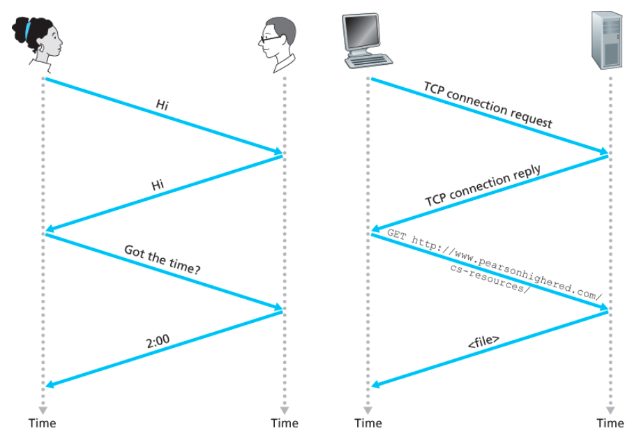

# Chapter 01. 인터넷이란?

## 1. 인터넷이란?

### 1.1 하드웨어와 소프트웨어 관점

- **인터넷**
  전 세계적으로 수십억 개의 컴퓨팅 장치를 연결하는 컴퓨터 네트워크이다.

- **호스트(Host), 종단 시스템(End System)**
  인터넷에 연결된 컴퓨팅 장치이며, 역할에 따라 **클라이언트(Client)** 와 **서버(Server)** 로 구분된다.

- **통신 링크(Communication Link)**
  다양한 전송률(bps)로 패킷(데이터)을 전달하는 매체이다.
  예: 동축 케이블, 구리선

- **패킷(Packet)**
  데이터를 세그먼트로 나누고 헤더를 붙여 목적지까지 전달한 뒤, 목적지에서 다시 조립하는 데이터 단위이다.

- **패킷 교환기(Packet Switch)**
  목적지 방향으로 패킷을 전달하기 위해 사용되는 장치이다.
  - **스위치(Switch)**: 접속 네트워크에서 사용
  - **라우터(Router)**: 네트워크 코어에서 사용

- **경로(Path)**
  시작 지점부터 목적지까지 도달하는 동안 거치는 통신 링크와 패킷 교환기의 집합이다.

- **ISP(Internet Service Provider)**
  패킷 스위치와 통신 링크로 이루어진 네트워크이다. 종단 시스템에 다양한 네트워크 접속을 제공하며, 인터넷은 종단 시스템들을 서로 연결하는 구조이므로 ISP들 또한 서로 연결되어 있어야 한다.

  하위 계층 ISP는 국가 및 국제 상위 계층 ISP를 통해 서로 연결되고, 상위 계층 ISP들은 직접 연결된다. 각 ISP 네트워크는 별도로 관리되며, IP 프로토콜을 수행하고 네이밍 및 주소 배정 방식을 따른다.

- **프로토콜(Protocol)**
  정보의 송수신을 위한 통신 규약이다.
  예: TCP/IP

  서로 다른 프로토콜을 사용하면 상호작용할 수 없다.

- **네트워크 프로토콜**
  둘 이상의 개체가 포함된 인터넷 환경에서 일어나는 모든 통신 활동을 제어한다.

  예시:
  - **혼잡 제어(Congestion Control)**: 종단 시스템에 존재하며, 송수신자 간에 전송되는 패킷 전송률을 조절한다.
  - **라우터에서의 프로토콜**: 출발지에서 목적지까지 패킷이 이동할 경로를 설정한다.

### 1.2 서비스 측면에서 본 인터넷

인터넷은 애플리케이션에 서비스를 제공하는 **인프라스트럭처(Infrastructure)** 이다.

- **소켓 인터페이스(Socket Interface)**
  한 종단 시스템에서 수행되는 프로그램이 다른 종단 시스템에서 수행되는 특정 목적지 프로그램으로 데이터를 전달하도록, 인터넷 인프라스트럭처에 어떤 방식으로 요청해야 하는지를 명시한 인터페이스를 의미한다.

### 1.3 네트워크 코어

링크와 스위치의 네트워크를 통해 데이터를 이동시키는 방식은 크게 두 가지이다.

1. **패킷 교환(Packet Switching)**: 자원을 미리 보장하지 않는다.
2. **회선 교환(Circuit Switching)**: 자원을 예약하므로 보장된다.

#### 1.3.1 패킷 교환

종단 시스템들은 서로 메시지를 교환한다.

1. 송신 시스템은 메시지를 **패킷** 이라는 데이터 덩어리로 분할한다.
2. 각 패킷은 통신 링크와 패킷 스위치를 거친다.
3. 각 패킷은 링크의 최대 전송률에 맞는 속도로 각각의 통신 링크에서 전송된다.

패킷 스위치에는 라우터와 링크 계층 스위치가 존재한다.

#### 저장 후 전달(Store-and-Forward) 전송 방식

스위치가 패킷의 첫 비트를 출력 링크로 전송하기 전에, 전체 패킷을 먼저 모두 받아야 한다.

출발지는 목적지로 전송할 3개의 패킷(1, 2, 3)을 가지고 있으며, 각 패킷은 `L` 비트로 구성되어 있다. 출발지는 링크에서 `L` 비트의 패킷을 `R bps(bits per second)`의 속도로 송신한다.

이 때 경과 시간에 대해서 생각
* 0 초 : 출발지가 패킷 1을 전송하기 시작
* L/R 초
라우터는 패킷 1을 수신 완료, 이를 전송하기 시작
출발지는 패킷 2를 전송하기 시작
* 2L/R 초
라우터는 패킷 2를 수신 완료, 이를 전송하기 시작
목적지는 패킷 1 전체를 수신 완료
출발지는 패킷 3을 전송하기 시작
* 3L/R 초
라우터는 패킷 3를 수신 완료, 이를 전송하기 시작
목적지는 패킷 2 전체를 수신 완료
* 4L/R 초 : 목적지는 패킷 3 전체를 수신 완료

따라서 저장-후-전달 전송 방식을 채택한다면 목적지는 4L/R 초에 3개의 모든 패킷을 수신하게 된다.
