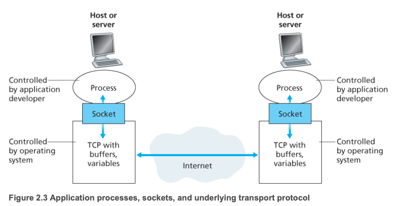
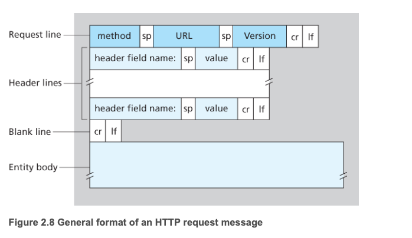
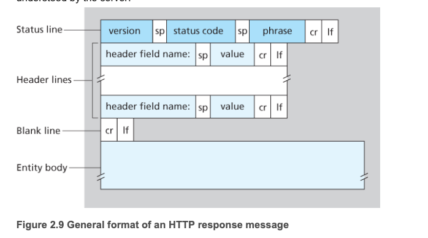
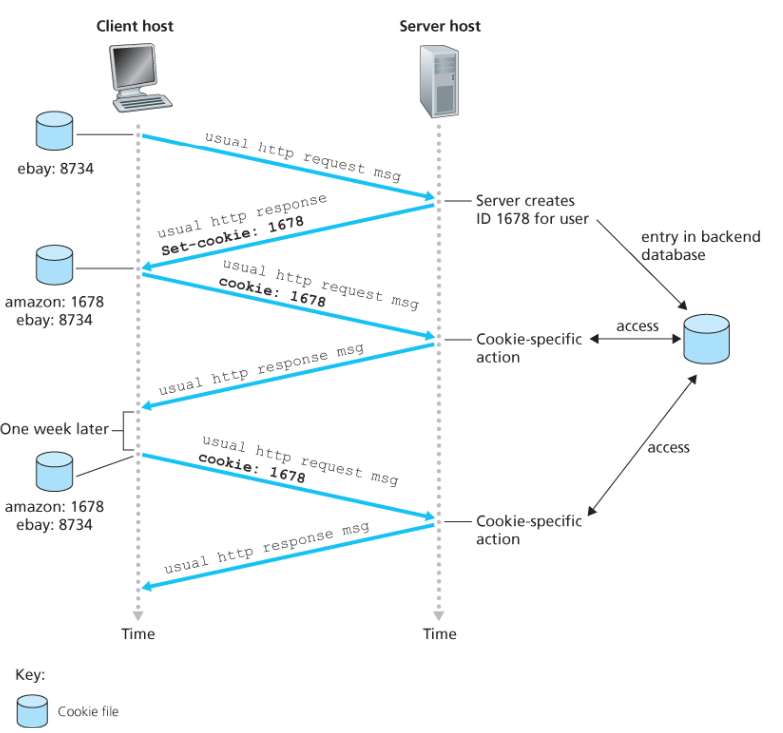
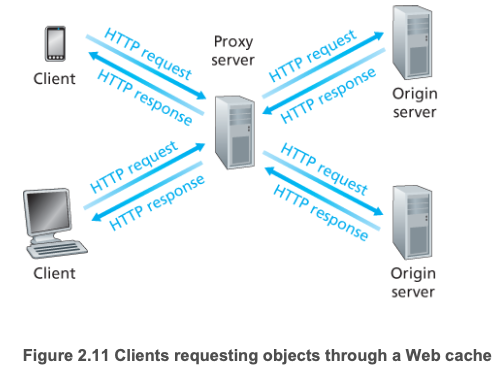
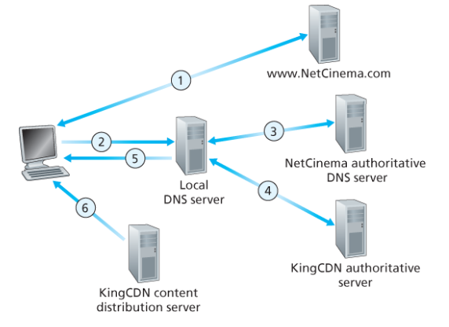

# Chapter 02. 애플리케이션 계층

## 1. 애플리케이션 구조

애플리케이션 구조는 크게 두 가지로 나눌 수 있다.

### 1.1 클라이언트-서버 구조

- 항상 동작하고 있는 서버가 존재한다.
- 클라이언트는 다른 호스트로부터 서비스를 요청한다.
- 클라이언트끼리는 직접 통신하지 않는다.
- 서버는 일반적으로 고정 IP 주소를 가진다.

### 1.2 P2P 구조

`P2P(Peer-to-Peer)` 구조에서는 간헐적으로 연결된 호스트 쌍이 서로 직접 통신한다. 여기서 `peer`는 클라이언트 역할을 하며, 즉 클라이언트끼리 직접 통신하는 구조라고 볼 수 있다.

### 1.3 프로세스와 소켓

프로세스는 소켓을 통해 네트워크로 메시지를 보내고 받는다. 네트워크 관점에서 프로세스를 집이라고 한다면, 소켓은 그 집의 문에 해당한다.

소켓은 호스트의 애플리케이션 계층과 트랜스포트 계층 사이의 인터페이스이다. 즉, 애플리케이션과 네트워크 사이의 `API` 라고도 볼 수 있다.

### 1.4 수신 프로세스 식별

수신 프로세스를 식별하려면 다음 두 가지 정보가 필요하다.

1. 호스트의 주소, 즉 `IP 주소`
2. `포트 번호(Port Number)`

### 1.5 TCP 서비스와 UDP 서비스

#### TCP 서비스

- **연결 지향형(Connection-Oriented)**
  애플리케이션 계층 메시지를 전송하기 전에 TCP는 클라이언트와 서버가 서로 전송 제어 정보를 교환하게 한다.
  이 과정에서 **핸드셰이킹(Handshaking)** 을 수행한다.

- **신뢰적인 데이터 전송 서비스**
  모든 데이터를 오류 없이 올바른 순서로 전달하기 위해 TCP에 의존한다.

- **혼잡 제어**
  네트워크 혼잡 상황을 고려해 전송 방식을 제어한다.

#### UDP 서비스

- **비연결형(Connectionless)**
  핸드셰이킹 과정을 거치지 않는다.

- **비신뢰적 데이터 전송 서비스**
  데이터 전달 보장을 제공하지 않는다.

- **혼잡 제어 미지원**
  TCP와 달리 혼잡 제어 방식을 포함하지 않는다.

## 2. 웹과 HTTP

### 2.1 웹 페이지

웹 페이지는 기본 `HTML` 파일과 여러 참조 객체들로 구성된다.

예를 들어, HTML 파일과 5개의 이미지로 구성된 페이지라면 총 6개의 객체로 이루어진다.

HTML 파일은 페이지 내부의 다른 객체들을 각 객체의 `URL` 로 참조한다.

### 2.2 웹 브라우저와 클라이언트

웹 브라우저는 웹의 **클라이언트** 역할을 한다.

사용자가 웹 페이지를 요청하면 다음과 같은 과정이 일어난다.

1. 브라우저는 페이지 내부 객체에 대한 `HTTP 요청 메시지`를 서버로 보낸다.
2. 서버는 요청을 수신하고, 객체를 포함한 `HTTP 응답 메시지`를 반환한다.

### 2.3 HTTP와 TCP

HTTP는 전송 프로토콜로 TCP를 사용한다.

HTTP는 TCP가 손실 데이터를 어떻게 복구하고, 데이터를 올바른 순서로 배열하는지 직접 신경 쓸 필요가 없다. 이것이 계층 구조의 장점이다.

### 2.4 비상태 프로토콜

HTTP 서버는 클라이언트에 대한 정보를 유지하지 않으므로, HTTP는 **비상태(Stateless) 프로토콜** 이라고 부른다.

### 2.5 비지속 연결과 지속 연결

#### 비지속 연결(Non-Persistent Connection)

클라이언트와 서버의 각 요청/응답 쌍이 서로 다른 TCP 연결을 통해 처리되는 방식을 말한다.

동작 과정은 다음과 같다.

1. HTTP 클라이언트는 기본 포트 `80`을 통해 서버로 TCP 연결을 시도한다.
2. 연결이 설정되면 클라이언트는 해당 소켓을 통해 HTTP 요청 메시지를 보낸다.
3. 서버는 요청 메시지를 받고, 저장 장치에서 요청한 객체를 찾아 HTTP 응답 메시지에 담아 전송한다.
4. 서버는 TCP에게 연결을 끊으라고 요청한다.
5. 클라이언트는 응답 메시지를 받고, 응답 객체가 HTML 파일인지 확인한 뒤 참조 객체를 다시 요청한다.
6. 참조된 객체들에 대해서도 같은 과정을 반복한다.

단점은 다음과 같다.

- 각 요청 객체마다 새로운 연결을 설정하고 유지해야 한다.
- 보통 객체마다 `2RTT` 가 필요하다.

#### 지속 연결(Persistent Connection)

`HTTP/1.1` 의 지속 연결에서는 서버가 응답을 보낸 뒤에도 TCP 연결을 유지한다.

같은 클라이언트와 서버 사이의 여러 요청/응답은 하나의 TCP 연결을 통해 전달될 수 있다. 즉, 같은 서버에 있는 여러 웹 페이지 객체를 하나의 지속 TCP 연결로 처리할 수 있다.

### 2.6 HTTP 메시지

#### HTTP 요청 메시지

HTTP 요청 메시지는 다음 요소로 구성된다.

- 메서드(Method)
- URL
- HTTP 버전
- 헤더(Header)
- 본체(Body)

`GET` 방식에서는 일반적으로 본체가 비어 있고, `POST` 방식에서는 본체가 사용된다.

#### HTTP 응답 메시지

HTTP 응답 메시지는 다음 요소로 구성된다.

- 상태 라인(Status Line)
- 상태 코드(Status Code)
- 헤더(Header)

### 2.7 쿠키

사용자를 식별할 때 쿠키를 사용할 수 있다.

동작 과정은 다음과 같다.

1. 브라우저가 웹 서버에 HTTP 요청 메시지를 전달한다.
2. 웹 서버는 유일한 식별 번호를 만들고, 이 번호를 키로 사용하는 백엔드 데이터베이스 엔트리를 생성한다.
3. 서버는 HTTP 응답 메시지에 `Set-Cookie` 헤더를 포함해 보낸다.
4. 브라우저는 이를 보고 관리 중인 쿠키 파일에 해당 정보를 저장한다.
5. 이후 같은 서버에 다시 요청할 때, 브라우저는 쿠키 파일을 참조해 `Cookie` 헤더와 함께 식별 번호를 보낸다.

이 과정을 통해 웹 서버는 사용자를 식별할 수 있다.

### 2.8 웹 캐싱

웹 캐시(Cache)는 기점 웹 서버를 대신해 HTTP 요청을 만족시키는 객체이다. 자체 저장 장치를 가지고 있으며, 최근 호출된 객체의 사본을 저장하고 유지한다.

동작 과정은 다음과 같다.

1. 브라우저는 웹 캐시와 TCP 연결을 맺고, 원하는 객체에 대한 HTTP 요청을 보낸다.
2. 웹 캐시는 객체의 사본이 저장되어 있는지 확인한다.
3. 저장되어 있다면 클라이언트에게 HTTP 응답 메시지와 함께 객체를 보낸다.
4. 저장되어 있지 않다면 기점 서버와 TCP 연결을 설정하고 객체를 요청한다.
5. 기점 서버로부터 객체를 수신하면, 이를 로컬 저장장치에 복사하고 클라이언트에게 전달한다.

웹 캐시는 **클라이언트이면서 동시에 서버** 역할을 한다.

장점은 다음과 같다.

1. 클라이언트 요청에 대한 응답 시간을 줄일 수 있다.
2. 웹 트래픽을 크게 줄일 수 있다.

## 3. 인터넷 전자 메일

### 3.1 전자 메일의 3가지 요소

- **사용자 에이전트(User Agent)**
  사용자가 메시지를 읽고, 응답하고, 전달하고, 저장하고, 작성할 수 있도록 도와준다.
  예: Microsoft Outlook, Apple Mail

- **메일 서버(Mail Server)**
  송신자와 수신자 사이에서 메일을 저장하고 전달하는 역할을 한다.

- **SMTP**
  메일 서버 간 전송에 사용되는 프로토콜이다.

### 3.2 메일 전달 과정

일반적인 메일 전달은 다음과 같이 이루어진다.

1. 송신자의 사용자 에이전트에서 메일 작성이 시작된다.
2. 메일은 송신자의 메일 서버로 전달된다.
3. 이후 수신자의 메일 서버로 전달된다.
4. 수신자는 적절한 시점에 사용자 에이전트를 통해 메일을 읽는다.

### 3.3 SMTP

SMTP는 TCP의 신뢰적인 데이터 전송 서비스를 이용하며, 클라이언트 측과 서버 측을 모두 가진다.

동작 과정은 다음과 같다.

1. 앨리스는 사용자 에이전트를 이용해 밥의 전자메일 주소로 메시지를 보낸다.
2. 앨리스의 사용자 에이전트는 메시지를 그녀의 메일 서버로 보내고, 메시지는 메일 서버의 큐에 저장된다.
3. 앨리스의 메일 서버에서 동작하는 SMTP 클라이언트는 메시지 큐를 확인한다.
4. 밥의 메일 서버에서 동작하는 SMTP 서버와 TCP 연결을 설정한다.
5. 초기 SMTP 핸드셰이킹 이후 메시지를 TCP 연결을 통해 보낸다.
6. 밥의 메일 서버는 메시지를 수신하고 밥의 메일박스에 저장한다.
7. 밥은 나중에 사용자 에이전트를 실행해 메시지를 읽는다.

추가 특징은 다음과 같다.

- SMTP는 메일 서버 간 전송 시 중간 메일 서버에 저장해가며 전달하지 않는다.
- 전송이 실패하더라도 중간 서버에 남는 것이 아니라, 송신자의 메일 서버에 남아 있게 된다.
- SMTP는 **push 프로토콜** 이다.
- 반면 메일을 읽어오는 작업은 **pull 방식** 이므로 `HTTP` 나 `IMAP` 같은 프로토콜을 사용한다.

## 4. DNS

### 4.1 DNS 개요

`DNS(Domain Name System)` 는 호스트 이름을 IP 주소로 변환해주는 서비스이다.

### 4.2 DNS가 UDP를 사용하는 이유

DNS가 UDP를 주로 사용하는 이유는 다음과 같다.

1. `3-way handshaking` 과정이 없어 연결 설정 비용이 작다.
2. DNS는 신뢰성보다 속도가 더 중요한 경우가 많다.
3. DNS 패킷 크기가 작아 UDP로 처리하기 적합하다.
4. 연결 상태를 유지할 필요가 없다.

### 4.3 DNS의 분산 구조

DNS는 분산되도록 설계되어 있다.

주요 구성 요소:

- 루트 DNS 서버(Root DNS Server)
- 최상위 도메인 DNS 서버(TLD DNS Server)
- 권한 DNS 서버(Authoritative DNS Server)
- 로컬 DNS 서버(Local DNS Server)

### 4.4 DNS 캐싱

실제 DNS 시스템에서는 지연을 줄이고 DNS 메시지 수를 감소시키기 위해 **캐싱(Caching)** 을 사용한다.

질의 과정에서 DNS 서버는 DNS 응답을 받았을 때, 그 결과를 로컬 메모리에 저장할 수 있다.

## 5. P2P 애플리케이션

클라이언트-서버 파일 분배에서는 서버가 파일 복사본을 각 클라이언트에게 모두 보내야 하므로 서버에 큰 부하가 걸린다.

### 5.1 토렌트

대표적인 예로 `Torrent` 가 있다.

- 특정 파일 분배에 참여하는 모든 피어의 모임을 **토렌트(Torrent)** 라고 한다.
- 토렌트에 참여한 피어들은 같은 크기의 **청크(Chunk)** 를 서로 다운로드한다.
- 일반적으로 청크 크기는 약 `256KB` 이다.

처음에는 어떤 피어도 청크를 많이 가지고 있지 않지만, 시간이 지날수록 다른 피어들로부터 청크를 받아 점점 더 많은 데이터를 보유하게 된다.

또한 피어는 청크를 다운로드하는 동시에 다른 피어들에게 청크를 업로드한다.

한 피어가 전체 파일을 모두 얻으면 다음 두 가지 중 하나를 할 수 있다.

1. 토렌트를 떠난다.
2. 토렌트에 남아 다른 피어들에게 계속 청크를 업로드한다.

## 6. CDN

`CDN(Content Delivery Network)` 은 다수의 지점에 분산된 서버들을 운영하며, 비디오나 기타 웹 콘텐츠의 복사본을 여러 분산 서버에 저장한다.

### 6.1 기본 동작

대표 개념:

- **Enter Deep**
- **Bring Home**

동작 과정은 다음과 같다.

1. 사용자가 URL을 입력해 비디오를 요청한다.
2. CDN은 해당 요청을 가로채고, 클라이언트에게 가장 적절한 CDN 클러스터를 선택한다.
3. 이 과정에서 요청을 적절히 연결하기 위해 DNS를 활용한다.
4. 이후 클라이언트의 요청은 선택된 클러스터 서버로 전달된다.

### 6.2 클러스터 선택 정책

1. 지리적으로 가까운 클러스터를 선택하는 방식
2. 실시간 측정을 통해 가장 적합한 클러스터를 선택하는 방식
