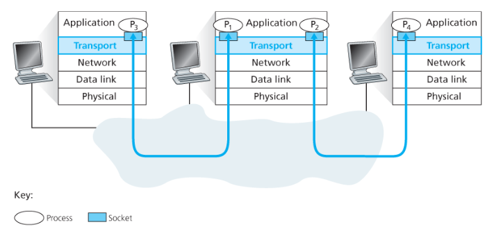
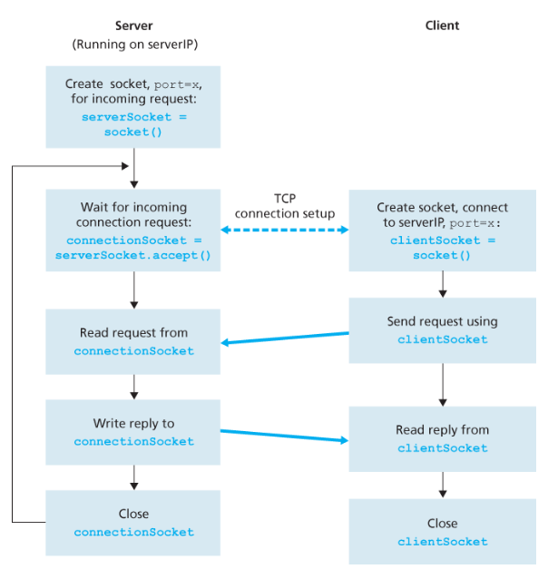
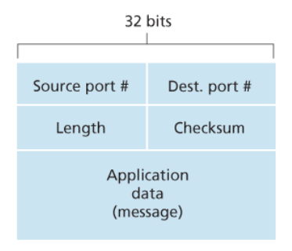

## 트랜스포트 계층 서비스 및 개요

### 트랜스포트 계층
> 서로 다른 호스트에서 동작하는 애플리케이션 프로세스 간의 논리적 통신 제공

- 애플리케이션 관점에서는 호스트들이 직접 연결된 것처럼 보임
- 트랜스포트 계층은 종단 시스템에서 구현됨

---

### 데이터 전달 과정
- 애플리케이션 메시지를 세그먼트(segment)로 변환
- 메시지를 작은 조각으로 분할
- 각 조각에 트랜스포트 계층 헤더 추가
- 네트워크 계층으로 전달

- 세그먼트는 데이터그램(datagram)에 캡슐화되어 전달됨
- 라우터는 네트워크 계층 정보만 처리
- 트랜스포트 계층 정보는 종단 시스템에서만 처리

- 수신 측에서 역순으로 처리
    - datagram → segment → application

---

### 트랜스포트 계층과 네트워크 계층

> 트랜스포트 계층: 프로세스 간 통신  
> 네트워크 계층: 호스트 간 통신  

- 트랜스포트 계층은 네트워크 계층 위에서 동작
- 네트워크 계층이 제공하는 기능에 제약받음

---

### 핵심 개념
- 네트워크 계층은 best-effort 서비스 제공
- 전달, 순서, 무결성 보장 없음

- 트랜스포트 계층은 부족한 기능을 보완
    - TCP: 신뢰성 제공
    - UDP: 최소 기능 제공

---

### TCP vs UDP

#### TCP
- 연결 지향
- 신뢰성 보장
- 순서 보장
- 재전송
- 흐름 제어
- 혼잡 제어

#### UDP
- 비연결
- 신뢰성 없음
- 빠름
- 오버헤드 적음

---

### 세그먼트와 데이터그램
- Segment: 트랜스포트 계층 데이터
- Datagram: 네트워크 계층 데이터

---

### IP (Internet Protocol)
> 네트워크 계층 프로토콜

- best-effort delivery
- 비신뢰적 서비스

---

### 트랜스포트 계층 기능

#### Multiplexing
> 여러 소켓의 데이터를 모아 세그먼트 생성
- 송신 측

#### Demultiplexing
> 수신된 세그먼트를 올바른 소켓으로 전달
- 수신 측

---

### 오류 검출
- 트랜스포트 계층 헤더에 오류 검출 필드 포함
- 데이터 무결성 확인

---

## 다중화와 역다중화

### 개념
> 호스트 간 전달을 프로세스 간 전달로 확장하는 과정

- 네트워크 계층은 호스트 간 전달
- 트랜스포트 계층은 프로세스 간 전달

---

### 기본 동작
- 트랜스포트 계층은 네트워크 계층으로부터 세그먼트를 받음
- 해당 데이터를 올바른 애플리케이션 프로세스로 전달

---

### Socket
> 프로세스와 네트워크 사이의 출입구

- 각 프로세스는 하나 이상의 소켓을 가짐
- 각 소켓은 고유한 포트 번호를 가짐

---

### 세그먼트 전달 방식

#### Demultiplexing
> 수신된 세그먼트를 올바른 소켓으로 전달
- 목적지 포트 번호 기준

#### Multiplexing
> 여러 소켓의 데이터를 모아 세그먼트 생성
- 송신 측에서 수행

---

### 포트 번호 필드
- Source Port Number
- Destination Port Number

---

## UDP 다중화 특징

### 특징
> 비연결형 통신

- 소켓 식별 기준:
    - 목적지 IP + 목적지 Port

- 동일한 목적지이면 같은 프로세스로 전달됨

---

### Source Port 역할
- 응답을 위한 회신 주소 역할

---

## TCP 다중화 특징

### 소켓 식별 기준 (4-tuple)
- 출발지 IP
- 출발지 Port
- 목적지 IP
- 목적지 Port

---

### 특징
- 동일한 목적지 포트라도
- 출발지 정보가 다르면 다른 연결로 구분됨

---

## TCP 연결 구조

### 서버 구조
- welcome socket (연결 대기)
- connection socket (연결별 생성)

---

### 동작 흐름
- 클라이언트가 연결 요청 전송
- 서버는 요청을 받아 새로운 소켓 생성
- 이후 통신은 해당 소켓으로 진행

---

## 웹 서버와 TCP

### 특징
> 하나의 서버는 여러 클라이언트 처리 가능

- 각 연결은 서로 다른 소켓으로 구분됨
- 동일한 포트(80) 사용 가능

---

### 서버 처리 방식
- 과거: 연결마다 프로세스 생성
- 현재: 하나의 프로세스 + 여러 스레드 사용

---

## HTTP 연결 방식

### Persistent
- 하나의 TCP 연결 유지
- 여러 요청 처리 가능

---

### Non-persistent
- 요청마다 TCP 연결 생성
- 오버헤드 증가

---

## 비연결형 트랜스포트: UDP

### UDP
> 최소 기능을 제공하는 트랜스포트 계층 프로토콜

- 다중화 / 역다중화 지원
- 간단한 오류 검사 기능
- 그 외 기능은 없음 (IP에 거의 추가 없음)

---

### 특징
- 비연결형 (connectionless)
- 핸드셰이크 없음
- 상태 유지 없음
- 빠름
- 헤더 오버헤드 작음 (8 bytes)

---

### 동작 과정
- 애플리케이션 메시지 수신
- 포트 번호(출발지, 목적지) 헤더에 추가
- 세그먼트를 네트워크 계층으로 전달
- IP 데이터그램으로 캡슐화되어 전송

- 수신 측에서
    - 목적지 포트 번호로 프로세스 식별
    - 해당 애플리케이션으로 전달

---

### UDP vs TCP 비교

#### UDP
- 비연결
- 신뢰성 없음
- 혼잡 제어 없음
- 즉시 전송

#### TCP
- 연결 지향
- 신뢰성 제공
- 혼잡 제어 존재
- 재전송 수행

---

### UDP 장점

- 빠른 전송 (연결 설정 없음)
- 지연 최소화
- 애플리케이션이 직접 제어 가능
- 많은 클라이언트 처리 가능 (상태 없음)
- 오버헤드 적음

---

### UDP 단점

- 신뢰성 없음
- 순서 보장 없음
- 혼잡 제어 없음

→ 네트워크 혼잡 시 패킷 손실 증가

---

### 사용 예

- DNS
- 실시간 스트리밍
- 온라인 게임

---

## UDP 세그먼트 구조

- 애플리케이션 데이터 : UDP 데이터그램의 데이터 필드에 위치한다
- 포트번호 : 목적지 호스트가 목적지 종단 시스템에서 동작하는 (역다중화 기능을 수행하는) 정확한 프로세스에게 애플리케이션 데이터를 넘기게 해준다
- 체크섬 : 세그먼트에 오류가 발생했는지 검사하기 위해 수신 호스트가 사용한다
- 길이 필드 : 헤더를 포함하는 UDP 세그먼트의 길이를 바이트 단위로 나타낸다

---

### 체크섬 (Checksum)
> 데이터 오류 검출

- 송신 측: 데이터 기반으로 체크섬 계산
- 수신 측: 동일 계산 후 비교

---

### 특징
- 오류 검출만 수행
- 오류 복구는 하지 않음

---

## 종단 간 원칙 (End-to-End Principle)

> 신뢰성은 종단에서 보장

- 네트워크 내부가 아닌
- 송신자와 수신자가 직접 처리

---

### 의미
- UDP는 단순 전달만 수행
- 필요 시 애플리케이션에서 신뢰성 구현

---

## TCP (연결지향형 트랜스포트)

### TCP
> 신뢰적인 데이터 전송을 제공하는 연결지향형 프로토콜

- 연결 설정 후 데이터 전송
- 전이중 통신 (양방향)
- 점대점 통신 (1:1)

---

### TCP 연결

- 클라이언트가 연결 시작
- 서버가 요청 대기

---

### 3-way handshake

1. 클라이언트 → SYN 전송
2. 서버 → SYN + ACK 응답
3. 클라이언트 → ACK 응답

→ 연결 설정 완료

---

### 특징
- 초기 2개 세그먼트는 데이터 없음
- 3번째부터 데이터 전송 가능

---

## TCP 데이터 전송

### 버퍼 구조

- 송신 버퍼 (send buffer)
- 수신 버퍼 (receive buffer)

- 애플리케이션은 버퍼를 통해 데이터 송수신

---

### MSS (Maximum Segment Size)

- 한 세그먼트에 담을 수 있는 최대 데이터 크기
- MTU 기반으로 결정
    - 최대 전송 단위 (maximum transmission unit, MTU)

---

## TCP 세그먼트 구조

### 주요 필드

---

### Sequence Number (순서 번호)
> 데이터 순서 식별

- 세그먼트의 첫 바이트 번호

---

### Acknowledgment Number
> 다음에 받을 바이트 번호

- 누적 확인응답 방식

---

### 특징
- TCP는 바이트 스트림 기반
- 순서 보장
- 중복 제거

---

## 신뢰적인 데이터 전송

### 핵심 메커니즘

- Checksum → 오류 검출
- ACK → 수신 확인
- Retransmission → 재전송
- Sequence Number → 순서 보장

---

### 타이머 기반 재전송

- 일정 시간 내 ACK 없으면 재전송

---

### RTT (Round Trip Time)

> 전송 → 응답까지 걸리는 시간

---

### Timeout 설정

- RTT 기반으로 설정
- 너무 짧으면 불필요 재전송
- 너무 길면 지연 증가

---

## 빠른 재전송 (Fast Retransmit)

> 타임아웃 전에 손실 감지

- 동일한 ACK 3번 수신 시 재전송

---

## 흐름 제어 (Flow Control)

> 수신자가 처리 가능한 속도로 제한

- 수신 버퍼 기반
- receive window 사용

---

### 목적
- 수신 버퍼 overflow 방지

---

## 혼잡 제어 (Congestion Control)

> 네트워크 혼잡 방지

- 네트워크 상태에 따라 전송 속도 조절

---

### 흐름 제어 vs 혼잡 제어

- 흐름 제어 → 수신자 보호
- 혼잡 제어 → 네트워크 보호

---

## TCP 연결 종료

1. 클라이언트 → FIN
2. 서버 → ACK
3. 서버 → FIN
4. 클라이언트 → ACK

→ 연결 종료

---

## 핵심 정리

- TCP는 신뢰성 보장 프로토콜
- 3-way handshake로 연결 설정
- 순서번호 + ACK + 재전송으로 신뢰성 확보
- 흐름 제어 + 혼잡 제어로 안정성 유지