# 트랜스포트 계층 서비스 및 개요

트랜스포트 계층은 애플리케이션 프로세스 간의 논리적 통신을 제공한다. 즉, 서로 다른 호스트에서 동작하는 프로세스들이 직접 연결된 것처럼 보이게 한다.

트랜스포트 계층 프로토콜은 네트워크 라우터가 아니라 호스트에서 구현된다.

## 트랜스포트 계층의 동작

1. 송신 측 트랜스포트 계층은 수신 받은 메시지를 트랜스포트 계층 패킷인 세그먼트(segment)로 변환한다.
2. 트랜스포트 계층은 세그먼트를 네트워크 계층으로 전달한다.
3. 수신 측 네트워크 계층은 세그먼트를 추출해서 트랜스포트 계층으로 보내고, 트랜스포트 계층은 애플리케이션 계층에서 이용할 수 있도록 세그먼트를 처리한다.

네트워크 애플리케이션에서는 하나 이상의 트랜스포트 계층 프로토콜을 사용할 수 있다.

> 예: TCP, UDP

## 트랜스포트 계층과 네트워크 계층

- 트랜스포트 계층: 다른 호스트에서 동작하는 프로세스 사이의 논리적 통신을 제공한다.
- 네트워크 계층: 호스트 사이의 논리적 통신을 제공한다.

트랜스포트 계층은 네트워크 계층이 제공하지 못하는 일부 기능을 보완할 수 있다. 예를 들어 IP 프로토콜은 비신뢰적이지만, TCP는 기능을 추가해 신뢰성을 제공할 수 있다.

다만 네트워크 자원 자체에 의존하는 지연, 대역폭 같은 보장은 트랜스포트 계층 혼자 만들 수 없다.

## 트랜스포트 계층 프로토콜

### TCP(Transmission Control Protocol)

- 신뢰적
- 연결 지향형
- 혼잡 제어
- 흐름 제어

### UDP(User Datagram Protocol)

- 비신뢰적
- 비연결형

## 다중화와 역다중화

다중화와 역다중화는 네트워크 계층의 호스트 대 호스트 전달 서비스를 애플리케이션의 프로세스 대 프로세스 전달 서비스로 확장하는 과정이다.

1. 목적지에서 트랜스포트 계층은 네트워크 계층으로부터 세그먼트를 수신한다.
2. 트랜스포트 계층은 세그먼트를 소켓에게 전달한다.

프로세스는 애플리케이션의 한 부분으로서 소켓을 가지고 있다. 소켓은 데이터를 전달하는 출입구 역할을 하며, 유일한 식별자인 포트 번호를 가진다.

### 역다중화

역다중화는 세그먼트를 올바른 소켓으로 전달하는 작업이다. UDP의 동작 과정과 같다.

### 다중화

다중화는 출발지 호스트의 소켓으로부터 데이터를 모으고, 세그먼트 생성을 위해 각 데이터에 헤더 정보를 붙여 캡슐화한 뒤, 세그먼트들을 네트워크 계층으로 전달하는 작업이다.

### 다중화 요구사항

1. 소켓은 유일한 포트 번호를 가진다.
2. 각 세그먼트는 세그먼트가 전달될 적절한 소켓을 가리키는 특별한 필드를 가진다.

특별한 필드에는 다음이 포함된다.

- 출발지 포트 번호 필드
- 도착지 포트 번호 필드

출발지 포트 번호는 회신 주소의 한 부분으로 사용된다.

B가 A에게 세그먼트를 보낸다고 할 때, B에서 A로 가는 세그먼트의 목적지 포트 번호는 A에서 B로 가는 세그먼트의 출발지 포트 번호로부터 가져온다.


## 연결 지향형 다중화와 역다중화

TCP 소켓은 4개 요소의 집합에 의해 식별된다.

1. 출발지 IP 주소
2. 출발지 포트 번호
3. 목적지 IP 주소
4. 목적지 포트 번호

HTTP 연결 방식은 다음과 같이 나눌 수 있다.

- 지속적인 HTTP
- 비지속적인 HTTP

## 비연결형 트랜스포트: UDP

### UDP의 기능

1. 다중화, 역다중화 기능
2. 간단한 오류 검사 기능

UDP는 세그먼트를 송신하기 전에 핸드셰이크를 사용하지 않는다. 따라서 비연결형이다.

> 예: DNS

### UDP의 장점

1. 어떤 데이터를 언제 보낼지 애플리케이션 레벨에서 더 정교하게 제어할 수 있다.
2. 연결 설정이 없기 때문에 연결을 위한 지연도 없다.
3. 연결 상태가 없으므로 자원을 덜 사용한다.
4. 패킷 헤더 오버헤드가 적다.

실시간 애플리케이션에서는 UDP를 사용하고, 필요한 추가 기능을 애플리케이션에서 구현할 수 있다. UDP 자체는 비신뢰적이지만 애플리케이션이 신뢰성을 제공하면 신뢰적인 데이터 전송이 가능하다.

### UDP의 단점

UDP는 혼잡 제어를 하지 않는다.

1. 라우터에 많은 패킷 오버플로우가 발생하면 소수의 패킷만 출발지-목적지 간 경로를 통과할 수 있다.
2. 높은 손실률은 TCP 송신자들이 속도를 줄이게 만들고, 결과적으로 TCP 세션의 혼잡을 유발할 수 있다.

### UDP 세그먼트 구조

1. 애플리케이션 데이터
2. 포트 번호
3. 체크섬
4. 길이 필드

체크섬은 오류 검사를 위한 것이다. 출발지와 목적지 사이의 모든 링크가 오류 검사를 제공한다는 보장이 없기 때문에 UDP는 체크섬을 제공한다.

세그먼트들이 정확하게 링크를 통해 전송되었더라도, 세그먼트가 라우터의 메모리에 저장될 때 비트 오류가 발생할 수 있다.

다만 UDP는 오류 검사를 제공하지만 오류 회복을 위한 작업은 하지 않는다. 예를 들어 손상된 세그먼트를 그냥 버리거나, 경고와 함께 손상된 세그먼트를 넘겨주기도 한다.

## 신뢰적인 데이터 전송의 원리

상위 계층 객체에서 제공되는 서비스 추상화는 데이터가 전송될 수 있는 신뢰적인 채널의 서비스 추상화다.

신뢰적인 채널에서는 다음이 보장된다.

- 전송된 데이터가 손상되거나 손실되지 않는다.
- 모든 데이터가 전송된 순서 그대로 전달된다.

이는 TCP가 인터넷 애플리케이션에게 제공하는 서비스 모델이다.

## 연결 지향형 트랜스포트: TCP

### TCP 연결

TCP는 애플리케이션 프로세스가 데이터를 다른 프로세스에게 보내기 전에 두 프로세스가 서로 핸드셰이크를 먼저 해야 하므로 연결 지향형(connection-oriented)이다.

TCP 연결은 전이중 서비스(full-duplex service)를 제공한다. 만약 호스트 A의 프로세스와 호스트 B의 프로세스 사이에 TCP 연결이 있다면, 애플리케이션 계층 데이터는 B에서 A로 흐르는 동시에 A에서 B로 흐를 수 있다.

TCP 연결은 점대점이다. 따라서 단일 송신 동작으로 한 송신자가 여러 수신자에게 데이터를 전송하는 멀티캐스팅은 TCP에서 불가능하다.

### TCP 연결 과정

- Client process: 연결을 먼저 요청하는 쪽
- Server process: 연결 요청을 기다리고 있다가 받아주는 쪽

TCP 연결은 three-way handshake로 이루어진다.

1. 클라이언트 애플리케이션 프로세스는 서버의 프로세스와 연결을 설정하기를 원한다고 TCP 클라이언트에게 먼저 알린다.
2. 클라이언트의 트랜스포트 계층은 서버 TCP와의 TCP 연결 설정을 진행하고, 특별한 TCP 세그먼트를 보낸다.
3. 서버는 두 번째 특별한 TCP 세그먼트로 응답한다.
4. 클라이언트는 세 번째 특별한 세그먼트로 다시 응답한다.

처음 2개의 세그먼트에는 데이터가 없고, 세 번째 세그먼트에는 페이로드를 포함할 수 있다.

연결이 설정되면 2개의 애플리케이션 프로세스는 서로 데이터를 보낼 수 있다.

1. 클라이언트 프로세스는 소켓을 통해 데이터 스트림을 전달한다.
2. 데이터가 소켓을 통해 전달되면, 데이터는 TCP에 맡겨진다.
3. TCP는 연결의 송신 버퍼로 데이터를 보낸다.
4. 때때로 TCP는 송신 버퍼에서 데이터 묶음을 만들어 보낸다.

### 최대 세그먼트 크기(MSS)

최대 세그먼트 크기(maximum segment size, MSS)는 세그먼트로 모아 담을 수 있는 최대 데이터 양이다.

MSS는 로컬 송신 호스트에 의해 전송될 수 있는 가장 큰 링크 계층 프레임의 길이인 MTU(maximum transmission unit)의 영향을 받는다.

- 헤더를 포함하는 TCP 세그먼트의 최대 크기가 아니다.
- 세그먼트에 있는 애플리케이션 계층 데이터에 대한 최대 크기다.

### TCP 세그먼트

TCP 세그먼트는 TCP 헤더와 클라이언트 데이터로 구성된다. 이 세그먼트는 IP 데이터그램 안에 담겨 외부 네트워크로 전송된다.

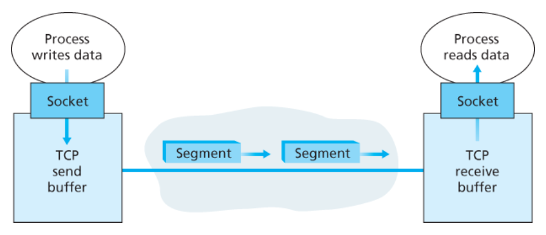

### TCP 세그먼트 구조

- 헤더
- 데이터
- MSS
- 순서 번호
- 확인 응답 번호

#### 순서 번호

TCP는 데이터를 구조화되어 있지 않고 순서대로 정렬된 바이트 스트림으로 본다. 세그먼트에 대한 순서 번호는 세그먼트에 있는 첫 번째 바이트의 바이트 스트림 번호다.

예를 들어 데이터 스트림이 500,000 바이트로 구성된 파일이고 MSS가 1,000 바이트라고 가정한다. 데이터 스트림의 첫 번째 바이트는 0으로 설정하고, 이후 각 세그먼트 내부의 순서 번호 필드에 삽입한다.

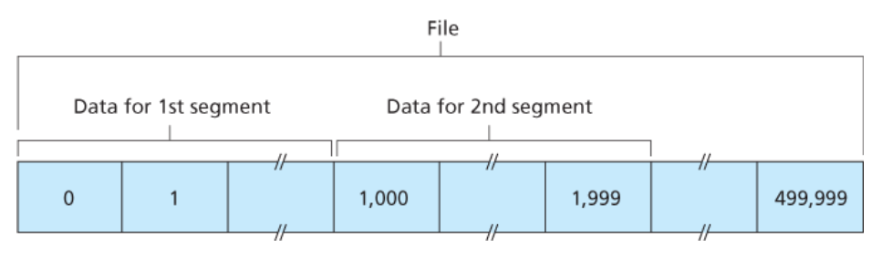

#### 확인 응답 번호

TCP는 전이중 방식이다. 즉, A가 B로 데이터를 송신하는 동안 B로부터 데이터를 수신할 수 있다.

B로부터 도착한 각 세그먼트는 B에서 A로 들어온 데이터에 대한 순서 번호를 가진다. A가 자신의 세그먼트에 삽입하는 확인 응답 번호는 A가 B로부터 기대하는 다음 바이트의 순서 번호다. ACK만 담은 세그먼트를 보낼 수도 있다.

예를 들어 B에서 A로 데이터가 이동한다고 하자.

- 순서 번호: 100
- 데이터 크기: 20 byte

그러면 A는 B로부터 바이트 번호 100~119까지 받은 것이다. A는 B에게 ACK 번호가 120이라고 알려줘야 한다. 이는 119번까지 잘 받았고, 120번 바이트부터 보내면 된다는 의미다.

TCP는 스트림에서 첫 번째 잃어버린 바이트까지의 바이트들까지만 확인 응답한다. 이를 누적 확인 응답이라고 한다.

만약 100~119까지 받고, 120~139를 수신하기 전에 140~159를 수신하면 순서가 틀어진다. 이때 호스트가 해야 할 행동은 정해져 있지 않고 TCP 구현 개발자에게 맡겨져 있다.

가능한 방식은 다음과 같다.

1. 수신자가 세그먼트를 버린다.
2. 수신자가 순서가 바뀐 데이터를 보유하고, 빈 공간에 잃어버린 데이터를 채우기 위해 기다린다.

실제로는 두 번째 방식이 사용된다.

#### 예: 텔넷


1. 42번을 보내고, 73번까지 잘 받았으며 데이터는 `C`다.
2. 79번을 보내고, 42번을 잘 받았으니 43번을 다음에 달라고 응답한다. 데이터 `C`도 받았다.
3. 43번을 보내고, 79번을 잘 받았으니 80번을 다음에 달라고 응답한다.

피기백은 ACK만 따로 보내지 않고, 내가 상대에게 보내는 데이터 세그먼트에 ACK를 같이 실어 보내는 것이다.

## RTT와 타임아웃

TCP는 손실 세그먼트 발견을 위해 타임아웃과 재전송 메커니즘을 사용한다. 타임아웃은 연결의 RTT보다 조금 더 커야 한다.

왕복 시간을 예측할 때는 전송되었지만 현재까지 확인 응답이 없는 세그먼트 중 하나에 대해서만 측정한다.

예를 들어 1, 2, 3, 4번 세그먼트를 보냈는데 아직 응답이 오지 않은 1번 세그먼트에 대해서 측정한다. RTT를 계산할 때는 평균을 사용한다. 라우터의 혼잡과 종단 시스템의 부하 변화 때문에 세그먼트마다 값이 달라질 수 있기 때문이다.

### 재전송 타임아웃 주기 설정

타임아웃 주기는 EstimatedRTT보다 크거나 같아야 한다. 그렇지 않으면 불필요한 재전송이 발생한다.

EstimatedRTT는 측정한 RTT의 가중평균(weighted average)이다.

타임아웃 값이 너무 크면 세그먼트를 잃었을 때 즉각적인 재전송이 어렵다. 따라서 타임아웃 값은 EstimatedRTT에 약간의 여유 값을 더한 값으로 설정한다.

## 신뢰적인 데이터 전송

신뢰적인 데이터 전송은 프로세스가 자신의 수신 버퍼로부터 읽은 데이터 스트림이 손상되지 않음을 보장하는 것이다.

또한 다음을 보장한다.

- 중복이 없다.
- 순서가 유지된다.
- 바이트 스트림은 송신자가 전송한 것과 같은 바이트 스트림이다.

### 타이머 관리

TCP는 다수의 세그먼트가 아니라 하나의 세그먼트에 대해서 재전송 타이머를 사용한다. 즉, 단일 타이머를 사용한다.

예를 들어 1, 2, 3번 세그먼트를 보냈는데 아직 ACK가 오지 않았다고 해서 1, 2, 3번 각각에 대해 재전송 타이머를 돌리는 것이 아니라, 가장 오래된 1번 세그먼트에 대해서 재전송 타이머를 돌린다.

### 손실된 확인 응답에 기인하는 재전송

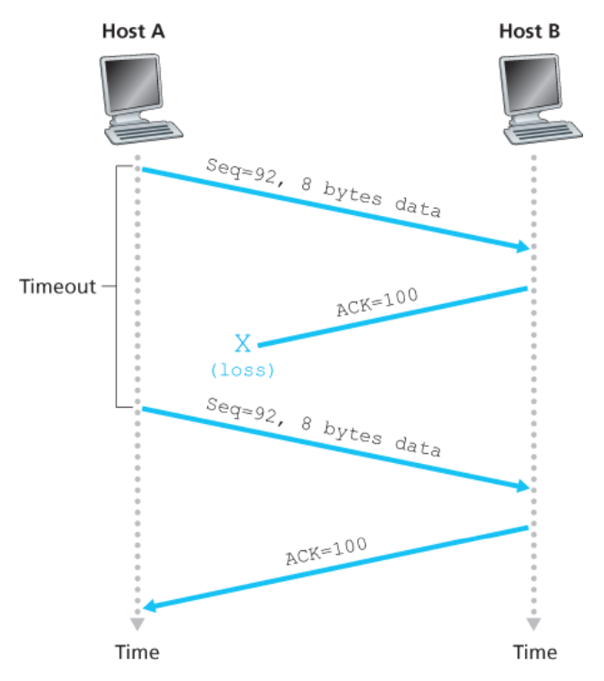

## 흐름 제어

TCP는 송신자가 수신자의 버퍼를 오버플로시키는 것을 방지하기 위해 흐름 제어 서비스를 제공한다. 수신하는 애플리케이션이 읽는 속도와 전송하는 속도를 맞추는 것이다.

흐름 제어는 수신 윈도우(receive window)라는 변수를 통해 제공된다.

- 수신 측에서 가용한 버퍼 공간이 얼마나 되는지를 송신자에게 알려준다.
- 전이중이므로 각 측의 송신자는 별개의 수신 윈도우를 유지한다.

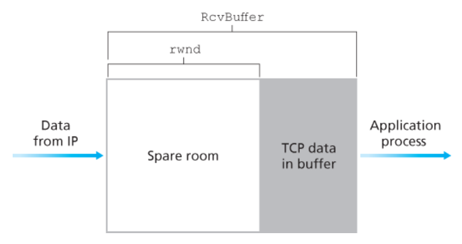

호스트 B는 호스트 A에게 전송하는 모든 세그먼트의 윈도 필드에 현재 `rwnd` 값을 설정한다. 이를 통해 호스트 A에게 연결 버퍼에 얼마만큼의 여유 공간이 있는지 알려준다.

호스트 A는 두 변수를 유지한다.

- `LastByteSent`
- `LastByteAcked`

```text
LastByteSent - LastByteAcked
= 호스트 A가 이 연결에 전송했지만 아직 확인 응답을 받지 못한 데이터의 양
```

TCP는 버퍼 여유 공간보다 작은 확인 응답 안 된 데이터 양을 유지해서 오버플로가 발생하지 않도록 한다.

### 문제점과 해결법

B의 수신 버퍼가 0이고 B가 A에게 전송할 것이 없는 경우 문제가 발생한다.

1. B가 버퍼를 비워도 버퍼 여유 공간이 생겼다고 전달할 수 없다.
2. A는 B에게 데이터를 보낼 수 없다.
3. 이를 해결하기 위해 A는 B의 수신 윈도우가 0일 때도 1바이트 데이터 세그먼트를 계속 전송한다.

## TCP 연결 관리

### 연결 설정

TCP 연결 설정은 three-way handshake로 이루어진다.

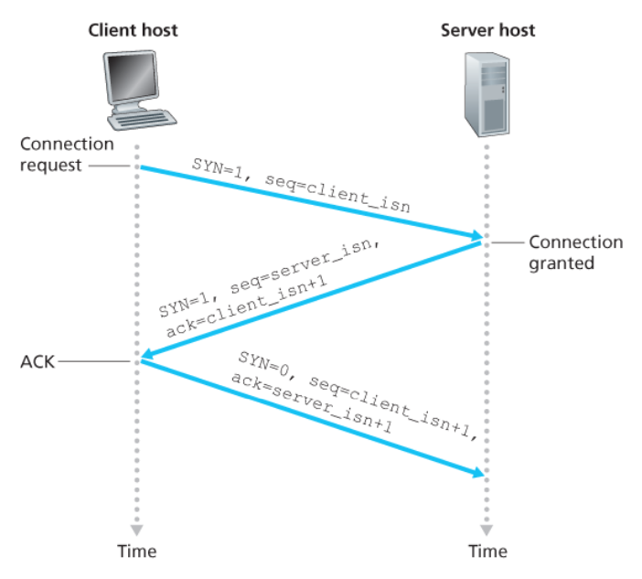

### 연결 종료

두 프로세스 중 하나가 연결을 끊을 수 있다. 연결이 끝날 때 호스트의 버퍼와 변수는 회수된다.

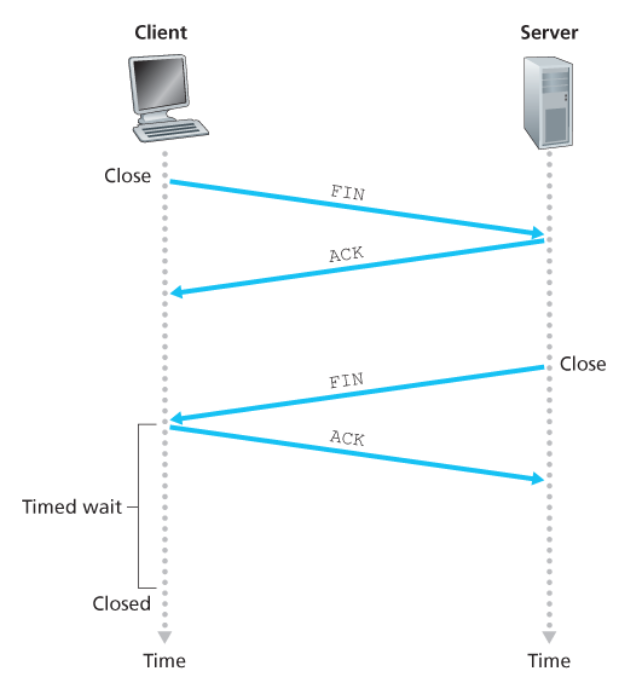

## 혼잡 제어의 원리

혼잡은 너무 많은 출발지가 너무 높은 속도로 데이터를 보내려고 시도할 때 발생한다.

네트워크 계층은 혼잡 제어 목적을 위해 트랜스포트 계층에게 어떤 지원도 제공하지 않는다.

### TCP가 혼잡 제어를 위해 취하는 방식

TCP는 다음을 혼잡 발생 표시로 간주한다.

1. 세그먼트 손실
2. 증가하는 왕복 지연값

이에 따라 윈도 크기를 줄인다. TCP는 혼잡 윈도(`cwnd`)를 추적해서 송신자가 네트워크로 전송할 수 있는 속도에 제약을 가한다.

### cwnd 값을 조정하는 메커니즘

1. 손실된 세그먼트는 혼잡을 의미한다.
2. ACK가 도착하면 혼잡하지 않다는 의미로 보고 송신자 전송률을 증가시킨다.
3. ACK가 도착하면 전송률을 높이다가, 손실 이벤트가 발생하면 전송률을 줄인다. 이를 대역폭 탐색이라고 볼 수 있다.

손실 세그먼트의 재전송을 야기하는 이벤트는 다음과 같다.

- 타임아웃 이벤트
- 4개의 확인 응답 수신: 원래 ACK 1개 + 중복 ACK 3개

## 네트워크 지원 혼잡 제어

1. 직접 피드백
   - 네트워크 라우터가 송신자에게 초크 패킷을 보내 알린다.
2. 송신자에서 수신자로 흐르는 패킷 안의 특정 필드 표시/수정
   - 수신자가 표시된 패킷을 수신하고 혼잡 상태를 송신자에게 알린다.

## TCP 혼잡 제어 알고리즘

TCP 혼잡 제어 알고리즘은 다음 세 가지로 나눌 수 있다.

1. 슬로 스타트(slow start)
2. 혼잡 회피(congestion avoidance)
3. 빠른 회복(fast recovery)

### 슬로 스타트

TCP 연결 시작 시 혼잡 윈도의 값은 일반적으로 1MSS로 초기화된다. 가용 대역폭은 1MSS보다 훨씬 크기 때문에 사용 가능한 대역폭을 찾아야 한다.

전송 세그먼트가 확인 응답을 받을 때마다 혼잡 윈도는 1MSS씩 증가한다.

```text
1 -> 2 -> 4 -> 8 -> 16
```

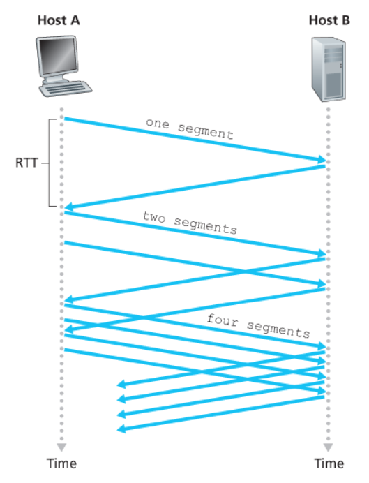

### 슬로 스타트 종료 조건

1. 타임아웃으로 표시되는 손실 이벤트가 있는 경우
   - 혼잡 윈도를 다시 1로 설정하고 새로운 슬로 스타트를 시작한다.
2. 혼잡 윈도 값이 `ssthresh` 값과 같은 경우
   - 슬로 스타트를 종료하고 혼잡 회피 모드로 들어간다.
   - `ssthresh`는 혼잡 윈도/2 값이다.
   - 혼잡 회피 모드에서는 혼잡 윈도를 조심스럽게 증가시킨다.
3. 중복 ACK를 검출한 경우
   - 빠른 회복 상태로 들어간다.

### 혼잡 회피 상태

혼잡 회피 상태로 들어가면 혼잡 윈도는 혼잡이 마지막으로 발견된 시점 값의 절반이 된다. 혼잡 회피 상태에서 TCP는 일반적으로 하나의 MSS만큼 혼잡 윈도를 증가시킨다.

#### 타임아웃이 발생했을 때

슬로 스타트와 같이 동작한다.

예를 들어 손실 당시 혼잡 윈도가 20MSS였다면 다음과 같이 설정된다.

```text
ssthresh = 10MSS
cwnd = 1MSS
```

이후 흐름은 다음과 같다.

```text
1 -> 2 -> 4 -> 8 -> 10 -> 혼잡 회피 -> 10 -> 11 -> 12 ...
```

#### 중복 ACK 이벤트

예를 들어 1, 2, 3, 4, 5를 보냈는데 `ACK = 2`가 3개 도착하면 네트워크가 완전히 죽은 것은 아니라고 판단한다.

```text
ssthresh = 10
cwnd = 10
```

그리고 빠른 회복으로 들어간다.

### 빠른 회복

1. 손실된 세그먼트에 대한 ACK가 도착하면 TCP는 `cwnd` 혼잡 회피 상태로 들어간다.
2. 타임아웃 이벤트가 발생하면 빠른 회복은 슬로 스타트와 혼잡 회피에서와 같은 동작을 수행한 후 슬로 스타트로 전이한다.

즉, `cwnd` 값은 1MSS로 하고, `ssthresh` 값은 손실 이벤트가 발생할 때의 `cwnd` 값의 절반으로 한다.

> 이 부분은 추가 학습 필요.

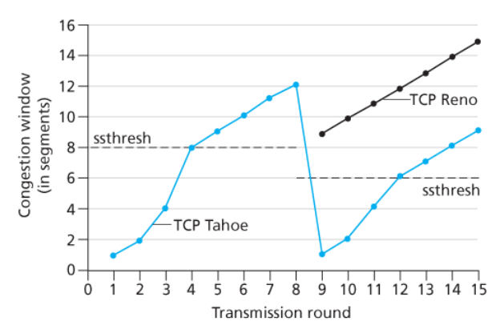

## 명시적 혼잡 알림

명시적 혼잡 알림(Explicit Congestion Notification, ECN)은 혼잡 알림을 통해 혼잡을 수신자에게 알려주는 방식이다.

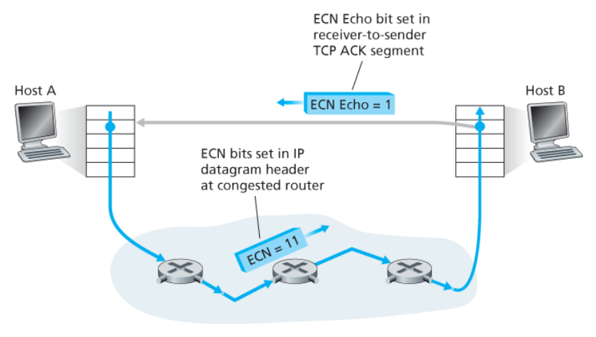

## 트랜스포트 기능의 발전

애플리케이션 설계자는 애플리케이션 계층에서 자신의 프로토콜을 확장할 수 있다.

## QUIC

QUIC(Quic UDP Internet Connections)은 빠른 UDP 인터넷 연결을 의미한다. 트랜스포트 계층 서비스의 성능 향상을 위해 설계된 애플리케이션 계층 프로토콜이다.

QUIC은 다음 기능을 제공한다.

- 신뢰적인 데이터 전송
- 혼잡 제어
- 연결 관리

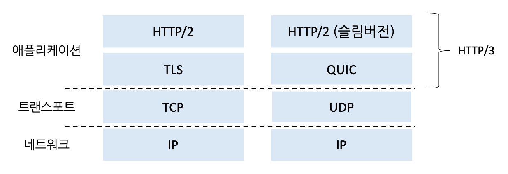

### QUIC의 특징

QUIC은 연결 지향 프로토콜이다. 핸드셰이크가 필요하지만, 연결 상태 설정과 인증 및 암호화에 필요한 과정을 결합한다.

기존 TCP/TLS 방식은 다음처럼 진행된다.

1. 먼저 TCP 연결을 설정한다.
2. TCP 연결을 통해 TLS 연결을 설정한다.

QUIC은 이 과정을 한 번에 하느냐, 나눠서 하느냐의 차이를 만든다.

### QUIC 스트림

단일 QUIC 연결을 통해 애플리케이션 레벨의 스트림을 다중화한다. 따라서 새 스트림을 빠르게 추가할 수 있다.

QUIC은 신뢰적이고 TCP 친화적인 혼잡 제어 데이터 전송을 제공한다.

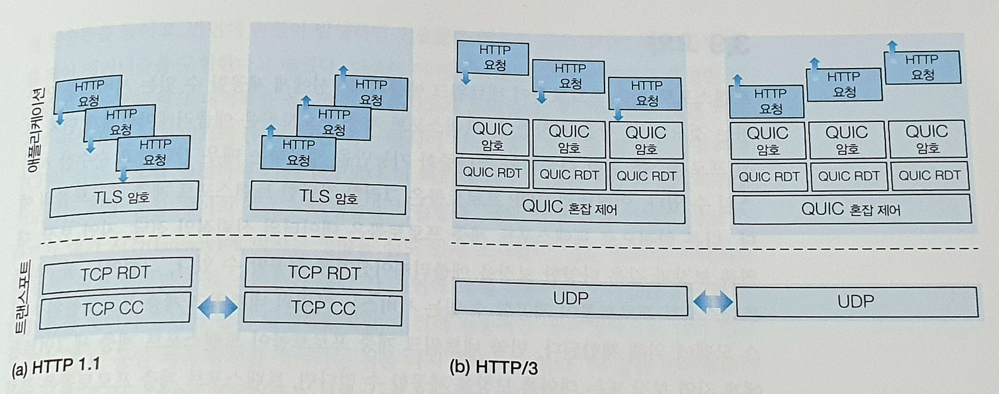

## HTTP/1.1과 HTTP/3

### HTTP/1.1

HTTP/1.1은 단일 연결 클라이언트 및 서버 구조다.

따라서 한 HTTP 요청의 바이트가 손실되면, 나머지 HTTP 요청들은 손실된 바이트가 재전송되어 HTTP 서버에서 TCP가 올바르게 수신할 때까지 전달될 수 없다.

이를 HOL 차단 문제라고 한다. 앞에 있는 데이터 하나가 막혀서 뒤에 도착한 데이터들까지 같이 기다리는 문제다.

### HTTP/3

HTTP/3는 멀티스트림 클라이언트 및 서버 구조다.

손실된 UDP 세그먼트는 해당 세그먼트에서 데이터가 전달된 스트림에만 영향을 준다.

## UDP와 QUIC 비교

### UDP가 해주는 것

- 출발지 포트
- 목적지 포트
- 데이터그램 전달

### UDP가 안 해주는 것

- 연결 설정
- 순서 보장
- 손실 재전송
- 혼잡 제어
- 암호화

### QUIC이 해주는 것

- 연결 관리
- 암호화
- 재전송
- 혼잡 제어
- 여러 스트림 관리
- 패킷 번호 관리
