# 3단원 트랜스포트 계층

---

## 3.1 트랜스포트 계층

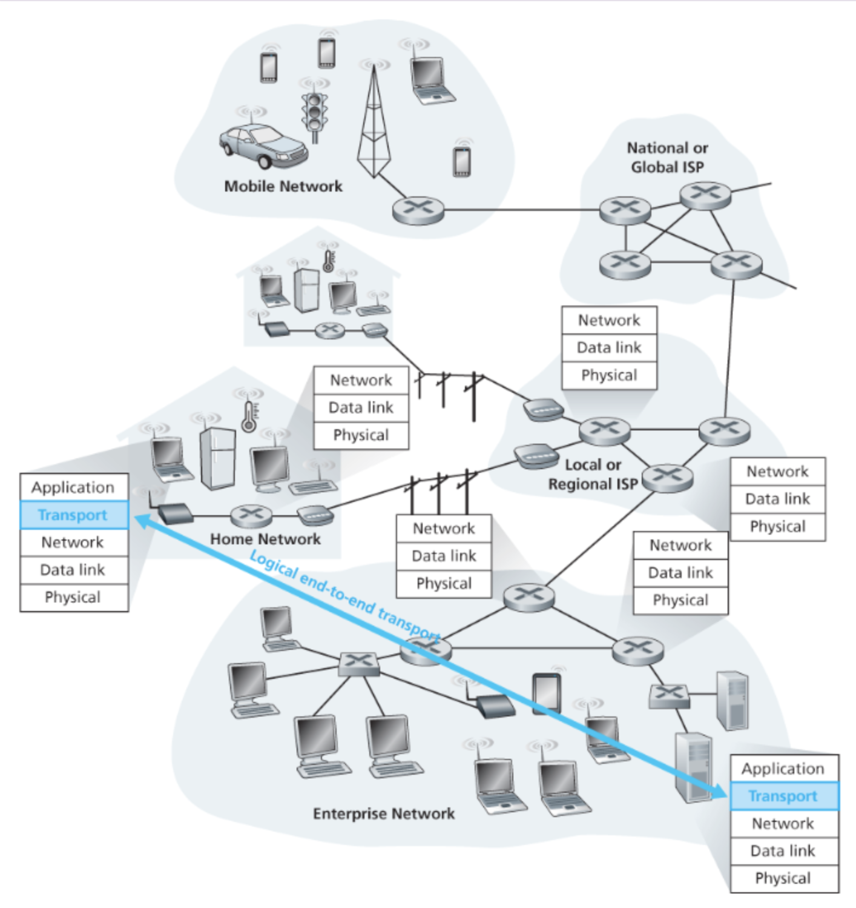

각기 다른 호스트에서 동작하는 **애플리케이션 프로세스 간**의 논리적 통신을 제공. 라우터가 아닌 종단 시스템(end system)에서 구현됨.

**네트워크 계층** : 호스트 간 통신. 어느 경로로 갈지 담당.

**트랜스포트 계층** : 프로세스 간 통신. 경로나 방법은 신경 안 쓰고 올바른 프로세스에 전달하는 것만 담당.

 

**TCP** : 신뢰적 전송, 순서 보장(in-order delivery), 혼잡 제어, 흐름 제어, 연결 지향형.

**UDP** : 비신뢰적 전송, 순서 보장 없음(unordered delivery), 비연결형. 빠름.

TCP, UDP 둘 다 제공하지 않는 것
- 전송 지연(delay) 보장 → "이 데이터 100ms 안에 도착시켜줘" 같은 요청 불가
- 대역폭 보장 → "이 앱한테는 항상 10Mbps 보장해줘" 같은 요청 불가

---

## 3.2 다중화(Multiplexing) / 역다중화(Demultiplexing)

**IP** = 호스트(기계) 식별 / **포트 번호** = 프로세스 식별

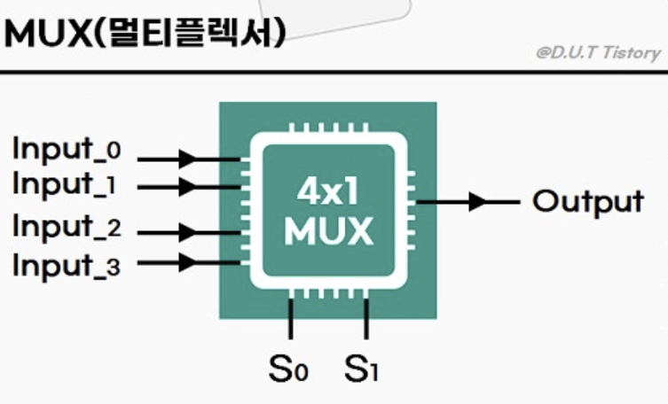

**다중화(multiplexing)** : 소켓에서 데이터를 모아 세그먼트 생성 후 네트워크 계층으로 전송. (N → 1)

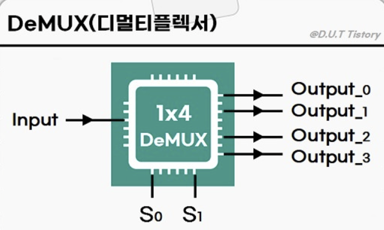

**역다중화(demultiplexing)** : 수신된 세그먼트를 올바른 소켓으로 전달. (1 → N)

 

**UDP demux (비연결형)**

UDP 소켓은 목적지 IP + 목적지 포트번호로 식별. 출발지가 달라도 같은 목적지 포트면 같은 소켓으로 전달. 그렇다고 출발지 포트가 필요없는 건 아님 → 회신할 수도 있으니까.

**TCP demux (연결형)**

TCP 소켓은 출발지 IP, 출발지 포트, 목적지 IP, 목적지 포트 **4가지를 모두** 봄. 하나라도 다르면 다른 소켓.

---

## 3.3 UDP

connectionless. 핸드셰이킹 없이 바로 전송. 전달/순서 보장 없음.

UDP를 쓰는 이유
- 연결 설정 불필요 → RTT 지연 없음
- 단순함
- 헤더가 작음 (8바이트 vs TCP 20바이트)
- 혼잡 제어가 없어서 속도 제한 없음 (TCP는 혼잡 시 속도를 강제로 줄임)
- 어플리케이션 레벨에서 정교한 데이터 제어 가능

만약 신뢰적인 전송이 필요하다면 애플리케이션 계층에서 신뢰성과 혼잡 제어를 직접 추가하면 됨.

 

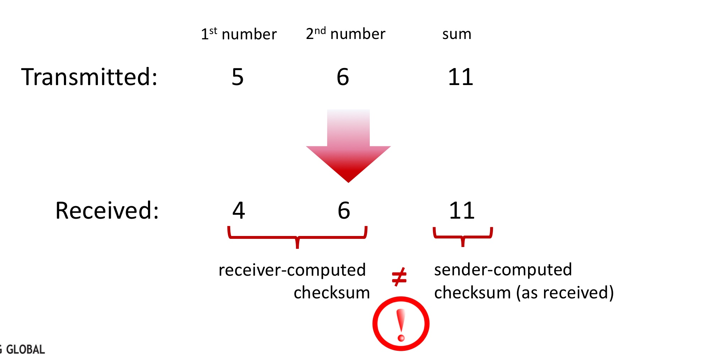

**체크섬(checksum)** : 전송된 세그먼트의 오류(비트 변조 등)를 검출하기 위해 사용. 오류를 고치지는 않고 그냥 버리거나 경고와 함께 앱에 넘김.

**end-end principle** : 복잡한 기능은 네트워크 중간(라우터)이 아니라 양쪽 끝에서 처리. UDP는 그냥 전달만 함.

UDP 사용 예 : DNS, SNMP, HTTP/3, 실시간 스트리밍.

---

## 3.4 신뢰적인 데이터 전송 (RDT)

no packet loss, no packet error, in-order delivery가 목표. 실제 링크는 신뢰적이지 않기 때문에 트랜스포트 프로토콜이 이를 처리해야 함.

 

**rdt1.0** : 완전히 신뢰적인 채널 가정. 오류가 없으니 피드백 불필요. 현실에는 없음.

**rdt2.0** : 비트 오류가 있는 채널. 체크섬 + ACK/NAK + 재전송 추가. stop-and-wait 방식.

**rdt2.1** : 순서 번호(sequence number) 추가. 중복 패킷 구분 가능. (0과 1, 두 개만 있으면 됨)

**rdt2.2** : NAK 없는 버전. 중복 ACK로 NAK 대체. TCP가 이 방식 채택.

**rdt3.0** : 패킷 손실까지 처리. 타이머(timer) 추가. 타임아웃 시 재전송. 타임아웃 원인은 패킷 지연(조기 타임아웃) 또는 ACK 손실.

 

stop-and-wait의 문제 : 한 번에 하나씩만 전송 → 채널 이용률이 매우 낮음.

**파이프라이닝(pipelining)** : ACK를 기다리지 않고 여러 패킷을 연속으로 전송. 채널 이용률 크게 향상.

 

**GBN(Go-Back-N)**

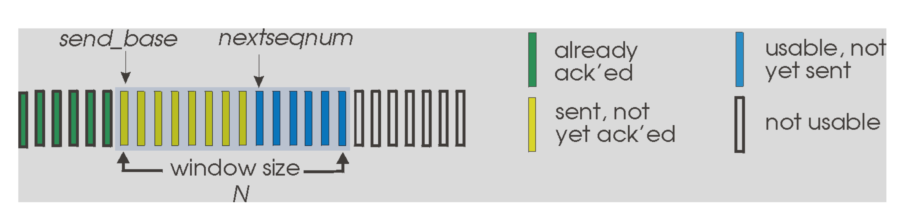

- 윈도 크기 N개까지 ACK 없이 연속 전송 가능
- 수신자는 순서대로 받다가 순서가 잘못된 패킷은 버리고 마지막 정상 수신 패킷에 대한 ACK 재전송
- 오류 발생 시 해당 패킷부터 윈도 내 모든 패킷 재전송 → 불필요한 재전송이 많아지는 게 단점
- 수신자 구현 단순 (버퍼링 불필요)

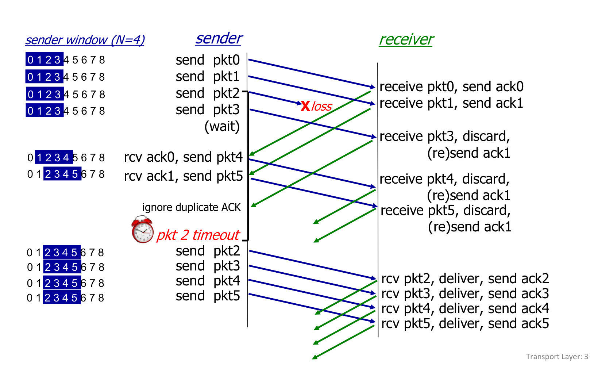

**SR(Selective Repeat)**

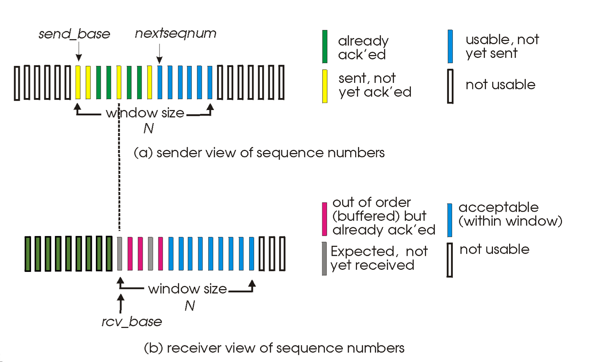

- 오류난 패킷만 재전송. GBN처럼 불필요한 재전송 없음
- 수신자가 순서 바뀐 패킷도 버퍼에 저장해두고, 빠진 패킷이 오면 순서대로 상위 계층에 전달
- 각 패킷마다 개별 타이머와 개별 ACK 필요
- 수신자 구현이 GBN보다 복잡함

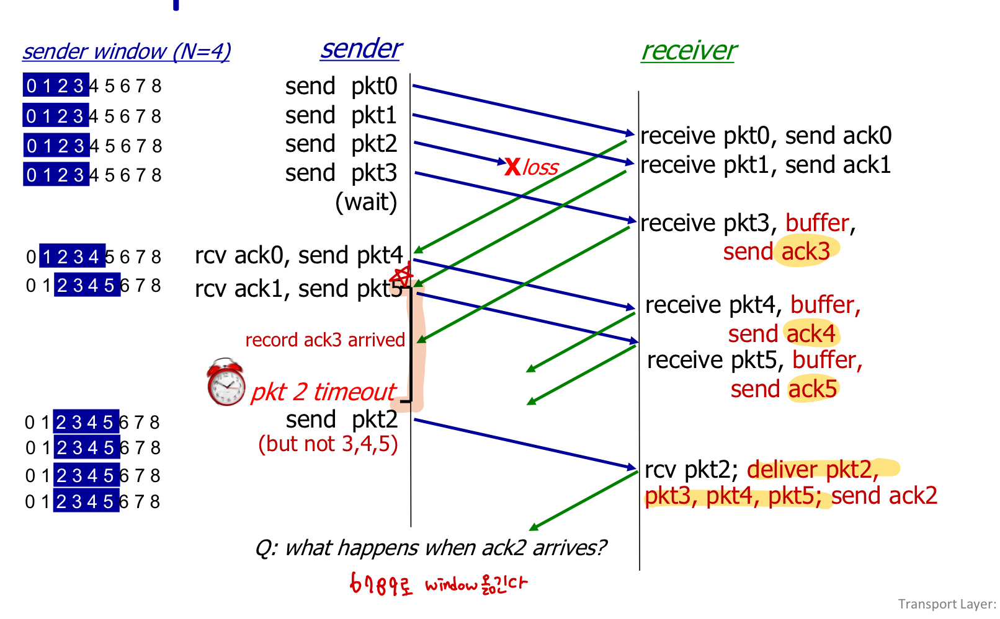

---

## 3.5 TCP

특성 : 1:1 통신(멀티캐스팅 불가), **전이중(full-duplex)**, 연결 지향형, 흐름 제어, 파이프라이닝.

TCP가 상대에게서 세그먼트를 수신했을 때, 세그먼트의 데이터는 수신 버퍼에 저장됨. 앱은 이 버퍼로부터 데이터 스트림을 읽음.

**MSS(Maximum Segment Size)** : 세그먼트에 담을 수 있는 애플리케이션 데이터의 최대 크기. 헤더 포함 크기가 아님. MTU에 의해 결정됨.

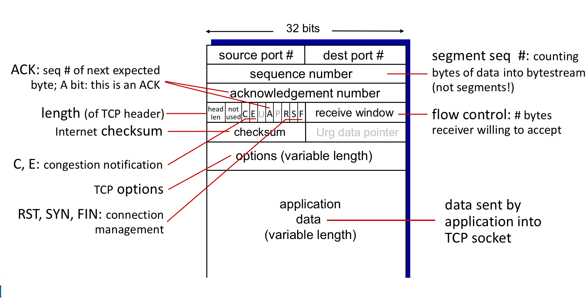

 

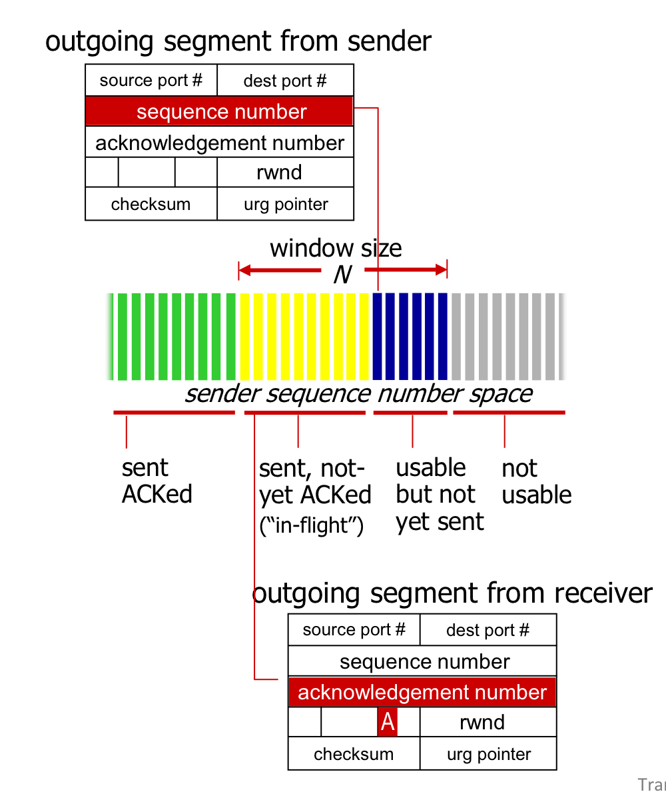

**순서 번호(sequence number)** : 내가 보내는 세그먼트의 첫 번째 바이트 번호. TCP는 데이터를 바이트 스트림으로 봄.

**확인응답 번호(acknowledgment number)** : 내가 다음으로 받기를 기대하는 바이트 번호. ex) 0~535를 받았으면 확인응답 번호는 536.

**피기배킹(piggybacking)** : 데이터를 보내면서 ACK도 같이 실어 보냄.

**누적 확인응답(cumulative ACK)** : 첫 번째 잃어버린 바이트 이전까지만 확인응답. 순서 바뀐 세그먼트는 버퍼에 저장하고 빈 부분이 채워지면 상위 계층에 전달.

 

**RTT와 타임아웃**

타임아웃은 RTT 기반으로 동적 결정. 고정값이 아님. 네트워크 상황이 나빠지면 타임아웃도 같이 늘어남.
- 너무 짧으면 → 불필요한 재전송 발생
- 너무 길면 → 손실 감지가 늦어짐

RTT가 길다는 건 그만큼 응답이 느리다는 뜻. 서버를 사용자 가까이 두거나 CDN을 쓰는 게 RTT를 줄이는 방법.

 

**TCP 재전송**

타임아웃 재전송 : 타이머 만료 시 해당 세그먼트 재전송. ACK가 손실되더라도 누적 ACK 덕분에 불필요한 재전송을 줄일 수 있음.

빠른 재전송(fast retransmit) : 중복 ACK 3개 수신 시 타임아웃 기다리지 않고 즉시 재전송. 중복 ACK는 수신자가 기대한 것보다 높은 순서 번호의 세그먼트가 왔을 때 발생.

TCP = **GBN + SR 혼합**. 기본은 누적 ACK(GBN)지만 SACK(어디가 빠졌는지 정확히 알려줌) 옵션으로 SR처럼 동작 가능.

 

### 흐름 제어 (Flow Control)

보내는 속도가 앱이 소켓을 읽는 속도보다 빠르면 수신 버퍼에 데이터가 쌓이다가 넘침 → 유실 발생. 이를 막기 위한 게 흐름 제어.

수신자가 현재 버퍼 여유 공간(**rwnd**)을 세그먼트 헤더에 담아 송신자에게 알려줌. 송신자는 확인응답 안 된 데이터 양을 rwnd 이하로 유지.

TCP는 전이중(full-duplex)이므로 연결의 각 측 송신자는 별개의 rwnd를 가짐.

rwnd = 0이면 송신자는 1바이트짜리 세그먼트를 계속 보내서 버퍼가 비워지는 타이밍을 확인.

> **흐름 제어** = 수신자 버퍼 보호 / **혼잡 제어** = 네트워크 혼잡 방지. 목적이 다름.

 

### 3-way Handshake

1단계 : 클라이언트 → 서버. **SYN** 전송. (SYN=1, client_isn 포함)

2단계 : 서버 → 클라이언트. **SYNACK** 전송. (SYN=1, ACK=client_isn+1, server_isn 포함) 서버 버퍼/변수 할당.

3단계 : 클라이언트 → 서버. **ACK** 전송. (SYN=0, ACK=server_isn+1) 클라이언트 버퍼/변수 할당. 이 세그먼트부터 데이터 포함 가능.

왜 2-way가 아닌가 : 2-way면 클라이언트만 "서버가 내 말을 들을 수 있다"는 걸 확인 가능. 서버는 클라이언트가 자신의 응답을 받았는지 확인할 방법이 없음. 3단계 ACK가 있어야 양방향 통신 가능을 양쪽 모두 확인.

 

### 연결 종료 (4-way)

클라이언트 **FIN** → 서버 **ACK** → 서버 **FIN** → 클라이언트 **ACK** 후 종료. 자원 회수.

서버의 ACK와 FIN이 분리되는 이유 : ACK 보낸 뒤에도 서버에 전송할 데이터가 남아있을 수 있기 때문.

 

### SYN 플러드 공격

3-way handshake의 3단계(ACK)를 보내지 않고 SYN만 대량으로 보냄. 서버가 half-open 연결에 자원을 계속 할당하다가 소진 → 정상 클라이언트 서비스 거부(DoS).

**SYN 쿠키**로 방어 : SYN을 받았을 때 자원을 바로 할당하지 않고 해시값(쿠키)을 만들어 SYNACK에 담아 보낸 뒤 ACK가 돌아오면 검증 후 자원 할당. 공격자는 ACK를 안 보내니 서버 자원 낭비 없음.

---

## 3.6 혼잡 제어의 원리

혼잡 : 너무 많은 송신자가 너무 빠른 속도로 데이터를 보내서 네트워크가 감당 못하는 상태. 패킷 손실과 큐잉 지연 증가가 증상.

혼잡의 비용

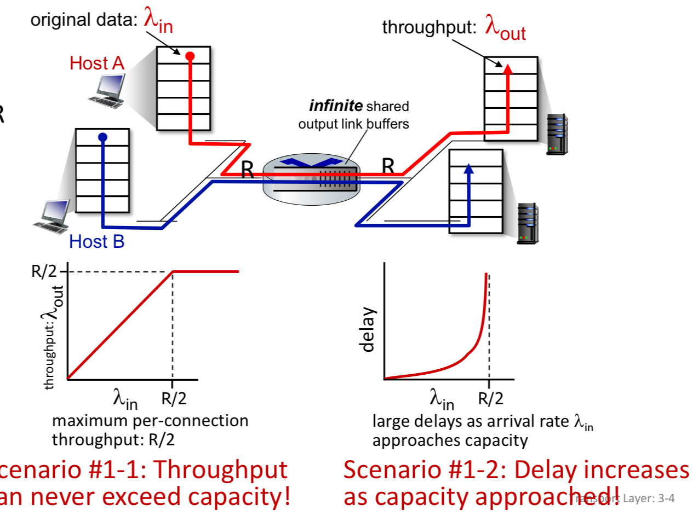

- 버퍼 무한 : 패킷은 안 버려지지만 링크 용량에 가까워질수록 큐잉 지연이 폭발적으로 커짐

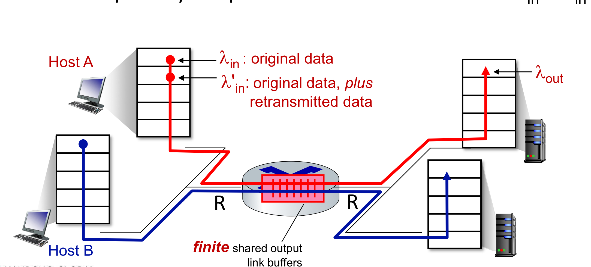

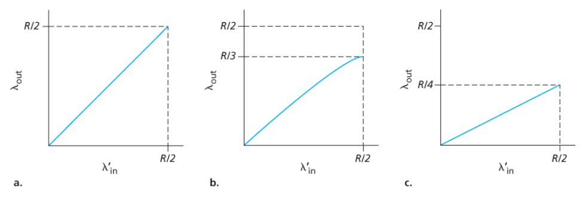

- 버퍼 유한 : 버퍼 꽉 차면 패킷 손실 → 재전송 → 재전송 트래픽이 또 쌓여서 유효 처리량이 줄어드는 악순환. 불필요한 재전송(아직 안 버려진 패킷을 조기 타임아웃으로 재전송)이 발생하면 링크 대역폭 낭비

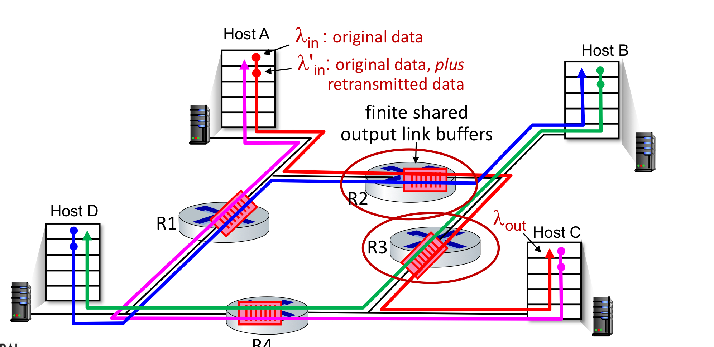

- 멀티홉 : 패킷이 여러 라우터를 거치다가 마지막에 버려지면 앞쪽 라우터들이 쓴 대역폭이 전부 낭비됨. 혼잡이 심해지면 종단 간 처리율이 0에 수렴할 수도 있음

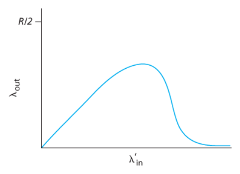

 

**종단 간 혼잡 제어** : 라우터가 직접 알려주지 않음. 종단 시스템이 패킷 손실이나 지연 증가를 보고 스스로 혼잡을 추론해서 전송 속도를 줄임. TCP가 사용하는 방식.

**네트워크 지원 혼잡 제어** : 라우터가 직접 혼잡 신호를 송신자/수신자에게 전달. 라우터가 송신자에게 직접 초크 패킷(choke packet)을 보내거나, 패킷 헤더에 혼잡 표시를 해서 수신자가 이를 송신자에게 전달하는 방식.

---

## 3.7 TCP 혼잡 제어

**cwnd(혼잡 윈도)** : TCP 송신자가 네트워크로 보낼 수 있는 데이터 양을 제한하는 변수.

실제 전송 가능한 양 = **min{cwnd, rwnd}**

> cwnd = 혼잡 제어용 / rwnd = 흐름 제어용. 실제 전송 가능한 양은 둘 중 작은 값으로 결정.

TCP는 패킷 손실(타임아웃 또는 중복 ACK 3개)을 혼잡 신호로 감지하고 cwnd를 줄임. ACK가 잘 오면 혼잡이 없다고 판단해서 cwnd를 늘림.

 

### 슬로 스타트 (Slow Start)

cwnd = 1 MSS에서 시작. ACK 하나 받을 때마다 cwnd를 1 MSS씩 늘림 → 실제로는 **RTT마다 2배씩 지수적으로 증가**.

이름이 슬로 스타트인 이유 : 느리게 증가해서가 아니라 "1 MSS라는 작은 값에서 시작한다"는 뜻.

종료 조건
- 타임아웃 발생 → cwnd = 1 MSS로 리셋, 슬로 스타트 재시작
- cwnd = ssthresh → **혼잡 회피**로 전환
- 중복 ACK 3개 수신 → **빠른 회복**으로 전환

 

### 혼잡 회피 (Congestion Avoidance)

cwnd가 ssthresh에 도달한 이후부터 적용. **RTT마다 1 MSS씩 선형 증가**. 조심스럽게 대역폭을 탐색하는 단계.

종료 조건
- 타임아웃 발생 → cwnd = 1 MSS로 리셋, ssthresh = 손실 시점 cwnd의 절반
- 중복 ACK 3개 수신 → cwnd 절반으로 줄이고 **빠른 회복**으로 전환

 

### 빠른 회복 (Fast Recovery)

중복 ACK 3개를 받았을 때 진입. 타임아웃보다 가벼운 손실 처리. **cwnd를 절반으로만 줄임** (1 MSS 리셋 안 함).

손실 세그먼트에 대한 ACK가 오면 혼잡 회피로 복귀. 타임아웃 발생 시 슬로 스타트로 전환.

빠른 회복은 권고사항이며 필수는 아님. TCP 타호는 빠른 회복이 없고, TCP 리노부터 채택.

 

### AIMD

TCP 혼잡 제어의 핵심 원리.

- 손실 없으면 → cwnd **+1 MSS/RTT** (Additive Increase)
- 손실 발생하면 → cwnd **× 0.5** (Multiplicative Decrease)

이 패턴을 반복하면서 가용 대역폭을 탐색함.

 

### TCP 타호 vs TCP 리노

**TCP 타호** : 타임아웃이든 중복 ACK 3개든 손실이 발생하면 무조건 cwnd = 1로 리셋, 슬로 스타트부터 재시작.

**TCP 리노** : 중복 ACK 3개로 인한 손실은 빠른 회복을 적용해서 cwnd를 절반만 줄임. 타임아웃은 타호와 동일하게 1 MSS로 리셋. 타호보다 효율적.

타임아웃 vs 중복 ACK 3개
- 타임아웃 = 더 심각한 혼잡 신호 → cwnd = 1로 리셋
- 중복 ACK 3개 = 가벼운 손실 신호 → cwnd 절반으로만 줄임

 

### TCP 큐빅 (CUBIC)

현재 리눅스 기본 TCP. 손실 직전 cwnd 값(Wmax)을 기억해두고, 회복 시 세제곱 함수 형태로 증가. Wmax에 가까울수록 천천히, 멀수록 빠르게. 전반적으로 더 높은 처리량 달성.

 

### ECN (Explicit Congestion Notification)

라우터가 버퍼 꽉 차기 전에 패킷 헤더에 혼잡 표시 → 수신자가 ACK에 ECE 비트 설정해 송신자에게 전달 → 송신자가 cwnd를 절반으로 줄이고 CWR 비트 설정.

패킷 손실 없이도 혼잡을 **사전에** 감지 가능.

 

### 공평성 (Fairness)

AIMD 덕분에 같은 병목 링크를 공유하는 연결들이 결국 대역폭을 공평하게 나눠 가짐.

단, RTT가 작은 연결이 더 빨리 대역폭을 채워서 더 높은 처리율을 가져갈 수 있음.

UDP는 혼잡 제어가 없어서 TCP가 양보하는 동안 대역폭을 차지할 수 있음. 병렬 TCP 연결을 여러 개 열면 더 많은 대역폭을 차지하는 것도 같은 문제.

---

## 3.8 QUIC

**QUIC(Quick UDP Internet Connections)** : UDP 위에서 동작하는 애플리케이션 계층 프로토콜. HTTP/3의 기반. 현재 인터넷 트래픽의 7% 이상.

왜 필요한가 : 기존 HTTP/2는 TCP + TLS 조합으로 총 2~3RTT 소요. QUIC은 연결 수립과 암호화를 한 번에 처리해서 **1RTT**, 재연결 시 **0RTT** 가능.

왜 UDP를 쓰는가 : TCP는 커널에 구현되어 있어 수정/배포가 느림. UDP 위에 올리면 애플리케이션 레벨에서 자유롭게 구현하고 훨씬 빠르게 업데이트 가능.

 

주요 특징

**연결지향 + 보안 내장** : 연결 수립과 TLS 암호화를 동시에 처리. 별도 TLS 핸드셰이크 불필요.

**스트림 다중화** : 하나의 QUIC 연결에서 여러 스트림을 동시에 처리. HTTP/2의 HOL 블로킹 문제 해결.

**신뢰적 전송 + 혼잡 제어** : UDP 기반이지만 QUIC이 자체 구현. 혼잡 제어는 TCP NewReno 기반.

 

**HTTP/1.1** : TCP 기반. TCP가 순서대로 전달을 보장하기 때문에 하나의 패킷이 손실되면 그 뒤 모든 요청이 대기해야 함. HOL 블로킹 발생.

**HTTP/3** : QUIC 기반. 스트림별로 독립적으로 신뢰적 전달을 보장. 하나의 스트림에서 손실이 발생해도 다른 스트림은 영향 없음. HOL 블로킹 해결.
