## 네트워크 계층 개요

### 네트워크 계층
> 송신 호스트에서 수신 호스트까지 패킷을 전달하는 계층

- 트랜스포트 계층 세그먼트를 받아 목적지까지 전달
- 라우터는 네트워크 계층까지만 처리 (상위 계층 없음)
- 데이터 평면 : 입력 링크에서 출력 링크로 데이터그램을 전달한다.
  - 패킷을 실제로 전달 (빠른 처리, 라우터 내부)
- 제어 평면 : 데이터 그램이 전달되도록 로컬 포워딩, 라우터별 포워딩을 대응시킨다.
  - 패킷이 갈 경로를 계산 (느린 처리, 네트워크 전체)

---

### 포워딩과 라우팅 : 데이터 평면, 제어 평면

- 포워딩(전달) : 라우터가 패킷을 적절한 출력링크로 이동시키는 작업
- 라우팅 : 라우팅 알고리즘에 의해 출발지에서 목적지까지 패킷 경로를 설정하는 작업

#### 포워딩 테이블

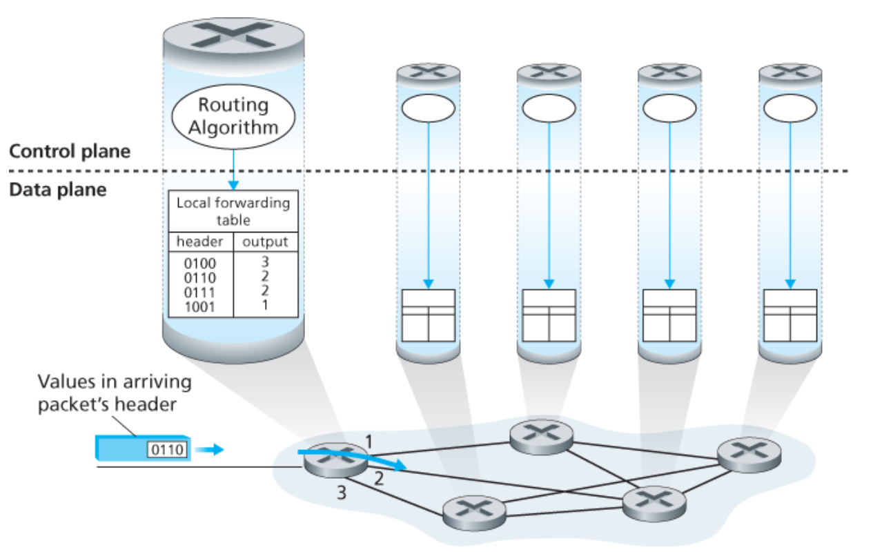

- 라우터는 `패킷 헤더의 필드값`을 통해, 포워딩 테이블 내부 색인으로 패킷을 전달함
- 포워딩 테이블의 헤더 값은 해당 패킷이 전달되어야할 라우터의 외부 링크 인터페이스를 나타낸다.

### 제어평면 접근 방법

#### 전통적인 접근 방법

라우팅 알고리즘은 모든 라우터에서 실행되며, 라우터는 포워딩과 라우팅 기능을 모두 갖고 있다.
또한, 라우터들끼리 라우팅 알고리즘과 소통하며 포워딩 테이블의 값을 계산한다.

#### SDN 접근 방법

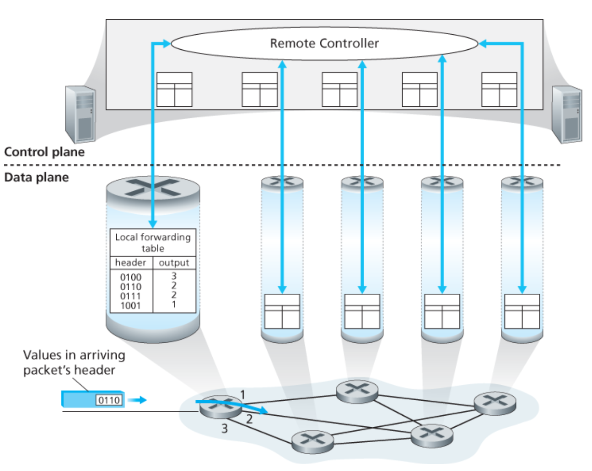

- 원격 컨트롤러가 포워딩 테이블을 계산, 분배한다.
- 라우팅 기기는 포워딩만 수행
- 제어 평면을 중앙으로 분리한 구조

---

### 네트워크 서비스 모델

> 인터넷은 best-effort 서비스 제공

- 전달 보장 없음
- 순서 보장 없음
- 지연 보장 없음
- 대역폭 보장 없음

→ 신뢰성은 TCP가 담당

---

## 라우터 내부


- 입력 포트 : 패킷이 라우터로 들어오는 지점
  - 물리 계층 수행 (비트 수신)
  - 링크 계층 처리 (프레임 해석)
  - 네트워크 계층 처리 (헤더 확인)
- 스위치 구조 : 입력 포트와 출력 포트를 연결하는 통로
  - 패킷을 입력 -> 출력으로 이동 시킴
  - 라우터 내부 핵심 연결 구조
- 출력 포트 : 패킷이 라우터를 나가는 지점
  - 패킷 저장 (버퍼링)
  - 링크 계층 처리
  - 물리 계층 처리 후 전송
- 라우팅 프로세서 : 제어평면 기능 수행
  - 라우팅 알고리즘 실행
  - 라우팅 테이블 관리
  - 포워딩 테이블 계산

---

### 입력 포트 처리 및 목적지 기반 전송

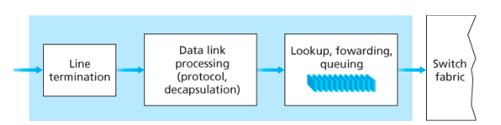

#### 입력 포트 처리
> 입력 포트는 라우터로 들어온 패킬을 처리하고, 어느 출력 포트로 보낼지 결정

- 라우터 동작의 핵심은 입력 포트에서 수행되는 검색(lookup)
- 포워딩 테이블 조회 후 패킷이 나갈 출력 포트 결정
- 결정된 패킷은 스위치 구조로 전달

### 포워딩 테이블

#### 목적지 주소 범위 포워딩 테이블

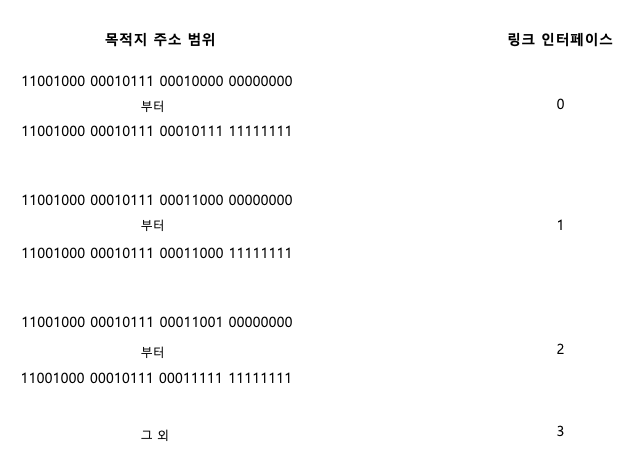

- 목적지 IP 주소를 **범위 단위로 묶어서 관리**
- 개별 IP마다 엔트리를 두지 않고 일정 범위로 묶어서 처리
- 특징
  - 테이블 크기를 줄일 수 있음
  - 관리가 단순함
- 한계
  - 주소 범위를 정확히 나누기 어려움
  - 복잡한 네트워크에서는 비효율적

#### 프리 픽스 포워딩 테이블

> IP 주소의 앞부분을 기준으로 포워딩하는 방식


- IP 주소의 앞부분 비트(prefix)를 기준으로 매칭
- 동일한 prefix를 가지는 주소들은 같은 경로 사용
- 특징
  - 주소 범위보다 더 유연하게 표현 가능
  - CIDR 기반 라우팅에서 사용
  - 실제 인터넷 라우터에서 사용되는 방식
- 한계
  - longest prefix matching 연산 비용이 큼
  - 여러 prefix 중 가장 긴 것을 찾아야 하므로 lookup이 복잡
  - 고속 처리를 위해 TCAM 같은 특수 하드웨어 필요
  - 포워딩 테이블 크기 증가
    - prefix 단위로 나누면 엔트리가 많아짐 -> 메모리 사용량 증가
  - 라우팅 테이블 관리 복잡
    - prefix가 겹칠 수 있어 관리 난이도 증가
    - 경로 갱신 시 연쇄적으로 영향 발생 가능
  - 경로 집약(aggregation) 한계
    - prefix를 잘못 설계하면 테이블이 비효율적으로 커짐

---

### 스위칭

> 입력 포트 -> 출력 포트로 패킷을 실제로 전달하는 라우터 내부 구조

### 스위칭 방식 비교

| 방식 | 처리 위치 | 병렬 처리 | 병목 |
|------|-----------|-----------|------|
| 메모리 | CPU/메모리 | 불가능 | 메모리 대역폭 |
| 버스 | 공유 버스 | 제한적 | 버스 속도 |
| 상호연결(크로스바) | 하드웨어 | 가능 | 동일 출력 포트 경쟁 |

---

### 메모리를 통해 교환

> 패킷을 메모리에 복사해서 전달하는 방식


#### 동작
- 입력 포트 -> 패킷을 메모리에 복사
- CPU가 목적지 주소 확인
- 출력 포트 버퍼로 다시 복사

#### 특징
- 구조 단순
- CPU 중심 처리

#### 한계
- 메모리 읽기/쓰기 속도가 전체 성능 제한
- 한 번에 하나의 패킷만 처리 가능
- 처리량 제한: B/2 이하


### 버스를 통한 교환

> 공유 버스를 통해 패킷을 전달하는 방식

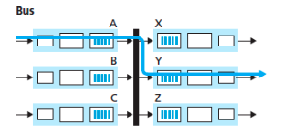

#### 동작
- 입력 포트 -> 버스로 패킷 전송
- 모든 출력 포트가 수신
- 목적지에 해당하는 포트만 패킷 유지

#### 특징
- CPU 개입 없음
- 구조 단순

#### 한계
- 한 번에 하나의 패킷만 버스 통과 가능
- 버스 속도가 전체 성능 제한

### 상호연결 네트워크 (크로스바)

> 입력 포트와 출력 포트를 직접 연결하는 방식

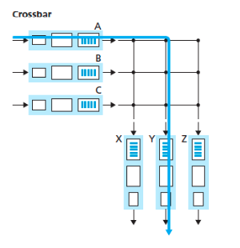

#### 동작
- 입력 포트와 출력 포트 사이를 직접 연결
- 필요한 연결만 열어서 패킷 전달

#### 특징
- 여러 패킷을 동시에 전달 가능 (병렬 처리)
- 가장 높은 성능

#### 한계
- 동일한 출력 포트로 가는 패킷은 동시에 처리 불가
- 충돌 시 대기 발생

---

### 출력 포트 처리

> 출력 포트는 스위치 구조에서 전달된 패킷을 외부 링크로 전송하는 부분


- 출력 포트 버퍼에서 패킷을 꺼내 전송
- 링크 계층 / 물리 계층 처리 수행
- 어떤 패킷을 먼저 보낼지 선택 (스케줄링 필요)

---

## 큐잉 (Queueing)

> 패킷이 즉시 전송되지 못하고 대기하는 현상

---

### 큐잉이 발생하는 이유

- 패킷 도착 속도 > 처리 속도
- 여러 패킷이 동시에 몰림
- 특정 출력 포트로 트래픽 집중

---

### 큐잉 발생 위치

- 입력 포트 (입력 큐잉)
- 출력 포트 (출력 큐잉)

---

## 입력 큐잉 (Input Queueing)

> 패킷이 입력 포트에서 대기하는 현상


### 발생 원인

- 스위치 구조가 충분히 빠르지 않음
- 동일한 출력 포트로 가는 패킷이 동시에 존재


### 특징

- FCFS (먼저 온 패킷부터 처리)
- 병렬 처리 가능하지만 출력 포트 충돌 시 대기 발생

---

### HOL Blocking (핵심)

> 큐 맨 앞 패킷 때문에 뒤 패킷도 못 나가는 현상


### 예시

- 앞 패킷 -> 출력 포트 A
- 뒤 패킷 -> 출력 포트 B

→ 뒤 패킷은 다른 포트로 갈 수 있어도  
→ 앞 패킷 때문에 대기


### 결과

- 전체 처리량 감소
- 성능 저하

---

## 출력 큐잉 (Output Queueing)

> 출력 포트에서 패킷이 대기하는 현상


### 발생 원인

- 여러 입력 포트에서 같은 출력 포트로 패킷 전송
- 출력 링크는 한 번에 하나만 전송 가능


### 특징

- 출력 버퍼에 패킷 쌓임
- 처리 속도보다 도착 속도가 빠르면 큐 증가


### 결과

- 큐가 가득 차면 패킷 손실 발생
- 패킷 스케줄링 필요

---

## 버퍼 (Buffer)

> 패킷을 임시 저장하는 메모리


### 역할

- 트래픽 순간 증가 흡수
- 패킷 손실 감소


### 트레이드오프

- 버퍼 크기 ↑ -> 패킷 손실 ↓
- 버퍼 크기 ↑ -> 지연 ↑

---

## 버퍼 블로트 (Bufferbloat)

> 버퍼가 너무 커서 지연이 지속적으로 증가하는 현상

### 특징

- 패킷 손실은 줄어듦
- 대신 지연이 계속 증가
- 네트워크가 느려진 것처럼 보임

### 핵심 원인

- ACK 기반 전송 (TCP)
- 패킷이 계속 큐에 쌓임

## 핵심 정리

- 입력 큐잉 -> HOL blocking 발생 가능
- 출력 큐잉 -> 병목 및 패킷 손실 발생
- 버퍼 -> 손실과 지연 사이의 균형 필요
- 버퍼 블로트 -> 과도한 버퍼로 인한 지연 문제

---

## 패킷 스케줄링

### FIFO


### Priority Queueing

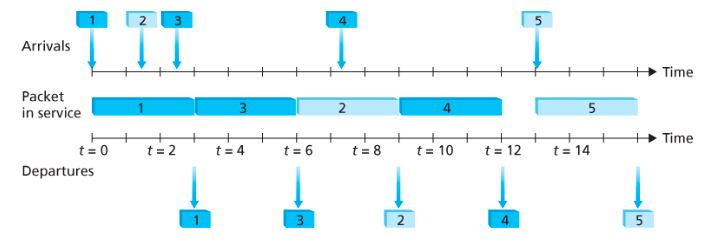

### Round Robin

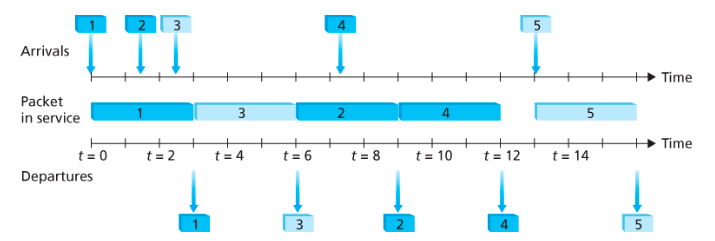

| 구분 | 우선순위 큐잉 (Priority Queueing) | 라운드 로빈 (Round Robin) | WFQ (Weighted Fair Queueing) |
|------|----------------------------------|---------------------------|-------------------------------|
| 기본 개념 | 우선순위가 높은 패킷부터 전송 | 여러 큐를 번갈아가며 전송 | 가중치를 기반으로 공정하게 전송 |
| 처리 방식 | 가장 높은 우선순위 큐 먼저 처리 | 각 큐를 순환하며 하나씩 처리 | 가중치 비율에 따라 처리 |
| 큐 내부 처리 | 동일 우선순위는 FIFO | 각 큐 내부는 FIFO | 각 큐 내부는 FIFO |
| 공정성 | 낮음 (낮은 우선순위는 계속 대기 가능) | 높음 (모든 큐에 기회 제공) | 매우 높음 (가중치 기반 공정성) |
| 특징 | 빠른 처리 가능 | 단순하고 공정함 | QoS 보장 가능 |
| 단점 | starvation 발생 가능 | 중요 트래픽 우선 처리 어려움 | 구현 복잡 |
| 사용 목적 | 중요한 패킷 우선 처리 | 공정한 처리 | 트래픽 비율 제어 및 QoS |

---

### 핵심 정리

- 우선순위 큐잉 -> 빠르지만 불공정 (낮은 우선순위 기아 발생 가능)
- 라운드 로빈 -> 공정하지만 중요도 반영 어려움
- WFQ -> 공정성과 우선순위를 동시에 고려 (실무에서 많이 사용)

---

## 인터넷 프로토콜 (IP)

---

## IPv4 데이터그램

### 개념

> 네트워크 계층에서 사용하는 패킷 (데이터그램)

---

### IPv4 데이터그램 구조


---

### 주요 필드

#### Version

- IP 버전 (IPv4 = 4)

#### Header Length

- 헤더 길이 (보통 20바이트)

#### Total Length

- 전체 데이터그램 길이

#### TTL (Time To Live)

> 패킷 무한 순환 방지

- 라우터 지날 때마다 감소
- 0이면 폐기

#### Protocol

> 상위 계층 전달 대상

- TCP / UDP 구분

#### Header Checksum

- 헤더 오류 검출

#### Source / Destination IP

- 출발지 / 목적지 주소

---

### 핵심

- IP는 전달만 담당
- 신뢰성 없음
- 순서 보장 없음

---

## IP 주소 체계

### IP 주소

> 네트워크에서 장치를 식별하는 주소

- 32비트
- 인터페이스 단위로 할당

### 인터페이스

- 호스트와 물리적 링크 사이의 경계
- 장치는 여러 IP 가질 수 있음

---

## 서브넷 (Subnet)

### 개념

> 라우터 없이 직접 연결된 네트워크

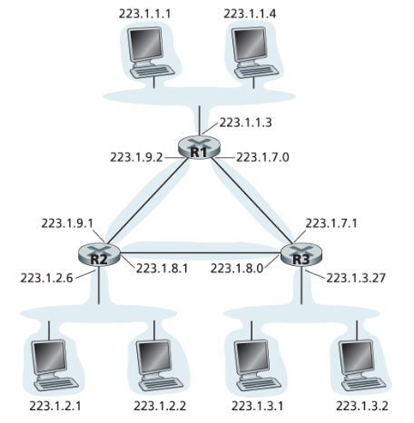

### 특징

- 같은 prefix 공유
- 하나의 네트워크로 동작

---

## CIDR

> prefix 기반 주소 체계

```text
a.b.c.d/x
```

- x → 네트워크 부분
- 나머지 → 호스트 구분

### 특징

- 주소 효율적 사용
- 포워딩 테이블 감소

---

## 클래스 주소 체계

| 클래스 | prefix | 의미        |
| --- | ------ | --------- |
| A   | /8     | 앞 8비트 고정  |
| B   | /16    | 앞 16비트 고정 |
| C   | /24    | 앞 24비트 고정 |

---

## 브로드캐스트

```text
255.255.255.255
```

- 같은 네트워크 전체 전송

---

## 주소 블록 획득

> 기관이 사용할 IP 주소 범위를 ISP로부터 할당받는 과정

- IP 주소는 계층적으로 할당됨
- ICANN -> ISP -> 기관 순서
- ISP는 큰 블록을 나눠서 제공

---

## DHCP


> IP 자동 할당 프로토콜

---

### 동작

1. Discover -> 서버 탐색
2. Offer -> IP 제안
3. Request -> 선택
4. ACK -> 할당 완료

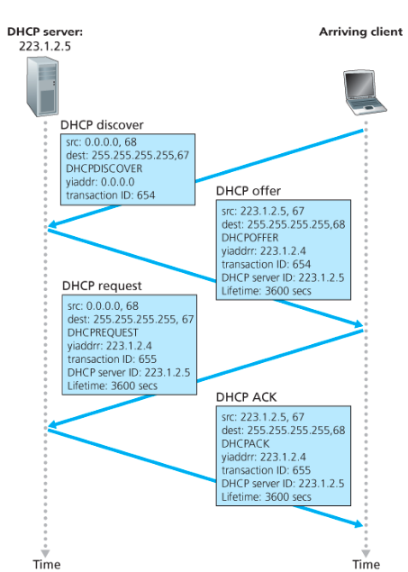

---

### 특징

- 자동 설정
- 관리 편함

---

## NAT

> 사설 IP를 공인 IP로 변환

---

### 특징

- IP 주소 절약
- 내부 네트워크 보호

---

### 동작

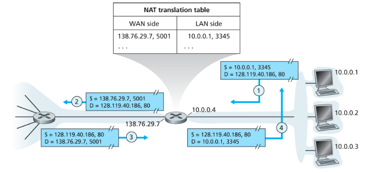

---

### 핵심

- IP + Port로 내부 호스트 구분

---

## IPv6

### 등장 이유

- IPv4 주소 부족

---

### 특징

- 128비트 주소
- 주소 공간 확장

---

### IPv6 구조


---

### 주요 변화

- 헤더 단순화
- 체크섬 제거
- 단편화 제거 (송신자만 수행)

---

## IPv4 -> IPv6 전환

### 터널링


---

### 동작

- IPv6 -> IPv4 내부 캡슐화
- 목적지에서 복원

---

## 핵심 정리

- IP = best-effort
- CIDR = prefix 기반 주소
- DHCP = 자동 IP 할당
- NAT = 주소 변환
- IPv6 = 주소 확장

---

## 일반화된 포워딩 (SDN)

> match → action 방식

- 조건에 따라 패킷 처리
- 다양한 헤더 기준으로 매칭
- 포워딩, 드랍, 수정 가능

### SDN
- 제어 평면 분리
- 중앙 컨트롤러가 정책 결정
- 장비는 실행만 수행

---

## 미들박스

> 네트워크 중간에서 추가 기능 수행하는 장치

### 역할
- NAT → 주소 변환
- 보안 → 방화벽, IDS
- 성능 → 로드밸런싱

### 특징
- 여러 계층 정보 사용
- 계층 구조 일부 위반
