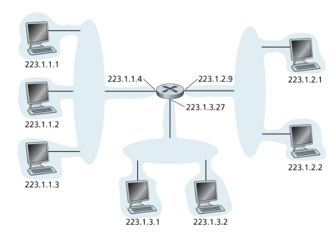
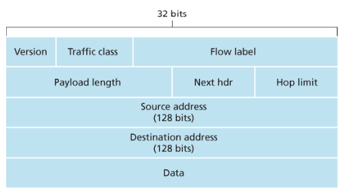
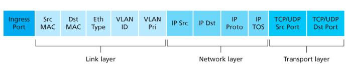

# 네트워크 계층 개요

네트워크 계층은 송신 호스트에서 수신 호스트까지 패킷을 전달하는 계층이다. 송신 측 트랜스포트 계층에서 내려온 세그먼트를 데이터그램으로 감싸고, 목적지까지 전달될 수 있도록 라우터를 거쳐 이동시킨다.

라우터는 네트워크 계층 장비이므로 트랜스포트 계층과 애플리케이션 계층 기능을 직접 지원하지 않는다. 즉, 라우터의 프로토콜 스택에는 네트워크 계층보다 상위 계층이 존재하지 않는다.

## 라우터의 두 평면

라우터의 역할은 크게 데이터 평면과 제어 평면으로 나눌 수 있다.

| 구분 | 역할 | 성격 |
| --- | --- | --- |
| 데이터 평면 | 입력 링크로 들어온 데이터그램을 적절한 출력 링크로 전달 | 하드웨어 중심 |
| 제어 평면 | 데이터그램이 출발지에서 목적지까지 갈 경로와 포워딩 정보를 결정 | 소프트웨어 중심 |

## 포워딩과 라우팅

네트워크 계층의 핵심 역할은 송신 호스트에서 수신 호스트로 패킷을 전달하는 것이다. 이 과정은 포워딩과 라우팅으로 나뉜다.

- **포워딩**: 패킷이 라우터의 입력 링크에 도착했을 때, 포워딩 테이블을 보고 적절한 출력 링크로 이동시키는 작업
- **라우팅**: 송신자에서 수신자까지 어떤 경로로 패킷을 보낼지 결정하는 작업

정리하면, 라우팅은 "어느 길로 보낼지 표를 만드는 일"이고 포워딩은 "만들어진 표를 보고 실제로 패킷을 내보내는 일"이다.

### 포워딩 테이블


라우터는 도착한 패킷 헤더의 필드값을 확인하고, 포워딩 테이블의 엔트리와 비교해 어떤 외부 링크로 내보낼지 결정한다.

### 제어 평면

전통적인 라우터에서는 라우팅 알고리즘이 모든 라우터에서 실행된다. 각 라우터는 다른 라우터와 정보를 주고받으며 포워딩 테이블의 값을 계산한다.

### SDN 접근 방식

SDN(Software Defined Networking)은 제어 평면을 라우터 내부가 아닌 원격 컨트롤러로 분리하는 방식이다.


- **원격 컨트롤러**: 포워딩 테이블을 계산하고 라우터에 배포
- **라우터**: 전달받은 테이블을 기반으로 포워딩만 수행

네트워크가 소프트웨어적으로 정의되면, 컨트롤러가 라우터와 상호작용하면서 포워딩 테이블을 계산한다.

## 네트워크 서비스 모델

네트워크 계층은 이론적으로 다음과 같은 서비스를 제공할 수 있다.

- 보장된 전달
- 지연 제한 이내의 보장된 전달
- 순서화된 패킷 전달
- 최소 대역폭 보장
- 보안 서비스

하지만 인터넷의 네트워크 계층은 **최선형 서비스(best-effort service)** 를 제공한다.

- 패킷이 보낸 순서대로 수신됨을 보장하지 않는다.
- 패킷이 목적지까지 도착함을 보장하지 않는다.
- 종단 시스템 간 지연을 보장하지 않는다.
- 최소 대역폭을 보장하지 않는다.

## 라우터 내부 구조


라우터는 입력 포트, 스위치 구조, 출력 포트, 라우팅 프로세서로 구성된다.

### 입력 포트

- 라우터로 들어오는 입력 링크와 연결된다.
- 물리 계층 및 링크 계층 기능을 수행한다.
- 포워딩 테이블을 참조해 도착한 패킷이 어느 출력 포트로 가야 하는지 검색한다.
- 포워딩 테이블은 라우팅 프로세서에서 계산 및 갱신되거나, 원격 SDN 컨트롤러에서 수신한다.

### 스위치 구조

- 입력 포트와 출력 포트를 연결한다.
- 패킷이 라우터 내부에서 이동하는 경로 역할을 한다.

### 출력 포트

- 스위치 구조에서 받은 패킷을 저장한다.
- 출력 링크를 통해 패킷을 전송한다.
- 양방향 링크에서는 같은 링크의 입력 포트와 한 쌍을 이룬다.

### 라우팅 프로세서

- 제어 평면 기능을 수행한다.
- 라우팅 알고리즘을 실행하거나 SDN 컨트롤러와 통신한다.

정리하면 입력 포트, 출력 포트, 스위치 구조는 주로 하드웨어이고, 제어 평면은 주로 소프트웨어이다.

## 목적지 주소 기반 포워딩

IP 주소마다 포워딩 테이블 엔트리를 하나씩 만들면 40억 개 이상의 주소를 다뤄야 하므로 현실적으로 불가능하다. 그래서 주소 범위나 prefix를 이용해 포워딩한다.


### Prefix 포워딩


패킷의 목적지 주소 prefix를 포워딩 테이블의 엔트리와 매치한다. 여러 엔트리가 동시에 매치될 수 있으면 **최장 prefix 매치(longest prefix matching)** 규칙을 사용한다.

```text
11001000 00010111 00010110 10100001
→ 첫 번째 엔트리와 매치

11001000 00010111 00011000 10101010
→ 처음 24비트는 2번째 엔트리와 매치
→ 처음 21비트는 3번째 엔트리와 매치
→ 최장 prefix 매치 규칙에 따라 2번째 엔트리 선택
```

## 스위칭 방식

스위칭은 라우터 내부에서 입력 포트의 패킷을 출력 포트로 이동시키는 과정이다.

### 메모리를 통한 교환


초기 라우터는 프로세서가 직접 입력 포트와 출력 포트 사이의 패킷 이동을 제어했다.

1. 패킷이 입력 포트에 도착한다.
2. 프로세서 메모리에 패킷을 복사한다.
3. 라우팅 프로세서가 헤더에서 목적지를 추출한다.
4. 포워딩 테이블에서 출력 포트를 찾는다.
5. 패킷을 출력 포트의 버퍼에 복사한다.

### 버스를 통한 교환


입력 포트가 라우팅 프로세서의 개입 없이 공유 버스를 통해 직접 출력 포트로 패킷을 보낸다.

```text
기존 방식
입력 포트: 이 패킷 어디로 보내?
라우팅 프로세서: 2번 출력 포트로 보내라.

버스 방식
입력 포트: 목적지를 보니 2번 출력 포트네. 바로 공유 버스로 보낸다.
```

입력 포트는 라우터 내부에서만 사용하는 레이블을 패킷에 붙인다.

```text
[출력 포트 2로 가라] + [패킷]
```

모든 출력 포트가 패킷을 수신하지만, 레이블과 매치되는 출력 포트만 패킷을 유지한다.

```text
입력 포트 1이 버스에 패킷을 올림
출력 포트 1, 2, 3: 나한테 온 건가?
출력 포트 1, 3: 내 것이 아니므로 버림
출력 포트 2: 내 것이므로 유지
```

공유 버스가 하나뿐이기 때문에 동시에 여러 패킷이 지나갈 수 없다. 따라서 교환 속도는 버스 속도에 의해 제한된다.

### 상호 연결 네트워크를 통한 교환


크로스바 스위치는 N개의 입력 포트와 N개의 출력 포트를 연결한다. 여러 패킷을 병렬로 전달할 수 있지만, 서로 다른 입력 포트에서 나온 패킷이 같은 출력 포트로 가면 한 번에 하나만 전송되고 나머지는 기다려야 한다.

### 출력 포트 처리

출력 포트는 메모리에 저장된 패킷을 출력 링크를 통해 전송한다. 이때 전송할 패킷 선택, 큐 제거, 링크 계층 및 물리 계층 전송 기능을 함께 수행한다.

## 큐잉

### 입력 큐잉


입력 큐의 맨 앞 패킷이 특정 출력 포트를 기다리면, 그 뒤의 패킷은 다른 출력 포트로 갈 수 있더라도 앞 패킷 때문에 대기해야 할 수 있다. 이를 **HOL(Head-of-Line) 차단**이라고 한다.

### 출력 큐잉


출력 포트는 시간 단위마다 하나의 패킷만 전송할 수 있다. 여러 입력 포트에서 동시에 패킷이 도착하면 출력 큐에서 대기한다.

메모리가 부족하면 다음 중 하나를 선택해야 한다.

1. 새로 도착한 패킷을 버린다.
2. 이미 큐에 있던 패킷 중 하나를 버리고 새 패킷을 넣는다.

출력 포트의 패킷 스케줄러는 대기 중인 패킷 중 하나를 선택해 큐에서 제거하고 전송한다.

### 버퍼링과 버퍼블로트

버퍼가 클수록 패킷 손실률은 줄어들 수 있지만, 큐잉 지연은 길어진다. 버퍼링으로 인해 지연이 과도하게 길어지는 현상을 **버퍼블로트(bufferbloat)** 라고 한다.

### 패킷 스케줄링

- FIFO
- 우선순위 큐잉
- 라운드 로빈
- WFQ(Weighted Fair Queuing)

## 인터넷 프로토콜(IP)

인터넷 네트워크 계층의 패킷은 **데이터그램(datagram)** 이라고 한다.

### IPv4 데이터그램 포맷


IPv4 데이터그램은 다음 필드를 가진다.

- **버전 번호**
- **헤더 길이**: 대부분의 데이터그램은 20바이트 헤더를 가진다. 옵션이 있으면 헤더 길이가 늘어날 수 있다.
- **서비스 타입**
- **데이터그램 길이**
- **식별자, 플래그, 단편화 오프셋**
- **TTL**: 라우터가 데이터그램을 처리할 때마다 감소한다. 0이 되면 데이터그램을 폐기해 무한 순환을 방지한다.
- **프로토콜**: 목적지 트랜스포트 계층의 프로토콜을 명시한다. 예: TCP, UDP
- **헤더 체크섬**
- **출발지 IP 주소와 목적지 IP 주소**
- **옵션**
- **데이터**

## IPv4 주소 체계

### 인터페이스와 IP 주소

- **인터페이스**: 네트워크와 장비가 만나는 연결 지점
- **호스트**: 보통 인터페이스가 1개라서 IP 주소도 1개처럼 보인다.
- **라우터**: 여러 링크를 연결하므로 인터페이스가 여러 개다.
- **IP 주소**: 장비 자체가 아니라 인터페이스에 붙는 주소다.

### 서브넷과 IP 주소

IPv4 주소는 32비트이며, 주소의 각 바이트를 십진수로 표현하고 점으로 구분한다.

```text
예: 223.1.1.1
```

IP 주소의 일부는 연결된 서브넷을 결정한다.



세 호스트의 인터페이스들과 하나의 라우터 인터페이스로 연결된 네트워크는 하나의 서브넷을 구성한다고 볼 수 있다.

정리하면, 서브넷을 결정할 때는 먼저 호스트와 라우터의 각 인터페이스를 기준으로 네트워크를 분리한다. 이렇게 분리된 고립 네트워크의 경계는 인터페이스가 되고, 각 고립 네트워크를 하나의 서브넷이라고 부른다.

### CIDR

CIDR(Classless Inter-Domain Routing)은 인터넷 주소를 유연하게 할당하기 위한 방식이다.

CIDR에서는 서브넷 주소를 `a.b.c.d/x` 형식으로 표현한다. 여기서 `x`는 IP 주소에서 네트워크 부분을 구성하는 비트 수이며, 이를 **프리픽스(prefix)** 또는 **네트워크 프리픽스**라고 부른다.

### 클래스 주소 체계

CIDR이 사용되기 전에는 IP 주소의 네트워크 부분을 8비트, 16비트, 24비트 단위로 제한했다. 각각을 A, B, C 클래스 네트워크로 나누었기 때문에 이를 클래스 주소 체계라고 한다.

클래스 주소 체계는 주소를 고정된 크기로 나누기 때문에 실제 필요한 주소 수와 맞지 않아 주소 낭비가 생기기 쉽다. CIDR은 프리픽스 길이를 더 자유롭게 정할 수 있어 이런 문제를 완화한다.

### 브로드캐스트 주소

호스트가 목적지 IP 주소를 `255.255.255.255`로 설정한 데이터그램을 보내면, 해당 메시지는 같은 서브넷에 있는 모든 호스트에게 전달된다. DHCP처럼 아직 자신의 IP 주소를 모르는 호스트가 네트워크 전체에 요청을 보낼 때 사용된다.

### 주소 블록 획득

기관이 서브넷에서 사용할 IP 주소 블록을 얻으려면, 네트워크 관리자는 먼저 ISP(Internet Service Provider)에 요청한다. ISP는 자신이 이미 할당받은 큰 주소 블록에서 일부를 잘라 기관에 제공한다.

ISP가 큰 주소 블록을 가지고 있다면, 이 블록을 같은 크기의 더 작은 주소 블록 여러 개로 나누어 여러 조직에 할당할 수 있다. ISP는 비영리 단체인 ICANN으로부터 주소 블록을 할당받는다.

ICANN의 주요 역할은 다음과 같다.

- IP 주소 할당 관리
- DNS 루트 서버 관리

### 호스트 주소 획득: DHCP

기관이 ISP로부터 주소 블록을 획득하면, 기관 내부의 호스트와 라우터 인터페이스에 개별 IP 주소를 할당해야 한다. 라우터 인터페이스의 IP 주소는 보통 시스템 관리자가 직접 설정한다.

호스트의 IP 주소는 수동으로 설정할 수도 있지만, 일반적으로 **DHCP(Dynamic Host Configuration Protocol)** 를 사용한다. DHCP는 호스트가 네트워크에 연결될 때 자동으로 IP 주소를 얻도록 해주며, 다음 정보도 함께 제공할 수 있다.

- 서브넷 마스크
- 첫 번째 홉 라우터 주소
- 로컬 DNS 서버 주소
- IP 주소 임대 기간

DHCP는 사용자가 별도 설정 없이 네트워크에 연결할 수 있게 해주므로 **플러그 앤 플레이 프로토콜** 또는 **제로 구성 프로토콜**이라고도 한다.

DHCP는 클라이언트-서버 프로토콜이다. 클라이언트는 보통 새롭게 네트워크에 연결된 호스트이고, DHCP 서버는 해당 호스트에게 네트워크 설정 정보를 제공한다. 각 서브넷에는 DHCP 서버가 있거나, DHCP 서버의 위치를 알려주는 DHCP 릴레이 에이전트가 필요하다. 릴레이 에이전트는 일반적으로 라우터가 담당한다.

DHCP 동작은 다음 4단계로 진행된다.

1. **DHCP 서버 발견**
   - 클라이언트는 DHCP 발견 메시지를 UDP 포트 67번으로 보낸다.
   - 아직 자신의 IP 주소가 없으므로 출발지 IP 주소는 `0.0.0.0`, 목적지 IP 주소는 브로드캐스트 주소 `255.255.255.255`를 사용한다.
   - 이 IP 데이터그램은 링크 계층에서 서브넷의 모든 노드로 브로드캐스트된다.
2. **DHCP 서버 제공**
   - DHCP 서버는 DHCP 제공 메시지로 응답한다.
   - 응답도 브로드캐스트로 전달될 수 있다.
   - 제공 메시지에는 트랜잭션 ID, 제공할 IP 주소, 네트워크 마스크, 임대 기간 등이 포함된다.
3. **DHCP 요청**
   - 클라이언트는 하나 이상의 서버 제공 메시지 중 하나를 선택하고, 선택한 설정을 사용하겠다는 DHCP 요청 메시지를 보낸다.
4. **DHCP ACK**
   - 서버는 DHCP ACK 메시지로 요청된 파라미터를 확인한다.
   - 클라이언트는 ACK을 받은 뒤 임대 기간 동안 할당받은 IP 주소를 사용할 수 있다.

DHCP의 단점은 노드가 새로운 서브넷으로 이동할 때마다 새로운 IP 주소를 얻는다는 점이다. 이 때문에 이동 중인 노드가 서브넷을 바꾸면 기존 TCP 연결이 유지되기 어렵다.

## 네트워크 주소 변환: NAT

네트워크가 커질수록 모든 호스트에 공인 IP 주소를 할당하려면 큰 주소 블록이 필요하다. 하지만 ISP가 이미 인접한 주소 범위를 다른 곳에 할당했거나, 충분한 공인 주소를 확보하기 어려운 경우가 있다. 이때 **NAT(Network Address Translation)** 를 사용할 수 있다.

NAT 가능 라우터는 내부 네트워크 쪽 인터페이스와 외부 인터넷 쪽 인터페이스를 가진다. 예를 들어 홈 네트워크 내부 장비들은 `10.0.0.0/24` 같은 사설 주소를 사용하고, 외부 인터넷에서는 NAT 라우터의 공인 IP 주소 하나로 보인다.

`10.0.0.0/8`은 사설망에서 사용하도록 예약된 주소 공간 중 하나다. 사설 주소는 해당 네트워크 내부에서만 의미가 있으며, 글로벌 인터넷에서는 직접 라우팅되지 않는다.

NAT 라우터는 외부 세계에 대해 하나의 IP 주소를 가진 장비처럼 동작한다.

- 내부에서 외부로 나가는 패킷의 출발지 IP 주소는 NAT 라우터의 공인 IP 주소로 바뀐다.
- 외부에서 내부로 들어오는 응답 패킷의 목적지 IP 주소도 NAT 라우터의 공인 IP 주소가 된다.
- NAT 라우터는 내부 네트워크의 구체적인 구조를 외부에 숨긴다.

외부에서 보면 모든 응답 데이터그램의 목적지 IP 주소가 NAT 라우터의 공인 IP 주소로 같아 보인다. NAT 라우터는 어떤 내부 호스트에게 전달해야 하는지 구분하기 위해 **NAT 변환 테이블**을 사용한다.

NAT 변환 테이블에는 내부 호스트의 IP 주소와 포트 번호, 외부로 변환된 IP 주소와 포트 번호가 함께 저장된다. 따라서 웹 서버는 내부 호스트를 알지 못하고 NAT 라우터의 공인 주소로 응답하지만, NAT 라우터는 변환 테이블을 보고 알맞은 내부 호스트에게 응답을 전달할 수 있다.

NAT는 포트 번호를 함께 사용한다는 점에서 계층 구조를 흐릴 수 있다. 포트 번호는 원래 호스트 주소 지정이 아니라 프로세스 주소 지정에 사용되기 때문이다. 특히 홈 네트워크 내부에서 서버를 운영할 때는 외부에서 들어오는 연결을 어떤 내부 호스트로 전달할지 명시해야 하므로 문제가 생길 수 있다. 이런 문제를 해결하기 위해 포트 포워딩이나 NAT 순회 도구를 사용할 수 있다.

## IPv6

IPv6는 IPv4 주소 공간이 빠르게 고갈되면서 개발되었다.

### IPv6의 특징

- **확장된 주소 기능**: 32비트에서 128비트로 확장
- **주소 유형**: 유니캐스트, 멀티캐스트, 애니캐스트
- **40바이트 고정 길이 헤더**
- **흐름 레이블링**

### IPv6 데이터그램 포맷



- 버전
- 트래픽 클래스
- 흐름 레이블
- 페이로드 길이
- 다음 헤더: TCP, UDP 등 상위 프로토콜 구분
- 홉 제한: IPv4의 TTL과 비슷한 역할
- 출발지 주소와 목적지 주소
- 데이터

## IPv4에서 IPv6로의 전환

IPv6 장비나 시스템은 IPv4와 함께 동작하도록 만들 수 있다. 하지만 기존 IPv4 전용 장비는 IPv6 패킷을 이해할 수 없다.

### 터널링


터널링은 IPv6 데이터그램을 IPv4 데이터그램 안에 넣어 IPv4 네트워크를 통과시키는 방식이다. 터널 내부의 IPv4 라우터는 IPv4 데이터그램 안에 IPv6 데이터그램이 들어 있다는 사실을 모르고, 일반 IPv4 데이터그램처럼 처리한다.

## 일반화된 포워딩과 SDN

### 목적지 기반 포워딩

목적지 기반 포워딩은 목적지 IP 주소를 매치하고, 스위치 구조를 통해 지정된 출력 포트로 전송하는 방식이다.

### Match + Action

일반화된 포워딩에서는 헤더 필드를 보고 다양한 동작을 수행할 수 있다.

- 하나 이상의 출력 포트로 패킷 전달
- 인터페이스에서 나가는 패킷을 로드 밸런싱
- 헤더값 다시 쓰기
- 패킷 차단 또는 삭제
- 추가 처리를 위해 특수 서버로 패킷 전달

일반화된 포워딩에서 각 패킷 스위치는 원격 컨트롤러가 계산하고 배포한 **match + action 테이블**을 가진다.

예: OpenFlow 1.0

- 포워딩
- 로드 밸런싱
- 방화벽

```text
조건
- 출발지 IP: 10.0.0.5
- 목적지 포트: 22
- 프로토콜: TCP

동작
- 출발지 IP가 10.0.0.5이고 목적지 포트가 22이면 삭제

매치: 10.0.0.5 + TCP 22
액션: drop
```


### 매치



### 액션과 플로우 테이블

플로우 테이블은 엔트리와 매치되는 패킷을 어떻게 처리할지 결정하는 0개 이상의 액션 목록을 가진다. 여러 액션이 있으면 지정된 순서대로 실행된다.

- 포워딩
- 삭제
- 필드 수정

### 미들박스

미들박스는 출발지 호스트와 목적지 호스트 사이의 데이터 경로에서 일반적인 IP 라우터 기능 외의 추가 기능을 수행하는 장비를 말한다.

대표적인 미들박스 기능은 다음과 같다.

- NAT 변환
- 보안 서비스
- 성능 향상

미들박스는 실용적인 기능을 제공하지만 계층 분리 관점에서는 논쟁이 있다. 예를 들어 NAT 박스는 네트워크 계층의 IP 주소뿐 아니라 트랜스포트 계층의 포트 번호까지 다시 쓴다. 따라서 순수한 계층 구조만 보면 어색하지만, 주소 부족 문제 해결이나 보안 정책 적용 같은 현실적인 필요 때문에 널리 사용된다.
