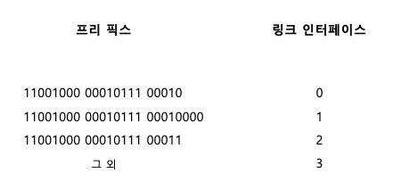
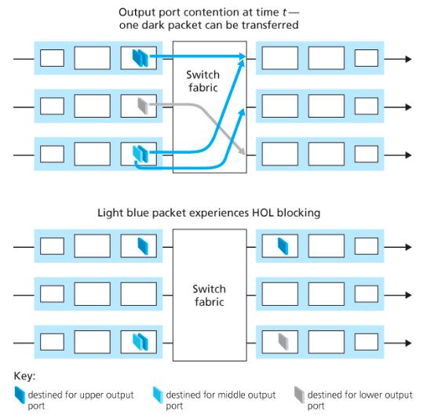
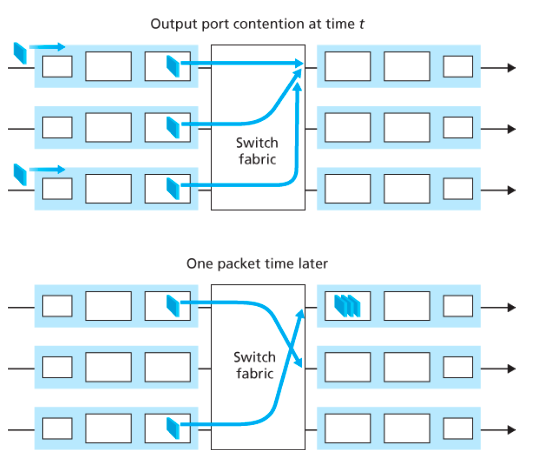

네트워크 계층 개요

호스트 A와 B가 있을 때 네트워크 계층은 송신 트랜스포트 계층 세그먼트를 추출하여 H2 트랜스포트 계층까지 전달하는 역할을 한다.

라우터는 트랜스포트 계층과 애플리케이션 계층을 지원 x
-> 프로토콜 스택에서 네트워크 상위 계층 존재 x

라우터
* 데이터 평면 -> 입력 링크에서 출력 링크로 데이터그램을 전달
* 제어 평면 -> 데이터그램이 출발지 호스트에서 목적지 호스트까지 전달되게끔 로컬 포워딩, 라우터별 포워딩 대응

포워딩과 라우팅: 데이터 & 제어 평면
네트워크 계층의 근본적인 역할 -> 송신 호스트에서 수신 호스트로 패킷을 전달하는 것

* 포워딩(전달) -> 패킷이 라우터의 입력 링크에 도달했을 때 라우터는 그 패킷을 적절한 출력 링크로 이동시켜야 한다, 하드웨어
* 라우팅 -> 송신자가 수신자에게 패킷을 전송할 때 네트워크 계층은 패킷 경로를 결정해야 한다 -> 이 때 라우팅 알고리즘 사용, 소프트웨어

-> 라우팅은 어느 길로 갈지 표를 만드는 일
-> 포워딩은 만들어진 표를 보고 실제로 패킷을 내보내는 일

포워딩 테이블

-> 라우터는 도착하는 패킷 헤더의 필드값을 통해 패킷을 전달한다.
포워딩 테이블 엔트리에 저장되어 있는 헤더의 값은 해당 패킷이 전달되어야 할 라우터의 외부 링크를 나타냄

제어평면
라우팅 알고리즘은 모든 라우터에서 실행, 라우터는 포워딩과 라우팅 기능을 모두 갖고 있어야 함
라우터의 라우팅 알고리즘 기능은 다른 라우터의 라우팅 알고리즘과 소통하며 포워딩 테이블의 값을 계산

SDN(Software Defined Networking) 접근 방법

원격 컨트롤러 컴퓨터와 라우터를 사용한 방법 
-> 원격 컨트롤러: 포워딩 테이블을 계산 및 배분
-> 라우터: 포워딩만을 수행

네트워크가 소프트웨어적으로 정의되었을 때, 포워딩 테이블을 계산하는 컨트롤러는 라우터와 상호작용을 하며 소프트웨어에서 실행

네트워크 서비스 모델
네트워크 계층 제공 서비스
* 보장된 전달
* 지연 제한 이내의 보장된 전달
* 순서화 패킷 전달
* 최소 대역폭 보장
* 보안 서비스

인터넷 네트워크 계층은 최선형 서비스(best-effort service)
* 패킷을 보내는 순서대로 수신됨을 보장하지 않는다.
* 목적지까지 패킷이 전송됨을 보장하지 않는다.
* 종단 시스템 간 지연이 보장되지 않는다.
* 보장된 최소 대역폭이 없다.

라우터

입력 포트:
    * 입력 포트의 맨 왼쪽과 맨 오른쪽 박스는 라우터에 들어오는 입력 링크, 물리 계층 기능을 수행 -> 오른쪽 박스 오타인가????
    * 링크 계층과 상호 운용하기 위해 필요한 링크 계층 기능 수행
    * 검색 기능 -> 포워딩 테이블을 참조, 도착된 패킷이 스위치 구조를 통해 출력 포트를 결정
    포워딩 테이블은 라우팅 프로세서에서 계산, 갱신되거나 원격 SDN 컨트롤러에서 수신

스위치 구조:
    * 입, 출력 포트를 연결
출력 포트:
    * 스위치에서 수신한 패킷 저장, 출력 링크로 패킷을 전송
    * 양방향일 경우 동일한 링크의 입력 포트와 한 쌍을 이룸
라우팀 프로세서:
    * 제어평면 기능을 수행

입력 포트, 출력 포트, 스위치 -> 하드웨어
제어편면 -> 소프트웨어

목적지 주소 범위 포워딩 테이블
ip 주소마다 포워딩 테이블을 억지로 구현하는 것은 불가능(40 억개 이상의 주소 필요)

프리 픽스 포워딩 테이블

패킷의 목적지 주소의 prefix를 테이블의 엔트리와 매치

예: 11001000 00010111 00010110 10100001은 첫 번째 엔트리와 연결
11001000 00010111 00011000 10101010은 처음 24비트는 2번째, 처음 21비트는 3번째에 매치 -> 최장 프리픽스 매치 규칙에 따라 2번째에 보냄

스위칭
메모리를 통한 교환

초기의 라우터는 프로세서를 직접 제어해서 입력 포트와 출력 포트 사이에서 패킷을 스위칭하는 방법
패킷 도착하면 프로세서 메모리에 복사 -> 라우팅 프로세서는 헤더에서 목적지 추출 -> 포워딩 테이블에서 출력 포트 찾아서, 패킷을 출력 포트의 버퍼에 복사

메모리 스위칭
목적지 주소 검색 -> 해당 메모리 위치에 패킷을 저장

버스를 통한 교환

입력 포트는 라우팅 프로세서 개입 없이 공뷰 버스를 통해 직접 출력 포트로 패킷 전송
-> 원래: 
    입력 포트: 이 패킷 어디로 보내?
    라우팅 프로세서: 2번 출력 포트로 보내라
-> 버스:
    입력 포트: 목적지 보니까 2번 출력 포트네, 바로 공유 버스로

입력 포트 스위치 내부 레이블 -> 라우터 내부에서 잠깐 쓰는 꼬리표 붙임, 레이블은 출력 포트에서 제거됨
예: [출력 포트 2로 가라] + [패킷]

모든 출력 포트에 패킷 수신, 레이블과 매치되는 포트만 패킷을 유지
-> 입력 포트 1이 버스에 패킷 올림
출력 포트 1, 2, 3: 나한테 온건가?
출력 포트 1, 3: 내꺼 아니네. 버림.
출력 포트 2: 내꺼네. 유지.

공유 버스가 하나뿐이기 때문에 하나 도착하면 다른 패킷은 대기해야함
패킷이 버스를 통과해야하므로 교환 속도가 버스 속도에 의해 제한됨 

상호 연결 네트워크를 통한 교환

크로스바 스위치 -> N개의 입력 포트, N개의 출력 포트에 연결

여러 패킷을 병렬로 전달할 수 있다.
다만 서로 다른 입력 포트에서 나오는 2개의 패킷이 동일한 출력 포트로 가는 경우, 한 번에 하나의 패킷만 
특정 버스로 전송될 수 있음 -> 다른 패킷은 기다려야 함

출력 포트 처리
출력 포트의 메모리에 저장된 패킷을 출력 링크를 통해 전송
전송을 위핸 패킷 선택 및 큐 제거, 필요한 링크 계층 및 물리 계층 전송 기능 포함

큐잉
입력 큐잉

왼쪽 하단 큐의 가장 앞쪽 패킷은 출력 포트 같으니까 대기, 두번째 패킷은 출력 포트 다르지만 앞의 패킷 때문에 대기해야함 -> HOL(Head of the line) 차단

출력 큐잉

출력 포트는 시간 단위에 단일 패킷만을 전송할 수 있기 때문에 N개의 도착 패킷은 출력 링크를 통한 전송 큐에서 대기
메모리가 충분하지 않을 때 도착한 패킷을 삭제하거나 이미 대기 중인 하나 이상의 패킷을 제거해야함
예: 만약에 출력 큐 공간이 3인데 현재 대기 패킷이 3개이고, 새 패킷이 도착한다면
1. 새로 도착한 패킷을 버린다
2. 이미 큐에 있던 패킷 중 하나를 버리고 새 패킷을 넣음

출력 포트의 패킷 스케줄러가 대기 중인 패킷 중 하나를 선택하여 큐에서 제거

버퍼링이 클 수록 패킷 손실률을 감소 시킬 수 있지만 그만큼 큐잉 지연이 길어진다.
예: 홉당 버퍼의 양을 10배 늘리면 종단 간 지연이 10개 증가함
지속적인 버퍼링으로 지연이 과도하게 길어지는 현상 -> 버퍼블로트

패킷 스케줄링
FIFO
우선순위 큐잉
라운드 로빈, WFQ
