# 네트워크 계층(Network Layer) 정리

## 학습 목표

- 네트워크 레이어 서비스 모델 이해
- 포워딩과 라우팅 차이 이해
- 라우터 작동 방식 이해
- 일반적인 포워딩 방법 이해

## 1. 네트워크 레이어
* 세그먼트를 받으면 dest의 트랜스포트 계층으로 보내는 역할을 하는거
* sender(호스트입장에서) : 받은 세그먼트를 캡슐화해서 링크계층으로 보냄
* receiver(호스트입장에서) : 데이터그램(네트워크 layer에서의 데이터 단위)에서 세그먼트를 추출해서 트랜스포트 레이어로 전송

네트워크 계층은 모든 인터넷 디바이스에 구현 돼 있어야함. (라우터, 엔드호스트 모두 다)

라우터 : 데이터그램의 헤더필드를 보고 어디로 보낼지를 본다.
- application 계층과, transport계층 지원하지 않음.

---

### 1.1 네트워크 계층의 두 가지 기능

1. forwarding : 패킷이 라우터의 입력 링크에 도달하면 해당 패킷을 적절한 출력 링크로 이동시키는것. **data plane(데이터 평면)**에서 실행되며 매우 짧은시간단위를 가짐 (라우터에서 라우터로 pass)

2. routing : sender가 receiver에게 패킷을 전송할 때 네트워크 계층은 패킷의 경로를 결정해야함. end to end(경로를 결정해주는 것). (라우팅 알고리즘)

---

### 1.2 라우터의 두 가지 평면

라우터에는 2가지 평면이 존재함.
**data plane(데이터 평면)** : 입력 링크에서 출력 링크로 데이터그램을 전달 (packet 포워딩)
* 라우터의 input 포트로 들어온거 어떤 output포트로 보낼지 결정하는 것. (local)
> 이미지 참고: data plane
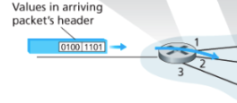

**control plane(제어 평면)** : 데이터그램이 출발지 호스트에서 목적지 호스트까지 전달 되게끔 로컬 포워딩, 라우터별 포워딩을 대응시킴. (포워딩 테이블 완성) (라우팅) (global view)
주로 소프트웨어로 구현되며 라우팅 프로세서에서 실행됨.
* 2가지 접근법이 있음
    * 표 접근 : 포워딩 표를 통해서 목적지를 찾는 방법
    * 서버 접근(SDN) : 서버(remote controller computer)가 라우팅 정보를 각각 라우터에 전달함. 그러면 라우터가 그 정보를 통해 올바른 라우터로 보냄.

---

### 1.3 포워딩 테이블


라우터는 도착하는 패킷 헤더의 필드 값을 통해 `포워딩 테이블`을 사용하여 패킷을 전달함.
해당 테이블에 저장되어 있는 헤더의 값은 해당 패킷이 전달되어야할 라우터의 외부 링크를 나타냄.

#### 전통적인 접근 방법

각 라우터마다 라우팅 알고리즘(벨만포드, 다익스트라 등)이 있어서 자기들이 스스로 실행하고 라우터마다 그걸 상호작용하며 포워딩 테이블의 값을 계산함.(5장에서 더 다룸) 각 라우터는 포워딩이랑 라우팅 기능을 모두 갖고 있어야함.
포워딩 테이블을 결정하는 것은 control plane과 관련이 있음. (packet이랑은 관련 없음.)

#### SDN 접근 방법

table 만들기 위해 원격 컨트롤러를 사용함. 얘가 각 라우터에 포워딩 표를 설치함.
원격 컨트롤러 컴퓨터 : 네트워크 정보를 모아서 표를 결정하고 라우터에 배분함.


---

## 2. 네트워크 서비스 모델

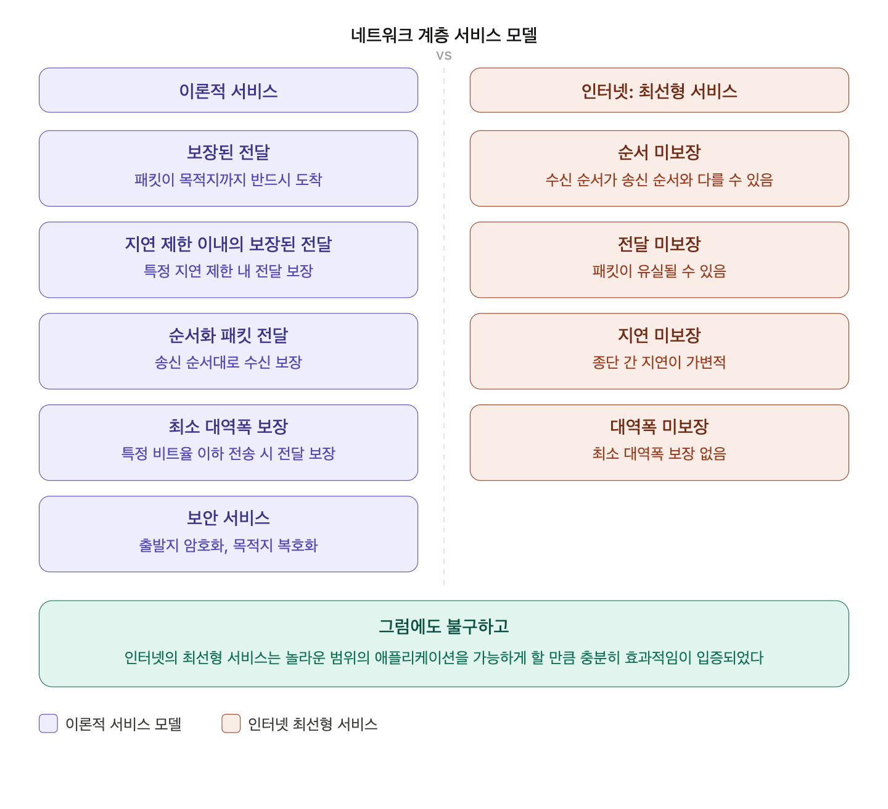

네트워크 계층이 이상적으로 제공할 수 있는 서비스 vs  인터넷이 실제로 제공하는 최선형 (best-effort service)의 특징.

인터넷의 네트워크 계층은 많은 것을 보장하지 않지만, 다음 이유로 충분히 실용적이다.
1. 구조가 단순하다.
2. 실시간 애플리케이션이 동작하기에 충분한 대역폭 성능을 제공하는 경우가 많다.
3. 네트워크 계층에서 보장하지 않아도 다른 계층이나 기술에서 보완할 수 있다. 예: CDN 등

---

## 3. 라우터 내부 구조

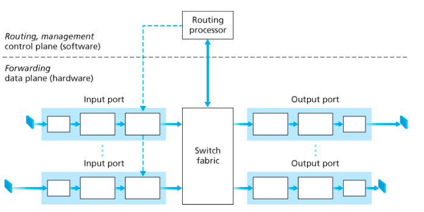

* 라우팅 프로세서 (control plane - 제어평면 기능을 수행함.)
    - 적절한 output link를 결정함.
    - 전통적인 라우터에선 라우팅 프로토콜 실행하고 테이블과 연결된 링크를 관리하면서 포워딩 테이블 계산함
    - SDN에서는 원격 컨트롤러랑 통신하며 원격 컨트롤러가 보낸 테이블값을 라우터의 입력 포트에 이런 엔트리를 설치함.(포워딩 테이블 만들어지면 테이블들이 각 input port에 저장됨)
    - 네트워크 관리 기능을 수행함.

* 입력 포트 (input port)
    - 들어오는 링크의 물리 계층
    - 링크 계층 기능 수행. (패킷을 해석하고 포장하는 변환 작업(=링크 계층 기능, decode and analyze)을 수행하며, 이 변환 장치를 미들박스라고 부른다.)
    - 가장 중요한 건 포워딩 테이블을 참조해서 패킷을 어느 출력 포트로 보낼지 결정하는 검색 기능.
    - 제어 패킷(라우터끼리 경로 정보를 주고받는 패킷)은 라우팅 프로세서로 전달.

* 스위치 구조 (switch fabric)
    - 라우터의 입력 포트와 출력 포트를 연결함.
    - 라우터 내부에 포함되어 있음

* 출력 포트 (output port)
    - 스위치 구조에서 받은 패킷을 저장하고 링크 계층 (받는 쪽 기기 규격에 맞게 패킷을 다시 포장) + 물리 계층 기능을 수행해서 출력 링크로 전송(포장된 패킷을 실제 케이블로 내보낼 수 있도록 전기 신호나 빛 신호로 변환해서 전송).

### 3.1 입력 포트 기능


- 입력 포트에서 수행되는 검색(lookup)은 라우터 동작의 핵심이다.
- 포워딩 테이블을 사용해서 도착 패킷이 스위치 구조를 통해 전달되는 출력 포트를 검색한다.
- 포워딩 테이블은 라우팅 프로세서에서 계산되고 각 라인 카드에 복사됨 → 패킷마다 중앙 프로세서를 거치지 않아도 돼서 병목 방지.

### 3.2 포워딩 테이블 검색

#### 목적지 주소 범위 포워딩 테이블


IP 주소는 32비트라서 모든 주소마다 엔트리를 만들면 40억 개 이상 필요 → 불가능.
IP 주소를 묶어서 관리 → 주소 범위 경계 설정 어려움.

#### 프리픽스 포워딩 테이블

프리픽스(prefix) 기반으로 테이블을 구성. 목적지 주소의 앞부분만 보고 어느 링크로 보낼지 결정.

최장 프리픽스 매칭(longest prefix matching) : 여러 엔트리가 매치될 때 가장 길게 매치되는 엔트리를 선택. 더 구체적인 경로를 우선시하는 것.
- (포워딩 테이블 검색은) 주로 TCAM(ternary content addressable memory)을 사용해서 수행됨.
- TCAM에 주소를 입력하면, 테이블 크기에 상관없이 1 clock 만에 결과를 꺼내온다.

검색을 통해 패킷의 출력 포트가 결정되면 패킷을 스위치 구조로 보낼 수 있다.

### 3.3 스위칭

패킷이 입력 포트에서 출력포트로 전달되는 과정

3가지 주요 타입이 존재

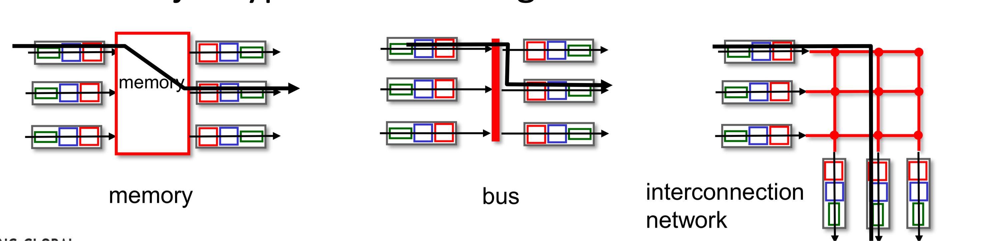

#### 메모리를 통한 교환(초기 라우터)
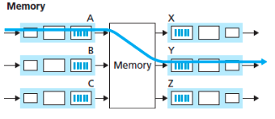
- 패킷이 프로세서 메모리에 복사되고, 라우팅 프로세서가 출력 포트 결정(패킷 헤더를 통해서 목적지 추출 후 포워딩 테이블 참조) 후 출력 버퍼에 복사.
- 메모리 대역폭에 의해 속도 제한됨. (라우터 성능 ↓ - 메모리 접근 시간 많이 걸림)
- 두 패킷을 동시에 전달 불가. (한 번에 하나의 메모리 읽기/쓰기 작업을 수행할 수 있으므로)

#### 버스를 통한 교환

- 입력 포트가 라우팅 프로세서 개입 없이 패킷에 레이블을 붙여서 공유 버스를 통해 직접 출력 포트로 전송. (입력포트에 포워딩테이블의 복사본이 있기 때문)
- 모든 출력포트가 해당 패킷을 받지만 레이블이랑 매치되는 포트만 패킷을 유지함
- 한 번에 하나의 패킷만 버스를 통과할 수 있어서 버스 속도에 의해 제한됨.

#### 상호 연결 네트워크(크로스바 스위치)를 통한 교환

- 입력 포트와 출력 포트를 직접 연결하는 방식
- N개 입력과 N개 출력을 연결하는 2N 버스 구조.
- 출력 포트가 다르면 여러 패킷을 병렬로 전달 가능.
- 같은 출력 포트로 가는 경우엔 대기 필요.

---

### 3.4 출력 포트 처리

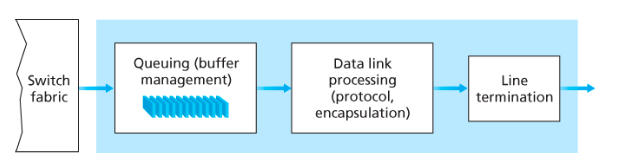

스위치 구조에서 전달된 패킷을 출력 링크로 보낸다. 전송을 위한 패킷 선택 및 큐 제거, 필요한 링크 계층 및 물리 계층 전송 기능을 수행
어떤 패킷을 먼저 전송할지 선택해야함.

## 4. 큐잉과 패킷 손실

큐잉은 입력 포트와 출력 포트 모두에서 형성될 수 있다. 큐가 커지면 라우터 메모리가 소모되고, 저장 공간이 없을 때 패킷 손실 발생.

#### 입력 큐잉 (input port queuing)

스위치 구조가 충분히 빠르지 않으면 입력 포트에서 대기 발생.
출력 링크로 보내는 양보다 input으로 들어오는 양이 더 많으면 큐잉이 발생할 수 있음.

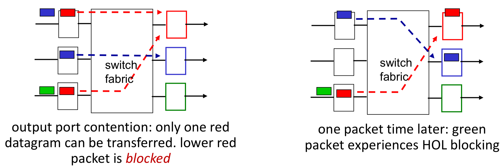
-> 첫번째 빨간색 패킷은 같은 출력포트라 block된거지만 오른쪽의 초록색 패킷은 출력 포트가 다르지만 앞에 있는 빨간색 패킷으로 인해 대기해야함

HOL(Head-of-the-Line) 차단 : 큐 맨 앞의 패킷이 대기 중일 때, 뒤에 있는 패킷이 다른 출력 포트로 갈 수 있음에도 불구하고 함께 대기해야 하는 현상.

#### 출력 큐잉 (output port queuing)

스위치 구조 후에 출력 포트로 데이터를 forward하면 큐에 들어감

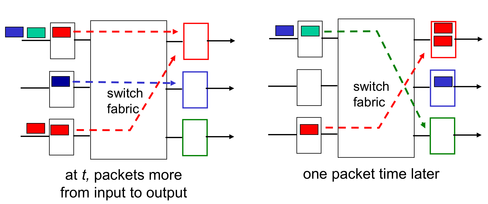

여러 입력 포트에서 패킷이 동시에 `같은` 출력 포트로 몰리면 출력 포트에서 대기 발생.
버퍼가 꽉 차면 도착 패킷을 버리거나 이미 대기 중인 패킷을 제거해야 함. (packet loss)

### 4.1 버퍼(Buffer)

버퍼의 크기 증가는 패킷 손실율을 줄일 수 있지만 종단 간 지연을 증가시킬 수 있는 양날의 검
버퍼 management를 적용할 수 있음
1. 패킷을 drop해서 혼잡 관리 (tail drop, priority)
2. 패킷을 마킹(marking)함(패킷에 혼잡 표시를 해서 보낸다). (ECN - Explicit Congestion Notification 명시적 혼잡 알림)
```
패킷을 버리면 송신자가 나중에야 알아채지만, 표시를 해서 보내면 송신자가 더 빨리 "속도 줄여야겠다" 고 인식할 수 있어서 더 효율적

유튜브 서버 (송신자)
→ 라우터 (혼잡 표시 붙임)
→ 내 컴퓨터 (수신자, 표시 확인)
→ 내 컴퓨터가 유튜브 서버한테 "혼잡하대요" 라고 알림
→ 유튜브 서버가 전송 속도 줄임

```

버퍼블로트(bufferbloat)
- 버퍼가 과도하게 커서 지연이 지속적으로 길어지는 현상
- 이를 해결하기 위해 AQM(Active Queue Management) 메커니즘이 개발됨.

### 4.2 패킷 스케줄링
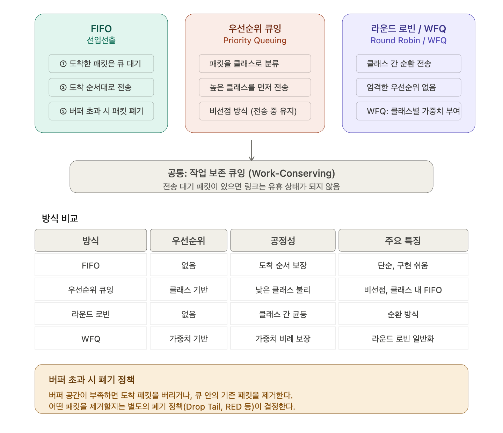

FIFO : 도착한 순서대로 전송. 가장 단순.

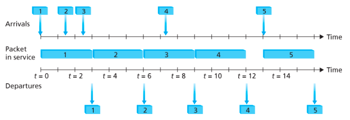

우선순위 큐잉 : 패킷을 우선순위 클래스로 분류. 높은 우선순위 클래스 패킷을 먼저 전송. 같은 우선순위 내에서는 FIFO. 비선점 방식 → 전송 중인 패킷은 끝날 때까지 선점 안 됨.

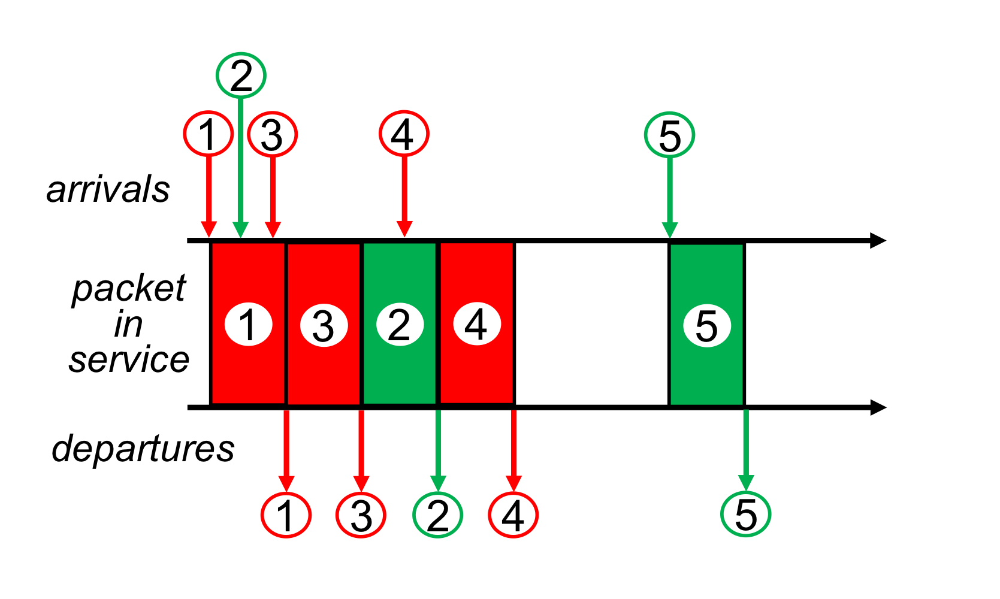

라운드 로빈 : 클래스를 번갈아가며 패킷 전송. 클래스 간 엄격한 우선순위 없음. 특정 클래스에 패킷이 없으면 건너뛰고 다음 클래스로 넘어가는 작업 보존 방식.


WFQ(Weighted Fair Queuing) : 라운드 로빈의 일반화. 각 클래스에 가중치(w)를 부여해서 가중치 비율만큼 처리율을 보장. 가중치를 기반으로 공정하게 전송

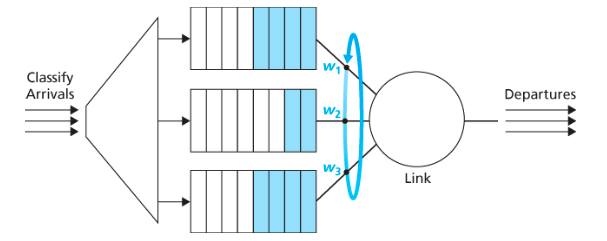

---
## 5. 인터넷 프로토콜(IP)

인터넷 네트워크 계층 패킷을 데이터그램(datagram)이라고 부른다.

### 5.1 IPv4 데이터그램

대부분의 IPv4 데이터그램은 옵션이 없을 때 헤더 20바이트 + 페이로드로 구성됨.
TCP 세그먼트를 전송하면 IP 헤더 20바이트 + TCP 헤더 20바이트 = 총 40바이트의 헤더를 가짐.

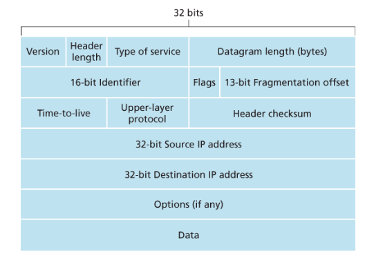

* version : 4비트로 데이터그램의 IP 버전을 명시함. 라우터는 이걸 읽고 해당 데이터그램을 어떻게 해석할지를 결정
* 헤더 길이 : IPv4는 헤더에 가변 길이인 옵션(option)이 있어서 실제 페이로드 시작 위치를 알려줌. 보통 IPv4는 옵션을 포함하지 않으므로 대체로 IPv4 데이터그램 헤더는 20바이트다.
* 서비스 타입 : 실시간 데이터그램과 비실시간 트래픽 등 데이터그램 유형 구별. (ECN 여기에 포함 됨.)
* 데이터그램 길이 : 16비트. IP 데이터그램 전체 길이(바이트). 최대 65,535바이트지만 실제로 1,500바이트 이상인 경우는 거의 없음. (헤더 + 페이로드의 길이)
* 식별자, 플래그, 단편화 오프셋 : IP 단편화 관련 필드. 큰 데이터그램을 여러 조각으로 쪼개서 독립적으로 전달하고, 목적지(최종 호스트의 트랜스포트 계층으로 전달되기 전)에서 다시 조립할 때 사용.
* TTL(Time to Live) : 데이터그램이 네트워크에서 무한 순환하지 않도록 라우터를 거칠 때마다 1씩 감소. 0이 되면 폐기.
* 프로토콜 : 데이터가 목적지에서 어느 트랜스포트 계층 프로토콜(TCP, UDP)로 전달될지 명시. 트랜스포트 계층의 포트 번호와 유사한 역할. (일반적으로 IP 데이터그램이 최종목적지에 도착했을 때만 사용된다.)
* 헤더 체크섬 : 비트 오류 탐지. 오류 발생 시 라우터는 해당 데이터그램을 폐기함. TTL 필드가 매 라우터마다 바뀌기 때문에 체크섬도 매 라우터마다 재계산해야 함.
* 출발지와 목적지 IP 주소 : 데이터그램 생성 시 출발지와 목적지 IP 주소 삽입.
* 옵션 : 헤더 확장용. 오버헤드 문제 때문에 거의 사용 안 함.
* 데이터(페이로드) : 트랜스포트 계층 세그먼트를 담음.

#### 단편화/재결합
-> 네트워크 링크마다 MTU(링크에서 지원할 수 있는 패킷의 최대 size)가 다름
-> 보내는 패킷 크기 > MTU 면 -> MTU에 맞게 패킷이 쪼개짐, 보낼 땐 독립적으로 보내지고 마지막에 도착지에서 하나로 합치자!
호스트에서만 재조립 가능 (라우터에선 불가능). IP헤더를 확인해서 재조립한다.
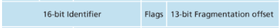

### 5.2 IPv4 주소 체계

#### 인터페이스
* 호스트와 물리적 링크(physical link) 사이의 경계
* IP 주소는 호스트가 아니라 인터페이스에 할당
* 라우터는 링크가 여러 개 → 인터페이스도 여러 개 (= IP주소가 여러개)

#### 서브넷과 IP주소


해당 그림에서 호스트는 하나의 인터페이스를 갖고있고, 라우터는 3개의 인터페이스를 갖고 있는걸 확인 할 수 있음.

IP 주소는 32비트. 점으로 구분된 십진수 표기법 사용 (ex. 223.1.1.1).
인터페이스의 IP 주소는 마음대로 선택할 수 없고, 연결된 서브넷이 결정.
서브넷이란?
- 같은 prefix 가졌으며 하나의 네트워크로 동작한다.
- 라우터 없이 서로 연결된 인터페이스들(호스트-라우터, 라우터-라우터...)의 집합.
- 서브넷을 결정하려면 호스트나 라우터에서 각 인터페이스를 분리하고 고립된 네트워크를 만들었을 때 생기는 각 고립된 네트워크가 서브넷.
- 223.1.1.0/24 에서 /24는 서브넷 마스크. 왼쪽 (24~32)비트가 서브넷 주소라는 뜻.

#### CIDR (Classless InterDomain Routing)

- 인터넷 주소 할당 방식.
- a.b.c.d/x 형식에서 앞의 x비트가 프리픽스(네트워크 부분), 나머지 32-x 비트가 호스트를 구별하는 데 사용됨.
- 외부 라우터는 해당 기관으로 패킷을 전달할 때 앞의 x비트만 보면 되기 때문에 포워딩 테이블 크기를 크게 줄여줌.
```
CIDR 이전에는 네트워크 크기가 정해져 있어서 낭비가 심했는데, CIDR은 /x 숫자를 자유롭게 지정할 수 있어서 필요한 만큼만 주소를 잘라 쓸 수 있다는 게 핵심입니다.
```

#### 클래스 주소체계

CIDR 이전에는 네트워크 부분을 8, 16, 24비트로 제한해서 A, B, C 클래스로 분류.
단점 : 클래스 C(/24)는 호스트 254개만 지원해서 너무 적고, 클래스 B(/16)는 65,534개를 지원해서 너무 큼. 중간 크기 네트워크를 효율적으로 지원하지 못함.

#### 브로드캐스트 주소

호스트가 목적지 주소가 255.255.255.255로 데이터그램을 보내면 같은 서브넷에 있는 모든 호스트에게 전달됨.

#### 주소 블록 획득

기관은 ISP에 연락해서 IP 주소 블록을 받음. ISP는 비영리 단체 ICANN으로부터 주소 블록을 받음.
ICANN의 역할 : IP 주소 할당 + DNS 루트 서버 관리.
```
ICANN (전 세계 IP 주소 총관리)
  └── ISP (큰 주소 블록을 받아서 보유)
        └── 기관/회사/개인 (ISP한테서 필요한 만큼 받음)
              └── 인터페이스 (실제로 IP가 붙는 곳)

ICANN이 전 세계 IP 주소 전체를 관리하는 기관이고, ISP(KT, SKT 같은 통신사)가 ICANN한테서 큰 덩어리를 받아옵니다. 그러면 우리 회사나 학교는 ISP한테 연락해서 "주소 몇 개 주세요" 하고 그 덩어리에서 잘라 받는 겁니다.

```
외부 라우터는 `200.23.16.0/20` 하나만 알면 이 ISP 산하 모든 기관에 패킷 전달 가능
```
외부 라우터 입장에서는 "200.23.16.x로 시작하는 패킷은 이 ISP로 보내면 되겠다" 하고 /20 하나만 기억하면 되는 거고, 그 안에서 정확히 어느 기관인지는 ISP 내부 라우터가 알아서 처리합니다.
```
#### 호스트 주소 획득:  DHCP (Dynamic Host Configuration Protocol)

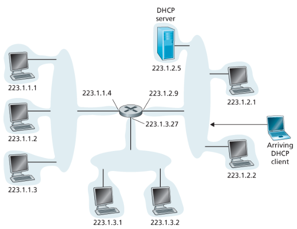

> 네트워크에 접속하면 자동으로 IP 주소 받아오는 시스템
> 예시 : IP 주소가 없으면 네트워크에서 "나 여기 있어요"를 표현할 수 없으니까, 인터넷 쓰기 전에 제일 먼저 일어나는 과정.
- 호스트가 자동으로 IP 주소를 얻을 수 있게 해주는 프로토콜(application 계층에서 동작하지만 네트워크 설정을 위해 사용되는 프로토콜).
- 플러그 앤 플레이 프로토콜이라고도 함.(원래 IP 주소는 누군가 직접 설정해줘야 했는데, DHCP가 있으면 그냥 Wi-Fi 연결하는 순간 자동으로 IP 주소를 받아옴)
- IP 주소만 받는 게 아니라 네트워크 접속에 필요한 것들을 한꺼번에 받아옵니다.
    - 내 IP 주소
    - 서브넷 마스크 (내가 속한 네트워크 범위)
    - 첫 번째 홉 라우터 주소 (인터넷으로 나가는 관문, 즉 공유기 주소)
    - DNS 서버 주소 (google.com 같은 도메인을 IP로 변환해주는 서버)
- DHCP는 클라이언트-서버 프로토콜. (내 노트북(클라이언트)이 "IP 주소 주세요" 하고 요청하면 DHCP 서버가 "이 주소 써" 하고 응답하는 식)
- 각 서브넷은 DHCP 서버를 갖거나, 없다면 DHCP 연결 에이전트(라우터)가 필요.

* DHCP 프로토콜의 4단계 과정


1. DHCP 서버 발견(Discover) : 새로 도착한 호스트가 브로드캐스트 주소(255.255.255.255)로 DHCP 발견 메시지를 보냄. 출발지 IP는 0.0.0.0. (포트 번호 67번)
2. DHCP 서버 제공(Offer) : DHCP 서버가 브로드캐스트로 응답. 제공할 IP 주소, 네트워크 마스크, IP 주소 임대 기간 포함.
3. DHCP 요청(Request) : 클라이언트가 하나 이상의 서버 제공 중 하나를 선택하고 DHCP 요청 메시지로 응답.
4. DHCP ACK : 서버가 요청된 파라미터를 확인하고 ACK 메시지 전송. 클라이언트는 임대 기간 동안 해당 IP 사용 가능.

```
1,2는 skip 가능.(이전에 할당받아둔거 있으면 재사용하면 되기 때문)

3. Request 과정에서 하나 이상의 서버 제공 설명
->
노트북: "IP 주소 주세요~"
DHCP 서버A: "192.168.0.5 써!"
DHCP 서버B: "192.168.0.10 써!"
노트북: "A꺼 쓸게요" (하나만 선택)

```
단점 : 이동 노드가 서브넷 사이를 이동하면 새로운 IP 주소를 받아야 해서 TCP 연결이 유지될 수 없음.

---

### 5.3 NAT(Network Address Translation)

네트워크가 커지거나 IP 주소 부족 문제가 생길 때 사용하는 주소 변환 방식.
>  IP 주소가 부족할 때 공인 IP 하나로 여러 기기가 인터넷을 쓸 수 있게 해주는 기술.

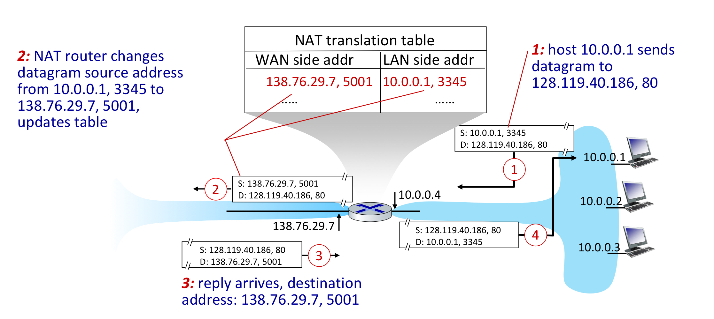

#### 동작 방식

- 외부에서 보면 공유기 하나만 보임 (내부 기기들은 안 보임)
- 외부 인터넷(WAN)에서 집으로 데이터가 들어올 때, 목적지 IP가 전부 공유기 IP 하나로 되어있음.
- 집 안 기기들은 사설 IP(192.168.x.x 같은 거)를 씀
- 사설 IP는 집 안에서만 쓰는 주소라 인터넷에서 직접 통신 불가

#### NAT 변환 테이블
- 응답이 돌아왔을 때 어느 기기꺼인지 구분하려고 공유기가 기록해두는 테이블.
- IP 주소 + 포트 번호를 같이 기록해서 구분함.
```
ex)
노트북(192.168.0.2, 포트 3000) → 인터넷
폰(192.168.0.3, 포트 4000) → 인터넷
```

#### 단점
- 포트 번호는 원래 "어떤 프로그램한테 줄지" 구분하는 용도인데, NAT에서는 "어떤 기기한테 줄지"까지 구분하는 데 써버림
- 외부에서 집 안 서버에 직접 접속하기 어려움 (밖에서 보면 공유기 하나만 보이고 내부 기기는 안 보이니까. - 보안 관점에서는 장점이긴 함)
- P2P 연결 까다로워짐
- 이걸 해결하는 게 NAT 순회 도구

### 5.4 IPv6

IPv4 주소 공간이 빠르게 고갈되어가면서 IPv6 주소 체계가 개발되었다.

> address space를 확장함!


#### 주요 변화

* IP 주소 크기를 32비트 → 128비트로 확장. 사실상 무한한 주소 공간.
* 유니캐스트, 멀티캐스트 외에 애니캐스트 주소 도입. 애니캐스트는 호스트 그룹 중 어느 하나에게 전달하는 방식.
* 고정 40바이트 헤더. 라우터가 데이터그램을 더 빠르게 처리 가능.

```
유니캐스트 → 특정 한 명한테 전달 (1:1)
멀티캐스트 → 특정 그룹 전원한테 전달 (1:N)
애니캐스트 → 특정 그룹 중 가장 가까운 한 명한테만 전달 (1:1인데 누구한테 갈지는 자동)
```

#### IPv6 헤더 주요 필드

버전(4비트), 트래픽 클래스(우선순위 부여), 흐름 레이블(데이터그램 흐름 인식), 페이로드 길이(헤더 뒤 바이트 수), 다음 헤더(TCP/UDP 구분), 홉 제한(TTL과 동일 개념), 출발지/목적지 주소(128비트).

#### IPv4에 있지만 IPv6에서 사라진 것

단편화/재결합 : IPv6에서는 라우터가 단편화를 수행하지 않음. 데이터그램이 너무 크면 라우터가 버리고 ICMP 오류 메시지를 송신자에게 보냄. 송신자가 크기를 줄여서 다시 보내야 함. 라우터 처리 속도 향상을 위해 이 기능 제거.
헤더 체크섬 : 트랜스포트 계층과 데이터 링크 계층에서 이미 체크섬을 수행하기 때문에 중복이라 판단해서 제거.
옵션 : 라우터가 매번 "이 패킷 헤더가 얼마나 길지?" 계산해야 했음. IPv4에서도 잘 안 쓰던 필드. 제거하고 고정 헤더 길이(40바이트)를 갖게 됨. 대신 다음 헤더(Next hdr) 필드로 유연하게 처리 가능.

### 5.5 IPv4 → IPv6 전환: 터널링

IPv4 라우터는 IPv6 데이터그램을 처리할 수 없기 때문에 전환이 필요함.

플래그 데이 방식(한꺼번에 전환 - 모든 인터넷 장비를 끄고 IPv4를 IPv6로 업그레이드하는 시간과 날짜를 정하는 것)은 현실적으로 불가능. 현재는 터널링 방식을 사용.

터널링 : IPv6 사이에 IPv4 라우터를 지나서 갈 수 있게 해주는 것.

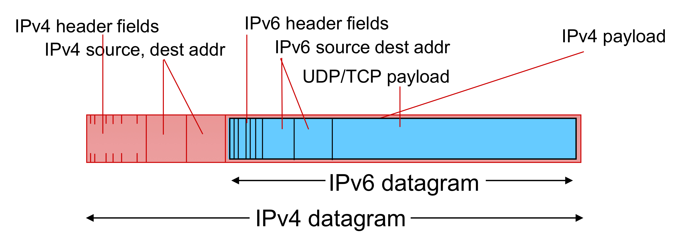
IPv6 패킷을 IPv4 패킷 안에 통째로 집어넣는 거
[IPv4 헤더] + [IPv6 헤더 + IPv6 데이터]

#### 터널링 동작 방식
> 두 IPv6 노드 사이에 IPv4 라우터들이 있을 때, IPv4 라우터들로 이루어진 구간을 터널이라고 부름.

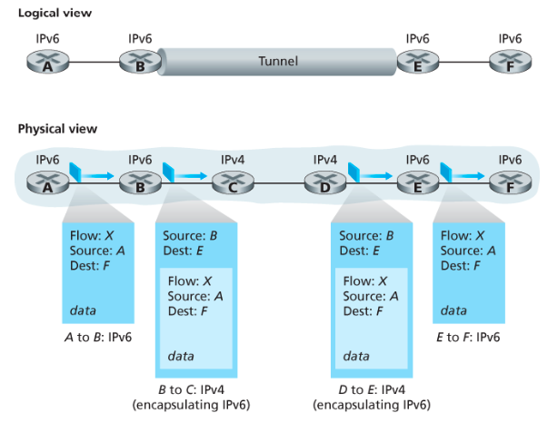

1. 터널 입구의 IPv6 노드가 IPv6 데이터그램을 IPv4 데이터그램의 페이로드에 담음
2. IPv4 데이터그램의 목적지를 터널 출구의 IPv6 노드 주소로 설정
3. IPv4 라우터들은 내부에 IPv6 데이터그램이 있다는 사실을 모른 채 그냥 IPv4 데이터그램으로 처리
4. 터널 출구의 IPv6 노드가 IPv4 데이터그램을 받고 안에 든 IPv6 데이터그램을 꺼내서 처리

```
B는 자기 옆에 연결된 라우터가 IPv4인지 IPv6인지 미리 설정으로 알고 있음. 네트워크 관리자가 "C~D 구간은 IPv4야, 거기 들어갈 때 터널링 써" 하고 B한테 설정해둠.
```
---

## 6. 일반화된 포워딩 및 SDN

### 6.1 일반화된 포워딩이란

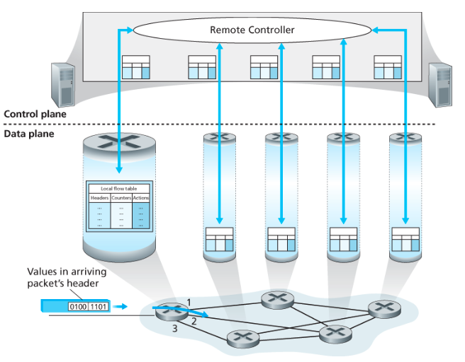

기존 목적지 기반 포워딩(destination-based forwarding) :  목적지 IP만 보고 패킷을 전달했음.
일반화된 포워딩(generalized forwarding) : 여러 헤더 필드를 기준으로 매치하고, 다양한 액션을 수행하는 방식.
(SDN : data plane(포워딩)과 control plane(라우팅)을 분리함. 라우터는 포워딩에만 집중할 수 있게 하고 기존 control plane을 원격 서버가 담당)

핵심 개념 : 매치 플러스 액션 (Match + Action)

매치 : 패킷 헤더 필드를 조건과 비교
액션 : 매치된 패킷에 수행할 동작 결정. 포워딩, 삭제, 헤더 수정, 로드 밸런싱, 컨트롤러로 전달 등이 가능.

각 패킷 스위치는 원격 컨트롤러가 계산해서 배포한 매치 플러스 액션 테이블(플로우 테이블) 을 가짐.

#### 예시
```
매치(Match)  →  액션(Action)
목적지 IP가 X  →  포트 3으로 보내
목적지 IP가 Y  →  버려
목적지 IP가 Z  →  복사해서 두 곳으로 보내
```
### 6.2 OpenFlow 1.0


플로우 테이블 엔트리는 세 가지로 구성됨.
헤더 필드 : 매치 조건. OpenFlow 1.0에서는 11개의 패킷 헤더 필드 + 수신 포트 ID 사용 가능.
와일드카드(*) 사용 가능. ex) 128.119.*.* → 앞 16비트가 128.119인 모든 주소와 매치.
여러 엔트리와 매치될 경우 우선순위가 높은 엔트리 적용.
참고 : TTL, 데이터그램 길이 필드는 매치 조건으로 사용 불가.

카운터 : 해당 엔트리와 매치된 패킷 수, 마지막 갱신 시간 등 통계 정보.

액션 목록 : 매치 시 수행할 동작. 여러 액션이 있으면 순서대로 수행.

#### 액션 종류

포워딩 : 패킷을 특정 출력 포트로 전달하는 기본 동작. 단일 포트뿐만 아니라 모든 포트로 브로드캐스트하거나 선택한 포트 세트로 멀티캐스트도 가능.
특이한 점은 패킷을 원격 컨트롤러로 캡슐화해서 보낼 수도 있다는 것. 컨트롤러는 해당 패킷을 받아서 새로운 플로우 테이블 엔트리를 설치하거나, 갱신된 규칙에 따라 패킷을 다시 장치로 돌려보내서 포워딩하게 할 수 있음. 즉, 플로우 테이블에 매치되는 엔트리가 없는 패킷도 컨트롤러가 동적으로 처리할 수 있음.
삭제(Drop) : 액션이 없는 엔트리와 매치된 패킷은 삭제.
필드 수정 : 출력 포트로 전달하기 전에 10개의 패킷 헤더 필드 값을 다시 씀.

#### OpenFlow 활용 예시

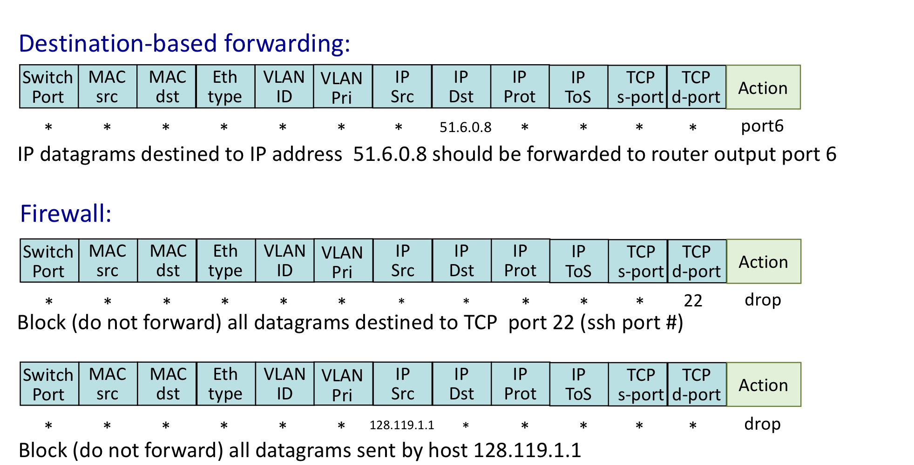

- 단순 포워딩 : 목적지 IP 기준으로 매치해서 다음 스위치나 호스트 방향으로 전달. 기본적인 포워딩 동작.
- 로드 밸런싱 : 목적지 IP가 같아도 출발지 IP를 함께 매치해서 다른 경로로 분산. 기존 목적지 기반 포워딩으로는 불가능한 동작.
- 방화벽 : 특정 출발지(10.3.*.*)에 대한 엔트리만 존재. 다른 출발지는 매치되는 엔트리 없음 → 자동으로 패킷 삭제. 별도 방화벽 장비 없이 플로우 테이블만으로 구현 가능.

---

4.4 핵심 정리

- 매치 플러스 액션은 SDN의 핵심 개념이다.
- 기존 포워딩보다 훨씬 유연하게 패킷 처리가 가능하다.
- 포워딩, 로드 밸런싱, 방화벽을 하나의 테이블로 구현할 수 있다.
- 원격 컨트롤러가 테이블을 계산하고 배포함으로써 네트워크를 소프트웨어로 제어할 수 있다.

매치 플러스 액션이란

패킷 헤더 필드를 조건과 비교(매치)해서 그에 맞는 동작(액션)을 수행하는 방식. 목적지 IP뿐만 아니라 출발지 IP, 포트 번호 등 다양한 헤더 필드를 기준으로 포워딩, 삭제, 헤더 수정 등의 동작을 할 수 있음.

기존 포워딩 vs 일반화된 포워딩

기존은 목적지 IP만 보고 전달. 일반화된 포워딩은 여러 헤더 필드를 기준으로 매치하고 포워딩, 로드 밸런싱, 방화벽 등 다양한 액션 수행 가능. 로드 밸런싱 예시처럼 같은 목적지라도 출발지에 따라 다른 경로로 보내는 게 기존 방식으로는 불가능.

# 7. 미들박스

## 미들박스란
출발지 호스트와 목적지 호스트 사이의 데이터 경로에서 IP 라우터의 정상적인 기능과는 별도로 추가 기능을 수행하는 모든 장치 (네트워크 중간에 끼어서 뭔가 추가 작업을 하는 장치)

### 미들박스가 수행하는 서비스 3가지
NAT 변환 : 사설 네트워크 주소체계를 구현. 데이터그램 헤더의 IP 주소와 포트 번호를 다시 작성.

보안 서비스

    방화벽 : 헤더 필드 값을 기준으로 트래픽 차단. DPI(Deep Packet Inspection)로 추가 처리를 위해 패킷 리다이렉션.
    IDS(침입 탐지 시스템) : 미리 결정된 패턴을 탐지하고 패킷 필터링.

성능 향상 : 압축 서비스 수행. 서버 집합 중 하나로 요청을 분산하는 로드 밸런싱.

### 특징
미들박스는 네트워크 계층, 트랜스포트 계층, 애플리케이션 계층을 명확히 구분하는 기존 계층 구조를 위반함.

    NAT 박스 : 네트워크 계층 IP 주소 + 트랜스포트 계층 포트 번호를 함께 수정
    방화벽 : IP 헤더뿐만 아니라 트랜스포트 계층, 애플리케이션 계층 헤더까지 참조해서 패킷 차단 여부 결정

원래 각 계층은 독립적으로 동작해야 하는데 그걸 어기는 셈. 그래서 "계층 구조 위반"이라고 비판받기도 하지만, 현실적으로 없으면 안 되는 존재이.