## 네트워크 제어 평면

### 핵심 개념
> 제어 평면(control plane)은 포워딩/플로우 테이블을 생성하고 유지하는 역할을 담당한다.

---

### 포워딩 테이블과 플로우 테이블

- 포워딩 테이블 -> 목적지 기반 포워딩 사용
- 플로우 테이블 -> 일반화된 포워딩(SDN) 사용

---

## 제어 평면 구조

### 라우터별 제어
> 개별 라우팅 알고리즘들이 제어 평면에서 상호작용한다.

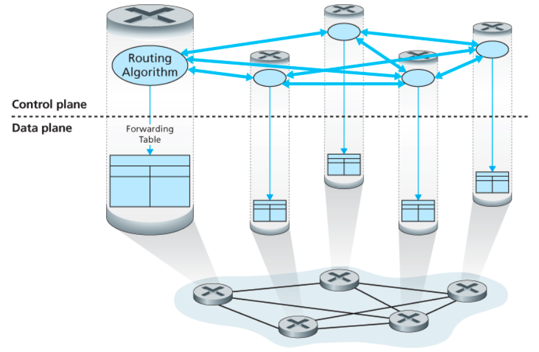

- 각 라우터가 독립적으로 동작
- 라우터끼리 직접 라우팅 정보 교환
- 포워딩 + 라우팅 기능을 모두 가짐


### 논리적 중앙 집중형 제어
> 일반적으로 원격에 위치한 별개의 컨트롤러가 지역의 제어 에이전트(CA)와 상호작용한다.

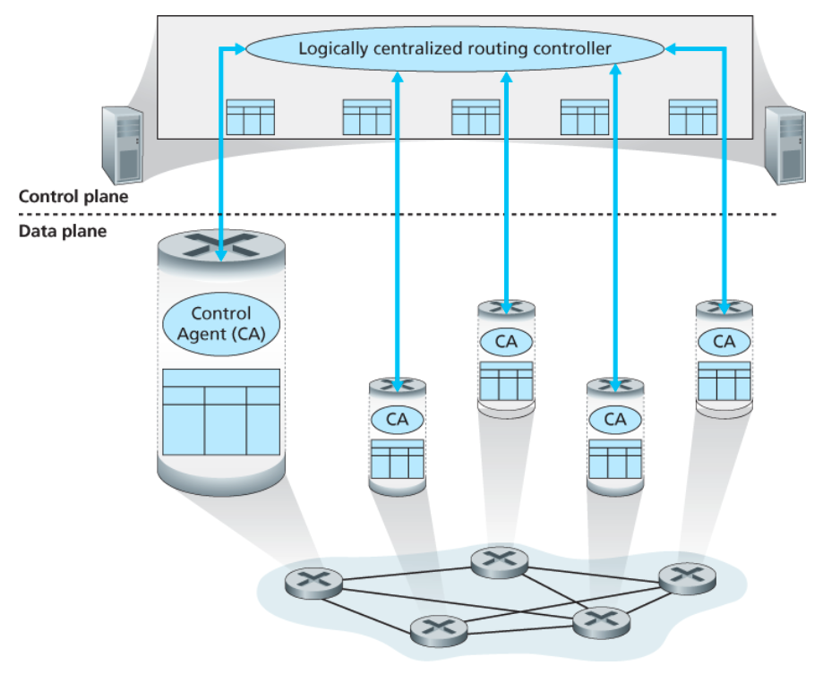

- 중앙 컨트롤러가 플로우 테이블 계산
- 각 라우터는 전달 기능만 수행
- 제어 에이전트는(CA)는 컨트롤러와만 통신

일반화된 `매치 플러스 액션(match plus action)` 추상화를 통해

- 패킷 전달
- 패킷 차단
- 로드 밸런싱
- 헤더 수정
- 방화벽 기능

등 다양한 네트워크 동작을 수행할 수 있다.


| 구분    | 라우터별 제어      | 논리적 중앙 집중형 제어 |
| ----- | ------------ | ------------- |
| 제어 방식 | 각 라우터가 직접 계산 | 중앙 컨트롤러가 계산   |
| 정보 교환 | 라우터끼리 직접 통신  | 컨트롤러와 통신      |
| 구조    | 분산 구조        | 중앙 집중 구조      |
| 유연성   | 낮음           | 높음            |
| 대표 예시 | OSPF, BGP    | SDN/OpenFlow  |

---

## 라우팅 알고리즘
> 송신자부터 수신자까지 라우터의 네트워크를 통과하는 루트(route)를 결정하는 것

- 일반적으로 최소 비용 경로(least-cost path)를 결정하는 알고리즘
- 실제 환경에서는 정책, 혼잡도 등도 고려

---

## 그래프 기반 모델

### 그래프


- 노드 -> 라우터
- 엣지 -> 링크
- 링크 비용 존재

### 경로
> 노드와 링크의 연속

- 경로 비용 = 모든 링크 비용의 합

---

## 라우팅 알고리즘 분류

### 중앙 집중형 라우팅 알고리즘 (LS)

> 네트워크 전체 정보를 기반으로 경로 계산

- 전체 토폴로지 정보 사용
- 링크 상태(link-state) 알고리즘
- 대표: OSPF

---

### 분산 라우팅 알고리즘 (DV)

> 이웃 노드와 정보 교환하며 경로 계산

- 직접 연결된 이웃 정보만 사용
- 반복적 / 분산적 방식
- 거리 벡터(distance-vector) 알고리즘
- 대표: RIP

---

## 정적 vs 동적 라우팅

### 정적 라우팅
- 사람이 직접 경로 설정
- 거의 변경되지 않음

### 동적 라우팅
- 네트워크 변화에 따라 경로 변경
- 자동 갱신 가능
    - 장점 : 네트워크 변화에 빠르게 대응한다.
    - 단점 : 경로의 루프(loop)나 경로 진동(oscillation) 같은 문제에 취약하다.

---

## 부하 민감 여부

### 부하에 민감한 알고리즘
- 혼잡한 링크 비용 증가
- 혼잡 회피 가능

### 부하에 민감하지 않은 알고리즘
- 현재 인터넷 대부분 사용
- RIP, OSPF, BGP

---

## 링크 상태(LS) 라우팅 알고리즘
> 네트워크 토폴로지와 모든 링크 비용이 알려져 있어, 최소 비용 경로 계산

- 모든 링크 비용 정보 사용
- 링크 상태 패킷을 브로드캐스트

### 다익스트라 알고리즘
> 하나의 출발지에서 모든 노드까지 최소 비용 경로 계산

### 특징

- 중앙 집중형
- 전체 네트워크 정보 필요
- 최소 비용 경로 계산

### 포워딩 테이블 생성

- 최소 비용 경로 계산 후
- 다음 홉(next hop) 결정

#### 장점

- 빠른 수렴
- 루프 문제 적음

#### 단점

- 전체 네트워크 정보 필요
- 계산량 많음
- 메시지 오버헤드 큼

## 진동(Oscillation)
> 링크 비용 변화로 경로가 계속 바뀌는 현상

### 원인

- 혼잡 기반 비용 사용
- 모든 라우터가 동시에 계산

### 해결 방법

- 랜덤 시간 사용
- 동기화 방지

---

## 거리 벡터(DV) 라우팅 알고리즘
> 오늘날 실제로 사용되는 알고리즘은 거리 벡터(distance-vector, DV) 라우팅 알고리즘이다.

> 이웃과 거리 정보를 교환하며 최소 비용 경로 계산

- 분산적 : 각 노드는 하나 이상의 직접 연결된 이웃으로부터 정보를 받고 계산을 수행하며 계산된 결과를 다시 이웃들에게 배포한다.
- 반복적 : 이웃끼리 더 이상 정보를 교환하지 않을 때까지 프로세스가 지속된다.
- 비동기적 : 모든 노드가 서로 정확히 맞물려 동작할 필요가 없다.

### 벨만-포드(Bellman-Ford)
> 이웃 노드를 거쳐가는 최소 비용 계산

```plaintext
D(x) = min { c(x,v) + D(v) }
```

- v -> x의 이웃 노드
- c(x,v) -> x에서 v까지의 링크 비용
- Dv(y) -> 이웃 v가 알고 있는 y까지의 거리

#### 의미

노드 x는:
- 이웃 v까지 이동한 뒤
- v가 알고 있는 y까지의 최소 비용 사용

→ 이 값들 중 가장 작은 값을 선택한다.

---

### DV 알고리즘 동작 과정

#### 기본 흐름

1. 이웃으로부터 거리 벡터 수신
2. 벨만-포드 식으로 거리 계산
3. 자신의 거리 벡터 갱신
4. 변경이 있으면 이웃에게 다시 전송

#### 특징

- 이웃끼리만 정보 교환
- 반복적으로 최소 비용 경로 계산
- 더 이상 갱신이 없으면 종료

#### 핵심

```plaintext
이웃에게 배우고
계산하고
다시 전파
```

### 장점

- 구조 단순
- 전체 네트워크 정보 불필요
- 분산 방식

### 단점

- 수렴 속도 느릴 수 있음
- 라우팅 루프 발생 가능
- 잘못된 정보가 전체로 확산 가능

---

## 링크 비용 변화

### 비용 감소 상황

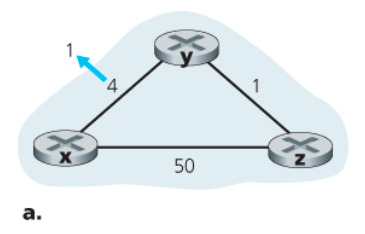

#### 특징

- 더 좋은 경로가 생김
- 새로운 최소 비용 빠르게 전파
- 비교적 빠르게 수렴

#### 동작 흐름

```plaintext
링크 비용 감소
-> 거리 벡터 갱신
-> 이웃에게 전파
-> 네트워크 전체 반영
```

### 비용 증가 상황

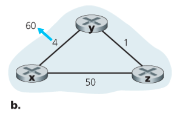

#### 문제

노드가 잘못된 최소 비용 정보를 믿을 수 있음

예:
- y는 z를 통해 x로 간다고 생각
- z는 y를 통해 x로 간다고 생각

→ 라우팅 루프 발생

---

### 라우팅 루프

> 패킷이 목적지로 가지 못하고 노드 사이를 계속 순환하는 현상

#### 결과

- 패킷 낭비
- 네트워크 혼잡
- 수렴 지연

---

### Count-to-Infinity 문제

> 잘못된 거리 정보가 점점 증가하며 계속 전파되는 문제

#### 발생 원인

- 노드들이 서로의 잘못된 정보를 믿음
- 실제 경로는 끊겼는데 우회 경로가 있다고 착각

#### 특징

- 비용 값이 계속 증가
- 매우 느리게 수렴
- DV 알고리즘 대표 문제

---

## Poisoned Reverse

### 개념
> 특정 경로 비용을 무한대로 광고하여 루프를 방지하는 기법

### 동작

예:

- z가 y를 통해 x로 가는 중이라면
- z는 y에게:

```plaintext
x까지 거리 = 무한대
```

라고 알림

### 목적

- y가 다시 z를 통해 x로 가는 경로를 선택하지 못하게 함

### 한계

- 2개 노드 루프는 완화 가능
- 3개 이상 루프는 완전히 해결 못함

---

# 링크 상태(LS) vs 거리 벡터(DV)

| 구분 | 링크 상태 (LS) | 거리 벡터 (DV) |
|------|----------------|----------------|
| 정보 범위 | 전체 네트워크 정보 | 이웃 정보만 사용 |
| 알고리즘 | 다익스트라 | 벨만-포드 |
| 계산 방식 | 중앙 집중형 | 분산형 |
| 정보 교환 | 전체 브로드캐스트 | 이웃끼리 교환 |
| 수렴 속도 | 빠름 | 느릴 수 있음 |
| 루프 문제 | 적음 | 발생 가능 |
| 대표 프로토콜 | OSPF | RIP |

---

## 메시지 복잡성

### LS 알고리즘

- 전체 링크 상태 전파 필요
- 메시지 수 많음
- 계산량 큼

### DV 알고리즘

- 이웃끼리만 교환
- 상대적으로 단순
- 반복적 전파 필요

## 견고성 비교

### LS 알고리즘

- 일부 노드 오류가 전체에 미치는 영향 제한적
- 각 노드가 독립적으로 계산

### DV 알고리즘

- 잘못된 정보가 네트워크 전체로 퍼질 수 있음
- 한 노드 오류가 전체 경로에 영향 가능

---

## 인터넷에서의 AS 내부 라우팅: OSPF

### 자율 시스템 (autonomous system, AS)
> 동일한 관리 정책 아래 동작하는 라우터들의 집합

- 같은 AS 내부 라우터들은 동일한 라우팅 프로토콜 사용
- 하나의 AS는 고유한 ASN(Autonomous System Number)을 가짐

---

### AS가 필요한 이유

#### 1. 확장성 문제

- 라우터 수 증가 시
  - 라우팅 정보 교환 증가
  - 계산량 증가
  - 저장 공간 증가

-> 네트워크 전체를 하나로 관리하기 어려움

#### 2. 관리 자율성

- 기관(ISP)은 자신의 네트워크를 독립적으로 운영하고 싶어함
- 내부 구조를 외부에 숨기고 싶어함

## AS 내부 라우팅 프로토콜

> 하나의 AS 내부에서 사용하는 라우팅 프로토콜

대표:
- OSPF
- IS-IS

---

## OSPF (Open Shortest Path First)
> 링크 상태(Link-State) 기반의 AS 내부 라우팅 프로토콜

- 링크 상태 정보 사용
- 다익스트라 알고리즘 사용
- 전체 AS 토폴로지 기반 동작

### OSPF 핵심 아이디어

각 라우터는:

1. 자신의 링크 상태 정보를 전체 AS에 브로드캐스트
2. 전체 네트워크 토폴로지 정보를 획득
3. 다익스트라 알고리즘 수행
4. 최단 경로 트리 생성
5. 포워딩 테이블 생성

---

## 링크 상태 브로드캐스트

### 브로드캐스트 정보

각 라우터는:

- 자신과 연결된 링크 상태
- 링크 비용(cost)

을 다른 모든 라우터에게 전송한다.

### 브로드캐스트 시점

- 링크 상태가 변경될 때
- 변경이 없어도 주기적으로 전송
  - 최소 30분마다

### 특징

모든 라우터는:

- AS 전체 네트워크 그래프 보유
- 동일한 링크 상태 데이터베이스 유지

즉, 각 라우터는 전체 네트워크 구조를 알고 있다.

---

## 다익스트라 알고리즘 수행

각 라우터는:

- 자신을 루트 노드로 설정
- 모든 목적지까지 최소 비용 경로 계산

### 결과

- 최소 비용 경로 트리 생성
- 포워딩 테이블 구성

---

## OSPF 특징

### 링크 상태 기반

- 전체 네트워크 정보 사용
- 빠른 수렴 가능
- 루프 문제 적음

### 프로토콜 번호

```plaintext
89
```

- IP 헤더의 Protocol 필드에서 사용

---

## OSPF가 직접 구현해야 하는 기능

OSPF는 TCP 위에서 동작하지 않는다.

따라서 OSPF는 직접:

- 신뢰적 메시지 전달
- 링크 상태 브로드캐스트
- 이웃 상태 검사

등을 구현해야 한다.

---

## OSPF 링크 가중치

### 링크 가중치
> 링크 비용(cost)

- 다익스트라 알고리즘 입력값
- 최소 비용 경로 계산 기준

---

## 링크 가중치와 경로 관계

기본 개념:

```plaintext
링크 비용
-> 최소 비용 경로 계산
```

---

### 실제 운영에서는 반대 방향으로 생각 가능

운영자는:

- 원하는 트래픽 흐름을 먼저 정하고
- 그 흐름이 나오도록 링크 가중치를 설정할 수 있다.

즉:

```plaintext
원하는 경로
-> 링크 비용 조정
```

---

## 링크 가중치 설정 예시

### 최소 홉 기반

- 모든 링크 비용 = 1

→ 최소 홉 경로 선택

---

### 대역폭 기반

- 낮은 대역폭 링크 -> 높은 비용
- 높은 대역폭 링크 -> 낮은 비용

→ 느린 링크 사용 억제

---

# OSPF 개선 기능

## 보안 기능

### 인증(Authentication)

- 신뢰 가능한 라우터만 OSPF 참여 가능
- 위조된 OSPF 패킷 방지

---

### 단순 인증

- 동일한 패스워드 사용
- 평문 전송
- 보안 약함

---

### MD5 인증

- 공유 비밀키 기반
- 더 안전한 인증 방식

---

## 복수 동일 비용 경로

> 같은 비용 경로를 여러 개 사용할 수 있음

---

### 특징

- 하나의 경로만 선택하지 않아도 됨
- 여러 경로로 트래픽 분산 가능
- 로드 밸런싱 가능

---

## 멀티캐스트 지원

### MOSPF

> OSPF 기반 멀티캐스트 확장

- 멀티캐스트 라우팅 지원
- 기존 OSPF 링크 상태 데이터베이스 사용

---

## 통신 방식 비교

### 유니캐스트 (Unicast)

> 1 : 1 통신

- 하나의 송신자
- 하나의 수신자

---

### 브로드캐스트 (Broadcast)

> 1 : 전체 통신

- 같은 네트워크 전체 전송

---

### 멀티캐스트 (Multicast)

> 1 : 그룹 통신

- 특정 그룹에게만 전송
- 효율적 데이터 전달 가능

---

# OSPF 계층 구조

## 영역(Area)

> 하나의 AS 내부를 여러 영역으로 분할 가능

### 목적

- 라우팅 오버헤드 감소
- 확장성 향상

### 특징

- 각 영역은 독립적으로 LS 알고리즘 수행
- 링크 상태 정보 범위 감소
- 영역 내부에서만 링크 상태 브로드캐스트

---

## 영역 경계 라우터 (ABR)

> 영역과 영역을 연결하는 라우터

- 영역 간 트래픽 전달
- 영역 정보 교환 담당

---

## 백본 영역 (Backbone Area)

> AS 내부 영역들을 연결하는 중심 영역

- 영역 간 트래픽 전달 담당
- 다른 영역 연결 역할

---

## 영역 간 라우팅 흐름

```plaintext
출발 영역
-> 영역 경계 라우터
-> 백본 영역
-> 목적지 영역
-> 최종 목적지
```

---

## ISP 간 라우팅 : BGP

## BGP (Border Gateway Protocol)

### BGP
> AS(자율 시스템) 간 라우팅을 수행하는 프로토콜

- 인터넷의 모든 AS가 사용
- AS 간 라우팅 프로토콜(inter-AS routing protocol)
- 분산형 / 비동기식 프로토콜
- 거리 벡터(DV) 계열

---

## 왜 BGP가 필요한가

### AS 내부 목적지

- 같은 AS 내부 -> OSPF 같은 AS 내부 라우팅 프로토콜 사용

---

### AS 외부 목적지

- 다른 AS까지 패킷 전달 필요
- AS 간 경로 정보 필요

→ BGP 사용

---

## BGP 핵심 역할

### 1. 도달 가능한 프리픽스 정보 전달

> 어떤 AS가 어떤 주소(prefix)를 가지고 있는지 알림

예:

```plaintext
139.16.68.0/22
```

---

### 2. 최적 경로 선택

- 목적지까지 여러 경로 가능
- BGP가 가장 좋은 경로 선택

---

## BGP 경로(Route)

> prefix + 속성(attribute)

---

### 주요 속성

#### AS-PATH

> 목적지까지 거쳐야 하는 AS 목록

예:

```plaintext
AS2 -> AS3
```

---

### 역할

- 어떤 AS를 거치는지 표시
- 루프 방지 가능

---

### 루프 방지

라우터가:

- 자신의 AS 번호가 AS-PATH에 존재하면
- 해당 경로 폐기

---

## NEXT-HOP

> 다음으로 가야 하는 라우터 인터페이스 IP 주소

---

### 의미

- 실제로 패킷을 어디로 보내야 하는지 결정
- 게이트웨이 라우터 정보

---

## 게이트웨이 라우터 vs 내부 라우터

### 게이트웨이 라우터
> 다른 AS와 연결된 라우터

- AS 경계 위치

---

### 내부 라우터
> 같은 AS 내부 장비와만 연결

---

## eBGP vs iBGP


---

### eBGP

> 서로 다른 AS 간 연결

- AS 외부 정보 교환

---

### iBGP

> 같은 AS 내부 연결

- BGP 정보 내부 전파

---

## BGP 경로 전달 과정

### 예시 흐름

```plaintext
AS3 x
-> AS2 AS3 x
-> AS1 전달
```

---

### 의미

- x prefix는 AS3에 존재
- AS2를 거쳐 AS3으로 이동 가능

---

# BGP 경로 선택

## 여러 경로 존재 가능

예:

- AS2 -> AS3 -> x
- AS3 -> x

---

## Hot Potato Routing

### 개념
> 가장 가까운 게이트웨이로 최대한 빨리 패킷을 내보내는 방식

---

### 특징

- 자신의 AS 내부 비용만 최소화
- 외부 AS 비용은 고려하지 않음

---

### 동작

1. 여러 BGP 경로 확인
2. NEXT-HOP까지 내부 비용 계산
3. 가장 가까운 게이트웨이 선택

---

### 핵심

```plaintext
빨리 AS 밖으로 보내자
```

---

## 경로 선택 알고리즘

BGP는 다음 순서로 경로 선택

---

### 1. Local Preference

> 가장 높은 지역 선호도 선택

---

### 2. AS-PATH 길이

> 더 짧은 AS 경로 선택

---

### 3. Hot Potato Routing

> 가장 가까운 NEXT-HOP 선택

---

### 4. 기타 규칙

- BGP ID 등 사용

---

## 핵심

```plaintext
Local Preference
-> AS-PATH
-> Hot Potato
순서로 경로 선택
```

---

# IP 애니캐스트 (Anycast)

## 애니캐스트

> 여러 서버가 같은 IP를 공유하고 가장 가까운 서버로 연결되는 방식

---

### 특징

- 가장 가까운 서버 자동 선택
- BGP 경로 선택 활용

---

## 활용 예

### CDN

- 전 세계 서버에 동일 콘텐츠 복제
- 사용자 -> 가장 가까운 서버 연결

---

### DNS

- 가장 가까운 DNS 서버 연결

---

## 동작 방식

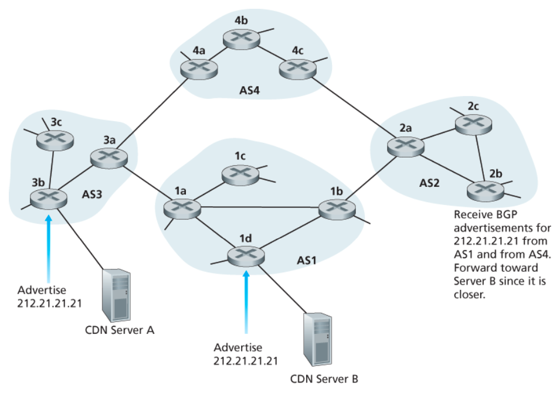

---

### 과정

1. 여러 서버가 같은 IP 사용
2. BGP가 각 서버 경로 광고
3. 라우터가 가장 가까운 경로 선택
4. 사용자 -> 가장 가까운 서버 연결

---

# 라우팅 정책

## 핵심

> BGP는 단순 최단 경로보다 정책(policy)을 더 중요하게 생각한다.

---

## 정책 예시

### 특정 AS 트래픽 차단

- 특정 AS 통과 금지 가능

---

### Transit 거부

- 다른 AS끼리의 트래픽 전달 거부 가능

---

## 핵심 특징

- BGP는 기술보다 비즈니스/정책 영향 큼
- ISP 간 계약 관계 중요

---

# 왜 AS 내부 / 외부 라우팅이 다를까

## 정책 차이

### AS 내부

- 같은 조직
- 정책 중요도 낮음
- 성능 중심

---

### AS 외부

- 서로 다른 ISP
- 정책 중요도 매우 높음
- 트래픽 제어 중요

---

## 확장성 차이

### 내부

- 규모 제한 가능
- 영역(area) 분할 가능

---

### 외부

- 인터넷 전체 규모
- 엄청난 경로 수 처리 필요

---

# 인터넷 연결 과정

## 인터넷에 서버 공개하기

### 과정

1. ISP와 계약
2. IP 주소 블록 할당
3. 도메인 등록
4. DNS 등록
5. BGP로 prefix 광고

---

## BGP 역할

지역 ISP가:

- 회사 prefix를 다른 ISP들에게 광고
- 광고가 인터넷 전체로 전파

---

## 결과

전 세계 라우터가:

- 해당 prefix 존재 인식
- 패킷 전달 가능

---

## 소프트웨어 정의 네트워크(SDN) 제어 평면

## SDN 핵심 개념

### SDN
> 데이터 평면과 제어 평면을 분리한 네트워크 구조

---

### 기존 네트워크

```plaintext
라우터 내부
-> 제어 + 포워딩 모두 수행
```

---

### SDN 구조

```plaintext
스위치
-> 포워딩만 수행

컨트롤러
-> 제어 수행
```

---

## SDN 특징

### 플로우 기반 포워딩

> 패킷 헤더의 다양한 값을 기반으로 포워딩 수행

---

### 기존 라우터

```plaintext
목적지 IP 기반 포워딩
```

---

### SDN

- 출발지 IP
- 목적지 IP
- TCP/UDP 포트
- MAC 주소
- 프로토콜 종류

등 다양한 헤더 기반 처리 가능

---

### 핵심

```plaintext
조건(match)
-> 행동(action)
```

---

## 데이터 평면과 제어 평면 분리

### 데이터 평면

> 실제 패킷 전달 수행

- 스위치 중심
- 빠른 처리 담당
- 플로우 테이블 기반 동작

---

### 제어 평면

> 네트워크 정책 및 경로 결정

- 컨트롤러에서 수행
- 플로우 테이블 계산 및 관리

---

## SDN 구성 요소

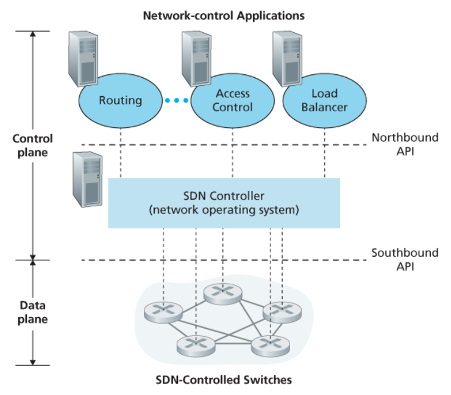

---

### 1. SDN 컨트롤러

> 네트워크 전체 상태를 관리하는 중앙 제어 장치

---

### 역할

- 네트워크 상태 유지
- 플로우 테이블 관리
- 스위치 제어
- 제어 애플리케이션 지원

---

### 특징

- 논리적으로 중앙 집중형
- 실제 구현은 분산 서버 가능

---

### 2. 네트워크 제어 애플리케이션

> 네트워크 정책을 결정하는 소프트웨어

예:
- 라우팅
- 로드 밸런싱
- 방화벽
- QoS

---

### 핵심

애플리케이션이:

- SDN 컨트롤러 API 사용
- 네트워크를 프로그래밍 가능하게 만듦

---

# SDN 컨트롤러 구조

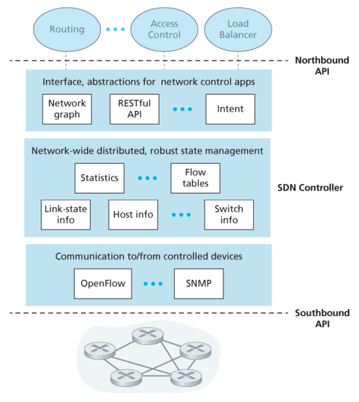

---

## 1. 통신 계층

> 컨트롤러와 스위치 간 통신 담당

---

### 특징

- 스위치 상태 수집
- 플로우 테이블 전달
- OpenFlow 사용

---

### Southbound Interface

> 컨트롤러 -> 스위치 방향 인터페이스

---

## 2. 네트워크 전역 상태 관리 계층

> 네트워크 전체 상태 저장

---

### 저장 정보

- 링크 상태
- 스위치 상태
- 호스트 상태
- 플로우 테이블

---

### 특징

- 중앙에서 전체 네트워크 상태 관리
- 제어 애플리케이션에 정보 제공

---

## 3. 애플리케이션 인터페이스 계층

> 네트워크 제어 애플리케이션과 연결

---

### Northbound Interface

> 애플리케이션 -> 컨트롤러 인터페이스

---

### 역할

- 상태 정보 제공
- 플로우 테이블 읽기/쓰기 지원

---

# OpenFlow 프로토콜

## OpenFlow

> SDN 컨트롤러와 스위치 간 통신 프로토콜

- TCP 기반
- 기본 포트 번호: 6653

---

## 컨트롤러 -> 스위치 메시지

### 설정(Configuration)

- 스위치 설정 조회/변경

---

### 상태 수정(Modify-State)

- 플로우 테이블 추가/삭제/수정

---

### 상태 읽기(Read-State)

- 통계 정보 조회

---

### 패킷 전송(Packet-Out)

- 특정 패킷 전송 요청

---

## 스위치 -> 컨트롤러 메시지

### 플로우 제거

- 플로우 엔트리 삭제 알림

---

### 포트 상태

- 링크 상태 변화 전달

---

### 패킷 전달(Packet-In)

- 매칭되지 않은 패킷 전달

---

# SDN 동작 예시

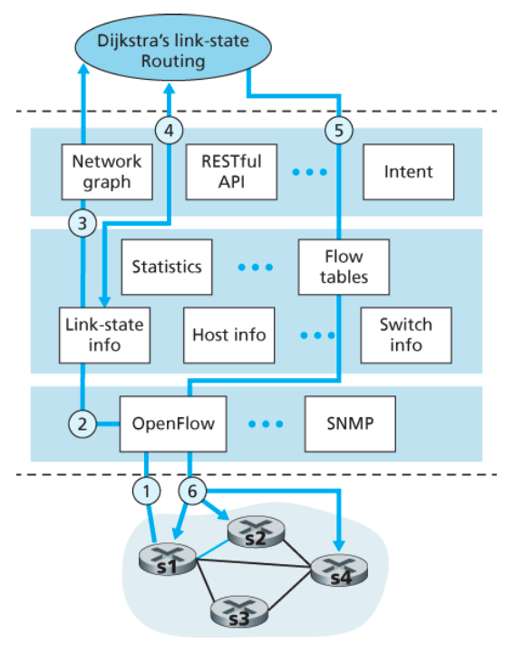

---

## 링크 장애 상황

예:
- s1 ↔ s2 링크 단절

---

## 동작 과정

### 1. 링크 장애 감지

- 스위치 s1이 링크 단절 감지
- 컨트롤러에 상태 전달

---

### 2. 상태 갱신

- 컨트롤러가 링크 상태 DB 갱신

---

### 3. 라우팅 재계산

- 다익스트라 알고리즘 재수행
- 새로운 최단 경로 계산

---

### 4. 플로우 테이블 수정

- 영향을 받는 스위치 플로우 테이블 갱신

---

## 핵심

```plaintext
장애 발생
-> 컨트롤러가 계산
-> 스위치 규칙 갱신
```

---

# SDN 장점

## 중앙 집중 제어

- 네트워크 전체 관리 가능
- 정책 적용 쉬움

---

## 프로그래밍 가능성

- 소프트웨어로 네트워크 제어 가능

---

## 유연성

- 다양한 정책 적용 가능
- 빠른 변경 가능

---

# SDN 미래

## NFV (Network Function Virtualization)

> 전용 네트워크 장비 기능을 소프트웨어로 대체

---

### 예시

- 방화벽
- 로드 밸런서
- NAT
- 캐싱 서버

---

## 목표

```plaintext
전용 하드웨어
-> 범용 서버 + 소프트웨어
```

---

# OpenDaylight (ODL)

## ODL 컨트롤러

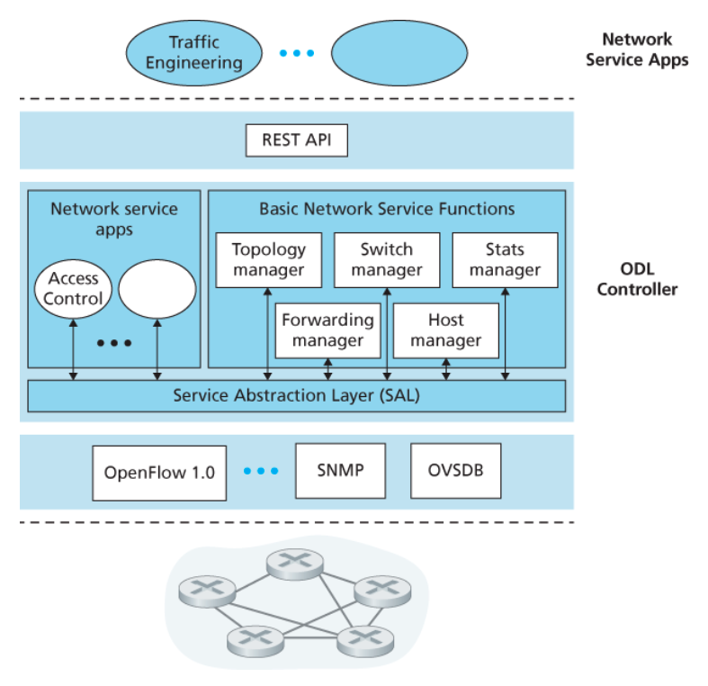

---

### 특징

- 오픈소스 SDN 컨트롤러
- Linux Foundation 지원

---

### SAL (Service Abstraction Layer)

> 애플리케이션과 장치 사이 추상화 계층

---

### 역할

- OpenFlow 등 다양한 프로토콜 추상화
- 컨트롤러 서비스 연결

---

# ONOS 컨트롤러

## ONOS

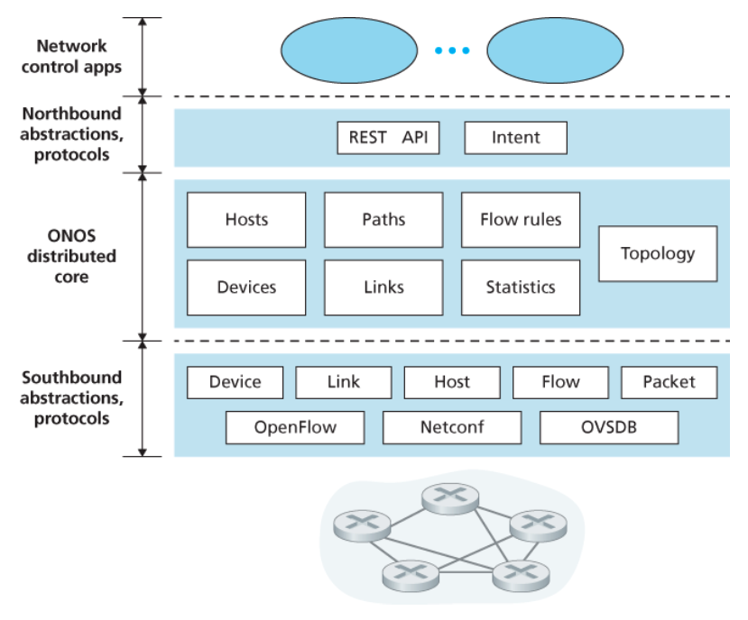

---

### 특징

- 논리적 중앙 집중 구조
- 고가용성 / 확장성 지원

---

## Intent Framework

> “무엇을 원하는지”만 선언

예:

```plaintext
호스트 A와 B 연결
```

---

### 특징

- 내부 구현 몰라도 됨
- 고수준 네트워크 제어 가능

---

## 인터넷 제어 메시지 프로토콜 (ICMP)

## ICMP

### ICMP
> 호스트와 라우터가 네트워크 계층 정보를 주고받기 위한 프로토콜

- 오류 보고
- 네트워크 상태 전달
- 진단 기능 수행

---

## ICMP와 IP 관계

### 구조

- ICMP 메시지는 IP 데이터그램에 담겨 전송
- IP 페이로드 내부에 포함됨

즉:

```plaintext
IP
└── ICMP 메시지
```

---

### 프로토콜 번호

```plaintext
1
```

- IP 헤더의 Protocol 필드에서 사용

---

## ICMP 메시지 구조

### 주요 필드

- Type
- Code

---

### 추가 정보

ICMP 메시지는:

- 오류를 발생시킨 IP 헤더
- 원래 데이터그램의 일부

를 포함한다.

---

### 이유

송신자가:

```plaintext
어떤 패킷에서 오류가 발생했는지
```

알 수 있도록 하기 위함

---

## ICMP 특징

### 핵심

> ICMP는 단순 오류 메시지 전송만 하는 프로토콜이 아니다.

- 진단 기능 수행 가능
- 네트워크 상태 확인 가능

---

# Ping 프로그램

## Ping

> 특정 호스트가 살아있는지 확인하는 프로그램

---

## 동작 방식

### Echo Request

```plaintext
Type 8
Code 0
```

- 목적지로 전송

---

### Echo Reply

```plaintext
Type 0
Code 0
```

- 목적지 호스트가 응답

---

## 특징

- RTT 측정 가능
- 네트워크 연결 여부 확인 가능

---

## 핵심

```plaintext
Ping
-> Echo Request
-> Echo Reply
```

---

# Source Quench (출발지 억제)

## 개념

> 혼잡 발생 시 송신 속도를 줄이도록 요청하는 메시지

---

## 동작

- 혼잡한 라우터가 송신자에게 알림
- 송신자는 속도 감소

---

## 현재 상황

- 거의 사용되지 않음
- TCP 혼잡 제어가 대신 수행

---

# Traceroute 프로그램

## Traceroute

> 목적지까지 거치는 라우터 경로를 추적하는 프로그램

---

## 핵심 아이디어

TTL 값을 점점 증가시키면서 패킷 전송

---

## 동작 과정

### 1. TTL = 1 전송

- 첫 번째 라우터에서 TTL 만료
- 라우터가 ICMP Time Exceeded 메시지 전송

---

### 2. TTL = 2 전송

- 두 번째 라우터에서 TTL 만료
- 두 번째 라우터 정보 획득

---

### 반복

TTL을 계속 증가시키며:

- 중간 라우터 주소 확인
- RTT 측정 가능

---

## 사용되는 ICMP 메시지

### TTL 만료

```plaintext
Type 11
Code 0
```

---

### 목적지 도착

Traceroute는 존재하지 않는 UDP 포트를 사용한다.

목적지에 도착하면:

```plaintext
Type 3
Code 3
```

포트 도달 불가 메시지 전송

---

## 목적지 도착 판단

출발지가:

```plaintext
Port Unreachable
```

메시지를 받으면:

```plaintext
목적지 도착
```

이라고 판단

---

# Traceroute 핵심 흐름

```plaintext
TTL 증가
-> 중간 라우터에서 TTL 만료
-> ICMP 응답
-> 경로 추적
```

---

# ICMP 핵심 메시지

| 기능 | Type | Code |
|------|------|------|
| Echo Request | 8 | 0 |
| Echo Reply | 0 | 0 |
| TTL Exceeded | 11 | 0 |
| Port Unreachable | 3 | 3 |

---

## 네트워크 관리와 SNMP, NETCONF/YANG

## 네트워크 관리

### 네트워크 관리
> 네트워크 상태를 감시하고 제어하는 작업

---

### 목적

- 네트워크 상태 모니터링
- 장애 탐지
- 설정 변경
- 성능 관리
- 서비스 품질 유지

---

# 네트워크 관리 프레임워크

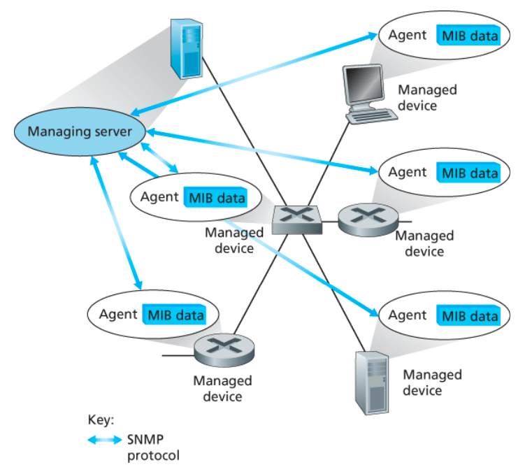

---

## 관리 서버 (Managing Server)

> 네트워크 관리 중심 시스템

- 네트워크 운영 센터(NOC)에서 동작
- 관리자가 사용하는 관리 애플리케이션

---

### 역할

- 장치 상태 수집
- 장치 설정 및 제어
- 데이터 분석 및 관리

---

## 피관리 장치 (Managed Device)

> 관리 대상 네트워크 장비

예:
- 라우터
- 스위치
- 호스트
- 방화벽
- 미들박스

---

## 네트워크 관리 에이전트

> 피관리 장치 내부에서 동작하는 관리 프로세스

---

### 역할

- 관리 서버와 통신
- 장치 상태 전달
- 관리 서버 명령 수행

---

## 네트워크 관리 프로토콜

> 관리 서버와 장치 간 통신 프로토콜

---

### 역할

- 장치 상태 조회
- 장치 설정 변경
- 이벤트 알림 전달

---

# 관리 데이터 종류

## 설정 데이터 (Configuration Data)

> 관리자가 설정한 정보

예:
- IP 주소
- 인터페이스 속도

---

## 동작 데이터 (Operational Data)

> 장치가 동작하며 생성한 정보

예:
- OSPF 인접 라우터 목록

---

## 장치 통계 (Statistics)

> 장치 상태 및 카운터 정보

예:
- 드롭 패킷 수
- 인터페이스 오류 수

---

# 네트워크 관리 방식

## 1. CLI 방식

> 장치에 직접 명령 입력

---

### 방법

- 콘솔 직접 입력
- Telnet
- SSH

---

### 특징

- 직관적
- 소규모 관리 적합

---

### 단점

- 자동화 어려움
- 대규모 관리 비효율적
- 사람 실수 발생 가능

---

# 2. SNMP / MIB 방식

## SNMP

> 네트워크 장치 상태를 조회/관리하기 위한 프로토콜

---

### 특징

- 관리 서버 ↔ 에이전트 구조
- 상태 조회 및 설정 가능

---

## MIB (Management Information Base)

> 관리 정보 데이터베이스

---

### 역할

- 장치 상태 정보 저장
- 관리 가능한 객체 집합

---

### 예시

- 드롭 패킷 수
- 인터페이스 상태
- 라우팅 정보

---

# SNMP 동작 방식

## 요청-응답 방식

```plaintext
관리 서버 -> 요청
에이전트 -> 응답
```

---

### 사용 목적

- 상태 조회
- 값 수정

---

## Trap 메시지

> 장치가 이벤트 발생 시 관리 서버에 알림

---

### 예시

- 링크 다운
- 장치 오류
- 성능 임계치 초과

---

# 주요 SNMP PDU

| PDU | 역할 |
|-----|------|
| GetRequest | 값 조회 |
| SetRequest | 값 수정 |
| Response | 응답 |
| Trap | 비동기 이벤트 알림 |

---

# SNMP 특징

## 장점

- 상태 조회 간단
- 표준화된 관리 가능

---

## 단점

- 장치 단위 관리 중심
- 대규모 자동화 한계
- 설정 관리 복잡

---

# SNMP와 UDP

## 특징

- 일반적으로 UDP 사용
- 신뢰성 보장 없음

---

### 요청 ID

- 요청/응답 식별
- 손실 검출 가능

---

# SMI

## SMI (Structure of Management Information)

> MIB 객체 정의 규칙

---

### 역할

- MIB 데이터 구조 정의
- 데이터 타입 정의

---

# 3. NETCONF / YANG 방식

## NETCONF

> 장치 설정을 관리하기 위한 최신 네트워크 관리 프로토콜

---

### 특징

- 설정 관리 중심
- 구조화된 XML 사용
- 안전한 연결 사용

---

## 핵심 기능

- 설정 조회
- 설정 변경
- 동작 상태 조회
- 알림 구독

---

## RPC 기반 동작

```plaintext
관리 서버
-> RPC 요청

장치
-> RPC 응답
```

---

## 보안 연결

- TCP 기반
- TLS 사용 가능

---

## NETCONF 세션 흐름

### 과정

1. 보안 연결 생성
2. <hello> 메시지 교환
3. RPC 요청/응답 수행
4. 세션 종료

---

# 주요 NETCONF 작업

| 작업 | 역할 |
|------|------|
| get | 설정 조회 |
| edit-config | 설정 수정 |
| copy-config | 설정 복사 |
| delete-config | 설정 삭제 |
| lock / unlock | 설정 잠금 |

---

# YANG

## YANG

> 네트워크 관리 데이터 모델링 언어

---

### 역할

- 장치 데이터 구조 정의
- NETCONF 데이터 표현

---

### 특징

- 데이터 구조 표준화
- XML 문서 생성 가능

---

# SNMP vs NETCONF/YANG

| 구분 | SNMP | NETCONF/YANG |
|------|------|---------------|
| 목적 | 상태 조회 중심 | 설정 관리 중심 |
| 데이터 구조 | MIB | YANG |
| 통신 방식 | UDP 기반 | TCP/TLS 기반 |
| 자동화 | 제한적 | 강력 |
| 사용 목적 | 모니터링 | 대규모 설정 관리 |
