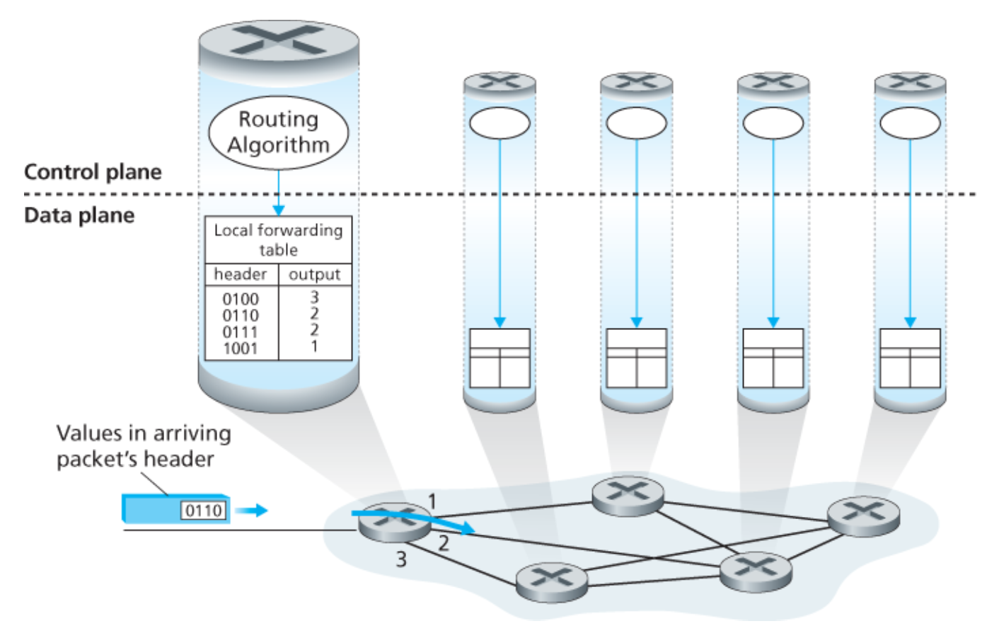
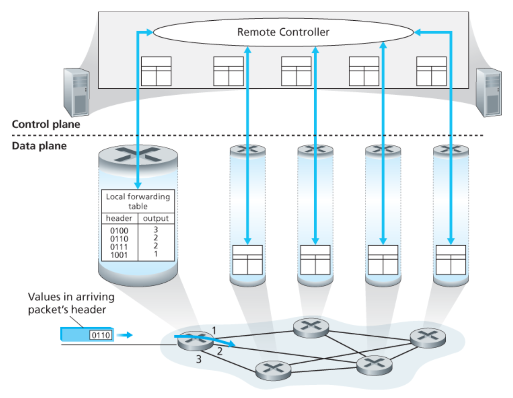
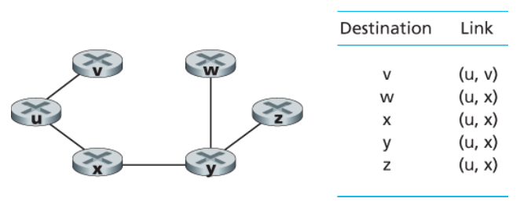
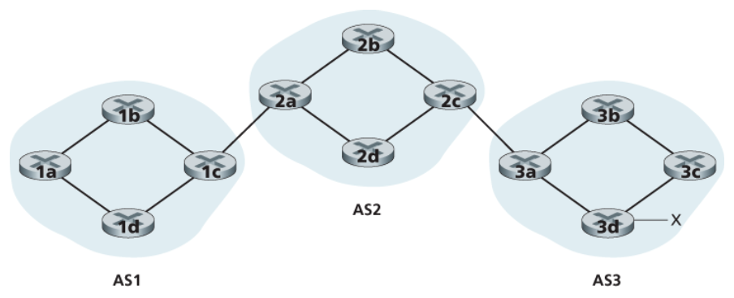
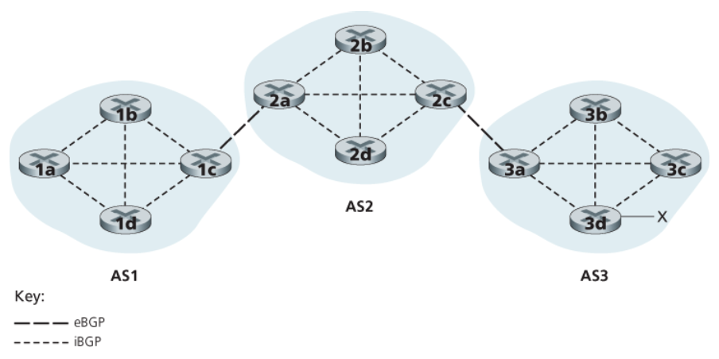
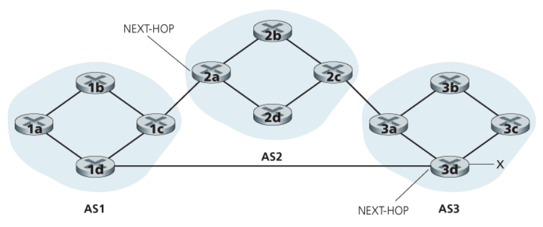
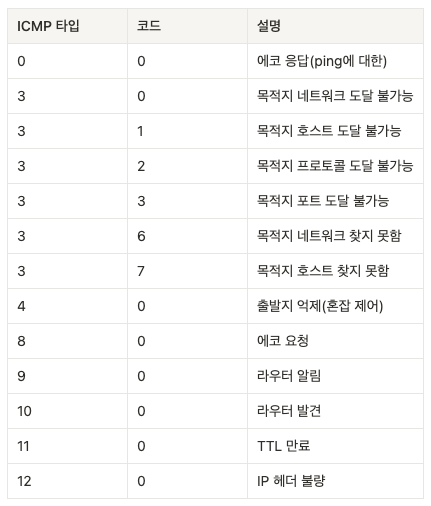
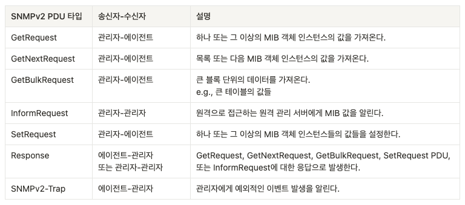
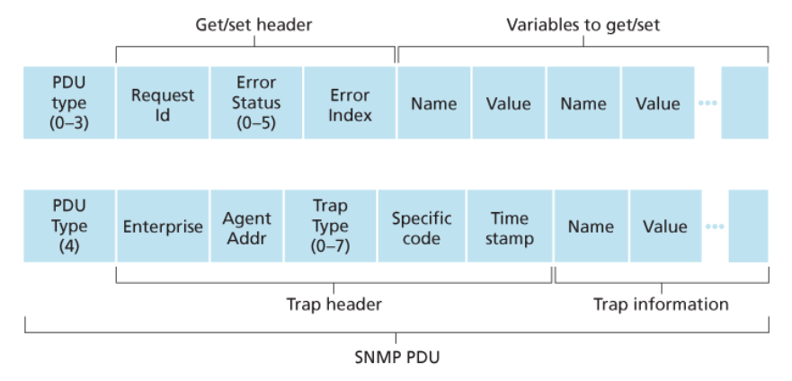
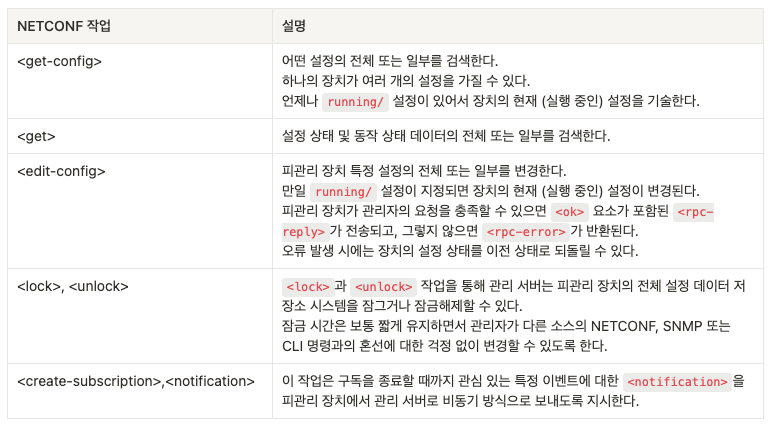

# Chapter 5: 네트워크 계층의 제어 평면

## 5.1 개요

네트워크 계층은 크게 **데이터 평면**과 **제어 평면**으로 나눌 수 있다.

데이터 평면은 실제 패킷을 처리하는 부분이다.
라우터에 패킷이 들어왔을 때 어떤 출력 포트로 내보낼지 결정하고, 필요하다면 패킷을 버리거나 헤더를 수정한다.

제어 평면은 데이터 평면이 사용할 규칙을 만드는 부분이다.
즉, 포워딩 테이블이나 플로우 테이블을 어떻게 만들고 유지할지 결정한다.

예를 들어 라우터 R에 목적지 IP가 `10.0.3.5`인 패킷이 들어왔다고 하자.
라우터가 포워딩 테이블을 보고 “이 패킷은 2번 포트로 내보내야 한다”고 판단하는 것은 데이터 평면의 동작이다.
반면 “목적지 `10.0.3.0/24`는 왜 2번 포트로 보내야 하는가”를 계산하고 테이블에 넣는 과정은 제어 평면의 동작이다.





### 포워딩과 라우팅

포워딩과 라우팅은 자주 헷갈리지만 역할이 다르다.

- 포워딩은 개별 라우터 내부에서 일어나는 동작이다.
- 라우팅은 네트워크 전체 관점에서 경로를 정하는 과정이다.

예를 들어 서울에서 부산까지 이동한다고 하자.
내비게이션이 전체 경로를 계산하는 것은 라우팅이다.
실제 운전 중 특정 교차로에서 오른쪽으로 갈지 왼쪽으로 갈지 결정하는 것은 포워딩에 가깝다.

라우터 관점에서 보면, 라우팅 알고리즘이 목적지까지의 경로를 계산하고 그 결과를 포워딩 테이블에 반영한다.
이후 실제 패킷이 들어오면 라우터는 이미 만들어진 포워딩 테이블을 빠르게 조회해서 패킷을 내보낸다.

### 포워딩 테이블과 플로우 테이블

전통적인 IP 라우터는 주로 **목적지 주소**를 기준으로 포워딩한다.
이때 사용되는 테이블이 포워딩 테이블이다.

예를 들어 다음과 같은 포워딩 테이블이 있다고 하자.

```text
목적지 prefix       출력 포트
10.0.1.0/24        1
10.0.2.0/24        2
10.0.3.0/24        3
```

목적지 IP가 `10.0.2.7`인 패킷이 들어오면 라우터는 `10.0.2.0/24` 항목과 매칭해 2번 포트로 패킷을 보낸다.

반면 일반화된 포워딩에서는 목적지 IP뿐 아니라 여러 헤더 필드를 기준으로 동작을 정할 수 있다.
예를 들어 출발지 IP, 목적지 IP, TCP 포트, 프로토콜 번호 등을 함께 보고 패킷을 처리할 수 있다.
이때는 **match plus action** 방식의 플로우 테이블을 사용한다.

예를 들어 다음과 같은 규칙을 생각할 수 있다.

```text
match: 목적지 IP = 10.0.3.0/24, TCP 목적지 포트 = 80
action: 방화벽 장비를 거쳐 3번 포트로 전달
```

이 방식은 단순 라우팅뿐 아니라 방화벽, NAT, 부하 분산 같은 기능도 하나의 추상화로 표현할 수 있게 해준다.

### 라우터별 제어와 논리적 중앙 집중 제어

제어 평면을 구현하는 방식은 크게 두 가지로 볼 수 있다.

첫 번째는 **라우터별 제어**다.
각 라우터가 자신의 라우팅 알고리즘을 실행하고, 다른 라우터와 정보를 교환하면서 포워딩 테이블을 만든다.
OSPF와 BGP가 이런 방식에 해당한다.

예를 들어 회사 내부 라우터 A, B, C가 있다고 하자.
각 라우터는 자신과 연결된 링크 상태를 알고, 다른 라우터와 정보를 주고받는다.
그 결과 각 라우터는 목적지별 다음 홉을 스스로 계산한다.

두 번째는 **논리적 중앙 집중 제어**다.
중앙 컨트롤러가 네트워크 전체 상태를 보고 각 라우터나 스위치의 플로우 테이블을 설정한다.
SDN이 대표적인 예다.

예를 들어 데이터센터에 수백 개의 스위치가 있다고 하자.
각 스위치가 독립적으로 경로를 계산하는 대신, SDN 컨트롤러가 전체 링크 상태와 트래픽 상태를 보고 “이 서버로 가는 트래픽은 이 경로로 보내라”는 규칙을 스위치들에게 내려줄 수 있다.

## 5.2 라우팅 알고리즘

라우팅 알고리즘의 목적은 송신자에서 수신자까지 패킷이 이동할 **좋은 경로**를 찾는 것이다.

일반적으로 좋은 경로는 최소 비용 경로를 의미한다.
여기서 비용은 단순한 거리일 수도 있고, 링크 속도, 지연 시간, 회선 비용, 관리자가 설정한 가중치일 수도 있다.

예를 들어 다음과 같은 네트워크가 있다고 하자.

```text
A --1-- B --2-- D
 \      |
  4     1
   \    |
     C --5-- D
```

A에서 D로 가는 경로는 여러 개다.

- `A -> B -> D`: 비용 `1 + 2 = 3`
- `A -> C -> D`: 비용 `4 + 5 = 9`
- `A -> B -> C -> D`: 비용 `1 + 1 + 5 = 7`

최소 비용 기준이라면 `A -> B -> D`가 선택된다.

하지만 실제 인터넷에서는 항상 최소 비용만 선택하지 않는다.
네트워크 운영 정책이 있기 때문이다.

예를 들어 어떤 기관 Y의 라우터가 경쟁 기관 Z의 네트워크를 경유하는 것을 원하지 않을 수 있다.
이 경우 비용이 낮더라도 Z를 지나가는 경로는 선택하지 않도록 정책을 설정할 수 있다.

### 그래프로 보는 라우팅

라우팅 문제는 그래프로 표현한다.

- 그래프 `G(N, E)`에서 `N`은 노드 집합이다.
- 노드는 보통 라우터를 의미한다.
- `E`는 에지 집합이다.
- 에지는 라우터 사이의 물리적 링크를 의미한다.
- 각 에지는 비용을 가진다.

예를 들어 `c(x, y) = 3`이면 라우터 x와 y 사이 링크 비용이 3이라는 뜻이다.

경로는 노드들의 연속이다.

```text
(x1, x2, x3, ..., xp)
```

이 경로가 유효하려면 `(x1, x2)`, `(x2, x3)` 같은 인접 노드 쌍이 모두 실제 링크로 연결되어 있어야 한다.

경로의 비용은 경로에 포함된 모든 링크 비용의 합이다.

```text
c(x1, x2) + c(x2, x3) + ... + c(xp-1, xp)
```

### 라우팅 알고리즘의 분류

#### 중앙 집중형과 분산형

**중앙 집중형 라우팅 알고리즘**은 네트워크 전체에 대한 완전한 정보를 가지고 경로를 계산한다.
예: 링크 상태 알고리즘

예를 들어 모든 도시와 도로 정보가 들어 있는 지도를 가지고 최단 경로를 계산하는 상황을 생각하면 된다.
전체 지도를 알고 있으므로 가장 짧은 길을 직접 찾을 수 있다.

**분산형 라우팅 알고리즘**은 각 라우터가 전체 정보를 알지 못한 상태에서 시작한다.
각 라우터는 자신과 직접 연결된 링크 비용만 알고, 이웃 라우터와 정보를 교환하면서 점차 경로를 계산한다.
예: 거리 벡터 알고리즘

예를 들어 A가 목적지 D까지 가는 전체 지도를 모르더라도, 이웃 B가 “나는 D까지 비용 4로 갈 수 있다”고 알려주면 A는 B를 통해 D로 가는 비용을 계산할 수 있다.

#### 정적 라우팅과 동적 라우팅

**정적 라우팅**은 사람이 직접 경로를 설정

- 경로 변화가 느리고 관리자가 개입해야 한다.

예: 작은 사무실 네트워크에서 “외부로 나가는 모든 트래픽은 게이트웨이 R1로 보내라”는 규칙을 수동으로 설정할 수 있다.

**동적 라우팅**은 네트워크 상태가 변하면 라우팅 알고리즘이 자동으로 경로를 바꾸는 방식이다.

- 동적 라우팅은 변화에 빠르게 대응할 수 있지만, 경로 루프나 경로 진동 같은 문제가 생길 수 있다.

예: R1과 R2 사이의 링크가 끊기면, 동적 라우팅 프로토콜은 이를 감지하고 우회 경로를 계산한다.

#### 부하 민감형과 부하 비민감형

**부하 민감형 알고리즘**은 현재 링크의 혼잡도를 비용에 반영한다.

예를 들어 어떤 링크에 트래픽이 몰려 지연 시간이 커지면, 해당 링크의 비용을 높게 설정해서 다른 경로를 선택하게 할 수 있다.

이런 방식은 경로 진동을 일으킬 수 있다.
모두가 혼잡한 링크를 피해서 다른 링크로 이동하면, 그 다른 링크가 다시 혼잡해지고 다시 원래 링크로 돌아가는 현상이 반복될 수 있다.

**부하 비민감형 알고리즘**은 현재 혼잡도를 링크 비용에 직접 반영하지 않는다.

- RIP
- OSPF
- BGP

## 5.2.1 링크 상태 라우팅 알고리즘

링크 상태 라우팅 알고리즘은 네트워크 전체 토폴로지와 모든 링크 비용이 알려져 있다고 가정한다.

각 라우터는 자신과 직접 연결된 링크의 상태를 알고 있다.
이 정보를 네트워크 전체에 알리면, 모든 라우터가 같은 네트워크 지도를 갖게 된다.
이후 각 라우터는 자신을 출발점으로 해서 모든 목적지까지의 최단 경로를 계산한다.

예를 들어 라우터 A가 다음 정보를 알고 있다고 하자.

```text
A-B 비용 2
A-C 비용 5
B-C 비용 1
B-D 비용 2
C-D 비용 3
```

A는 전체 그래프를 알고 있으므로 A에서 D까지 가는 여러 경로를 비교할 수 있다.

- `A -> B -> D`: 비용 `2 + 2 = 4`
- `A -> C -> D`: 비용 `5 + 3 = 8`
- `A -> B -> C -> D`: 비용 `2 + 1 + 3 = 6`

따라서 A에서 D로 가는 최단 경로는 `A -> B -> D`다.

### 링크 상태 정보의 전파

링크 상태 알고리즘에서는 각 라우터가 자신의 링크 상태 정보를 다른 모든 라우터에게 알려야 한다.
이를 위해 링크 상태 패킷을 네트워크 전체에 브로드캐스트하거나 플러딩한다.

예를 들어 라우터 B가 “나는 A와 비용 2로 연결되어 있고, C와 비용 1로 연결되어 있으며, D와 비용 2로 연결되어 있다”고 알린다.
다른 라우터들도 같은 방식으로 자신의 링크 상태를 알린다.
모든 정보가 모이면 각 라우터는 전체 네트워크 그래프를 만들 수 있다.

### 다익스트라 알고리즘

링크 상태 알고리즘에서 최단 경로 계산에 주로 사용되는 알고리즘은 다익스트라 알고리즘이다.
하나의 출발 노드에서 다른 모든 노드까지의 최소 비용 경로를 계산한다.

사용되는 주요 개념은 다음과 같다.

* `D(v)`: 현재까지 알려진 출발지에서 v까지의 최소 비용 추정값
* `p(v)`: 현재 최소 비용 경로에서 v 바로 이전 노드
* `N'`: 최소 비용 경로가 확정된 노드 집합

예를 들어 다음 그래프를 생각하자.

```text
u --2-- v --1-- x
|       |
5       2
|       |
w --1-- y
```

출발지가 u라고 하자.
처음에는 u와 직접 연결된 v, w의 비용만 안다.

* `D(v) = 2`
* `D(w) = 5`
* 다른 노드는 아직 모름

계산 흐름은 다음과 같다.

1. 가장 비용이 낮은 v를 확정한다.
2. v를 거치면 x까지 비용은 `2 + 1 = 3`이 된다.
3. v를 거치면 y까지 비용은 `2 + 2 = 4`가 된다.
4. w의 비용 5보다 x의 비용 3이 낮으므로 x를 먼저 확정한다.
5. 이런 식으로 가장 가까운 노드를 하나씩 확정하면서 최단 경로 트리를 만든다.

### 포워딩 테이블 생성

다익스트라 알고리즘이 끝나면 출발 라우터는 각 목적지까지의 최단 경로를 알게 된다.
하지만 포워딩 테이블에 필요한 것은 전체 경로가 아니라 **다음 홉**이다.

* 전체 그래프
  * 최단 경로 계산에 필요하다.
* 포워딩 테이블
  * 실제 전송에 필요한 다음 홉만 저장한다.

예를 들어 u에서 각 목적지까지의 최단 경로가 다음과 같다고 하자.

```text
목적지 v: u -> v
목적지 x: u -> v -> x
목적지 y: u -> v -> y
목적지 w: u -> w
```

이때 u 입장에서 필요한 다음 홉은 다음과 같다.

| 목적지 | 다음 홉 |
| ------ | ------- |
| v | v |
| x | v |
| y | v |
| w | w |

u는 x, y로 가는 전체 경로를 매번 기억할 필요가 없다.
패킷을 v에게 보내기만 하면 이후 경로는 다음 라우터들이 처리한다.

따라서 포워딩 테이블에는 목적지 x, y에 대해 다음 홉 v 또는 v로 가는 출력 포트가 저장된다.




### 계산 복잡도와 진동 문제

단순한 다익스트라 구현은 노드 수가 n일 때 대략 `O(n^2)`의 계산 복잡도를 가진다.

링크 상태 방식은 전체 정보를 바탕으로 정확하게 경로를 계산할 수 있다.
하지만 모든 라우터가 링크 상태 정보를 주고받아야 하므로 네트워크가 커질수록 정보 전파 비용이 증가한다.

또한 링크 비용이 현재 혼잡도에 따라 계속 바뀌면 경로 진동이 생길 수 있다.

예를 들어 많은 라우터가 혼잡한 경로 A를 피해 경로 B로 이동하면, 이번에는 B가 혼잡해진다.
그러면 다시 A로 이동하고, 다시 A가 혼잡해지는 식으로 경로가 계속 흔들릴 수 있다.

이를 줄이기 위해 다음 방식을 사용할 수 있다.

* 모든 라우터가 동시에 링크 상태 알고리즘을 실행하지 않게 한다.
* 각 노드가 상태 정보를 보내는 시각을 임의로 결정하게 한다.
* 이를 통해 한꺼번에 같은 경로로 몰리는 현상을 줄인다.

## 5.2.2 거리 벡터 라우팅 알고리즘

거리 벡터 라우팅 알고리즘은 각 라우터가 네트워크 전체 지도를 알지 못해도 동작할 수 있는 분산형 알고리즘이다.

- 반복 -> 이웃으로부터 정보를 받고, 계산 수행, 계산된 결과를 다시 이웃에게 배포
- 비동기적 -> 이웃끼리 정보를 교환하지 않을 때까지 프로세스 지속
- 분산 -> 모든 노드가 맞물려 동작할 필요 x

각 라우터는 자신과 직접 연결된 이웃까지의 비용만 알고 시작한다.
이후 이웃과 거리 벡터를 교환한다.
거리 벡터는 “각 목적지까지 내가 알고 있는 최소 비용”의 목록이다.

예를 들어 라우터 A의 거리 벡터가 다음과 같을 수 있다.

```text
목적지 B: 비용 1
목적지 C: 비용 4
목적지 D: 비용 7
```

라우터 B가 A에게 다음 정보를 알려준다고 하자.

```text
B에서 C까지 비용 2
B에서 D까지 비용 3
```

A에서 B까지 비용이 1이면, A는 B를 통해 가는 경로를 계산할 수 있다.

- A에서 C까지: `A-B 비용 1 + B-C 비용 2 = 3`
- A에서 D까지: `A-B 비용 1 + B-D 비용 3 = 4`

기존 A의 C 비용은 4였는데 B를 거치면 3이므로, A는 C로 가는 경로를 B 경유로 갱신한다.
D도 기존 비용 7보다 4가 낮으므로 B 경유로 갱신한다.

### Bellman-Ford 식

거리 벡터 알고리즘의 핵심은 Bellman-Ford 식이다.

```text
Dx(y) = minv { c(x, v) + Dv(y) }
```

의미는 다음과 같다.

- `Dx(y)`: x에서 y까지 가는 최소 비용
- `v`: x의 이웃 노드
- `c(x, v)`: x에서 이웃 v까지의 비용
- `Dv(y)`: 이웃 v가 알고 있는 y까지의 비용

즉, x는 모든 이웃 v에 대해 “v를 거쳐 y로 가면 비용이 얼마인가”를 계산하고, 그중 가장 작은 값을 선택한다.

예를 들어 x의 이웃이 a, b 두 개라고 하자.

```text
x-a 비용: 2
x-b 비용: 5
a가 말한 y까지 비용: 4
b가 말한 y까지 비용: 1
```

x가 a를 거쳐 y로 가면 비용은 `2 + 4 = 6`이다.
x가 b를 거쳐 y로 가면 비용은 `5 + 1 = 6`이다.
두 경로의 비용이 같으므로 둘 중 하나를 선택하거나 정책에 따라 결정할 수 있다.

1. 각 노드는 이웃으로부터의 갱신 기다리고
2. 업데이터를 수신하면 새로 거리 벡터를 계산하고
3. 새로운 거리 벡터를 이웃에게 배포

이 과정을 더 이상의 갱신 메시지가 없을 때까지 계속

### 좋은 소식과 나쁜 소식

거리 벡터 알고리즘은 좋은 소식은 빠르게 퍼지는 편이다.

예를 들어 어떤 목적지로 가는 더 짧은 경로가 생기면, 이웃 라우터들이 그 정보를 받아 자신의 비용을 낮추고 다시 다른 이웃에게 전파한다.

반면 나쁜 소식은 느리게 퍼질 수 있다.
대표적인 문제가 count-to-infinity다.

예를 들어 A, B, C가 있고 C가 목적지 X와 직접 연결되어 있었다고 하자.

```text
A -- B -- C -- X
```

B는 C를 통해 X로 갈 수 있고, A는 B를 통해 X로 갈 수 있다.
그런데 C와 X 사이 링크가 끊어지면 실제로는 아무도 X에 갈 수 없다.

하지만 B가 아직 A의 오래된 정보를 보고 “A를 통해 X에 갈 수 있나?”라고 착각할 수 있다.
A도 B를 통해 간다고 알고 있었기 때문에, 서로 잘못된 정보를 믿으며 비용이 계속 증가한다.
이처럼 도달 불가능한 목적지에 대한 비용이 천천히 무한대로 증가하는 문제가 count-to-infinity다.

기존: y --4-- x 변경: y --60-- x

직접 가면 60이네.
그런데 z가 예전에 "나는 x까지 5에 갈 수 있어"라고 했었지?
그러면 y → z → x = 1 + 5 = 6이네?
그럼 z로 가야겠다.

z가 x까지 5에 갈 수 있다고 말한 이유가 사실은:

z → y → x -> z는 원래 y를 거쳐서 x로 가고 있었음

z가 x까지 갈 수 있대.
그러면 나는 z한테 보내야지.

y는 x로 가려고 z에게 보냄 z는 x로 가려고 y에게 보냄

### 포이즌 리버스

count-to-infinity 문제를 줄이기 위한 방법 중 하나가 포이즌 리버스다.

어떤 라우터가 특정 목적지로 가기 위해 이웃 라우터를 사용한다면, 그 이웃에게는 해당 목적지 비용을 무한대로 알려준다.

예를 들어 A가 X로 가기 위해 B를 사용한다면, A는 B에게 “나는 X까지 갈 수 없다”고 알린다.
이렇게 하면 B가 다시 A를 통해 X로 가려는 잘못된 판단을 줄일 수 있다.

다만 포이즌 리버스도 모든 루프 문제를 완전히 해결하지는 못한다.
특히 세 개 이상의 라우터가 얽힌 루프에서는 여전히 문제가 발생할 수 있다.

### 비교

링크

- 내비게이션이 전국 지도를 가지고 최단 경로를 계산하는 것
- 내 링크 상태를 전체에게 알림
- 잘못된 링크 정보가 퍼질 수 있지만, 계산은 따로 하기 때문에 조금은 괜찮은 편

거리 벡터

- 나는 전국 지도를 모르고, 옆 사람들에게 "너 부산까지 몇 시간 걸려?"라고 물어보고, 그 사람에게 가는 시간까지 더해서 판단하는 것
- 내 거리 벡터를 이웃에게만 알림
- 잘못된 계산 결과가 이웃을 타고 계속 퍼질 수 있음

## 5.3 AS 내부 라우팅: OSPF(open shortest path first)

인터넷은 하나의 거대한 네트워크처럼 보이지만, 실제로는 여러 **자율 시스템 AS**로 구성된다.
AS는 하나의 관리 주체가 운영하는 라우터와 네트워크의 집합이다.

예를 들어 한 ISP의 네트워크, 한 대기업의 내부망, 한 대학의 캠퍼스망이 각각 하나의 AS가 될 수 있다.

OSPF는 AS 내부에서 사용하는 대표적인 라우팅 프로토콜이다.
이런 프로토콜을 **intra-AS routing protocol**이라고 한다.

### OSPF의 기본 동작

OSPF는 링크 상태 라우팅 프로토콜이다.

각 OSPF 라우터는 자신과 연결된 링크의 상태와 비용을 파악한다.
그리고 이 정보를 같은 AS 내부의 다른 라우터들에게 플러딩한다.
그 결과 각 라우터는 AS 내부의 전체 토폴로지 지도를 갖게 된다.

이후 각 라우터는 자신을 출발점으로 다익스트라 알고리즘을 수행해 목적지별 최단 경로를 계산한다.

예를 들어 회사 내부망에 서울, 대전, 부산 라우터가 있다고 하자.
서울 라우터는 대전과 연결된 링크 비용, 부산과 연결된 링크 비용을 OSPF로 알린다.
대전과 부산 라우터도 자신의 링크 정보를 알린다.
모든 라우터는 같은 지도를 가지게 되고, 각자 자신 기준의 최단 경로를 계산한다.

### OSPF 메시지와 신뢰성

OSPF 메시지는 IP 데이터그램에 담겨 전달된다.
OSPF는 TCP나 UDP를 사용하지 않고, IP 위에서 직접 동작한다.
OSPF의 IP 프로토콜 번호는 89다.

TCP를 사용하지 않기 때문에 OSPF는 필요한 신뢰성(+브로드캐스트) 기능을 스스로 구현해야 한다.
예를 들어 링크 상태 정보가 제대로 전달되었는지 확인하고, 필요한 경우 다시 전송하는 방식이 필요하다.

### OSPF 링크 가중치

OSPF에서 링크 비용은 관리자가 설정할 수 있다.
링크 비용을 어떻게 설정하느냐에 따라 트래픽 경로가 달라진다.

예를 들어 A에서 D로 가는 두 경로가 있다고 하자.

```text
A -> B -> D
A -> C -> D
```

관리자가 `A-B`, `B-D` 링크 비용을 낮게 설정하면 트래픽은 B를 경유할 가능성이 높다.
반대로 C 경로의 비용을 낮게 설정하면 C를 경유한다.

즉, OSPF의 링크 가중치는 단순한 거리 정보가 아니라 트래픽 엔지니어링 수단으로도 사용될 수 있다.

### OSPF 인증

OSPF는 라우터 간 정보 교환을 인증할 수 있다.

예를 들어 공격자가 가짜 OSPF 메시지를 보내 “이 링크 비용은 0이다” 또는 “이 경로는 끊겼다”고 속이면 네트워크 경로가 잘못 바뀔 수 있다.
인증을 사용하면 신뢰할 수 있는 라우터만 OSPF에 참여하게 할 수 있다.

단순 인증은 비밀번호를 평문으로 포함할 수 있어 안전하지 않다.

- 단순 인증
- MD5 인증

### 동일 비용 다중 경로

OSPF는 하나의 목적지에 대해 동일한 비용의 경로가 여러 개 있으면 여러 경로를 사용할 수 있다.

예를 들어 A에서 D로 가는 두 경로가 모두 비용 10이라고 하자.

```text
A -> B -> D
A -> C -> D
```

OSPF는 두 경로를 모두 사용해 트래픽을 분산할 수 있다.
이를 통해 특정 링크에만 트래픽이 몰리는 것을 줄일 수 있다.

- MAC 주소 -> 디바이스마다 할당된 물리적 주소
- 유니캐스트 -> 프레임에 자신의 MAC 주소와 목적지의 MAC 주소를 첨부하여 전송하는 방식(1:1)
- 브로드캐스트 -> 로컬 네트워크에 연결되어 있는 모든 시스템에게 프레임을 보내는 방식
- 멀티캐스트 -> 네트워크에 연결되어 있는 특정 그룹에게 전송하는 방식

### 계층적 OSPF

큰 AS에서는 모든 라우터가 전체 AS의 세부 링크 정보를 아는 것이 부담스럽다.
그래서 OSPF는 영역 area를 사용해 계층적으로 구성할 수 있다.

각 영역 내부 라우터는 자신의 영역에 대한 자세한 링크 상태 정보를 가진다.
영역 밖 정보는 요약된 형태로 전달된다.

예를 들어 전국 규모 회사망에서 서울, 부산, 대구, 광주 지사를 하나의 평면으로 모두 연결해 관리하면 링크 상태 정보가 너무 많아진다.
지역별 area로 나누면 각 지역 내부는 자세히 관리하고, 지역 간 경로는 요약해서 관리할 수 있다.

## 5.4 ISP 간 라우팅: BGP(Border GateWay Protocol)

OSPF가 AS 내부 라우팅을 위한 프로토콜이라면, BGP는 AS 간 라우팅을 위한 프로토콜.
실제 인터넷의 AS들은 BGP를 통해 서로 도달 가능한 네트워크 prefix 정보를 교환한다.

예를 들어 AS1이 `10.10.0.0/16`이라는 prefix를 가지고 있다고 하자.
AS1은 BGP를 통해 다른 AS들에게 “이 prefix는 나를 통해 갈 수 있다”고 알린다.

### BGP의 역할

BGP는 TCP 위에서 동작한다.
OSPF가 AS 내부 라우팅을 위한 프로토콜이라면, BGP는 AS 간 라우팅을 위한 프로토콜이다.

같은 AS 내부에 있는 목적지는 AS 내부 라우팅 프로토콜로 결정한다.
반대로 AS 외부에 있는 목적지로 가려면 BGP가 필요하다.

라우터의 포워딩 테이블은 보통 다음과 같은 엔트리를 가진다.

* `x`: 주소 prefix
* `I`: 라우터 인터페이스 번호
* `(x, I)`: prefix x로 가는 패킷은 인터페이스 I로 내보내라는 의미

BGP는 각 라우터에 두 가지 기능을 제공한다.

1. 이웃 AS로부터 도달 가능한 prefix 정보를 얻는다.

   * prefix 정보는 서브넷의 집합을 나타낸다.

2. 특정 prefix로 가기 위한 여러 경로 중 하나를 선택한다.

예를 들어 어떤 라우터가 `203.0.113.0/24`로 가는 경로를 두 개 배웠다고 하자.

```text
경로 1: AS2 AS5
경로 2: AS3 AS4 AS5
```

단순히 AS hop 수만 보면 경로 1이 짧다.
하지만 BGP는 정책을 고려하므로 반드시 경로 1을 고르는 것은 아니다.

### Prefix와 경로 광고

BGP에서 목적지는 prefix로 표현된다.
예를 들어 `203.0.113.0/24`는 `203.0.113.0`부터 `203.0.113.255`까지의 주소 범위를 나타낸다.



라우터는 역할에 따라 다음처럼 볼 수 있다.

* 게이트웨이 라우터
  * AS의 경계에 있는 라우터
  * 예: AS1의 1C

* 내부 라우터
  * AS 내부에서 동작하는 라우터
  * 예: AS1의 1a, 1b, 1d

AS는 자신이 도달 가능하게 해줄 수 있는 prefix를 BGP로 광고한다.
이 광고에는 AS 경로 정보가 포함된다.

예를 들어 AS3이 prefix x를 가지고 있고 AS2가 AS3과 연결되어 있다고 하자.

1. AS2는 “x로 가려면 AS3을 거치면 된다”는 정보를 배운다.
2. 이후 AS2는 AS1에게 “x로 가려면 AS2 AS3을 거치면 된다”고 광고할 수 있다.

### eBGP와 iBGP

BGP 연결은 eBGP와 iBGP로 나눌 수 있다.

* eBGP
  * 서로 다른 AS 사이의 BGP 연결이다.
  * 예를 들어 AS1의 경계 라우터와 AS2의 경계 라우터가 직접 BGP 정보를 교환하면 eBGP다.

* iBGP
  * 같은 AS 내부 라우터 사이에서 BGP 정보를 교환하는 연결이다.
  * 외부 AS에서 배운 prefix 정보를 AS 내부 라우터들에게 전달할 때 사용된다.

예를 들어 AS2의 경계 라우터가 AS3으로부터 prefix x 정보를 배웠다고 하자.
AS2 내부의 다른 라우터들도 x로 가는 방법을 알아야 한다.
이때 AS2 내부 라우터들에게 BGP 정보를 전달하는 데 iBGP가 사용된다.



iBGP 연결은 물리 링크와 반드시 일치하지 않는다.
같은 AS 내부 라우터들 사이에 논리적인 BGP 세션이 구성될 수 있다.
즉, 직접 케이블로 연결된 라우터끼리만 세션을 맺는 것이 아니라 여러 라우터를 거쳐 BGP 세션을 맺을 수 있다.

BGP는 TCP 179번 포트를 사용한다.
따라서 BGP 메시지는 신뢰성 있는 TCP 연결 위에서 전달된다.

### BGP 속성과 경로

BGP에서는 prefix와 그 prefix에 대한 속성 attribute의 묶음을 route라고 한다.

중요한 속성 중 하나는 AS-PATH다.
AS-PATH는 해당 prefix에 도달하기 위해 거쳐야 하는 AS들의 목록이다.

예:

```text
prefix x, AS-PATH: AS2 AS3
```

이는 x로 가려면 AS2를 거쳐 AS3으로 가야 한다는 의미다.

AS-PATH는 루프 방지에도 사용됨 만약 어떤 AS가 광고받은 AS-PATH 안에 자기 AS 번호가 이미 들어 있다면, 그 경로를 받아들이지 않는다.

예를 들어 AS1이 `AS2 AS1 AS5`라는 경로를 받았다면, 이 경로는 자기 자신 AS1을 포함하므로 루프 가능성이 있다.
따라서 AS1은 이 경로를 거부할 수 있다.

### BGP 경로 선택

BGP는 여러 경로 중 하나를 선택할 때 단순히 최단 경로만 보지 않는다.
정책, 속성, AS-PATH 길이, NEXT-HOP까지의 내부 비용 등을 종합적으로 고려한다.

* 고려 요소
  * 정책
  * BGP 속성
  * AS-PATH 길이
  * NEXT-HOP까지의 AS 내부 비용

예를 들어 AS1이 prefix x로 가는 두 경로를 알고 있다고 하자.

```text
경로 A: AS2 AS4
경로 B: AS3 AS4
```

* 두 경로의 AS-PATH 길이는 모두 2다.
* 그런데 AS1이 AS2와는 고객 관계이고 AS3과는 비용을 지불해야 하는 관계라면, AS1은 AS2 경로를 선호할 수 있다.
* 즉, BGP의 핵심은 “인터넷 라우팅은 기술적 최단 거리만의 문제가 아니라 정책의 문제”라는 점이다.

NEXT-HOP은 목적지까지 가기 위해 내 AS에서 처음으로 넘겨야 하는 외부 라우터의 인터페이스 IP다.



예를 들어 다음과 같은 두 경로가 있다고 하자.

* 경로 A
  * NEXT-HOP: 라우터 2a의 왼쪽 인터페이스 IP
  * AS-PATH: AS2 AS3
  * 목적지: x

* 경로 B
  * NEXT-HOP: 라우터 3d의 왼쪽 인터페이스 IP
  * AS-PATH: AS3
  * 목적지: x

이때 AS1 입장에서 중요한 질문은 다음과 같다.

* 지금 패킷을 실제로 누구에게 먼저 넘겨야 하는가?
* 선택한 BGP 경로의 NEXT-HOP은 누구인가?

경로 A를 선택했다면 다음처럼 해석한다.

* AS-PATH는 `AS2 AS3`이다.
* 따라서 목적지 x로 가려면 AS2를 거쳐 AS3으로 간다.
* AS1이 실제로 처음 패킷을 넘겨야 하는 대상은 AS2 쪽 라우터 2a다.
* 그래서 NEXT-HOP은 `2a의 AS1 쪽 인터페이스 IP`가 된다.

반대로 경로 B를 선택했다면 NEXT-HOP은 3d 쪽 인터페이스 IP가 된다.
즉, NEXT-HOP은 항상 “선택된 경로에서 당장 다음으로 넘길 라우터”를 의미한다.

### 뜨거운 감자 라우팅

뜨거운 감자 라우팅은 외부 목적지로 가는 여러 출구가 있을 때, 자기 AS 내부 비용이 가장 적게 드는 출구로 트래픽을 빨리 내보내는 방식이다.


예를 들어 1B에서 X로 가는 BGP 경로가 두 개 있다고 하자.

* 후보 NEXT-HOP
  * 라우터 2A
  * 라우터 3D
* 둘 다 목적지 x로 갈 수 있다.
* 내부 비용
  * 1B -> 2A: 비용 2
  * 1B -> 3D: 비용 3

이 경우 1B는 2A로 패킷을 보낸다.
외부 AS에서의 전체 경로 품질보다, 자기 AS 내부에서 빨리 내보내는 것을 우선하기 때문이다.

1B의 포워딩 테이블 생성 흐름은 다음과 같다.

1. 라우터 1B가 BGP 경로 후보를 확인한다.
2. 목적지 x로 가는 NEXT-HOP 후보 중 내부 비용이 낮은 2A를 고른다.
3. 2A로 가기 위한 인터페이스 `I`를 찾는다.
4. 포워딩 테이블에 `(x, I)` 엔트리를 추가한다.

정리하면 다음과 같다.

* 라우터는 자기 AS 바깥 구간의 비용을 깊게 따지지 않는다.
* 자기 AS 밖으로 빨리 내보내는 것을 우선한다.
* 그래서 같은 목적지에 대해서도 AS 내부 라우터마다 다른 AS 경로를 선택할 수 있다.

### 경로 선택 알고리즘

BGP 경로 선택은 뜨거운 감자 라우팅만으로 결정되지 않는다.
지역 선호도(local preference)가 먼저 적용될 수 있다.

* 지역 선호도(local preference)
  * 라우터에 의해 직접 설정될 수 있다.
  * 또는 AS 내부 라우터로부터 학습될 수 있다.
  * 값이 높을수록 더 선호된다.

경로 선택 순서는 다음과 같이 볼 수 있다.

1. 지역 선호도가 가장 높은 경로를 선택한다.
2. 지역 선호도가 같다면 AS-PATH가 가장 짧은 경로를 선택한다.
3. 그래도 남은 경로가 있다면 뜨거운 감자 라우팅을 적용한다.

### IP 애니캐스트

BGP는 IP 애니캐스트 구현에도 사용된다.
애니캐스트는 여러 서버가 같은 IP 주소 또는 prefix를 광고하고, 사용자는 라우팅상 가까운 서버로 연결되는 방식이다.

* 핵심 아이디어
  * 여러 지역 서버가 같은 IP 주소를 가진 것처럼 보인다.
  * 각 서버는 BGP로 “이 IP로 오려면 나에게 와라”라고 광고한다.
  * 인터넷 라우터는 같은 목적지 IP로 가는 여러 경로 중 자기 기준에서 가장 좋은 경로를 선택한다.

예를 들어 CDN이나 DNS 사업자가 여러 지역 서버에 같은 IP 주소를 할당할 수 있다.

```text
목적지 IP: 10.10.10.10
```

각 지역 서버는 다음처럼 BGP 광고를 한다.

* 서울 서버
  * BGP 광고: `10.10.10.10`으로 오려면 나한테 와라.

* 도쿄 서버
  * BGP 광고: `10.10.10.10`으로 오려면 나한테 와라.

* 뉴욕 서버
  * BGP 광고: `10.10.10.10`으로 오려면 나한테 와라.

인터넷 라우터 입장에서는 다음처럼 판단한다.

1. `10.10.10.10`으로 가는 경로가 여러 개 있다.
2. 그중 자기 기준으로 가장 좋은 경로를 고른다.
3. 선택된 경로에 해당하는 지역 서버로 트래픽이 전달된다.

라우터는 실제로 “이게 서울 서버인지, 뉴욕 서버인지”를 특별히 구분하지 않는다.
그냥 같은 목적지 IP로 가는 여러 경로 중 하나라고 생각한다.

이 방식은 DNS 루트 서버나 CDN 서비스에서 활용된다.
다만 CDN에서는 TCP 연결 특성 때문에 주의가 필요하다.

* TCP 연결은 같은 서버와 계속 유지되어야 안정적이다.
* BGP 경로가 바뀌면 사용자가 다른 지역 서버로 이동할 수 있다.
* 이전 서버는 연결 상태를 알고 있지만, 새 서버는 그 연결을 모른다.
* 그 결과 연결이 깨지거나, 세션이 이상해지거나, 영상 끊김과 로그인 상태 꼬임이 생길 수 있다.

### 라우팅 정책

BGP 경로 선택은 단순히 다음 조건만으로 결정되지 않는다.

* AS-PATH가 가장 짧은 경로
* 가장 가까운 경로
* 비용이 가장 낮은 경로

정책은 우리 AS가 어떤 트래픽을 받아주고, 어떤 트래픽은 전달하지 않을지 정하는 사업적/운영적 규칙이다.

예를 들어 ISP는 다음과 같은 판단을 할 수 있다.

* 고객에게서 받은 트래픽은 다른 곳으로 전달해 돈을 벌 수 있다.
* 경쟁 ISP 사이의 트래픽을 공짜로 중계하고 싶지는 않을 수 있다.
* 따라서 어떤 경로를 광고할지, 어떤 경로를 선택할지 정책적으로 제어한다.

간단한 예는 다음과 같다.

```text
고객 AS에서 온 경로: 다른 이웃에게 광고
제공자 AS에서 온 경로: 고객에게만 광고
경쟁 ISP 경로: 필요하면 선택하지 않음
```

즉, 경로가 짧아도 남의 트래픽을 공짜로 전달해야 하면 선택하지 않을 수 있다.
반대로 경로가 길어도 수익이 있으면 전달할 수 있다.

이처럼 BGP는 인터넷의 경제적 관계와 운영 정책을 반영한다.

### AS 간 라우팅과 내부 라우팅이 다른 이유

AS 간 라우팅과 AS 내부 라우팅은 목적이 다르다.

1. 정책

   * AS 간 라우팅은 정책이 지배한다.
   * 하나의 AS 안에서는 모든 장비가 동일한 관리 하에 있으므로 정책보다 성능이 더 중요하다.

2. 확장성

   * AS 간 라우팅은 수많은 네트워크 사이의 경로 설정을 다룬다.
   * AS 단위로 계층을 나누면 인터넷 전체 경로 관리를 더 확장성 있게 처리할 수 있다.

3. 성능

   * AS 간 라우팅은 정책 지향적이다.
   * 단일 AS 내부 라우팅은 성능, 비용, 수렴 속도에 더 초점을 둔다.

## 5.5 SDN 제어 평면

SDN은 Software-Defined Networking의 약자다.
핵심은 네트워크의 제어 기능을 장비에서 분리해 소프트웨어 컨트롤러가 담당하게 하는 것이다.

전통적인 라우터는 데이터 평면과 제어 평면을 모두 가지고 있다.
라우터가 패킷도 전달하고, 경로도 계산한다.

SDN에서는 스위치나 라우터가 주로 패킷 전달만 수행한다.
경로 계산, 정책 결정, 플로우 규칙 설치는 SDN 컨트롤러가 담당한다.

플로우 기반 포워딩 전통적인 라우터 기반 포워딩과는 다르게 트랜스포트, 네트워크, 링크 계층 헤더의 어떤 값들을 기반으로 패킷 전달이 이루어진다.


1. SDN 컨트롤러
  * 정확한 상태정보(e.g., 원격 링크와 스위치, 호스트들의 상태)를 유지하고,
  * 이 정보를 네트워크 제어 애플리케이션들에 제공하며,
  * 애플리케이션들이 하부 네트워크 장치들을 모니터하고 프로그램하고 제어까지 할 수 있도록 수단을 제공
2. SDN 네트워크 제어 애플리케이션들의 집합

### SDN이 필요한 이유

전통적인 네트워크에서는 장비마다 설정 방식이 다르고, 경로 제어가 분산되어 있다.
대규모 네트워크에서 정책을 일관되게 적용하기 어렵다.

예를 들어 데이터센터에서 특정 고객의 트래픽은 방화벽을 반드시 거치게 하고, 다른 트래픽은 부하 분산 장비를 거치게 하고 싶다고 하자.
기존 방식에서는 여러 장비의 설정을 각각 조정해야 한다.

SDN에서는 컨트롤러가 전체 네트워크 상태를 보고 플로우 규칙을 중앙에서 내려줄 수 있다.

```text
웹 트래픽 -> 방화벽 -> 로드밸런서 -> 서버
관리 트래픽 -> 인증 장비 -> 서버
백업 트래픽 -> 별도 링크 사용
```

이런 정책을 소프트웨어적으로 표현하고 장비에 반영할 수 있다는 점이 SDN의 장점

### SDN 제어 평면의 구성


SDN 제어 평면은 보통 세 계층으로 볼 수 있다.

첫째, 통신 계층이다.
SDN 컨트롤러와 네트워크 장비 사이에서 정보를 주고받는 계층이다.
OpenFlow가 대표적이다.

둘째, 네트워크 상태 관리 계층이다.
컨트롤러는 링크 상태, 스위치 상태, 호스트 위치, 플로우 통계 같은 정보를 유지한다.

셋째, 네트워크 제어 애플리케이션 계층이다.
라우팅, 방화벽, 접근 제어, 부하 분산 같은 기능이 이 계층에서 구현된다.

예를 들어 SDN 라우팅 애플리케이션은 컨트롤러가 가진 링크 상태 정보를 보고 다익스트라 알고리즘을 수행할 수 있다.
그리고 계산된 결과를 바탕으로 스위치들의 플로우 테이블을 설정한다.

### OpenFlow

OpenFlow는 SDN 컨트롤러와 스위치 사이에서 동작하는 대표적인 프로토콜이다.

OpenFlow를 통해 컨트롤러는 스위치의 플로우 테이블을 수정할 수 있다.
플로우 테이블은 match와 action으로 구성된다.

예를 들어 다음과 같은 규칙을 설치할 수 있다.

```text
match:
  목적지 IP = 10.0.2.0/24
  TCP 목적지 포트 = 443

action:
  4번 포트로 전달
```

또는 다음과 같은 보안 정책도 가능하다.

```text
match:
  출발지 IP = 192.168.10.5

action:
  drop
```

이 경우 특정 출발지에서 오는 패킷을 스위치가 바로 버리게 할 수 있다.

### 데이터 평면과 제어 평면의 상호작용 예시

SDN에서 링크 장애가 발생했을 때의 흐름을 보자.

1. 스위치 s1과 s2 사이 링크가 끊어진다.
2. s1은 포트 상태 변화를 감지한다.
3. s1은 OpenFlow 메시지로 컨트롤러에게 링크 장애를 알린다.
4. 컨트롤러는 네트워크 상태 정보를 갱신한다.
5. 라우팅 애플리케이션이 새 경로를 계산한다.
6. 컨트롤러는 관련 스위치들의 플로우 테이블을 수정한다.
7. 이후 패킷은 새 경로로 전달된다.

예를 들어 기존 경로가 `s1 -> s2 -> s4`였는데 s1-s2 링크가 끊기면, 컨트롤러가 `s1 -> s3 -> s4` 경로를 새로 계산하고 해당 규칙을 설치할 수 있다.

### SDN의 특징

SDN 컨트롤러는 논리적으로 중앙 집중되어 있다.
즉, 외부에서 보면 하나의 중앙 제어 시스템처럼 보인다.

하지만 실제 구현에서는 장애 대응과 성능을 위해 여러 컨트롤러 인스턴스가 분산되어 동작할 수 있다.
중요한 점은 제어 관점에서는 중앙화된 추상화를 제공한다는 것이다.

## 5.6 ICMP

ICMP는 Internet Control Message Protocol의 약자다.
호스트와 라우터가 네트워크 계층의 오류나 상태 정보를 주고받기 위해 사용한다.

ICMP는 IP와 밀접하게 관련되어 있다.
ICMP 메시지는 IP 데이터그램의 payload에 담겨 전달된다.
구조적으로는 IP 위에 있지만, 기능적으로는 IP를 보조하는 프로토콜로 볼 수 있다.

### ICMP 메시지 구조



ICMP 메시지에는 type과 code가 있다.

* type: 메시지의 큰 종류
* code: type 안에서 더 구체적인 원인

예를 들어 목적지 도달 불가능 메시지는 하나의 type으로 표현된다.
그 안에서 세부 원인은 code로 구분된다.

* 네트워크 도달 불가
* 호스트 도달 불가
* 포트 도달 불가

ICMP 오류 메시지는 보통 오류를 일으킨 IP 데이터그램의 헤더와 앞부분 데이터를 포함한다.
이를 통해 출발 호스트는 어떤 패킷에서 문제가 발생했는지 알 수 있다.

### ping

`ping`은 ICMP Echo Request와 Echo Reply를 사용한다.

예를 들어 사용자가 다음 명령을 실행한다고 하자.

```text
ping example.com
```

동작 흐름은 다음과 같다.

1. 출발 호스트가 example.com으로 ICMP Echo Request를 보낸다.
2. 대상 호스트가 살아 있고 ICMP 응답을 허용하면 Echo Reply를 보낸다.
3. 출발 호스트는 도달 가능 여부와 왕복 시간 RTT를 확인한다.

```text
내 컴퓨터 -> Echo Request -> example.com
내 컴퓨터 <- Echo Reply   <- example.com
```

### traceroute

`traceroute`는 목적지까지 가는 경로상의 라우터들과 왕복 시간을 알아내는 도구다.
핵심은 IP의 TTL 값을 이용하는 것이다.

TTL은 라우터를 하나 지날 때마다 1씩 감소한다.
TTL이 0이 되면 라우터는 패킷을 버리고 ICMP Time Exceeded 메시지를 출발지로 보낸다.

동작 흐름은 다음과 같다.

1. TTL을 1로 설정한 패킷을 보낸다.
2. 첫 번째 라우터에서 TTL이 0이 되어 패킷이 버려진다.
3. 첫 번째 라우터가 ICMP Time Exceeded를 보낸다.
4. 출발 호스트는 이 응답을 보고 첫 번째 라우터의 주소를 알 수 있다.
5. 그다음 TTL을 2로 보내면 두 번째 라우터에서 같은 일이 발생한다.
6. 이런 식으로 TTL을 증가시키면 목적지까지의 경로를 순서대로 알 수 있다.

목적지에 도착했을 때는 보통 사용하지 않는 UDP 포트로 패킷을 보낸다.
목적지 호스트가 ICMP Port Unreachable을 보내면 traceroute는 목적지에 도달했다고 판단한다.

### ICMP의 용도

ICMP는 단순히 오류 메시지만 보내는 프로토콜이 아니다.

* ping처럼 연결성과 RTT를 확인할 수 있다.
* traceroute처럼 경로를 추적할 수 있다.
* TTL 초과, 목적지 도달 불가, 포트 도달 불가 같은 오류를 알릴 수 있다.

정리하면 ping과 traceroute는 모두 ICMP 프로토콜을 활용한다.

예를 들어 라우터가 목적지 네트워크로 가는 경로를 모르면 ICMP Destination Unreachable을 보낼 수 있다.
목적지 호스트에 해당 UDP 포트가 열려 있지 않으면 Port Unreachable을 보낼 수 있다.

## 5.7 네트워크 관리와 SNMP, NETCONF/YANG

네트워크 관리는 네트워크 장비와 서비스를 감시하고 설정하는 작업이다.
적정한 비용으로 실시간 운용 성능과 서비스 품질 요구사항을 만족시키기 위해 다음 활동을 수행한다.

* 감시
* 테스트
* 폴링
* 설정
* 분석
* 평가
* 제어

관리 대상에는 하드웨어, 소프트웨어, 사람의 운영 절차가 모두 포함된다.
관리자는 라우터, 스위치, 방화벽, 서버의 상태를 확인해야 한다.

확인해야 하는 대표 항목은 다음과 같다.

* 링크가 살아 있는가?
* 트래픽이 얼마나 흐르는가?
* CPU 사용률이 높은가?
* 설정이 올바른가?

예를 들어 운영자는 다음과 같은 질문에 답할 수 있어야 한다.

* 특정 라우터의 인터페이스가 down 되었는가?
* 어떤 링크에 트래픽이 몰리고 있는가?
* OSPF 인접 관계가 정상적으로 유지되는가?
* 장비 설정이 의도한 정책과 일치하는가?

### 네트워크 관리 프레임워크


- 관리 서버
  - 네트워크 관리자와 상호작용하는 애플리케이션
- 피관리 장치
  - 관리 대상 네트워크에 존재하는 네트워크 장비들
  - 예: 호스트, 라우터, 스위치, 미들박스 등
- 데이터
  - 각 피관리 장치는 상태라고 부르는, 장치와 관련된 데이터를 가짐
    - 설정, 동작, 장치 통계
- 네트워크 관리 에이전트
  - 관리 서버와 통신하는 피관리 장치상의 소프트웨어 프로세스
- 네트워크 관리 프로토콜
  - 관리 서버와 피관리 장치 사이에서 동작
  - 관리 서버가 피관리 장치의 상태에 대해 질의할 수 있게 함
  - 에이전트를 통해 피관리 장치에 행동을 취할 수 있게 함
  - 프로토콜 자체가 네트워크 관리를 수행하는 것은 아니고, 관리할 수 있는 기능을 제공함

### CLI 기반 관리

CLI로 장비에 직접 접속해 명령을 실행하는 것

예를 들어 관리자가 SSH로 라우터에 접속해 다음과 같은 명령을 실행할 수 있다.

```text
show interfaces
show ip route
show ospf neighbor
```

소규모 네트워크에서는 CLI가 직관적이다.
하지만 장비가 수백 대가 되면 직접 접속해서 하나씩 확인하고 설정하는 방식은 비효율적이고 오류 가능성이 큼

### SNMP(Simple Network Management Protocol)와 MIB(Management Information Base)

SNMP는 네트워크 장비의 상태를 조회하거나 일부 설정을 변경하기 위해 사용된다.

SNMP 구조에는 보통 관리 서버와 에이전트가 있다.

- 관리 서버: 정보를 요청하는 쪽
- 에이전트: 라우터나 스위치 안에서 동작하며 요청에 응답하는 쪽

예를 들어 관리 서버가 라우터에게 “1번 인터페이스의 수신 바이트 수를 알려줘”라고 요청하면, 라우터의 SNMP 에이전트가 해당 값을 응답한다.

SNMP에서 관리 가능한 정보는 MIB에 정의된다.
MIB는 장비의 관리 정보를 구조화한 데이터베이스처럼 볼 수 있다.

예를 들어 MIB에는 다음과 같은 정보가 포함될 수 있다.

- 인터페이스별 수신 패킷 수
- 인터페이스별 송신 패킷 수
- 인터페이스 오류 수
- 라우팅 테이블 항목
- 장비 이름
- 장비 가동 시간

### SNMP 요청과 Trap

SNMP의 일반적인 동작은 request-response 방식이다.

예: 관리 서버가 GetRequest를 보내면 에이전트가 Response를 보낸다.

```text
관리 서버 -> GetRequest -> 라우터
관리 서버 <- Response   <- 라우터
```

SNMP Trap은 반대로 장비가 먼저 관리 서버에게 이벤트를 알리는 방식이다.

예를 들어 라우터 인터페이스가 갑자기 down되면, 관리 서버가 물어보기 전에도 라우터가 Trap 메시지를 보내 장애를 알릴 수 있다.

```text
라우터 -> Trap: interface down -> 관리 서버
```

PDU(Protocol Data Unit) 일곱 가지 타입의 메시지





SNMP 메시지는 일반적으로 UDP에 실려 전달된다.
UDP는 가볍지만 신뢰성을 보장하지 않기 때문에, 관리 시스템은 응답이 없을 경우 재요청 같은 처리를 해야 할 수 있다.
-> 요청 ID 필드는 관리 서버가 요청 또는 응답의 분실 검출에 이용됨

### SNMP의 한계

SNMP는 모니터링에는 널리 사용되지만, 대규모 설정 관리에는 한계가 있다.

예를 들어 수백 대 라우터의 인터페이스 설정을 일관되게 바꾸고 싶다고 하자.
SNMP로도 일부 설정은 가능하지만, 복잡한 설정 구조를 명확하게 표현하고 검증하는 데는 불편하다.

또한 장비마다 MIB 지원 범위나 동작 방식이 다를 수 있어 자동화하기 어렵다.

### NETCONF와 YANG

NETCONF는 네트워크 장비 설정을 원격에서 구조적으로 관리하기 위한 프로토콜, XML 기반 RPC 방식을 사용한다.

예를 들어 관리 서버가 라우터에게 `<get>` 요청을 보내 현재 설정이나 상태 정보를 가져올 수 있다.
또는 `<edit-config>` 같은 작업으로 설정을 변경할 수 있다.

간단한 NETCONF 요청 예시는 다음과 같다.

```xml
<rpc message-id="101"
     xmlns="urn:ietf:params:xml:ns:netconf:base:1.0">
  <get/>
</rpc>
```

YANG은 NETCONF에서 사용하는 데이터의 구조와 의미를 정의하는 모델링 언어다.

예를 들어 라우터 인터페이스 설정을 생각해보자.
YANG 모델은 다음과 같은 구조를 정의할 수 있다.

```text
interface
  name
  enabled
  ipv4 address
  mtu
```

NETCONF는 이 구조에 맞춰 실제 값을 조회하거나 수정한다.

예를 들어 관리자는 “eth0 인터페이스를 활성화하고 IP 주소를 `10.0.0.1/24`로 설정하라”는 요청을 NETCONF로 보낼 수 있다.
YANG은 이 요청의 데이터 구조가 올바른지 판단하는 기준을 제공한다.



### SNMP와 NETCONF/YANG의 차이

SNMP는 주로 장비 상태를 조회하고 모니터링하는 데 많이 사용된다.
NETCONF/YANG은 구조화된 설정 관리와 자동화에 더 적합하다.

예를 들어 “라우터 CPU 사용률을 주기적으로 수집하라”는 작업은 SNMP에 잘 맞는다.
반면 “수백 대 장비의 인터페이스 설정을 동일한 모델에 따라 변경하라”는 작업은 NETCONF/YANG에 더 잘 맞는다.

## 전체 흐름 정리

Chapter 5의 핵심은 네트워크 계층에서 패킷 전달 규칙이 어떻게 만들어지고 관리되는지를 이해하는 것이다.

먼저 포워딩과 라우팅을 구분해야 한다.
포워딩은 라우터 내부의 빠른 패킷 처리이고, 라우팅은 목적지까지의 경로를 계산하는 과정이다.

라우팅 알고리즘에는 링크 상태 방식과 거리 벡터 방식이 있다.
링크 상태 방식은 전체 네트워크 지도를 기반으로 다익스트라 알고리즘을 수행한다.
거리 벡터 방식은 이웃과 비용 정보를 교환하면서 Bellman-Ford 식에 따라 경로를 갱신한다.

OSPF는 AS 내부에서 사용하는 링크 상태 기반 프로토콜이다.
각 라우터가 링크 상태 정보를 플러딩하고, 다익스트라 알고리즘으로 최단 경로를 계산한다.

BGP는 AS 간 라우팅에 사용된다.
BGP는 prefix 도달 가능성을 광고하고, AS-PATH와 정책을 바탕으로 경로를 선택한다.
인터넷 라우팅에서 BGP는 단순 최단 경로보다 정책이 중요하다.

SDN은 제어 평면을 장비에서 분리해 중앙 컨트롤러가 네트워크를 제어하는 방식이다.
OpenFlow 같은 프로토콜을 통해 컨트롤러가 스위치의 플로우 테이블을 설정한다.

ICMP는 네트워크 계층의 오류와 상태 정보를 전달한다.
ping은 ICMP Echo 메시지를 사용하고, traceroute는 TTL과 ICMP Time Exceeded 메시지를 활용한다.

마지막으로 네트워크 관리는 SNMP, MIB, NETCONF, YANG 같은 도구와 프로토콜을 통해 수행된다.
SNMP는 모니터링에 강하고, NETCONF/YANG은 구조화된 설정 관리와 자동화에 적합하다.
