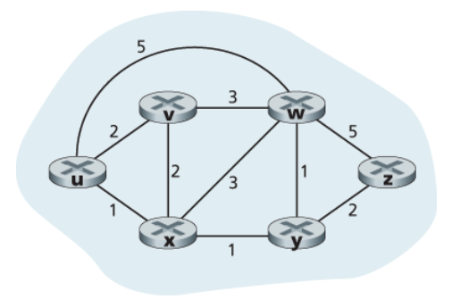

# Network Layer: Control Plane 

## 5.1 개요

control plane : source에서 destination의 경로를 결정.


### 라우터별 제어 (Per-router Control)**
각 라우터는 각자 라우팅 알고리즘을 실행함.
포워딩과 라우팅 기능이 모두 개별 라우터에 포함
이걸 라우터들끼리 상호작용해서 자신의 `Local forwarding table`을 만든다.

대표 프로토콜 : OSPF, BGP


### 논리적 중앙 집중형 제어 (SDN)**
라우터는 포워딩만 수행. 라우팅 계산은 컨트롤러가 담당.
컨트롤러가 각 라우터의 제어 에이전트(CA)와 통신해서 플로우 테이블 구성 및 관리
CA는 그냥 받아서 적용만 함. 계산에 참여 안 함.
라우터 하나로 포워딩, 로드 밸런싱, 방화벽, NAT (기존엔 별도의 장치를 통해서 구현됐음) 등 다양한 기능 처리 가능 (매치 플러스 액션)

---

## 5.2 라우팅 알고리즘

> src -> dest까지의 좋은 path를 찾자.
좋은 : 최소한의 비용, 가장 빠른, 적은 혼잡 (least cost, fastest, least congested)

### 그래프
네트워크를 그래프 G(N, E)로 표현.


* N : 노드(라우터)의 집합
* E : 에지(링크)의 집합. 각 에지는 비용(c(x,y))을 가짐. 
* 경로 비용 : 경로상 모든 에지 비용의 합

(최소 cost로 - 다익스트라. 일단 모든 목적지로 가는 최단 경로를 가지고 있어야 포워딩을 함.)

### 라우팅 알고리즘 분류


#### 중앙 집중형 vs 분산형
중앙 집중형(LS, Link State) : 네트워크 전체 정보를 가지고 최소 비용 경로 계산. 모든 링크 비용을 알고 계산.
분산형(DV, Distance Vector) : 라우터는 자신에게 직접 연결된 링크 비용 정보만 가지고 시작. 이웃과 반복적(ierative process)으로 정보를 교환하며 점차 최소 비용 경로 계산.
#### 정적 vs 동적
정적 : 경로가 아주 느리게 변함. 사람이 직접 수정.
동적 : 트래픽/토폴로지 변화에 자동 대응. 빠른 대응 가능하지만 루프나 진동 문제에 취약. 

```
(토폴로지 : 컴퓨터 네트워크의 구성 요소(노드, 링크)들이 물리적 또는 논리적으로 배치된 형태와 연결 방식)

토폴로지 : 네트워크가 실제로 어떻게 연결되어 있는지를 나타내는 구조. 라우터가 몇 개 있고, 어떤 라우터끼리 연결되어 있고, 링크 비용이 얼마인지 같은 정보.
결국 토폴로지를 그래프로 표현하는 거. 토폴로지가 변한다는 건 라우터가 추가/제거되거나 링크가 끊기거나 하는 식으로 네트워크 연결 구조 자체가 바뀐다는 뜻.
```

#### 부하 민감 vs 부하 비민감
부하 민감 : 링크 혼잡 수준에 따라 비용이 동적으로 변함. 혼잡한 링크를 우회하는 경향.
부하 비민감 : 오늘날 인터넷 라우팅(RIP, OSPF, BGP)이 사용하는 방식. 링크 비용이 현재 혼잡을 반영하지 않음.

---

### 5.2.1 링크 상태(LS) 알고리즘
> 네트워크 전체 토폴로지와 링크 비용을 알고 최소 비용 경로 계산

라우팅 알고리즘 하기 전에 모든 라우터들은 네트워크 상황을 알고 있고 전부 같은 정보를 갖고 있다. 

→ 각 노드가 자신과 직접 연결된 링크 정보를 담은 링크 상태 패킷을 네트워크 전체에 **브로드캐스트**해서 전체 정보를 공유함.

#### 다익스트라 알고리즘

하나의 출발지 노드에서 다른 모든 노드까지의 최소 비용 경로를 계산.
알고리즘의 k번째 반복 이후에는 k개의 목적지 노드에 대해 최소 비용 경로가 알려짐.

계산 복잡도 : 최악의 경우 O(n²). n은 노드 수.

기호 정의
* D(v) : 현재 시점에서 출발지 → v까지의 최소 비용 경로 비용
* p(v) : 출발지 → v까지 최소 비용 경로에서 v의 직전 노드
* N' : 최소 비용 경로가 확정된 노드의 집합

동작 방식
1. 초기화 : 출발지와 직접 연결된 노드 → 실제 비용 설정. 나머지 → 무한대(∞).
2. 반복 (모든 노드가 확정될 때까지): 
    * N'에 없는 노드 중 D(v)가 가장 작은 노드를 N'에 추가
    * 추가된 노드의 이웃들 D값 갱신




#### 포워딩테이블 


노드 u에대한 포워드 테이블을 얻을 수 있다. (다음 홉의 정보를 알 수 있음.)


#### 진동(Oscillation) 문제


링크 비용이 트래픽 양에 따라 변하는 경우, 라우터들이 최소 비용 경로를 계속 바꾸면서 경로가 진동하는 문제 발생.
("저쪽이 더 싸다" → 트래픽 몰림 → 비용 올라감 → "이쪽이 더 싸다" → 다시 몰림. 이게 반복되면서 경로가 계속 왔다 갔다 함.)

해결책 : 각 라우터가 알고리즘 실행 타이밍을 랜덤하게 결정. 라우터들이 동시에 같은 판단을 내리는 걸 막는 것. 타이밍이 엇갈리면 트래픽이 한꺼번에 몰리지 않아서 진동이 줄어듦. (동시에 라우팅 알고리즘을 실행하지 않도록 한다.)

### 5.2.2 거리 벡터(DV) 라우팅 알고리즘
> 오늘날 실제로 사용되는 알고리즘
전체 network에 브로드캐스팅하는거 없음. 그냥 내가 알고있는 정보를 내 이웃이랑만 공유함.
* 분산적 : 이웃으로부터 정보를 받아 계산하고 결과를 다시 이웃에게 배포
* 반복적 : 더 이상 정보 교환이 없을 때까지 반복
* 비동기적 : 모든 노드가 정확히 맞물려 동작할 필요 없음

#### 벨만-포드(Bellman-Ford) 


x에서 y까지 최소 비용 = min{ c(x,v) + Dv(y) } (v는 x의 모든 이웃)
x의 이웃 v를 거쳐서 y로 가는 비용 중 최솟값이 x→y 최소 비용.

**동작방식**
각 노드 x가 유지하는 정보
* 직접 연결된 이웃까지의 비용 c(x,v)
* 자신의 거리 벡터(distance vector) Dx : x에서 모든 노드까지의 비용 추정값
* 이웃들의 거리 벡터

이웃에게서 새로운 거리 벡터를 받으면 벨만-포드 식으로 자신의 거리 벡터 갱신. 변화가 생기면 이웃에게 전파. 더 이상 갱신이 없으면 알고리즘 정지.

링크 비용 변경 시 동작
비용 감소 시 : 빠르게 수렴(converge, 안정된 값에 도달). 두 번 반복만으로 안정화됨.
비용 증가 시 : **무한 계수 문제(count-to-infinity)** : 라우팅 루프 발생해서 비용이 무한히 올라가는 문제


예) y-x 링크 비용이 4 → 60으로 증가할 때
* y는 z를 통해 x로 가는 경로(비용 6)를 최솟값으로 잘못 계산
* y와 z가 서로를 통해 x로 가는 라우팅 루프(routing loop) 발생
* 비용이 1씩 증가하면서 수렴할 때까지 무한히 반복

#### 포이즌 리버스 (Poisoned Reverse)
> 라우팅 루프를 방지하는 방법
z가 y를 통해 x로 가고 있다면, z는 y에게 "x까지의 거리가 무한대"라고 거짓 정보를 전달. y가 z를 통해 x로 가려는 시도를 차단.
단, 3개 이상의 노드를 포함한 루프는 포이즌 리버스로 해결 불가.


### LS vs DV 비교

#### 경로 계산
* LS : 전체 네트워크 정보 필요. 모든 노드와 통신.
* DV : 직접 연결된 이웃과만 통신. 이웃에게 모든 노드까지의 비용 추정값 전달.
#### 메시지 복잡도 
* LS : O(|N||E|)개의 메시지 필요. 링크 비용 변경 시 모든 노드에 전달.
* DV : 매 반복마다 이웃끼리만 교환. 최소 비용 경로에 변화가 있을 때만 전파.
#### 견고성
* LS : 한 노드의 계산 오류가 자신의 포워딩 테이블에만 영향. 어느 정도 분산 처리.
* DV : 한 노드의 잘못된 계산이 이웃을 통해 전체로 확산될 수 있음. 1997년 실제로 이 문제로 인터넷 일부가 여러 시간 단절된 사례 있음.

> 어떤 알고리즘이 더 낫다고 말할 수 없음. 실제로 두 알고리즘 모두 인터넷에서 사용됨.

---

# 5.3 인터넷에서의 AS 내부 라우팅: OSPF

---

## 1. AS가 필요한 이유

인터넷 전체 라우터가 하나의 라우팅 알고리즘을 공유하면 두 가지 문제가 생긴다.

**확장성 문제** : 라우터가 많아질수록 라우팅 정보 교환량, 계산량, 저장 공간이 폭발적으로 늘어남. 수억 개의 라우터가 서로의 정보를 전부 주고받는 건 현실적으로 불가능.

**관리 자율성 문제** : ISP나 기관 입장에서 자신의 네트워크를 직접 관리하고 싶고, 내부 구조를 외부에 공개하고 싶지 않음.

즉, 이 문제를 해결하기 위해 라우터들을 **자율 시스템(AS)** 단위로 나눠서 관리함.

---

## 2. 자율 시스템 (AS, Autonomous System)

동일한 관리 주체 아래에 있는 라우터들의 집합.

- 각 AS는 전 세계적으로 고유한 **AS 번호(ASN)** 로 식별
- 같은 AS 내부 라우터들은 동일한 라우팅 알고리즘 사용
- AS 내부에서 사용하는 라우팅 프로토콜 = **AS 내부 라우팅 프로토콜(intra-AS routing protocol)**

즉, AS는 인터넷을 관리 가능한 단위로 쪼갠 구조.

---

## 3. OSPF (Open Shortest Path First)

AS 내부 라우팅에 널리 사용되는 **링크 상태(LS) 알고리즘** 기반 프로토콜.

핵심 방식 두 가지.
- 링크 상태 정보를 AS 전체에 **플러딩(flooding)** 해서 모든 라우터가 전체 지도를 갖게 함
- 각 라우터가 **다익스트라 알고리즘**으로 자신 기준의 최단 경로를 계산

즉, OSPF를 쓰면 AS 내 모든 라우터가 전체 네트워크 구조를 알고 각자 최적 경로를 계산함.

---

## 4. OSPF 동작 방식

1. 각 라우터가 자신과 연결된 링크 상태 정보 생성
2. AS 내부 모든 라우터에게 전파
3. 모든 라우터가 전체 AS 토폴로지(연결 구조)를 갖게 됨
4. 각 라우터가 자신을 출발점으로 다익스트라 알고리즘 수행
5. 최단 경로 계산 후 라우팅 테이블 완성

링크 상태 정보는 **변경이 생길 때**와 **최소 30분마다 주기적으로** 전파됨.

OSPF 메시지는 TCP/UDP가 아닌 **IP 위에서 직접 동작**. 프로토콜 번호 **89**.

---

## 5. OSPF 링크 가중치

링크마다 비용(가중치)을 설정해서 라우터가 최단 경로를 계산하게 함.

보통은 링크 가중치를 정하면 OSPF가 그에 맞는 경로를 선택하지만, 반대로 원하는 경로가 있을 때 그 경로가 선택되도록 가중치를 역으로 조정하기도 함.

예)
- 모든 링크 비용 = 1 → 최소 홉(거치는 라우터 수) 라우팅
- 대역폭 낮은 링크 비용을 높게 → 해당 링크 사용 억제

즉, 링크 가중치는 단순한 숫자가 아니라 트래픽 흐름을 제어하는 수단.

---

## 6. OSPF 주요 기능

**보안** : 라우터 간 정보 교환 시 인증 가능. 신뢰할 수 있는 라우터만 OSPF에 참여하도록 제한.
- 단순 인증 : 패스워드를 평문으로 포함. 안전하지 않음.
- MD5 인증 : 공유 비밀키 기반. 더 안전함.

**복수 동일 비용 경로** : 목적지까지 비용이 같은 경로가 여러 개면 하나만 고르지 않고 여러 경로로 트래픽을 분산할 수 있음.

**멀티캐스트 지원** : MOSPF(Multicast OSPF)를 통해 특정 그룹에게만 전송하는 멀티캐스트 라우팅도 지원.

---

## 7. OSPF 계층 구조 (영역 분할)

AS 규모가 커지면 모든 라우터가 전체 링크 상태를 아는 게 부담. 이를 해결하기 위해 AS를 여러 **영역(area)** 으로 나눠서 관리함.

- 각 영역은 독립적으로 OSPF 알고리즘 수행
- 같은 영역 내 라우터들끼리만 링크 상태 정보 전파
- 영역 간 트래픽은 **영역 경계 라우터(area border router)** 가 처리
- **백본 영역(backbone area)** 이 AS 내 영역 간 트래픽을 라우팅

영역 간 라우팅 흐름 : 출발 영역 내부 라우팅 → 백본 영역 통과 → 목적지 영역 경계 라우터 → 최종 목적지

즉, OSPF 계층 구조를 쓰면 대규모 네트워크에서도 각 라우터가 처리해야 할 정보와 계산량을 줄일 수 있음.

---

> 면접 포인트

**AS가 뭔지**
동일한 관리 주체 아래에 있는 라우터들의 집합. 확장성과 관리 자율성 문제를 해결하기 위해 도입.

**OSPF가 뭔지**
AS 내부 라우팅에 사용되는 링크 상태 알고리즘 기반 프로토콜. 각 라우터가 전체 AS 토폴로지를 알고 다익스트라 알고리즘으로 최단 경로 계산.

**OSPF 계층 구조가 왜 필요한지**
AS 규모가 커지면 전체 링크 상태를 아는 게 부담. 영역으로 나누면 각 라우터가 처리해야 할 정보와 계산량이 줄어듦.

---

> 가볍게 봐도 되는 부분

OSPF 프로토콜 번호(89), MD5 인증 세부 내용, MOSPF 동작 원리는 면접에서 잘 안 나옴. AS, OSPF 개념, 동작 방식, 계층 구조 정도만 알면 충분.