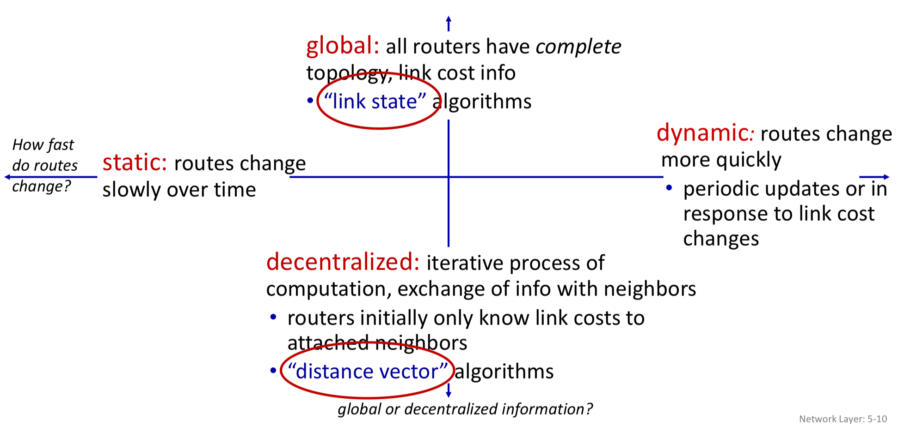
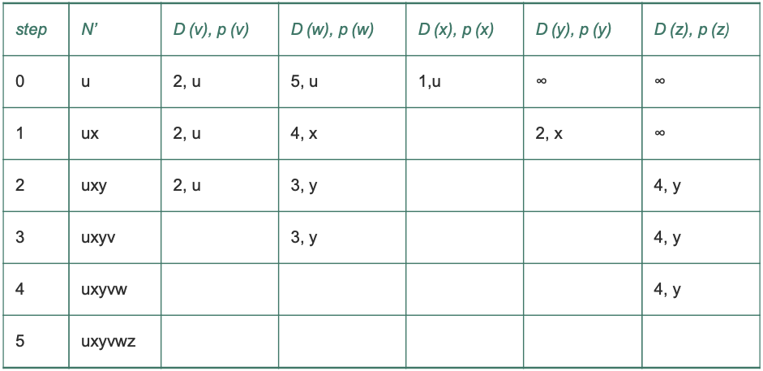
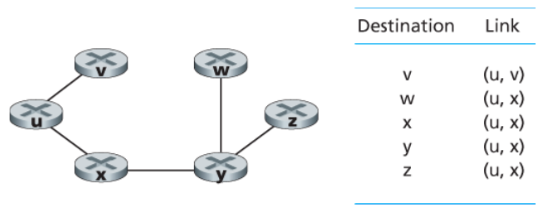
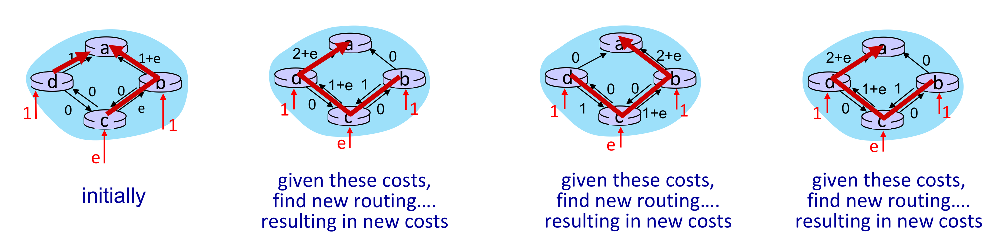
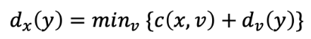
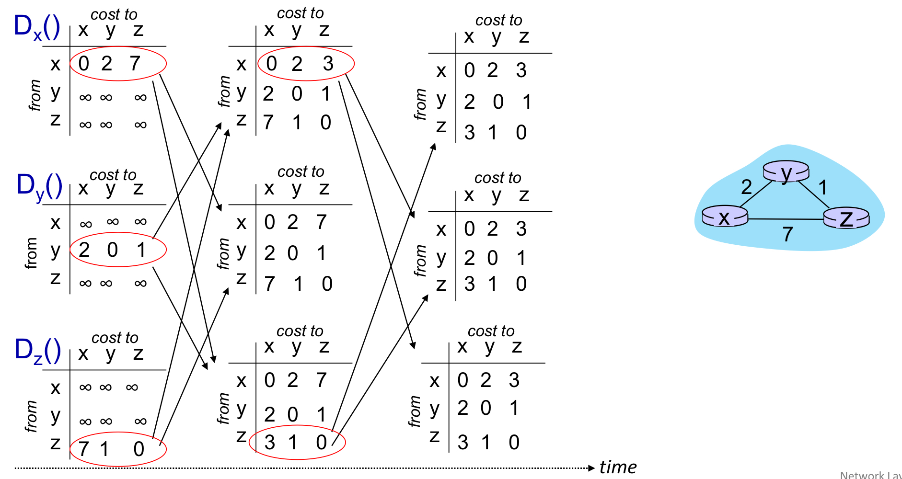

# Network Layer: Control Plane

## 5.1 개요

control plane : source에서 destination의 경로를 결정.


### 라우터별 제어 (Per-router Control)
각 라우터는 각자 라우팅 알고리즘을 실행함.
포워딩과 라우팅 기능이 모두 개별 라우터에 포함
이걸 라우터들끼리 상호작용해서 자신의 `Local forwarding table`을 만든다.

대표 프로토콜 : OSPF, BGP


### 논리적 중앙 집중형 제어 (SDN)
라우터는 포워딩만 수행. 라우팅 계산은 컨트롤러가 담당.
컨트롤러가 각 라우터의 제어 에이전트(CA)와 통신해서 플로우 테이블 구성 및 관리
CA는 그냥 받아서 적용만 함. 계산에 참여 안 함.
라우터 하나로 포워딩, 로드 밸런싱, 방화벽, NAT (기존엔 별도의 장치를 통해서 구현됐음) 등 다양한 기능 처리 가능 (매치 플러스 액션)

---

## 5.2 라우팅 알고리즘

> src -> dest까지의 좋은 path를 찾자.
좋은 : 최소한의 비용, 가장 빠른, 적은 혼잡 (least cost, fastest, least congested)

### 그래프
네트워크를 그래프 G(N, E)로 표현.


* N : 노드(라우터)의 집합
* E : 에지(링크)의 집합. 각 에지는 비용(c(x,y))을 가짐.
* 경로 비용 : 경로상 모든 에지 비용의 합

(최소 cost로 - 다익스트라. 일단 모든 목적지로 가는 최단 경로를 가지고 있어야 포워딩을 함.)

### 라우팅 알고리즘 분류



#### 중앙 집중형 vs 분산형
중앙 집중형(LS, Link State) : 네트워크 전체 정보를 가지고 최소 비용 경로 계산. 모든 링크 비용을 알고 계산.

분산형(DV, Distance Vector) : 라우터는 자신에게 직접 연결된 링크 비용 정보만 가지고 시작. 이웃과 반복적(iterative process)으로 정보를 교환하며 점차 최소 비용 경로 계산.

#### 정적 vs 동적
정적 : 경로가 아주 느리게 변함. 사람이 직접 수정.

동적 : 트래픽/토폴로지 변화에 자동 대응. 빠른 대응 가능하지만 루프나 진동 문제에 취약.

```
(토폴로지 : 컴퓨터 네트워크의 구성 요소(노드, 링크)들이 물리적 또는 논리적으로 배치된 형태와 연결 방식)

토폴로지 : 네트워크가 실제로 어떻게 연결되어 있는지를 나타내는 구조. 라우터가 몇 개 있고, 어떤 라우터끼리 연결되어 있고, 링크 비용이 얼마인지 같은 정보.
결국 토폴로지를 그래프로 표현하는 거. 토폴로지가 변한다는 건 라우터가 추가/제거되거나 링크가 끊기거나 하는 식으로 네트워크 연결 구조 자체가 바뀐다는 뜻.
```

#### 부하 민감 vs 부하 비민감

부하 민감 : 링크 혼잡 수준에 따라 비용이 동적으로 변함. 혼잡한 링크를 우회하는 경향.

부하 비민감 : 오늘날 인터넷 라우팅(RIP, OSPF, BGP)이 사용하는 방식. 링크 비용이 현재 혼잡을 반영하지 않음.

---

### 5.2.1 링크 상태(LS) 알고리즘
> 네트워크 전체 토폴로지와 링크 비용을 알고 최소 비용 경로 계산

라우팅 알고리즘 하기 전에 모든 라우터들은 네트워크 상황을 알고 있고 전부 같은 정보를 갖고 있다.

→ 각 노드가 자신과 직접 연결된 링크 정보를 담은 링크 상태 패킷을 네트워크 전체에 **브로드캐스트**해서 전체 정보를 공유함.

#### 다익스트라 알고리즘

하나의 출발지 노드에서 다른 모든 노드까지의 최소 비용 경로를 계산.

알고리즘의 k번째 반복 이후에는 k개의 목적지 노드에 대해 최소 비용 경로가 알려짐.

계산 복잡도 : 최악의 경우 O(n²). n은 노드 수.

기호 정의
* D(v) : 현재 시점에서 출발지 → v까지의 최소 비용 경로 비용
* p(v) : 출발지 → v까지 최소 비용 경로에서 v의 직전 노드
* N' : 최소 비용 경로가 확정된 노드의 집합

동작 방식
1. 초기화 : 출발지와 직접 연결된 노드 → 실제 비용 설정. 나머지 → 무한대(∞).
2. 반복 (모든 노드가 확정될 때까지):
    * N'에 없는 노드 중 D(v)가 가장 작은 노드를 N'에 추가
    * 추가된 노드의 이웃들 D값 갱신




#### 포워딩테이블


노드 u에대한 포워드 테이블을 얻을 수 있다. (다음 홉의 정보를 알 수 있음.)


#### 진동(Oscillation) 문제



링크 비용이 트래픽 양에 따라 변하는 경우, 라우터들이 최소 비용 경로를 계속 바꾸면서 경로가 진동하는 문제 발생.

("저쪽이 더 싸다" → 트래픽 몰림 → 비용 올라감 → "이쪽이 더 싸다" → 다시 몰림. 이게 반복되면서 경로가 계속 왔다 갔다 함.)

해결책 : 각 라우터가 알고리즘 실행 타이밍을 랜덤하게 결정. 라우터들이 동시에 같은 판단을 내리는 걸 막는 것. 타이밍이 엇갈리면 트래픽이 한꺼번에 몰리지 않아서 진동이 줄어듦. (동시에 라우팅 알고리즘을 실행하지 않도록 한다.)

### 5.2.2 거리 벡터(DV) 라우팅 알고리즘
> 오늘날 실제로 사용되는 알고리즘
전체 network에 브로드캐스팅하는거 없음. 그냥 내가 알고있는 정보를 내 이웃이랑만 공유함.
* 분산적 : 이웃으로부터 정보를 받아 계산하고 결과를 다시 이웃에게 배포
* 반복적 : 더 이상 정보 교환이 없을 때까지 반복
* 비동기적 : 모든 노드가 정확히 맞물려 동작할 필요 없음

#### 벨만-포드(Bellman-Ford)



x에서 y까지 최소 비용 = min{ c(x,v) + Dv(y) } (v는 x의 모든 이웃)
x의 이웃 v를 거쳐서 y로 가는 비용 중 최솟값이 x→y 최소 비용.

**동작방식**
각 노드 x가 유지하는 정보
* 직접 연결된 이웃까지의 비용 c(x,v)
* 자신의 거리 벡터(distance vector) Dx : x에서 모든 노드까지의 비용 추정값
* 이웃들의 거리 벡터

이웃에게서 새로운 거리 벡터를 받으면 벨만-포드 식으로 자신의 거리 벡터 갱신. 변화가 생기면 이웃에게 전파. 더 이상 갱신이 없으면 알고리즘 정지.

링크 비용 변경 시 동작
비용 감소 시 : 빠르게 수렴(converge, 안정된 값에 도달). 두 번 반복만으로 안정화됨.
비용 증가 시 : **무한 계수 문제(count-to-infinity)** : 라우팅 루프 발생해서 비용이 무한히 올라가는 문제



예) y-x 링크 비용이 4 → 60으로 증가할 때
* y는 z를 통해 x로 가는 경로(비용 6)를 최솟값으로 잘못 계산
* y와 z가 서로를 통해 x로 가는 라우팅 루프(routing loop) 발생
* 비용이 1씩 증가하면서 수렴할 때까지 무한히 반복

#### 포이즌 리버스 (Poisoned Reverse)
> 라우팅 루프를 방지하는 방법
z가 y를 통해 x로 가고 있다면, z는 y에게 "x까지의 거리가 무한대"라고 거짓 정보를 전달. y가 z를 통해 x로 가려는 시도를 차단.
단, 3개 이상의 노드를 포함한 루프는 포이즌 리버스로 해결 불가.


### LS vs DV 비교

#### 경로 계산
* LS : 전체 네트워크 정보 필요. 모든 노드와 통신.
* DV : 직접 연결된 이웃과만 통신. 이웃에게 모든 노드까지의 비용 추정값 전달.
#### 메시지 복잡도
* LS : O(|N||E|)개의 메시지 필요. 링크 비용 변경 시 모든 노드에 전달.
* DV : 매 반복마다 이웃끼리만 교환. 최소 비용 경로에 변화가 있을 때만 전파.
#### 견고성
* LS : 한 노드의 계산 오류가 자신의 포워딩 테이블에만 영향. 어느 정도 분산 처리.
* DV : 한 노드의 잘못된 계산이 이웃을 통해 전체로 확산될 수 있음. 1997년 실제로 이 문제로 인터넷 일부가 여러 시간 단절된 사례 있음.

> 어떤 알고리즘이 더 낫다고 말할 수 없음. 실제로 두 알고리즘 모두 인터넷에서 사용됨.

---

## 5.3 인터넷에서의 AS 내부 라우팅: OSPF

---

### 1. AS가 필요한 이유

인터넷 전체 라우터가 하나의 라우팅 알고리즘을 공유하면 두 가지 문제가 생긴다.

**확장성 문제** : 라우터가 많아질수록 라우팅 정보 교환량, 계산량, 저장 공간이 폭발적으로 늘어남. 수억 개의 라우터가 서로의 정보를 전부 주고받는 건 현실적으로 불가능.

**관리 자율성 문제** : ISP나 기관 입장에서 자신의 네트워크를 직접 관리하고 싶고, 내부 구조를 외부에 공개하고 싶지 않음.

즉, 이 문제를 해결하기 위해 라우터들을 **자율 시스템(AS)** 단위로 나눠서 관리함.

---

### 2. 자율 시스템 (AS, Autonomous System)

동일한 관리 주체 아래에 있는 라우터들의 집합.

- 각 AS는 전 세계적으로 고유한 **AS 번호(ASN)** 로 식별
- 같은 AS 내부 라우터들은 동일한 라우팅 알고리즘 사용
- AS 내부에서 사용하는 라우팅 프로토콜 = **AS 내부 라우팅 프로토콜(intra-AS routing protocol)**

즉, AS는 인터넷을 관리 가능한 단위로 쪼갠 구조.

---

### 3. OSPF (Open Shortest Path First)

AS 내부 라우팅에 널리 사용되는 **링크 상태(LS) 알고리즘** 기반 프로토콜.

핵심 방식 두 가지.
- 링크 상태 정보를 AS 전체에 **플러딩(flooding)** 해서 모든 라우터가 전체 지도를 갖게 함
- 각 라우터가 **다익스트라 알고리즘**으로 자신 기준의 최단 경로를 계산

즉, OSPF를 쓰면 AS 내 모든 라우터가 전체 네트워크 구조를 알고 각자 최적 경로를 계산함.

---

### 4. OSPF 동작 방식

1. 각 라우터가 자신과 연결된 링크 상태 정보 생성
2. AS 내부 모든 라우터에게 전파
3. 모든 라우터가 전체 AS 토폴로지(연결 구조)를 갖게 됨
4. 각 라우터가 자신을 출발점으로 다익스트라 알고리즘 수행
5. 최단 경로 계산 후 라우팅 테이블 완성

링크 상태 정보는 **변경이 생길 때**와 **최소 30분마다 주기적으로** 전파됨.

OSPF 메시지는 TCP/UDP가 아닌 **IP 위에서 직접 동작**. 프로토콜 번호 **89**.

---

### 5. OSPF 링크 가중치

링크마다 비용(가중치)을 설정해서 라우터가 최단 경로를 계산하게 함.

보통은 링크 가중치를 정하면 OSPF가 그에 맞는 경로를 선택하지만, 반대로 원하는 경로가 있을 때 그 경로가 선택되도록 가중치를 역으로 조정하기도 함.

예)
- 모든 링크 비용 = 1 → 최소 홉(거치는 라우터 수) 라우팅
- 대역폭 낮은 링크 비용을 높게 → 해당 링크 사용 억제

즉, 링크 가중치는 단순한 숫자가 아니라 트래픽 흐름을 제어하는 수단.

---

### 6. OSPF 주요 기능

**보안** : 라우터 간 정보 교환 시 인증 가능. 신뢰할 수 있는 라우터만 OSPF에 참여하도록 제한.
- 단순 인증 : 패스워드를 평문으로 포함. 안전하지 않음.
- MD5 인증 : 공유 비밀키 기반. 더 안전함.

**복수 동일 비용 경로** : 목적지까지 비용이 같은 경로가 여러 개면 하나만 고르지 않고 여러 경로로 트래픽을 분산할 수 있음.

**멀티캐스트 지원** : MOSPF(Multicast OSPF)를 통해 특정 그룹에게만 전송하는 멀티캐스트 라우팅도 지원.

---

### 7. OSPF 계층 구조 (영역 분할)

AS 규모가 커지면 모든 라우터가 전체 링크 상태를 아는 게 부담. 이를 해결하기 위해 AS를 여러 **영역(area)** 으로 나눠서 관리함.

- 각 영역은 독립적으로 OSPF 알고리즘 수행
- 같은 영역 내 라우터들끼리만 링크 상태 정보 전파
- 영역 간 트래픽은 **영역 경계 라우터(area border router)** 가 처리
- **백본 영역(backbone area)** 이 AS 내 영역 간 트래픽을 라우팅

영역 간 라우팅 흐름 : 출발 영역 내부 라우팅 → 백본 영역 통과 → 목적지 영역 경계 라우터 → 최종 목적지

즉, OSPF 계층 구조를 쓰면 대규모 네트워크에서도 각 라우터가 처리해야 할 정보와 계산량을 줄일 수 있음.

---

> 면접 포인트

**AS가 뭔지**
동일한 관리 주체 아래에 있는 라우터들의 집합. 확장성과 관리 자율성 문제를 해결하기 위해 도입.

**OSPF가 뭔지**
AS 내부 라우팅에 사용되는 링크 상태 알고리즘 기반 프로토콜. 각 라우터가 전체 AS 토폴로지를 알고 다익스트라 알고리즘으로 최단 경로 계산.

**OSPF 계층 구조가 왜 필요한지**
AS 규모가 커지면 전체 링크 상태를 아는 게 부담. 영역으로 나누면 각 라우터가 처리해야 할 정보와 계산량이 줄어듦.

---

> 가볍게 봐도 되는 부분

OSPF 프로토콜 번호(89), MD5 인증 세부 내용, MOSPF 동작 원리는 면접에서 잘 안 나옴. AS, OSPF 개념, 동작 방식, 계층 구조 정도만 알면 충분.

## 5.4 인터넷 서비스 제공업자(ISP) 간의 라우팅: BGP

---

### 1. BGP가 필요한 이유

OSPF 같은 AS 내부 라우팅 프로토콜은 하나의 AS 안에서만 동작함. 한국의 스마트폰이 미국 데이터센터로 패킷을 보내려면 여러 AS를 통과해야 하는데, 이때 AS 간 라우팅 프로토콜이 필요함.

인터넷의 모든 AS는 **BGP(Border Gateway Protocol)** 를 사용. 거리 벡터(DV) 알고리즘과 같은 계열의 분산형 비동기식 프로토콜.

---

### 2. BGP의 역할

BGP는 각 라우터에게 두 가지를 제공함.

- 이웃 AS를 통해 도달 가능한 **서브넷 프리픽스 정보** 획득. 각 서브넷이 자신의 존재를 인터넷 전체에 알릴 수 있게 함.
- 여러 경로 중 **가장 좋은 경로** 결정.

포워딩 테이블은 `(주소 프리픽스, 인터페이스 번호)` 형태로 저장됨.

---

### 3. BGP 연결 종류

BGP에서 라우터끼리는 포트 번호 **179**의 반영구적 TCP 연결을 통해 라우팅 정보를 교환함. 메시지를 보내는 주체는 AS가 아니라 **라우터**.

**게이트웨이 라우터** : AS 경계에 위치. 다른 AS의 라우터와 직접 연결됨.

**내부 라우터** : AS 내부에서만 연결됨.

**eBGP(external BGP)** : 서로 다른 AS의 게이트웨이 라우터 간 연결.

**iBGP(internal BGP)** : 같은 AS 내 라우터 간 연결. 물리적 링크와 항상 일치하지는 않음.

---

### 4. BGP 경로 정보 전파 과정

"x라는 서브넷이 존재한다"는 정보를 인터넷 전체에 퍼뜨리는 과정. eBGP로 AS 간에 전달하고, iBGP로 AS 내부에 전달하는 방식으로 단계적으로 퍼져나감.

AS3에 서브넷 x가 있고, AS1과 AS2가 x의 존재를 알게 되는 과정.

1. AS3 게이트웨이 → AS2 게이트웨이에게 eBGP로 `AS3 x` 전송 ("x가 AS3에 있다")
2. AS2 게이트웨이 → AS2 내부 모든 라우터에게 iBGP로 `AS3 x` 전달
3. AS2 게이트웨이 → AS1 게이트웨이에게 eBGP로 `AS2 AS3 x` 전송 ("x로 가려면 AS2를 거쳐 AS3으로 가면 된다")
4. AS1 게이트웨이 → AS1 내부 모든 라우터에게 iBGP로 `AS2 AS3 x` 전달

경로가 여러 개인 경우 라우터는 여러 AS 경로를 알게 되고 그 중 최적 경로를 선택.

---

### 5. BGP 주요 속성

**AS-PATH** : 알림 메시지가 통과한 AS들의 목록. 자신의 AS가 이미 포함된 알림 메시지는 버려서 루프를 방지.

**NEXT-HOP** : AS-PATH가 시작되는 라우터 인터페이스의 IP 주소. "x로 가려면 어느 라우터로 먼저 가야 하는가"를 나타냄.

예) AS1 입장에서 x로 가는 경로가 두 개 있을 때
- `AS2 AS3 x` 경로 → NEXT-HOP = 라우터 2a의 IP 주소
- `AS3 x` 경로 → NEXT-HOP = 라우터 3d의 IP 주소

---

### 6. 경로 선택 방법

#### 뜨거운 감자 라우팅 (Hot Potato Routing)

자기 AS 바깥의 비용은 신경 쓰지 않고, NEXT-HOP 라우터까지의 AS 내부 비용이 가장 적은 경로를 선택하는 방식.

쉽게 말하면 "일단 내 AS 밖으로 빨리 내보내자"는 이기적인 알고리즘. 같은 AS 내 두 라우터가 같은 목적지에 대해 서로 다른 경로를 선택할 수도 있음.

포워딩 테이블에 AS 외부 목적지를 추가할 때 BGP(AS 간)와 OSPF(AS 내부) **둘 다** 사용됨.

#### 경로 선택 알고리즘 (우선순위 순서)

하나의 경로가 남을 때까지 아래 순서로 제거 규칙 적용.

1. **지역 선호도(local preference)** 가 높은 경로 선택
2. **AS-PATH가 짧은** 경로 선택
3. **뜨거운 감자 라우팅** 적용 (NEXT-HOP까지 내부 비용 최소)
4. **BGP 식별자** 기준으로 선택

규칙 2가 규칙 3보다 먼저 적용되기 때문에, 내부 비용이 더 들더라도 AS-PATH가 짧은 경로가 선택될 수 있음. 이 경우 종단 간 지연이 줄어드는 효과가 있어서 더이상 순수하게 이기적인 알고리즘이 아님.

---

### 7. 라우팅 정책

AS 라우팅 정책은 최단 경로나 뜨거운 감자 라우팅보다 우선시됨.

**접속 ISP(W, X, Y)** : 들어오는 트래픽은 자신이 목적지, 나가는 트래픽은 자신이 출발지여야 함. 다른 AS 간 트래픽을 중계하지 않음.

예) X는 B와 C 사이의 트래픽을 중계하지 않기 위해, B와 C에게 자기 자신 외에는 다른 목적지로 가는 경로가 없다고 알림. B 입장에선 X가 Y로의 경로를 갖고 있는지 알 수 없으니 X를 통해 트래픽을 보내지 않게 됨.

**백본 제공자(A, B, C)** : 자신의 고객 네트워크를 출발지/목적지로 하는 트래픽만 전달하는 게 원칙. 다른 백본 ISP 간 트래픽을 무료로 중계하지 않음. 공식 표준은 없고 ISP 간 개별 협상으로 정해짐.

---

### 8. AS 내부 vs AS 간 라우팅이 다른 이유

**정책** : AS 간은 어떤 AS의 트래픽을 통과시킬지 결정권이 중요. AS 내부는 같은 관리 통제하에 있어서 정책 문제가 덜 중요.

**확장성** : AS 간은 수많은 네트워크를 처리해야 해서 확장성이 매우 중요. AS 내부는 커지면 두 개로 분리하면 됨.

**성능** : AS 간은 정책 중심이라 성능은 부수적. AS 내부는 경로 성능에 더 집중.

---

> 면접 포인트

**BGP가 뭔지**
AS 간 라우팅 프로토콜. 전 세계 모든 AS가 사용. 각 AS에 있는 서브넷 정보를 전파하고 최적 경로를 결정함.

**eBGP vs iBGP 차이**
eBGP는 서로 다른 AS의 라우터 간 연결, iBGP는 같은 AS 내 라우터 간 연결. 둘 다 TCP 포트 179 사용.

**뜨거운 감자 라우팅이 뭔지**
자기 AS 내부 비용만 최소화해서 가능한 빨리 패킷을 자기 AS 밖으로 내보내는 방식. AS 외부 비용은 신경 안 씀. 이기적인 알고리즘.

**AS 내부 vs AS 간 라우팅이 왜 다른지**
AS 간은 정책과 확장성이 중요. AS 내부는 성능이 중요. 목적 자체가 다르기 때문.

---

---

## 5.5 소프트웨어 정의 네트워크(SDN) 제어 평면

---

### 1. SDN이란?

SDN(Software Defined Networking)은 **데이터 평면**과 **제어 평면**을 분리해서, 네트워크를 소프트웨어적으로 제어할 수 있게 만든 구조.

기존 네트워크에서는 라우터나 스위치가 패킷을 어디로 보낼지 직접 판단하고, 실제 패킷 전달도 함께 수행했다.  
반면 SDN에서는 스위치는 패킷 전달만 수행하고, 경로 계산이나 정책 결정은 별도의 **SDN 컨트롤러**가 담당한다.

즉, 스위치는 단순히 컨트롤러가 내려준 규칙대로 패킷을 처리하고, 컨트롤러는 네트워크 전체 상태를 보고 플로우 테이블을 계산하고 관리함.

쉽게 말하면 다음과 같다.

- 기존 네트워크 : 각 라우터가 직접 판단하고 직접 전달
- SDN : 컨트롤러가 전체 상황을 보고 판단, 스위치는 지시에 따라 전달

예)
택배 배송으로 비유하면, 기존 방식은 각 택배 기사가 스스로 길을 판단하는 방식이고, SDN 방식은 중앙 관제센터가 전체 도로 상황을 보고 각 기사에게 경로를 지시하는 방식.

여기서 **중앙 관제센터 = SDN 컨트롤러**, **택배 기사 = 스위치**라고 볼 수 있음.

---

### 2. SDN 구조의 주요 특징

#### 2.1 플로우 기반 포워딩

전통적인 라우터는 주로 **목적지 IP 주소**를 기준으로 패킷을 전달한다.

하지만 SDN에서는 목적지 IP뿐만 아니라 트랜스포트 계층, 네트워크 계층, 링크 계층 헤더의 다양한 값을 기준으로 패킷을 처리할 수 있다.

예)
- 출발지 IP 주소
- 목적지 IP 주소
- 출발지 MAC 주소
- 목적지 MAC 주소
- TCP/UDP 포트 번호
- 프로토콜 종류

즉, SDN은 단순히 목적지만 보는 것이 아니라 여러 조건을 조합해 **플로우 단위**로 패킷을 처리한다.

예)
회사 네트워크에서 다음과 같은 정책을 만들 수 있음.

- 개발팀 PC에서 GitHub로 가는 트래픽은 허용
- 외부에서 사내 DB 서버로 들어오는 트래픽은 차단
- 화상회의 트래픽은 우선순위를 높임
- 특정 포트로 들어오는 패킷은 보안 장비로 전달

> 플로우 기반 포워딩 : 패킷을 목적지 IP만 보고 처리하는 것이 아니라, 출발지/목적지 주소, 포트 번호, 프로토콜 등 다양한 헤더 정보를 기준으로 매칭하고 그에 맞는 액션을 수행하는 방식.

---

#### 2.2 데이터 평면과 제어 평면의 분리

SDN의 핵심 특징은 **데이터 평면**과 **제어 평면**을 분리하는 것이다.

##### 데이터 평면

실제로 패킷을 전달하는 영역.  
SDN에서는 스위치들이 데이터 평면을 구성한다.

스위치는 컨트롤러가 설치한 플로우 테이블을 보고 다음과 같은 동작을 수행한다.

- 특정 포트로 패킷 전달
- 패킷 폐기
- 패킷을 컨트롤러에게 전달
- 패킷 헤더 수정

##### 제어 평면

네트워크의 동작 방식을 결정하는 영역.  
SDN에서는 제어 평면이 스위치 내부가 아니라 외부의 **SDN 컨트롤러**에 존재한다.

컨트롤러는 네트워크 전체 상태를 파악하고, 각 스위치의 플로우 테이블을 계산하고 관리한다.

쉽게 정리하면,

- 스위치 = 시키는 대로 움직이는 직원
- SDN 컨트롤러 = 전체 상황을 보고 지시하는 관리자
- 플로우 테이블 = 직원이 따라야 하는 업무 지시서

---

#### 2.3 네트워크 제어 기능이 스위치 외부에 존재

SDN에서는 네트워크 제어 기능이 스위치 내부가 아니라, 별도의 서버에서 실행되는 **SDN 컨트롤러**에 존재한다.

SDN 컨트롤러는 다음 역할을 수행한다.

- 네트워크 상태 정보 유지
- 스위치, 링크, 호스트 상태 관리
- 플로우 테이블 계산
- 플로우 테이블 설치 및 수정
- 네트워크 제어 애플리케이션에 정보 제공

컨트롤러는 그림상 하나의 중앙 서버처럼 보일 수 있지만, 실제로는 여러 서버에 분산되어 구현될 수 있다.

> SDN 컨트롤러는 **논리적으로는 중앙 집중형**이지만, **물리적으로는 분산 구조**일 수 있다.

예)
카카오톡은 사용자 입장에서는 하나의 서비스처럼 보이지만, 실제 내부에서는 여러 서버가 나누어 동작한다.  
SDN 컨트롤러도 외부에서는 하나의 컨트롤러처럼 보이지만, 실제로는 장애 허용성과 확장성을 위해 여러 서버에 분산될 수 있음.

---

#### 2.4 프로그램 가능한 네트워크

SDN에서는 제어 평면에서 수행되는 네트워크 제어 애플리케이션을 통해 네트워크를 프로그램할 수 있다.

네트워크 제어 애플리케이션은 SDN 컨트롤러가 제공하는 API를 이용하여 네트워크 장치들의 데이터 평면을 제어한다.

예)
라우팅 애플리케이션이 컨트롤러가 가진 링크 상태 정보를 바탕으로 다익스트라 알고리즘을 수행하고, 그 결과에 따라 스위치의 플로우 테이블을 수정할 수 있음.

즉, 네트워크 장비를 직접 하나하나 설정하지 않고, 소프트웨어 애플리케이션을 통해 네트워크 동작을 제어할 수 있다.

---

### 3. SDN 제어 평면

SDN 제어 평면은 크게 두 가지로 구성된다.

- SDN 컨트롤러
- SDN 네트워크 제어 애플리케이션

---

### 4. SDN 컨트롤러

SDN 컨트롤러는 SDN 구조에서 핵심 역할을 하는 소프트웨어이다.

주요 역할
- 네트워크 상태 정보 수집
- 스위치, 링크, 호스트 상태 관리
- 플로우 테이블 관리
- 네트워크 제어 애플리케이션에 정보 제공
- 스위치와 통신하여 실제 네트워크 장비 제어

SDN 컨트롤러는 기능적으로 세 계층으로 나눌 수 있다.

1. 통신 계층
2. 네트워크 전역 상태 관리 계층
3. 네트워크 제어 애플리케이션 계층과의 인터페이스

---

#### 4.1 통신 계층

통신 계층은 **SDN 컨트롤러와 네트워크 장치 사이의 통신**을 담당한다.

컨트롤러가 스위치를 제어하려면 스위치에게 명령을 내려야 한다.

예)
- 플로우 테이블 항목 추가
- 플로우 테이블 항목 삭제
- 포트 상태 조회
- 특정 패킷 전송 지시

반대로 스위치도 컨트롤러에게 정보를 알려야 한다.

예)
- 포트 상태 변화
- 링크 단절
- 처리할 규칙이 없는 패킷 발생

이처럼 컨트롤러와 스위치 사이의 통신을 담당하는 인터페이스를 **사우스바운드 인터페이스**라고 한다.

대표적인 사우스바운드 프로토콜은 **OpenFlow**이다.

---

#### 4.2 네트워크 전역 상태 관리 계층

SDN 컨트롤러가 올바른 제어 결정을 내리려면 네트워크 전체 상태를 알고 있어야 한다.

컨트롤러가 관리하는 정보는 다음과 같다.

- 호스트 상태
- 링크 상태
- 스위치 상태
- 포트 상태
- 플로우 테이블 정보
- 통계 정보
- 카운터 값

이 정보들을 바탕으로 컨트롤러는 어떤 경로가 적절한지, 어떤 스위치의 플로우 테이블을 바꿔야 하는지 결정한다.

예)
s1과 s2 사이의 링크가 끊어졌다면, 컨트롤러는 이 정보를 네트워크 상태에 반영해야 한다.  
그래야 라우팅 애플리케이션이 끊어진 링크를 제외하고 새로운 경로를 계산할 수 있음.

---

#### 4.3 네트워크 제어 애플리케이션 계층과의 인터페이스

SDN 컨트롤러는 네트워크 제어 애플리케이션과도 통신한다.

이때 사용하는 인터페이스를 **노스바운드 인터페이스**라고 한다.

네트워크 제어 애플리케이션은 노스바운드 인터페이스를 통해 다음 작업을 수행한다.

- 컨트롤러가 가진 네트워크 상태 정보 조회
- 플로우 테이블 정보 조회
- 새로운 네트워크 정책 요청
- 경로 계산 결과 반영 요청

네트워크 제어 애플리케이션 예시
- 라우팅 애플리케이션
- 방화벽 애플리케이션
- 로드 밸런싱 애플리케이션
- 접근 제어 애플리케이션

---

### 5. 노스바운드와 사우스바운드 인터페이스

SDN 컨트롤러를 가운데에 두고 생각하면 이해하기 쉽다.

```text
네트워크 제어 애플리케이션
        ↑
   노스바운드 인터페이스
        ↑
   SDN 컨트롤러
        ↓
  사우스바운드 인터페이스
        ↓
      스위치
```

#### 노스바운드 인터페이스

SDN 컨트롤러와 네트워크 제어 애플리케이션 사이의 인터페이스.

예)
라우팅 애플리케이션이 컨트롤러에게 다음과 같이 요청할 수 있음.

- 현재 네트워크 상태를 알려줘
- s1에서 s2로 가는 최단 경로를 계산하고 싶어
- 이 정책에 맞게 플로우 테이블을 수정해줘

#### 사우스바운드 인터페이스

SDN 컨트롤러와 스위치 같은 네트워크 장치 사이의 인터페이스.

예)
컨트롤러가 스위치에게 다음과 같이 명령할 수 있음.

- s1아, s2로 가는 패킷은 s4로 보내
- s4야, s1에서 온 패킷을 s2 방향으로 전달해
- 이 플로우 테이블 엔트리를 추가해
- 이 포트의 상태를 알려줘

대표적인 사우스바운드 프로토콜이 **OpenFlow**이다.

---

### 6. OpenFlow 프로토콜

OpenFlow는 SDN 컨트롤러와 SDN으로 제어되는 스위치 사이에서 동작하는 대표적인 프로토콜이다.

OpenFlow는 TCP 위에서 동작하며, 기본 포트 번호는 **6653**이다.

OpenFlow 메시지는 크게 두 방향으로 나눌 수 있다.

1. 컨트롤러 → 스위치
2. 스위치 → 컨트롤러

---

#### 6.1 컨트롤러에서 스위치로 보내는 메시지

**설정 메시지**  
컨트롤러가 스위치의 설정 파라미터를 조회하거나 설정할 때 사용.

**상태 수정 메시지**  
스위치의 플로우 테이블 엔트리를 추가, 삭제, 수정하거나 스위치 포트의 특성을 설정할 때 사용.

**상태 읽기 메시지**  
스위치의 플로우 테이블, 포트, 통계 정보, 카운터 값을 읽을 때 사용.

**패킷 전송 메시지**  
컨트롤러가 특정 패킷을 스위치의 특정 포트로 내보내도록 지시할 때 사용.

---

#### 6.2 스위치에서 컨트롤러로 보내는 메시지

**플로우 제거 메시지**  
플로우 테이블 엔트리가 만료되었거나 삭제되었음을 컨트롤러에게 알리는 메시지.

**포트 상태 메시지**  
스위치의 포트 상태 변화가 발생했을 때 컨트롤러에게 알리는 메시지.

**패킷 전달 메시지**  
스위치가 처리할 수 없는 패킷을 컨트롤러에게 보낼 때 사용.

예)
스위치에 패킷이 들어왔는데, 플로우 테이블에 일치하는 규칙이 없으면 스위치는 컨트롤러에게 패킷을 보낸다.

> 이 패킷은 어떤 규칙에도 일치하지 않습니다. 어떻게 처리해야 하나요?

---

### 7. 데이터 평면과 제어 평면의 상호작용 예시

예시 상황
> 스위치 s1과 s2 사이의 링크가 끊어졌다.

기존 경로는 다음과 같다고 하자.

```text
s1 → s2
```

그런데 s1과 s2 사이의 링크가 끊어지면 이 경로를 더 이상 사용할 수 없다.

이때 SDN에서는 다음 순서로 동작한다.

1. **장애 감지**  
   s1이 s2와의 링크 단절을 감지한다.

2. **컨트롤러에게 알림**  
   s1은 OpenFlow의 포트 상태 메시지를 사용해 SDN 컨트롤러에게 링크 상태 변화를 알린다.

3. **네트워크 상태 갱신**  
   SDN 컨트롤러는 링크 상태 관리자를 통해 네트워크 상태 정보를 갱신한다.

4. **라우팅 애플리케이션 알림**  
   라우팅 애플리케이션은 링크 상태 변화 알림을 받는다.

5. **새로운 경로 계산**  
   라우팅 애플리케이션은 갱신된 링크 상태 정보를 바탕으로 새로운 최단 경로를 계산한다.

6. **플로우 테이블 갱신**  
   컨트롤러는 OpenFlow를 사용하여 영향을 받는 스위치들의 플로우 테이블을 수정한다.

예를 들어 새로운 경로가 다음과 같이 계산될 수 있다.

```text
기존 경로: s1 → s2
새 경로: s1 → s4 → s2
```

컨트롤러는 각 스위치에게 다음과 같이 지시한다.

- s1 : s2로 가는 패킷은 이제 s4로 보내라
- s4 : s1에서 온 패킷을 s2 방향으로 전달해라
- s2 : s1로부터 오는 패킷은 s4를 통해 받는다

즉, SDN에서는 링크 장애가 발생했을 때 스위치들이 각자 복잡하게 판단하는 것이 아니라, 컨트롤러가 전체 네트워크 상태를 보고 새로운 경로를 계산한 뒤 필요한 스위치들의 규칙을 바꿔준다.

---

### 8. SDN의 과거와 미래

#### 8.1 SDN의 과거

SDN이 최근에 많은 관심을 받았지만, 데이터 평면과 제어 평면을 분리하려는 아이디어는 오래전부터 있었다.

대표적인 예로 **Ethane 프로젝트**가 있다.

Ethane 프로젝트는 다음과 같은 개념을 제시했다.

- 매치 플러스 액션 기반 플로우 테이블
- 중앙 집중식 컨트롤러
- 플로우 테이블에 일치하지 않는 패킷을 컨트롤러로 전달하는 방식

이후 Ethane은 OpenFlow 프로젝트로 발전했다.

---

#### 8.2 SDN의 미래

SDN은 기존의 복잡한 전용 네트워크 장비 중심 구조에서 벗어나, 단순한 상용 하드웨어와 정교한 소프트웨어 제어 평면을 활용하는 방향으로 발전하고 있다.

또한 SDN 개념은 **NFV(Network Functions Virtualization)** 로 확장되고 있다.

NFV는 방화벽, 로드 밸런서, 캐싱 서버 같은 네트워크 기능을 전용 하드웨어가 아니라 일반 서버 위의 소프트웨어로 구현하려는 기술이다.

예)
- 기존 : 전용 방화벽 장비 필요
- NFV : 일반 서버 + 방화벽 소프트웨어

즉, SDN과 NFV는 모두 네트워크를 더 유연하고 소프트웨어 중심으로 바꾸는 흐름이라고 볼 수 있다.

---

### 9. SDN 컨트롤러 사례

### 9.1 OpenDaylight 컨트롤러

OpenDaylight, ODL은 오픈소스 SDN 컨트롤러이다.

ODL의 중요한 구성 요소 중 하나는 **SAL(Service Abstraction Layer)** 이다.

SAL은 서비스 추상 계층이라는 뜻이다.  
컨트롤러 내부 구성 요소와 애플리케이션이 서로 서비스를 호출하거나 이벤트 알림을 받을 수 있도록 도와준다.

또한 OpenFlow, SNMP, NETCONF 같은 다양한 프로토콜에 대해 균일한 추상 인터페이스를 제공한다.

쉽게 말하면 SAL은 다양한 프로토콜을 하나의 공통된 방식으로 다룰 수 있게 해주는 중간 계층이다.

예)
각 장비가 서로 다른 프로토콜을 사용한다고 생각해보자.

- 장비 A : OpenFlow 사용
- 장비 B : SNMP 사용
- 장비 C : NETCONF 사용

이때 애플리케이션이 각 프로토콜을 전부 직접 다루면 복잡하다.  
SAL은 이런 차이를 숨기고, 애플리케이션이 더 일관된 방식으로 장비를 제어할 수 있게 해준다.

---

### 9.2 ONOS 컨트롤러

ONOS 역시 오픈소스 SDN 컨트롤러이다.

ONOS는 크게 세 계층으로 나눌 수 있다.

1. 노스바운드 추상화 프로토콜
2. 분산 코어
3. 사우스바운드 추상화와 프로토콜

ONOS의 특징 중 하나는 **Intent Framework**이다.

Intent Framework는 애플리케이션이 구체적인 구현 방식을 알 필요 없이 높은 수준의 요구사항을 표현할 수 있게 해준다.

예)
애플리케이션이 다음과 같이 요청할 수 있다.

> 호스트 A와 호스트 B를 연결해줘.

애플리케이션은 실제로 어떤 스위치를 거쳐야 하는지, 어떤 플로우 테이블을 수정해야 하는지까지 직접 알 필요가 없다.  
그 세부 구현은 ONOS 컨트롤러가 처리한다.

즉, Intent Framework는 “어떻게 할지”보다 “무엇을 원하는지”를 표현하게 해주는 방식이다.

---

### 10. 핵심 키워드 정리

| 키워드 | 의미 |
|---|---|
| SDN | 소프트웨어로 네트워크를 제어하는 구조 |
| 데이터 평면 | 실제 패킷 전달을 담당하는 영역 |
| 제어 평면 | 경로 결정, 정책 결정, 플로우 테이블 관리를 담당하는 영역 |
| SDN 컨트롤러 | 네트워크 전체 상태를 관리하고 스위치를 제어하는 소프트웨어 |
| 플로우 | 특정 조건을 만족하는 패킷들의 흐름 |
| 플로우 테이블 | 패킷 조건과 처리 방법을 저장한 규칙표 |
| Match | 패킷이 어떤 조건에 맞는지 검사하는 부분 |
| Action | 조건에 맞는 패킷을 어떻게 처리할지 정하는 부분 |
| OpenFlow | SDN 컨트롤러와 스위치 사이의 대표 프로토콜 |
| 노스바운드 인터페이스 | 컨트롤러와 네트워크 제어 애플리케이션 사이의 인터페이스 |
| 사우스바운드 인터페이스 | 컨트롤러와 스위치 사이의 인터페이스 |
| 논리적 중앙 집중 | 외부에서는 하나의 컨트롤러처럼 보이지만 실제로는 분산 구현 가능 |
| NFV | 네트워크 기능을 전용 장비가 아닌 소프트웨어로 구현하는 기술 |
| ODL | OpenDaylight, 오픈소스 SDN 컨트롤러 |
| ONOS | 오픈소스 SDN 컨트롤러 |
| Intent Framework | 원하는 네트워크 상태를 높은 수준으로 표현하는 방식 |

---

> 면접 포인트

**SDN이 뭔지**  
데이터 평면과 제어 평면을 분리해서, 스위치는 패킷 전달만 수행하고 SDN 컨트롤러가 경로 계산과 정책 결정을 담당하는 구조.

**데이터 평면과 제어 평면의 차이**  
데이터 평면은 실제 패킷 전달, 제어 평면은 경로 결정과 플로우 테이블 관리를 담당.

**OpenFlow가 뭔지**  
SDN 컨트롤러와 스위치 사이에서 사용되는 대표적인 사우스바운드 프로토콜. 플로우 테이블 수정, 상태 조회, 패킷 전달 등에 사용됨.

**노스바운드 vs 사우스바운드**  
노스바운드는 컨트롤러와 네트워크 제어 애플리케이션 사이, 사우스바운드는 컨트롤러와 스위치 사이의 인터페이스.

**SDN 컨트롤러가 중앙 집중형인지**  
논리적으로는 중앙 집중형이지만, 실제 구현은 장애 허용성과 확장성을 위해 분산 구조일 수 있음.

---

> 가볍게 봐도 되는 부분

OpenFlow 메시지의 세부 종류, ODL과 ONOS의 내부 구조, Ethane 프로젝트의 세부 내용은 면접에서 깊게 나올 가능성은 낮음.  
SDN 개념, 데이터 평면/제어 평면 분리, OpenFlow, 노스바운드/사우스바운드, 링크 장애 시 동작 흐름 정도를 우선 이해하면 충분.

# 5.6 인터넷 제어 메시지 프로토콜(ICMP)

---

## 1. ICMP란?

ICMP(Internet Control Message Protocol)는 **호스트와 라우터가 네트워크 계층 정보를 주고받기 위해 사용하는 프로토콜**이다.

주로 IP 데이터그램 전송 중 발생한 오류나 네트워크 상태를 송신자에게 알려주는 데 사용된다.

ICMP는 IP의 일부처럼 보이지만, 실제로는 **IP 데이터그램의 페이로드에 담겨 전송**되므로 구조적으로는 IP 바로 위에 있다.

- IP 프로토콜 번호 1번 = ICMP
- ICMP 메시지는 IP 데이터그램 안에 담겨 전달됨

---

## 2. ICMP 메시지 구조

ICMP 메시지는 기본적으로 다음 정보를 가진다.

- 타입(type)
- 코드(code)
- 오류를 발생시킨 IP 데이터그램의 헤더
- 오류를 발생시킨 IP 데이터그램의 첫 8바이트

오류를 발생시킨 IP 데이터그램 일부를 포함하는 이유는 송신자가 **어떤 패킷에서 문제가 발생했는지 알 수 있도록 하기 위해서**이다.

> ICMP는 오류 알림뿐만 아니라 ping, traceroute처럼 네트워크 상태 확인에도 사용된다.

---

## 3. ping 프로그램

ping은 목적지 호스트가 응답 가능한 상태인지 확인하는 프로그램이다.

동작 방식은 다음과 같다.

1. 출발지 호스트가 목적지 호스트에게 `ICMP Echo Request`를 보낸다.
   - 타입 8, 코드 0

2. 목적지 호스트는 `ICMP Echo Reply`를 보낸다.
   - 타입 0, 코드 0

이를 통해 목적지 호스트의 응답 여부와 왕복 시간(RTT)을 확인할 수 있다.

대부분의 TCP/IP 구현에서는 ping 응답 기능을 운영체제에서 직접 지원한다.  
즉, ping 서버가 별도 프로세스로 실행되는 것은 아니다.

---

## 4. 출발지 억제 메시지

출발지 억제 메시지는 원래 **혼잡 제어**를 위해 만들어진 ICMP 메시지이다.

혼잡이 발생한 라우터가 송신 호스트에게 전송 속도를 줄이라고 알리는 방식이다.

하지만 실제로는 거의 사용되지 않는다.  
TCP가 이미 전달 계층에서 자체적인 혼잡 제어 메커니즘을 가지고 있기 때문이다.

---

## 5. Traceroute 프로그램

Traceroute는 출발지 호스트에서 목적지 호스트까지 가는 경로에 있는 라우터들과 왕복 시간(RTT)을 확인하는 프로그램이다.

핵심 원리는 **TTL 값을 1씩 증가시키며 IP 데이터그램을 보내는 것**이다.

동작 방식은 다음과 같다.

1. 출발지가 TTL 값을 1, 2, 3, ... 으로 증가시키며 IP 데이터그램을 목적지로 보낸다.
2. n번째 데이터그램은 n번째 라우터에서 TTL이 만료된다.
3. 해당 라우터는 데이터그램을 폐기하고 출발지에게 `ICMP TTL 만료 메시지`를 보낸다.
   - 타입 11, 코드 0
4. 출발지는 이 메시지를 통해 n번째 라우터의 주소와 RTT를 알 수 있다.
5. 이 과정을 반복하면서 목적지까지의 경로를 확인한다.

---

## 6. Traceroute는 언제 멈추는가?

Traceroute가 보낸 데이터그램은 언젠가 목적지 호스트에 도착한다.

이 데이터그램은 보통 존재하지 않을 것 같은 UDP 포트 번호를 가진 UDP 세그먼트를 포함한다.

따라서 목적지 호스트는 해당 포트에서 동작하는 애플리케이션이 없다고 판단하고, 출발지에게 `포트 도달 불가능 ICMP 메시지`를 보낸다.

- 타입 3, 코드 3

출발지는 이 메시지를 받으면 목적지에 도착했음을 알고 탐색을 종료한다.

---

## 7. 핵심 키워드 정리

| 키워드 | 의미 |
|---|---|
| ICMP | 네트워크 계층의 오류나 상태 정보를 전달하는 제어용 프로토콜 |
| IP 프로토콜 번호 1 | ICMP를 의미 |
| type/code | ICMP 메시지의 종류와 세부 의미 |
| Echo Request | ping 요청, 타입 8 코드 0 |
| Echo Reply | ping 응답, 타입 0 코드 0 |
| TTL 만료 | 라우터에서 TTL이 0이 되어 패킷이 폐기되는 상황 |
| 타입 11 코드 0 | Traceroute에서 사용되는 TTL 만료 메시지 |
| 타입 3 코드 3 | 포트 도달 불가능 메시지 |

---

> 면접 포인트

**ICMP가 뭔지**  
호스트와 라우터가 네트워크 계층의 오류나 상태 정보를 주고받기 위해 사용하는 제어용 프로토콜.

**ping 동작 방식**  
ICMP Echo Request를 보내고 Echo Reply를 받아 목적지 호스트의 응답 여부와 RTT를 확인한다.

**Traceroute 동작 방식**  
TTL 값을 1씩 증가시키며 데이터그램을 보내고, 각 라우터가 보내는 ICMP TTL 만료 메시지를 통해 경로상의 라우터 정보를 확인한다. 목적지에 도착하면 포트 도달 불가능 메시지를 받고 종료한다.

---

# 5.7 네트워크 관리와 SNMP, NETCONF/YANG

---

## 1. 네트워크 관리란?

네트워크 관리는 네트워크와 그 구성요소를 **감시, 테스트, 설정, 분석, 평가, 제어**하는 활동이다.

즉, 네트워크가 정상적으로 동작하는지 확인하고, 문제가 생기면 원인을 파악하며, 필요한 경우 장치 설정을 변경하는 전체 과정을 의미한다.

예)
- 라우터 상태 확인
- 링크 장애 감지
- 트래픽 통계 수집
- 장치 설정 변경
- 성능 저하 원인 분석

---

## 2. 네트워크 관리 프레임워크

네트워크 관리는 보통 다음 구성요소들로 이루어진다.

### 관리 서버

관리 서버(managing server)는 네트워크 관리자가 사용하는 중앙 관리 애플리케이션이다.

일반적으로 네트워크 운영 센터(NOC)에서 동작하며, 네트워크 관리 정보의 수집, 처리, 분석, 제어를 담당한다.

주요 역할
- 피관리 장치 상태 수집
- 네트워크 데이터 분석
- 장치 설정 및 제어 작업 시작
- 장애나 성능 문제 모니터링

하나의 네트워크는 여러 개의 관리 서버를 가질 수 있다.

---

### 피관리 장치

피관리 장치(managed device)는 관리 대상이 되는 네트워크 장비이다.

예)
- 호스트
- 라우터
- 스위치
- 미들박스
- 모뎀
- 네트워크에 연결된 각종 장치

피관리 장치는 여러 관리 가능한 요소와 설정값을 가진다.

예)
- 네트워크 인터페이스 카드
- IP 주소
- 인터페이스 속도
- OSPF 같은 라우팅 프로토콜 설정

---

### 데이터

각 피관리 장치는 장치와 관련된 상태 데이터를 가진다.

데이터 유형은 크게 세 가지로 나눌 수 있다.

| 데이터 유형 | 의미 | 예시 |
|---|---|---|
| 설정 데이터 | 관리자가 설정한 장치 정보 | IP 주소, 인터페이스 속도 |
| 동작 데이터 | 장치가 동작하면서 얻은 정보 | OSPF 인접 라우터 목록 |
| 장치 통계 | 운영 중 갱신되는 상태값/카운터 | 삭제된 패킷 수, 팬 속도 |

관리 서버는 네트워크 토폴로지뿐만 아니라 각 장치의 설정, 동작, 통계 데이터 복사본을 유지할 수 있다.

---

### 네트워크 관리 에이전트

네트워크 관리 에이전트는 피관리 장치에서 실행되는 소프트웨어 프로세스이다.

관리 서버와 통신하며, 관리 서버의 명령에 따라 해당 장치에서 필요한 작업을 수행한다.

쉽게 말하면,

- 관리 서버 = 지시하는 쪽
- 에이전트 = 장치 안에서 지시를 수행하는 쪽

---

### 네트워크 관리 프로토콜

네트워크 관리 프로토콜은 관리 서버와 피관리 장치 사이에서 동작한다.

주요 역할
- 관리 서버가 피관리 장치 상태를 질의
- 관리 서버가 에이전트를 통해 장치에 명령 수행
- 에이전트가 예외 상황을 관리 서버에 알림

예)
- 장치 고장
- 링크 비활성화
- 성능 임계치 초과

중요한 점은 **네트워크 관리 프로토콜 자체가 네트워크를 관리하는 것은 아니라는 것**이다.  
네트워크 관리자가 네트워크를 감시, 설정, 분석, 제어할 수 있도록 기능을 제공하는 역할이다.

---

## 3. 네트워크 관리 방식

네트워크를 관리하는 대표적인 방식은 세 가지가 있다.

1. CLI
2. SNMP/MIB
3. NETCONF/YANG

---

## 3.1 CLI

CLI(Command Line Interface)는 네트워크 운영자가 명령줄을 통해 장치에 직접 명령을 입력하는 방식이다.

명령 입력 방법
- 장치 콘솔에 직접 입력
- Telnet 접속
- SSH 접속

장점
- 직접적이고 익숙한 방식
- 개별 장치 설정에 유용

단점
- 사람이 직접 입력하므로 오류 발생 가능성이 높음
- 대규모 네트워크 자동화에 부적합
- 장치를 개별적으로 관리해야 함

즉, CLI는 소규모 또는 개별 장치 관리에는 유용하지만, 대규모 네트워크 관리에는 한계가 있다.

---

## 3.2 SNMP/MIB

SNMP(Simple Network Management Protocol)는 관리 서버가 피관리 장치의 상태 정보를 질의하거나 설정할 때 사용하는 프로토콜이다.

MIB(Management Information Base)는 피관리 장치의 관리 정보를 구조화해 놓은 데이터 집합이다.

쉽게 말하면,

- SNMP = 관리 서버와 장치가 정보를 주고받는 방법
- MIB = 장치가 가진 관리 정보 목록

예)
관리 서버가 SNMP를 통해 라우터의 MIB에 있는 값을 조회할 수 있다.

- 버려진 IP 데이터그램 수
- 수신한 UDP 세그먼트 수
- 인터페이스 상태
- 장치 통계 정보

일반적으로 SNMP/MIB는 장치의 동작 상태나 통계 정보를 모니터링하는 데 많이 사용된다.

하지만 SNMP/MIB도 주로 장치를 개별적으로 관리하는 방식이기 때문에, 대규모 네트워크의 설정 자동화에는 한계가 있다.

---

## 4. SNMP

SNMP는 관리 서버와 에이전트 사이에서 네트워크 관리 메시지를 전달하는 프로토콜이다.

SNMP의 대표적인 동작 방식은 두 가지이다.

1. 요청-응답 모드
2. 트랩 메시지

---

### 4.1 요청-응답 모드

요청-응답 모드는 SNMP의 가장 일반적인 사용 방식이다.

동작 흐름은 다음과 같다.

1. 관리 서버가 에이전트에게 요청을 보낸다.
2. 에이전트는 요청을 수행한다.
3. 에이전트가 관리 서버에게 응답을 보낸다.

주로 MIB 객체 값을 조회하거나 설정할 때 사용된다.

예)
- 특정 인터페이스의 패킷 수 조회
- 장치 상태 정보 조회
- 일부 설정값 변경

---

### 4.2 트랩 메시지

트랩 메시지는 에이전트가 관리 서버의 요청 없이 먼저 보내는 메시지이다.

주로 예외 상황이나 이벤트가 발생했을 때 사용된다.

예)
- 링크가 끊어짐
- 인터페이스가 비활성화됨
- 성능 임계치 초과
- 장치 장애 발생

즉, 요청-응답 모드는 관리 서버가 먼저 물어보는 방식이고, 트랩 메시지는 장치가 먼저 알려주는 방식이다.

---

### 4.3 SNMP PDU

SNMP 메시지는 PDU(Protocol Data Unit) 형태로 정의된다.

주요 PDU는 다음과 같다.

| PDU | 역할 |
|---|---|
| GetRequest | MIB 객체 값 요청 |
| GetNextRequest | 다음 MIB 객체 값 요청 |
| GetBulkRequest | 여러 MIB 객체 값을 한 번에 요청 |
| SetRequest | MIB 객체 값 설정 |
| Response | 요청에 대한 응답 |
| SNMPv2-Trap | 이벤트 발생 시 비동기 알림 |

SNMP PDU는 일반적으로 UDP 데이터그램의 페이로드에 담겨 전송된다.

UDP는 신뢰성을 보장하지 않기 때문에 요청이나 응답이 손실될 수 있다.  
이를 구분하기 위해 SNMP PDU에는 **요청 ID 필드**가 있다.

요청 ID는 관리 서버가 요청과 응답을 매칭하거나 손실 여부를 판단하는 데 사용된다.

---

## 5. MIB

MIB(Management Information Base)는 네트워크 관리 자원 정보를 구조화한 대규모 관리 정보 집합이다.

피관리 장치의 동작 상태 데이터는 MIB에 수집된 객체들로 표현된다.

MIB 객체 예시
- IP 데이터그램 헤더 오류로 인해 버려진 데이터그램 수
- 이더넷 인터페이스의 오류 횟수
- DNS 서버 소프트웨어 버전
- 장치 동작 상태
- 특정 목적지로 가는 라우팅 경로 정보

MIB 객체는 SMI(Structure of Management Information)라는 규칙에 따라 정의된다.  
관련된 MIB 객체들은 MIB 모듈로 묶인다.

정리하면,

- MIB = 관리 가능한 정보들의 집합
- MIB 객체 = 장치 상태나 통계 정보를 나타내는 항목
- SMI = MIB 객체를 정의하는 규칙

---

## 6. NETCONF/YANG

SNMP/MIB와 CLI는 장치를 개별적으로 관리하는 성격이 강하다.

대규모 네트워크에서는 여러 장치를 일관성 있게 설정하고 자동화하는 것이 중요해졌고, 이를 위해 NETCONF/YANG 방식이 등장했다.

NETCONF/YANG은 단순 모니터링보다 **설정 관리와 자동화**에 더 중점을 둔다.

- NETCONF = 설정 데이터를 주고받는 프로토콜
- YANG = 설정 및 동작 데이터를 모델링하는 언어

---

## 6.1 NETCONF

NETCONF는 관리 서버와 피관리 장치 사이에서 동작하는 네트워크 설정 프로토콜이다.

주요 기능
- 장치 설정 데이터 검색
- 장치 설정 데이터 수정
- 장치 동작 데이터 및 통계 조회
- 장치 알림 구독

NETCONF는 XML 형식의 구조화된 설정 데이터를 사용한다.

또한 원격 프로시저 호출(RPC) 방식으로 동작한다.

동작 예시
- 관리 서버가 `<rpc>` 메시지를 보냄
- 피관리 장치가 `<rpc-reply>` 메시지로 응답

NETCONF 메시지는 보안 연결 지향 세션을 통해 교환된다.  
예를 들어 TLS 같은 안전한 연결 위에서 동작할 수 있다.

---

### 6.2 NETCONF 세션 흐름

NETCONF 세션은 대략 다음 순서로 동작한다.

1. 관리 서버와 피관리 장치가 보안 연결을 설정한다.
2. 양쪽이 `<hello>` 메시지를 교환한다.
3. 서로 지원하는 기능을 확인한다.
4. `<rpc>`와 `<rpc-reply>` 메시지를 통해 설정 조회, 수정, 통계 조회 등을 수행한다.
5. `<close-session>` 메시지로 세션을 종료한다.

즉, NETCONF는 단순히 값을 하나씩 조회하는 것보다, 구조화된 설정 데이터를 안전한 세션 안에서 주고받는 방식이다.

---

## 6.3 YANG

YANG은 NETCONF에서 사용하는 네트워크 관리 데이터의 구조, 구문, 의미를 정의하는 데이터 모델링 언어이다.

쉽게 말하면, NETCONF가 주고받는 데이터가 어떤 구조를 가져야 하는지 정의하는 언어이다.

예)
- 어떤 설정 항목이 있는지
- 각 항목의 타입은 무엇인지
- 어떤 값이 허용되는지
- 장치가 어떤 기능을 제공하는지

모든 YANG 정의는 모듈에 포함된다.  
YANG 모듈을 바탕으로 장치와 기능을 설명하는 XML 문서를 만들 수 있다.

---

## 7. SNMP/MIB vs NETCONF/YANG

| 구분 | SNMP/MIB | NETCONF/YANG |
|---|---|---|
| 주요 목적 | 상태 조회, 모니터링 | 설정 관리, 자동화 |
| 프로토콜 | SNMP | NETCONF |
| 데이터 모델 | MIB | YANG |
| 데이터 표현 | MIB 객체 | XML 기반 구조화 데이터 |
| 관리 방식 | 장치 개별 관리 성격이 강함 | 네트워크 전체 설정 관리에 적합 |
| 대표 사용 | 통계 조회, 장애 알림 | 설정 조회, 수정, 자동화 |

정리하면,

- SNMP/MIB는 장치 상태와 통계 정보를 모니터링하는 데 많이 사용된다.
- NETCONF/YANG은 장치 설정을 구조화하고 자동화하는 데 더 적합하다.

---

## 8. 핵심 키워드 정리

| 키워드 | 의미 |
|---|---|
| 네트워크 관리 | 네트워크와 장치를 감시, 설정, 분석, 제어하는 활동 |
| 관리 서버 | 네트워크 관리자가 사용하는 중앙 관리 애플리케이션 |
| 피관리 장치 | 관리 대상이 되는 라우터, 스위치, 호스트 등 |
| 에이전트 | 피관리 장치에서 관리 서버와 통신하는 소프트웨어 |
| 관리 프로토콜 | 관리 서버와 피관리 장치 사이의 통신 규칙 |
| CLI | 명령줄로 장치에 직접 명령하는 방식 |
| SNMP | 관리 서버와 에이전트 사이의 네트워크 관리 프로토콜 |
| MIB | 장치의 관리 정보를 구조화한 데이터 집합 |
| PDU | SNMP 메시지 단위 |
| Trap | 에이전트가 이벤트 발생 시 관리 서버에 보내는 비동기 알림 |
| NETCONF | 장치 설정 데이터를 검색, 수정, 조회하기 위한 프로토콜 |
| YANG | 네트워크 관리 데이터를 모델링하는 언어 |

---

> 면접 포인트

**네트워크 관리가 뭔지**  
네트워크와 장치의 상태를 감시하고, 설정을 변경하며, 성능이나 장애를 분석하고 제어하는 활동.

**SNMP/MIB가 뭔지**  
SNMP는 관리 서버와 에이전트가 네트워크 관리 정보를 주고받기 위한 프로토콜이고, MIB는 관리 가능한 장치 정보들을 구조화한 데이터 집합이다.

**SNMP의 요청-응답과 트랩 차이**  
요청-응답은 관리 서버가 먼저 질의하고 에이전트가 응답하는 방식이다. 트랩은 장치에 이벤트가 발생했을 때 에이전트가 먼저 관리 서버에게 알리는 방식이다.

**NETCONF/YANG이 왜 필요한지**  
CLI나 SNMP/MIB는 장치 개별 관리 성격이 강해 대규모 네트워크 설정 자동화에 한계가 있다. NETCONF/YANG은 구조화된 데이터 모델을 기반으로 장치 설정을 조회, 수정, 자동화하기에 적합하다.

**SNMP/MIB와 NETCONF/YANG의 차이**  
SNMP/MIB는 주로 상태 조회와 모니터링에 많이 사용되고, NETCONF/YANG은 설정 관리와 자동화에 더 중점을 둔다.

---

