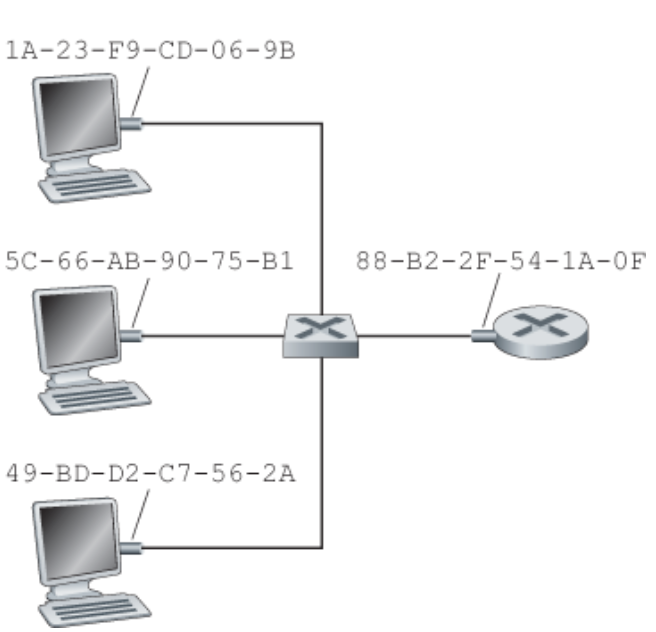
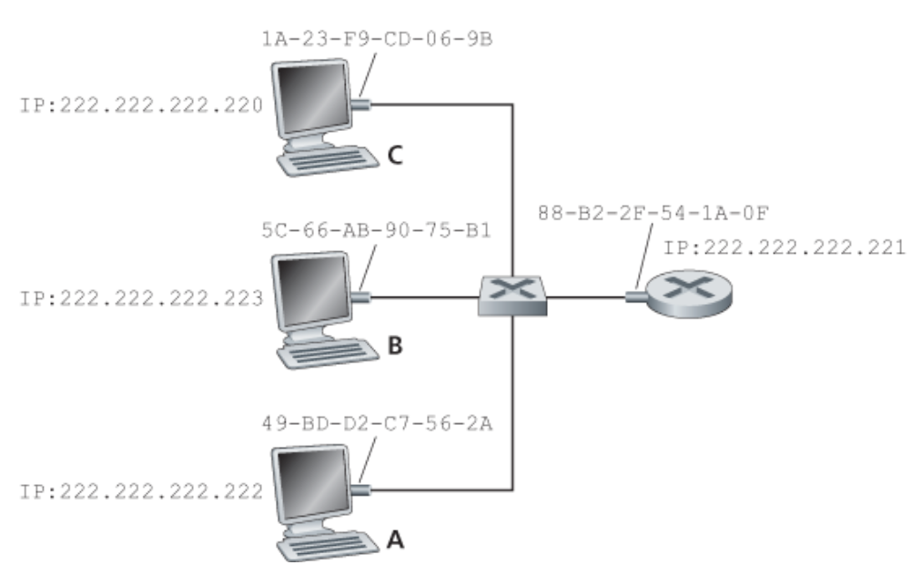
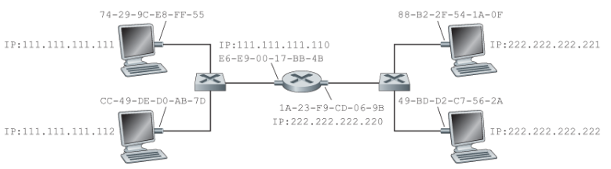
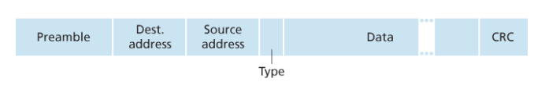

## 스위치 근거리 네트워크

> 스위치는 링크 계층에서 동작하기 때문에 링크 계층 프레임을 교환한다.

- 네트워크 계층 주소(IP)를 인식하지 않는다.
- OSPF 같은 라우팅 알고리즘을 사용하지 않는다.

즉:

```text
스위치 -> MAC 주소 사용
라우터 -> IP 주소 사용
```

---

## 링크 계층 주소체계와 ARP

### 링크 계층 주소가 필요한 이유

네트워크 계층 주소(IP)가 존재하는데도 링크 계층 주소(MAC)가 필요한 이유

- 랜은 IP만을 위해 설계된 것이 아니다.
- 각 계층이 독립적으로 동작하기 위해 자신만의 주소 체계를 가진다.

---

## MAC 주소



### 특징

- 링크 계층 주소
- 길이 : 6바이트(48비트)
- 네트워크 인터페이스(어댑터)에 할당된다.

즉:
- 하나의 장치가 여러 네트워크 인터페이스를 가지면 여러 MAC 주소를 가질 수 있다.

---

## 특징

- 평면 구조
- 위치가 변해도 변경되지 않음

예:
```text
IP 주소 -> 우편번호
MAC 주소 -> 주민등록번호
```

---

## MAC 주소 표기

예:

```text
AA-BB-CC-DD-EE-FF
```

---

## MAC 브로드캐스트 주소

> 모든 호스트에게 프레임 전달

```text
FF-FF-FF-FF-FF-FF
```

---

# ARP (Address Resolution Protocol)

> IP 주소를 MAC 주소로 변환하는 프로토콜

---

## 특징

- 같은 서브넷 내에서 동작
- 인터페이스마다 ARP 모듈 존재

---

## ARP 테이블

> IP 주소와 MAC 주소 매핑 정보 저장

---

## 특징

- 자동 생성
- TTL 기반 삭제
- Plug-and-Play 방식

---

# ARP 동작 과정



### 과정

1. 송신 호스트는 목적지 IP의 MAC 주소가 필요하다.

2. ARP Request를 브로드캐스트한다.

```text
FF-FF-FF-FF-FF-FF
```

3. 목적지 호스트는 자신의 MAC 주소를 ARP Reply로 응답한다.

4. 송신자는 ARP 테이블을 갱신한다.

---

## 특징

- Request -> 브로드캐스트
- Reply -> 유니캐스트

---

## 다른 서브넷으로 데이터그램 전송



### 특징

같은 서브넷이 아닌 경우:
- 목적지 MAC 주소가 아닌
- 라우터 인터페이스 MAC 주소 사용

---

### 과정

1. 송신 호스트는 라우터 MAC 주소를 ARP로 알아낸다.

2. 프레임을 라우터로 전송한다.

3. 라우터가 목적지 서브넷으로 전달한다.

4. 목적지 MAC 주소를 다시 ARP로 알아낸다.

---

## 이더넷 (Ethernet)

> 가장 널리 사용되는 LAN 기술

---

# 발전 과정

## 1980년대

- 동축 케이블 기반 버스 토폴로지
- 브로드캐스트 방식

---

## 1990년대

- 허브 기반 스타 토폴로지
- 꼬임쌍선 사용

### 허브(Hub)

> 물리 계층 장치

- 들어온 비트를 모든 포트로 전달

---

## 2000년대 이후

- 스위치 기반 스타 토폴로지

### 스위치(Switch)

> 저장 후 전달(Store-and-Forward) 패킷 스위치

- 충돌 없음

---

# 이더넷 프레임 구조



---

## 주요 필드

### 목적지 주소

- 목적지 MAC 주소

---

### 출발지 주소

- 출발지 MAC 주소

---

### 타입 필드

- 상위 네트워크 계층 프로토콜 구분

예:
- IP
- ARP

---

### 데이터 필드

- IP 데이터그램 포함

---

### CRC

> 오류 검출 수행

---

### 프리앰블

> 송신자와 수신자 클록 동기화

---

# 이더넷 특징

## 비연결형 서비스

- 핸드셰이크 없음

---

## 비신뢰적 서비스

- 오류 발생 시 폐기
- 재전송 없음

즉:

```text
신뢰성 -> TCP 담당
```

---

# CSMA/CD

> 충돌 감지를 위한 MAC 프로토콜

---

## 사용 이유

초기 이더넷:
- 브로드캐스트 링크
- 충돌 발생 가능

---

## 현재

스위치 기반 이더넷:
- 충돌 없음
- CSMA/CD 사실상 불필요

---

# 링크 계층 스위치

## 역할

> 프레임을 적절한 인터페이스로 전달

---

## 특징

- MAC 주소 기반 동작
- 호스트/라우터에게 투명함

---

# 포워딩과 필터링

## 포워딩

> 프레임을 적절한 인터페이스로 전달

---

## 필터링

> 프레임 폐기 여부 결정

---

# 스위치 테이블

## 저장 정보

- MAC 주소
- 인터페이스
- 생성 시간

---

# 스위치 동작

## 엔트리가 없는 경우

- 브로드캐스트 수행

---

## 목적지가 같은 인터페이스인 경우

- 필터링 수행

---

## 목적지가 다른 인터페이스인 경우

- 포워딩 수행

---

# 자가학습 (Self-Learning)

> 스위치가 MAC 주소를 자동 학습

---

## 과정

1. 초기 테이블은 비어있다.

2. 프레임 수신 시:
    - 출발지 MAC 주소 저장
    - 들어온 인터페이스 저장

3. Aging Time 이후 삭제 가능

---

## 특징

- Plug-and-Play
- 자동 학습 가능

---

# 스위치 특징

## 충돌 제거

- 충돌 없는 네트워크 구성 가능

---

## 이질적인 링크 지원

- 서로 다른 속도/매체 사용 가능

---

## 관리 용이

- 장애 감지 가능
- 통계 수집 가능

---

# 스위치 보안

## 스위치 테이블 엔트리가 있는 경우

- 자신 목적지 프레임만 수신

---

## 엔트리가 없는 경우

- 브로드캐스트 발생
- 스니핑 가능

---

## 스위치 포이즈닝 (Switch Poisoning)

> 가짜 MAC 주소로 스위치 테이블 오염 공격

---

# 스위치 vs 라우터

| 구분 | 스위치 | 라우터 |
|------|------|------|
| 계층 | 2계층 | 3계층 |
| 사용 주소 | MAC 주소 | IP 주소 |
| 특징 | 빠름 | 경로 선택 가능 |
| 충돌 | 제거 가능 | 제거 가능 |

---

# 스위치 장단점

## 장점

- Plug-and-Play
- 빠른 전달 속도

---

## 단점

- 브로드캐스트 폭풍 가능
- 스패닝 트리 제한 존재

---

# 라우터 장단점

## 장점

- 최적 경로 선택 가능
- 브로드캐스트 폭풍 방지 가능

---

## 단점

- 설정 필요
- 처리 속도 상대적으로 느림

---

# VLAN (Virtual LAN)

> 하나의 물리적 스위치에서 여러 개의 논리적 LAN 구성

---

# VLAN 필요성

## 문제점

- 브로드캐스트 범위 증가
- 트래픽 격리 어려움
- 사용자 이동 시 물리적 변경 필요

---

## 해결 방법

```text
VLAN -> 논리적 네트워크 분리
```

---

# VLAN 특징

- VLAN끼리 논리적으로 분리
- 같은 VLAN끼리만 브로드캐스트 가능

---

# 포트 기반 VLAN

> 스위치 포트를 그룹으로 분리

---

## 특징

- VLAN마다 브로드캐스트 도메인 형성
- 포트 재구성으로 그룹 변경 가능

---

# VLAN 트렁킹

> 여러 VLAN 트래픽을 하나의 링크로 전달

---

## 트렁크 포트

- 모든 VLAN에 속함
- VLAN 프레임 전달 가능

---

## VLAN 태그

> 프레임이 어떤 VLAN에 속하는지 표시

---

## 특징

- 송신 스위치가 태그 추가
- 수신 스위치가 태그 제거