## 네트워크 보안

### 안전한 통신에 요구되는 특성

- 기밀성
    - 송신자와 지정된 수신자만이 전송되는 메시지의 내용을 이해할 수 있어야한다.
    - 도청자가 메시지를 가로챌 수도 있으므로 도청자가 해석할 수 없도록 메시지를 어떠한 방식으로 암호화해야한다.
- 메시지 무결성
    - 통신하는 내용이 전송 도중에 변경되지 않아야 한다.
- 종단점 인증
    - 통신에 참여하는 상대방의 신원을 확인할 수 있어야한다.
- 운영 보안
    - 대부분의 네트워크는 공공 인터넷에 연결되어 있다.
    - 따라서 외부의 공격을 대비하여 방화벽이나 보안 체계를 갖추어야 한다.

### 보안 시나리오

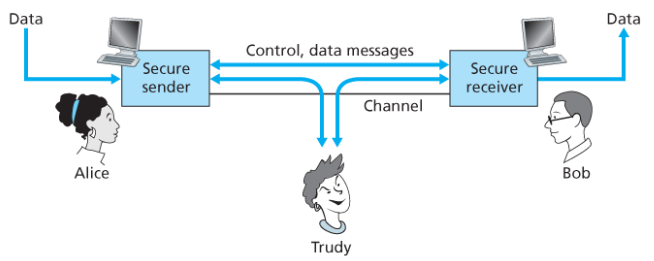

- 송신자와 수신자
    - 데이터 일부 or 전부를 암호화하여 안전한 통신을 하려고 할 것이다.
- 침입자
    - 채널상의 제어 메시지 및 데이터 메시지를 스니핑하거나 기록
    - 메시지 혹은 메시지 내용의 조작, 삽입 혹은 삭제

## 암호의 원리

> 송신자가 보내는 평문을 **암호화 알고리즘**을 사용해 암호화하여, 다른 침입자가 해석할 수 없게 만든다.
> 암호화 알고리즘은 모든이에게 알려져있고, 누구나 쉽게 사용할 수 있어야한다.
> 키 : 전송한 데이터를 침입자가 복원할 수 없게 해주는 비밀 정보

### 시나리오

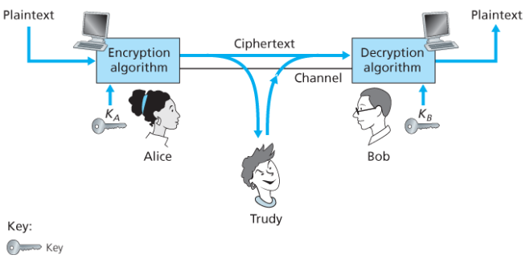

1. 앨리스는 키 A를 암호화 알고리즘의 입력값으로 사용하여 암호화된 메시지 `A(m)`을 완성한다.
2. 밥은 키 B와 암호문 `A(m)`을 복호화 알고리즘에 입력값으로 넣어 `B(A(m)) = m`의 출력을 받는다.

### 대칭키 시스템

> 앨리스와 밥의 키가 동일하며, 이 키는 둘만의 비밀이다.

### 공개키 시스템

> 키 중 하나는 세상 모두에게 알려져있고 다른 키는 앨리스 밥 중 한명만 알고있다.

---

## 대칭키 암호화

> 암호화와 복호화에 동일한 키를 사용하는 방식

```text
암호화 키 = 복호화 키
```

### 특징

- 속도가 빠르다.
- 대용량 데이터 암호화에 적합하다.
- 키를 안전하게 공유해야 하는 문제가 존재한다.

### 대표 알고리즘

- AES
- DES
- 3DES

---

### 카이사르 암호

> 평문의 각 문자를 알파벳 순서로 k번째 뒤 문자로 치환하는 방식

예:

```text
A -> D (k = 3)
```

- k 값이 암호화 키 역할 수행
- 구조가 단순하여 쉽게 복호화 가능

---

### 단일 문자 대응 암호

> 각 문자를 임의의 다른 문자로 변환하는 방식

- 규칙적인 이동 대신 무작위 대응 사용
- 가능한 경우의 수는 약 `26!`

### 특징

- 카이사르 암호보다 안전
- 문자 빈도 분석으로 해독 가능

예:
- e, t 같은 자주 등장하는 문자 분석 가능

---

### 공격 방식

#### 암호문만 이용한 공격

> 암호문만 가지고 해독 시도

#### 알려진 평문 공격

> 평문과 암호문 일부를 알고 있는 상태에서 해독

예:
- 이름
- 자주 등장하는 단어

#### 선택 평문 공격

> 공격자가 특정 평문을 직접 암호화시켜 암호문 분석

---

### 다중 문자 대응 암호화

> 위치에 따라 서로 다른 암호 규칙을 사용하는 방식

예:

```text
1번째 문자 -> C1
2번째 문자 -> C2
3번째 문자 -> C1
```

### 특징

- 같은 문자라도 위치에 따라 다르게 암호화
- 단일 문자 대응보다 안전

---

## 블록 암호화

> 메시지를 일정 크기의 블록 단위로 나누어 암호화하는 방식

### 대표 알고리즘

- AES
- DES
- 3DES

---

### 특징

- 데이터를 k비트 블록 단위로 처리
- 동일 평문 블록 → 동일 암호문 가능

---

### 문제점

같은 평문 블록이 반복되면:
- 동일한 암호문 생성
- 패턴 분석 공격 가능

---

### 해결 방법

> 랜덤성을 추가하여 동일 평문이라도 다른 암호문 생성

---

### 블록 암호화 동작

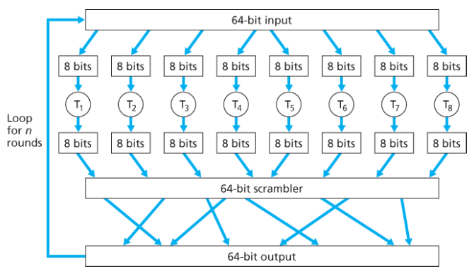

#### 과정

1. 메시지를 여러 블록으로 분할
2. 각 블록을 암호화
3. 블록들을 다시 합쳐 전송

---

### 특징

- 여러 라운드 반복 수행
- 입력 비트가 다양한 출력 비트에 영향

---

## 암호 블록 체이닝 (CBC)

> 이전 암호문 블록을 다음 암호화에 사용하는 방식

---

### 목적

- 동일 평문 → 동일 암호문 문제 해결
- 패턴 분석 공격 방지

---

### 초기화 벡터 (IV)

> 첫 번째 블록 암호화에 사용하는 임의 값

- 랜덤성 제공
- 같은 평문도 다른 암호문 생성 가능

---

### CBC 동작 과정

#### 암호화

```text
c(1) = K(m(1) xor c(0))
c(2) = K(m(2) xor c(1))
```

---

### 특징

- 이전 암호문 블록 사용
- 동일 평문도 다른 결과 생성
- 초기화 벡터만 추가 전송하면 됨

---

## 공개키 암호화

> 공개키와 개인키를 사용하는 암호화 방식


---

### 공개키 / 개인키

#### 공개키 (Public Key)

- 모두에게 공개 가능
- 암호화에 사용

#### 개인키 (Private Key)

- 소유자만 보관
- 복호화에 사용

---

### 동작 방식

#### 암호화

송신자:

```text
수신자의 공개키로 암호화
```

#### 복호화

수신자:

```text
개인키로 복호화
```

---

### 특징

#### 장점

- 안전한 키 교환 가능
- 인증 기능 제공 가능

#### 단점

- 연산 속도가 느림

---

### 대표 알고리즘

- RSA

---

## RSA

> 공개키 기반 암호화 알고리즘

---

### 특징

- 큰 소수 기반 연산 사용
- 모듈로(mod) 연산 활용
- 공개키 / 개인키 생성 가능

---

### 공개키와 개인키

#### 공개키

```text
(n, e)
```

#### 개인키

```text
(n, d)
```

---

### RSA 동작

#### 암호화

```text
c = m^e mod n
```

---

#### 복호화

```text
m = c^d mod n
```

---

### 특징

- 공개키로 암호화
- 개인키로 복호화
- 공개키만으로 개인키 계산은 매우 어려움

---

## 세션키

> 실제 데이터 암호화에 사용하는 임시 대칭키

---

### 사용 이유

RSA는 연산 비용이 매우 크다.

따라서 실제 통신에서는:

```text
공개키 → 세션키 전달
대칭키 → 실제 데이터 암호화
```

방식을 사용한다.

---

### 동작 과정

1. 송신자가 세션키 생성
2. 수신자의 공개키로 세션키 암호화
3. 수신자가 개인키로 복호화
4. 이후 대칭키 기반 통신 수행

---

## 메시지 무결성과 전자서명

### 메시지 무결성

> 메시지가 전송 도중 변경되지 않았음을 보장하는 것

- 메시지가 정말 해당 송신자로부터 왔는가?
- 메시지가 전송 중 변경되지 않았는가?

---

### 암호화 해시 함수

### 해시 함수

> 입력 메시지를 고정 길이 문자열로 변환하는 함수

```text
H(m)
```

- m : 원본 메시지
- H(m) : 해시값

### 암호화 해시 함수 특징

> 서로 다른 두 메시지가 같은 해시값을 갖는 경우를 찾기 매우 어렵다.

즉:

```text
H(x) = H(y)
```

를 만족하는 서로 다른 x, y를 찾는 것이 사실상 불가능하다.

---

### 특징

- 입력 크기와 관계없이 고정 길이 출력 생성
- 작은 변화에도 완전히 다른 해시값 생성
- 단방향 함수

---

### MD5 / SHA

#### MD5

> 대표적인 암호화 해시 알고리즘

#### SHA

> MD 계열 원리를 기반으로 발전한 해시 알고리즘

- SHA-1
- SHA-256
- SHA-512

등이 존재

### 해시 알고리즘 동작

1. Padding
    - 메시지 뒤에:
        - 1 추가
        - 여러 개의 0 추가

2. 길이 추가
    - 원본 메시지 길이를 추가

3. 블록 단위 처리
    - 메시지를 일정 크기 블록으로 나누어 반복 처리

---

## 메시지 인증 코드 (MAC)

> 메시지 무결성과 송신자 인증을 동시에 제공하는 방식

---

### 문제점

단순히:

```text
(m, H(m))
```

만 전송하면:
- 공격자가 새로운 메시지와 해시를 직접 생성 가능

---

## MAC

> 비밀키를 함께 사용하여 해시값 생성

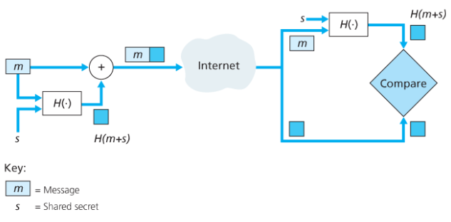

---

### 동작 방식

송신자:

```text
H(m + s)
```

- m : 메시지
- s : 비밀 인증키

---

### 전송

```text
(m, H(m+s))
```

전송

---

### 수신자

수신자는:
- 동일한 비밀키 s 사용
- 직접 H(m+s) 계산

값이 동일하면:
- 메시지 무결성 확인
- 송신자 인증 가능

---

## 특징

- 빠른 처리 가능
- 공개키 암호화보다 가볍다.
- 비밀키 공유 필요

> MD5, SHA 기반으로 가장 널리 사용되는 MAC 방식

---

## 전자 서명 (Digital Signature)

> 디지털 환경에서 문서의 작성자와 무결성을 증명하는 기술

---

### 목적

- 누가 보냈는지 확인
- 내용이 변경되지 않았는지 확인

---

## 특징

- 개인키로 서명
- 공개키로 검증

---

## 전자 서명 동작

### 서명자

1. 메시지 m 생성
2. 해시값 H(m) 생성
3. 자신의 개인키로 암호화

```text
K(H(m))
```

4. `(m, K(H(m)))` 전송

---

### 수신자

1. 메시지 m 수신
2. 서명자의 공개키로 복호화
3. h 값 획득
4. 직접 H(m) 계산
5. 두 값 비교

---

## 특징

- 송신자 인증 가능
- 메시지 무결성 확인 가능
- 위조 방지 가능

---

## 해시를 사용하는 이유

메시지 전체를 암호화하면:
- 연산 비용 매우 큼

따라서:
- 메시지를 해시값으로 축약
- 해시값만 서명

---

## MAC vs 전자서명

| 구분 | MAC | 전자 서명 |
|------|------|-----------|
| 키 | 공유 비밀키 | 공개키 / 개인키 |
| 목적 | 무결성 + 인증 | 무결성 + 인증 + 부인 방지 |
| 속도 | 빠름 | 느림 |
| 구조 | 단순 | 복잡 |
| 특징 | 대칭키 기반 | 공개키 기반 |

---

## 공개키 인증

> 공개키가 실제 해당 사용자 소유인지 검증하는 과정

---

### 필요성

공격자가:
- 자신의 공개키를 전달
- 자신이 정상 사용자라고 주장 가능

즉:

```text
공개키 자체의 신뢰성 보장 필요
```

---

## 인증 기관 (CA)

> 공개키와 사용자 신원을 인증하는 기관

---

### 역할

- 사용자 신원 확인
- 인증서 발급
- 공개키 신뢰성 보장

---

## 인증서

> 사용자 정보와 공개키를 묶은 전자 문서

---

### 특징

- CA가 전자 서명 수행
- 공개키의 소유자 보장 가능

---

## 종단점 인증

> 하나의 통신 개체가 다른 개체에게 자신의 신원을 증명하는 과정

예:
- 이메일 로그인
- 서버 인증
- 사용자 인증

---

### 특징

- 인증 프로토콜 기반 수행
- 대부분 실제 통신 전에 인증 수행

즉:

```text
인증
-> 이후 실제 작업 수행
```

---

## 인증 프로토콜 AP 2.0

### 방식


> 송신자의 IP 주소를 기반으로 인증

---

### 동작

수신자는:
- 패킷의 출발지 IP 확인
- 송신자의 IP와 일치하면 인증

---

### 문제점

#### IP 스푸핑 (IP Spoofing)

> 공격자가 출발지 IP 주소를 위조 가능

즉:
- 원하는 IP 주소를 넣어 패킷 생성 가능
- 실제 송신자인지 보장 불가

---

### 핵심

```text
IP 주소만으로는 인증 불가능
```

---

## 인증 프로토콜 AP 3.0

### 방식

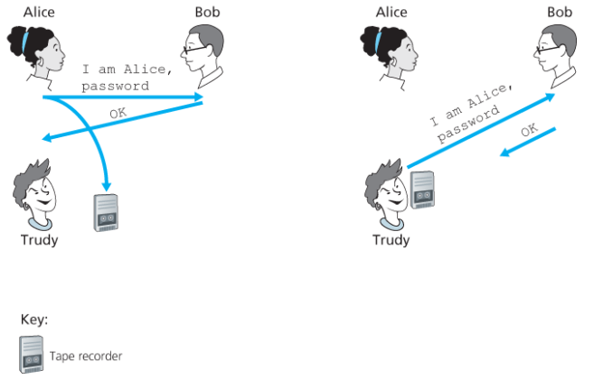

> 송신자와 수신자가 공유한 비밀번호 사용

---

#### 예시

- Gmail
- Facebook 로그인

---

### 문제점

#### 도청 가능

공격자가:
- 네트워크 통신 도청
- 비밀번호 획득 가능

---

### 핵심

```text
평문 비밀번호 전송은 안전하지 않음
```

---

## 인증 프로토콜 AP 3.1

### 방식

> 비밀번호를 암호화하여 전송

---

#### 특징

- 송신자와 수신자가 대칭 비밀키 공유
- 비밀번호 암호화 가능

---

### 문제점

#### 재생 공격 (Playback Attack)

> 공격자가 이전 인증 메시지를 재전송하는 공격

---

#### 동작

1. 공격자가 암호화된 비밀번호 저장
2. 이후 그대로 재전송
3. 송신자인 척 가능

---

### 핵심

```text
암호화만으로 재사용 공격 방지 불가능
```

---

## 인증 프로토콜 AP 4.0

### 넌스 (Nonce)

> 단 한 번만 사용하는 임의의 숫자

---

### 목적

- 재생 공격 방지

---

### 동작 과정

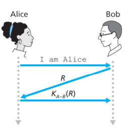

#### 1. 송신자 요청

송신자가 통신 요청

---

#### 2. 수신자

수신자가:
- 임의의 넌스 R 생성
- 송신자에게 전달

---

#### 3. 송신자

송신자는:
- 대칭 비밀키로 넌스 암호화

```text
K(R)
```

생성 후 전달

---

#### 4. 수신자 검증

수신자는:
- 동일한 비밀키로 복호화
- 값이 R과 같으면 인증 성공

---

### 특징

- 매번 다른 넌스 사용
- 이전 메시지 재사용 불가능
- 재생 공격 방지 가능

---

### 핵심

```text
Nonce
-> 재생 공격 방지
```

---

## 인증 프로토콜 발전 과정

| 프로토콜 | 방식 | 문제점 |
|------|------|------|
| AP 2.0 | IP 주소 기반 | IP 스푸핑 가능 |
| AP 3.0 | 평문 비밀번호 | 도청 가능 |
| AP 3.1 | 암호화 비밀번호 | 재생 공격 가능 |
| AP 4.0 | Nonce 사용 | 재생 공격 방지 가능 |

---

## 전자메일의 보안

### 보안 계층

> 보안 기능은 인터넷 프로토콜 스택의 여러 계층에서 제공될 수 있다.

- 특정 애플리케이션 계층 프로토콜에 보안 기능 제공 가능
- 해당 프로토콜을 사용하는 애플리케이션은 보안 서비스 사용 가능

### 여러 계층에서 보안을 제공하는 이유

#### 네트워크 계층 보안의 한계

네트워크 계층에서:
- 데이터 암호화
- IP 주소 인증

등을 수행할 수 있다.

그러나:

```text
사용자 수준 인증은 제공 불가능
```

---

## 보안 전자메일

> 암호화 기술을 사용하여 안전한 전자메일 시스템 구현

---

# 기밀성 (Confidentiality)

## 목적

> 제3자가 메일 내용을 읽지 못하게 하는 것

---

## 대칭키 암호화

AES, DES 등을 사용하여:
- 메시지 암호화 가능

그러나:

```text
송수신자가 같은 키를 공유해야 함
```

문제가 존재

---

## 공개키 암호화 사용

RSA를 사용할 수 있지만:
- 연산 비용이 매우 큼
- 긴 메시지 암호화에 비효율적

---

## 세션키 사용

> 공개키 + 대칭키 혼합 방식 사용

---

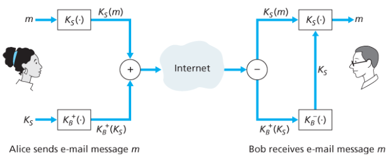

### 동작 과정

1. 송신자는 임의의 대칭 세션키 Ks를 선택한다.
    - 이 대칭 세션키는 AES나 DES에 사용된다.

2. Ks로 메시지 m을 암호화하여 암호문 1을 얻는다.

3. Ks는 송신자의 공개키로 암호화하여 암호문 2를 얻는다.

4. 이 두개의 암호문을 수신자에게 보낸다.

5. 수신자는 자신의 개인키로 암호문 1을 복호화하여 Ks를 얻을 수 있다.

6. 얻은 Ks로 암호문 2를 복호화하여 m을 얻을 수 있다.


---

# 송신자 인증과 메시지 무결성

## 목적

- 송신자 확인
- 메시지 위변조 방지

---

## 사용 기술

- 전자서명
- 해시 함수

---

## 동작 과정

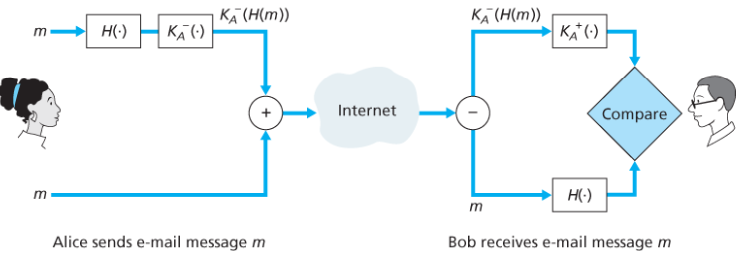

1. 송신자는 메시지 요약문을 얻기 위해 m에 해시함수를 적용하여 H(m)을 얻는다.

2. 전자 서명을 만들기 위해 해시의 결과를 자신의 개인키로 암호화한다.

3. 메시지 m과 전자서명을 수신자에게 보낸다.

4. 수신자는 송신자의 공개키로 전자서명을 복호화한다.

5. 메세지 m에 해시 알고리즘을 적용한 결과와 4의 결과를 비교하여 같으면 보낸 사람을 확인할 수 있고, 메시지의 무결성을 확인할 수 있다.

---

# 통합

> 기밀성 + 인증 + 무결성을 함께 제공

---

## 과정

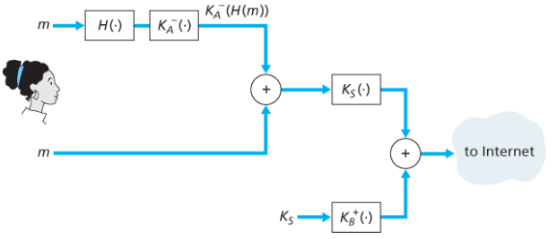

1. 먼저 송신자 인증과 무결성 과정을 통해 얻은 메시지와 전자서명 꾸러미를 만든다.

2. 이 꾸러미를 메시지 취급하여 기밀성 과정을 통해 수신자에게 전달한다.

3. 수신자는 순서대로 복호화하여 확인한다.

### 특징

- 기밀성 제공
- 송신자 인증 가능
- 메시지 무결성 보장 가능

### 공개키 인증 필요

송신자는:
- 수신자의 공개키 필요

수신자는:
- 송신자의 공개키 필요

따라서:

```text
CA를 통한 공개키 인증 필요
```

---

# PGP (Pretty Good Privacy)

> 대표적인 보안 전자메일 시스템

---

## 특징

- 공개키 기반 보안 사용
- 전자서명 지원
- 메시지 암호화 지원

---

1. PGP가 설치되면 소프트웨어는 사용자를 위한 공개키 쌍을 만든다.
    - 공개키는 사용자 웹사이트에 게시되거나 공개키 서버에 놓인다.
    - PGP 공개키는 사용자간 신뢰의 그물(web of trust) 속에서 인증된다.
    - 어떤 PGP 사용자들은 키 서명을 위한 모임을 열어 같은 물리적 공간에 모여서 공개키를 교환하고 그들의 개인키로 서명하는 것으로 서로의 키를 보증한다.

2. 개인키는 비밀번호로 보호된다.
    - 개인키를 사용하려면 사용자는 비밀번호로 인증해야한다.

3. PGP는 전자메일과 같은 방식으로 사용자에게 메시지를 전자서명하거나 암호화하거나 둘다 하거나 하는 선택지를 제공한다.
    - 개인키, 공개키, 해시 알고리즘, RSA가 있으니 모두 가능하다.

---

## TCP 연결의 보안 : TLS

> TLS(Transport Layer Security)는 TCP에 보안 기능을 추가한 프로토콜

---

## TLS가 제공하는 기능

- 기밀성
- 데이터 무결성
- 서버 인증
- 클라이언트 인증

---

## 특징

- TCP 기반 동작
- HTTPS에서 사용
- 애플리케이션 계층에 존재
- 개발자 입장에서는 보안 기능이 추가된 TCP처럼 동작

---

# TLS 동작 과정

## 1. 핸드셰이크 (Handshake)

> 클라이언트와 서버가 서로를 인증하고 공유 비밀키를 만드는 과정

---

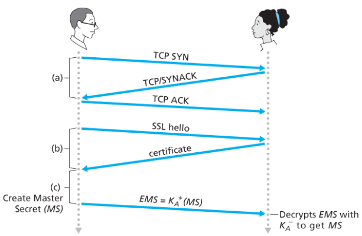

### 과정

1. 클라이언트와 서버가 TCP 연결을 생성한다.

2. 클라이언트는 hello 메시지를 보낸다.

3. 서버는 인증서와 공개키를 보낸다.
    - 클라이언트는 CA를 통해 인증서를 검증한다.

4. 클라이언트는 MS(Master Secret)를 생성한다.

5. 서버의 공개키로 MS를 암호화하여 EMS를 만든다.

6. 서버는 자신의 개인키로 EMS를 복호화하여 MS를 얻는다.

### 결과

```text
클라이언트와 서버만 MS를 공유
```

---

# 2. 키 유도 (Key Derivation)

> Master Secret를 기반으로 실제 세션키 생성

---

### 생성되는 키

- E(b)
    - 클라이언트 -> 서버 암호화 키

- M(b)
    - 클라이언트 -> 서버 HMAC 키

- E(a)
    - 서버 -> 클라이언트 암호화 키

- M(a)
    - 서버 -> 클라이언트 HMAC 키

---

### 특징

- 암호화 키 2개 생성
- HMAC 키 2개 생성

---

# 3. 데이터 전송

> TLS는 데이터를 레코드 단위로 나누어 처리한다.

---

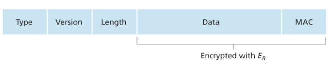

### 과정

1. 애플리케이션 데이터를 TLS 레코드로 분할한다.

2. HMAC을 생성한다.
    - 데이터 무결성 확인 목적

3. 레코드 + HMAC을 암호화한다.

4. TCP를 통해 전송한다.

---

# TLS 순서 번호

## 문제점

공격자가:
- TCP 세그먼트 순서 변경 가능
- 데이터 삽입 가능

---

## 해결 방법

> TLS는 순서 번호를 HMAC 계산에 포함한다.

---

### 특징

- 순서 변경 탐지 가능
- 삽입/삭제 공격 탐지 가능

---

## 완전한 TLS

### 특징

TLS는:
- 특정 암호화 알고리즘을 강제하지 않는다.
- 핸드셰이크 과정에서 알고리즘을 협상한다.

---

## TLS 핸드셰이크

### 과정

1. 클라이언트는:
    - 지원 가능한 암호화 알고리즘 목록
    - 클라이언트 넌스

전송

2. 서버는:
    - 사용할 알고리즘 선택
    - 인증서 전달
    - 서버 넌스 전달

3. 클라이언트는 PMS(Pre-Master Secret)를 생성한다.

4. PMS를 서버 공개키로 암호화하여 전송한다.

5. 클라이언트와 서버는:
    - PMS
    - 넌스

를 이용해 MS를 생성한다.

6. MS를 기반으로:
    - 암호화 키
    - HMAC 키

를 생성한다.

7. 이후 모든 메시지는:
    - 암호화
    - 인증

된다.

8. 클라이언트와 서버는 지금까지 주고받은 메시지의 HMAC을 교환한다.
    - 핸드셰이크 무결성 검증 목적

---

## 연결 종료

### 문제점

단순 TCP FIN 사용 시:
- 절단 공격 가능

---

### 해결 방법

TLS는:
- 레코드 타입 필드 사용
- 정상 종료 메시지 전달

---

# 네트워크 계층 보안 : IPsec과 VPN

## IPsec

> 네트워크 계층(IP 계층)에서 보안을 제공하는 프로토콜

---

## 특징

- IP 데이터그램 보호
- 기밀성 제공
- 데이터 무결성 제공
- 출발지 인증 제공
- 재생 공격 방지 가능

---

# VPN (Virtual Private Network)

> 공공 인터넷 위에 구축하는 가상 사설망

---

## 목적

- 기관 내부 트래픽 보호
- 안전한 원격 통신 제공

---

## 특징

- 인터넷 진입 전 데이터 암호화
- 공공 인터넷 사용 가능
- 물리적 사설망보다 비용 절감 가능

---

# AH와 ESP

## AH (Authentication Header)

> 인증과 무결성 제공

### 특징

- 출발지 인증
- 데이터 무결성
- 기밀성 제공 X

---

## ESP (Encapsulating Security Payload)

> 인증 + 무결성 + 기밀성 제공

### 특징

- 데이터 암호화 가능
- 실제로 가장 많이 사용

---

# SA (Security Association)

> IPsec 통신을 위한 논리적 연결

---

## 특징

- 단방향 연결
- 암호화 알고리즘과 키 정보 포함

---

# IKE (Internet Key Exchange)

> IPsec에서 키를 자동으로 교환하는 프로토콜

---

## 역할

- 인증 수행
- 암호화 알고리즘 협상
- 세션키 생성

---

# 무선 랜과 4G/5G 셀룰러 네트워크 보안

---

# 802.11 (Wi-Fi) 보안

## 보안 목표

### 상호 인증

> 이동 장치와 AP가 서로를 인증하는 과정

---

### 암호화

> 무선 구간 데이터 보호

- 무선 프레임 암호화 필요
- 대칭키 암호화 사용

---

# WPA / WPA2

## WEP

> 초기 Wi-Fi 보안 방식

- 심각한 보안 취약점 존재

---

## WPA

> WEP 개선 버전

- 메시지 무결성 검사 추가
- 키 추측 공격 완화

---

## WPA2

> WPA 개선 버전

- AES 암호화 사용
- 현재 널리 사용

---

# 상호 인증과 세션키 생성

## 특징

- 공유 비밀키 기반 인증
- 넌스 사용
- 세션키 생성 가능

---

# 4G/5G 셀룰러 보안

## 특징

- 상호 인증 수행
- 사전 공유 비밀키 사용
- 세션키 기반 암호 통신 수행

---

# 운영 보안 : 방화벽과 침입 탐지 시스템

---

# 방화벽 (Firewall)

> 내부 네트워크와 외부 인터넷 사이의 접근을 제어하는 시스템

---

## 목적

- 허용된 트래픽만 통과
- 외부 공격 차단
- 내부 네트워크 보호

---

# 전통적인 패킷 필터

> 패킷 헤더 정보를 기반으로 필터링 수행

---

## 필터링 기준

- 출발지 / 목적지 IP
- TCP / UDP 포트
- 프로토콜 타입
- TCP 플래그(SYN, ACK)

---

## 특징

- 단순한 구조
- 빠른 처리 가능

---

## 한계

- 연결 상태 추적 불가능
- IP 스푸핑 공격 취약

---

# 상태 기반 패킷 필터 (Stateful Packet Filter)

> TCP 연결 상태를 추적하는 방화벽

---

## 특징

- 진행 중인 TCP 연결 추적
- 연결 상태 기반 필터링 수행

---

## 핵심

```text
Stateless -> 패킷만 검사
Stateful -> 연결 상태까지 검사
```

---

# 애플리케이션 게이트웨이

> 애플리케이션 수준에서 동작하는 프록시 서버

---

## 특징

- 애플리케이션별 접근 제어 가능
- 사용자 인증 가능
- 데이터 중계 수행

---

# 침입 탐지 시스템 (IDS)

> 악의적인 트래픽을 탐지하는 시스템

---

# 침입 방지 시스템 (IPS)

> 악의적인 트래픽을 탐지하고 차단하는 시스템

---

## 핵심

```text
IDS -> 탐지
IPS -> 탐지 + 차단
```

---

# 시그니처 기반 IDS

> 알려진 공격 패턴 기반 탐지

---

## 특징

- 공격 시그니처 DB 사용
- 패킷과 시그니처 비교 수행

---

## 한계

- 새로운 공격 탐지 어려움
- 성능 비용 큼

---

# 이상 기반 IDS

> 비정상적인 트래픽 패턴 탐지

---

## 특징

- 통계 기반 분석
- 평소와 다른 트래픽 탐지

예:
- 비정상적인 ICMP 증가
- 포트 스캔
- Ping Flood