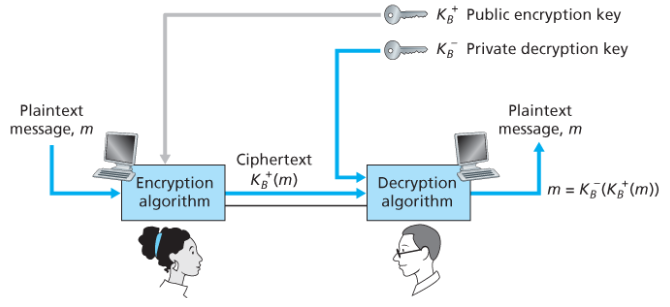
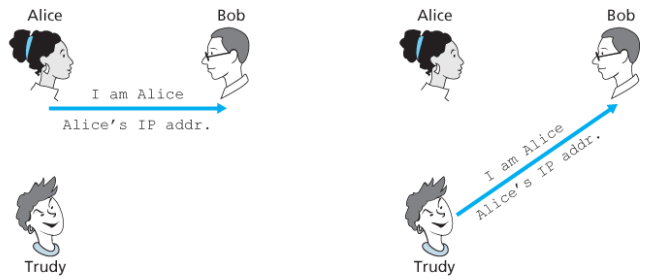
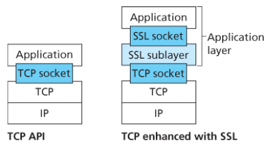
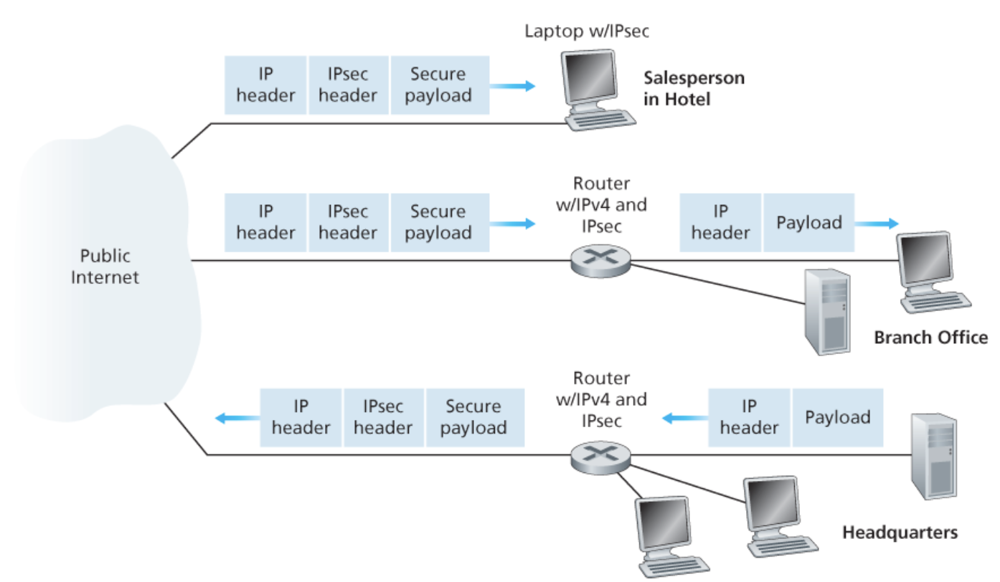
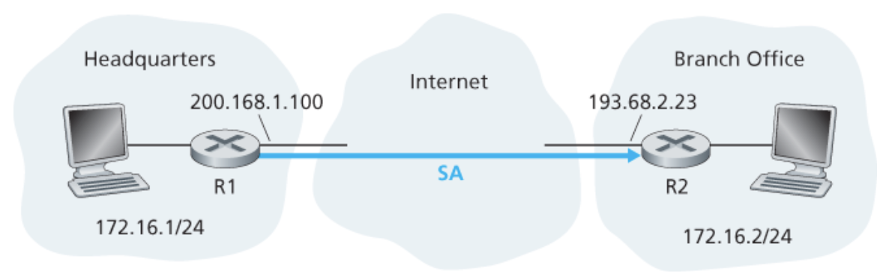
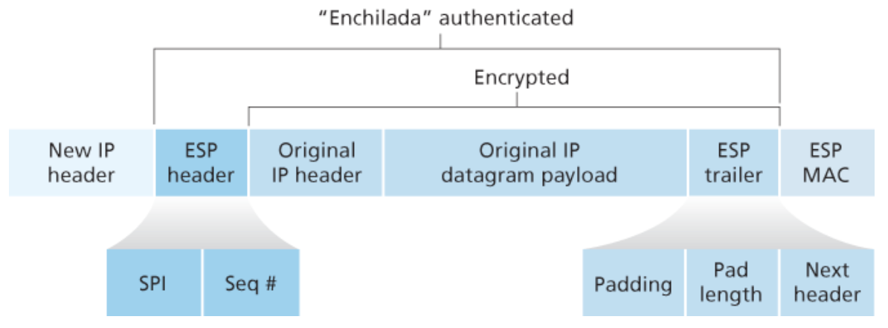
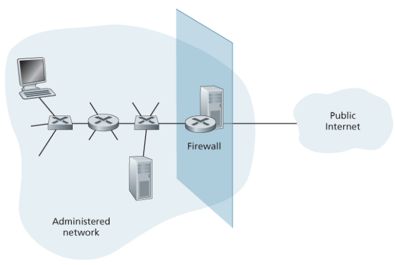

# Chapter 8. 네트워크 보안

## 8.1 네트워크 보안이란 무엇인가?

안전한 통신에 필요한 대표적인 속성

- 기밀성: 허가된 사람만 메시지 내용을 볼 수 있어야 한다.
- 무결성: 메시지가 전송 중에 바뀌지 않았음을 확인할 수 있어야 한다.
- 종단점 인증: 통신 상대가 진짜인지 확인할 수 있어야 한다.
- 운영 보안: 방화벽, IDS 같은 장치로 실제 네트워크를 보호해야 한다.

**예:**

- 사용자가 온라인 쇼핑몰에서 결제를 한다고 하자. 카드 번호는 다른 사람이 보면 안 되므로 기밀성이 필요
- 결제 금액이 `10,000원`에서 `100,000원`으로 바뀌면 안 되므로 무결성이 필요
- 사용자는 자신이 접속한 사이트가 진짜 쇼핑몰인지 확인해야 하므로 서버 인증이 필요
- 마지막으로 쇼핑몰 서버 자체가 공격자에게 뚫리지 않도록 방화벽과 침입 탐지 시스템도 필요

공격자는 네트워크에서 다음과 같은 일을 할 수 있다.


- 패킷을 몰래 훔쳐본다.
- 메시지 내용을 수정한다.
- 새로운 메시지를 삽입한다.
- 기존 메시지를 삭제한다.
- 가짜 서버나 가짜 사용자인 척한다.

## 8.2 암호의 원리

송신자가 보내는 원래 형태의 메시지: 평문 or 원문

암호화는 평문을 암호문으로 바꾸는 과정(이 때 암호화 알고리즘 사용), 복호화는 암호문을 다시 평문으로 되돌리는 과정.

암호화 알고리즘 자체가 꼭 비밀일 필요는 없음.
현대 암호는 보통 알고리즘은 공개되어 있고, 실제 보안은 키에 의존한다.
즉, 공격자가 암호화 방식은 알아도 키를 모르면 평문을 알아낼 수 없어야 한다.

**예:**


"각 문자를 알파벳에서 3칸씩 미는 방식"이라는 알고리즘이 공개되어 있다. 이때 `3`이라는 이동 값이 키다. 공격자가 알고리즘과 키를 모두 알면 쉽게 복호화할 수 있지만, 키를 모르면 가능한 값을 전부 시도해야 한다.

### 대칭키와 공개키

암호 시스템은 크게 대칭키 방식과 공개키 방식으로 나뉜다.

- 대칭키 암호: 송신자와 수신자가 같은 비밀키를 사용한다.
- 공개키 암호: 공개키와 개인키라는 서로 다른 두 키를 사용한다.

대칭키는 빠르지만 키를 안전하게 공유하는 문제가 있다. 공개키는 키 공유 문제를 해결하기 좋지만 계산이 느리다.

> 실제 보안 프로토콜은 두 방식을 섞어 씀.

TLS가 대표적인 예다. 처음에는 공개키 기반으로 상대를 인증하고 안전하게 키를 합의한 뒤, 실제 데이터 전송은 빠른 대칭키 암호로 처리한다.

## 8.2.1 대칭키 암호화

대칭키 암호화는 송신자와 수신자가 같은 키를 공유하는 방식.
같은 키로 암호화하고 같은 키로 복호화

**예:**

친구 A와 B가 둘만 아는 숫자 `3`을 키로 정했다고 하자. A가 `HELLO`를 보낼 때 각 문자를 알파벳 순서로 3칸씩 밀면 `KHOOR`가 된다. B는 같은 키 `3`을 알고 있으므로 다시 3칸씩 당겨서 `HELLO`를 복원할 수 있다.

### 카이사르 암호

카이사르 암호는 알파벳을 일정한 칸수만큼 밀어서 암호화하는 방식

예를 들어 키가 `3`이면 다음처럼 바뀐다.

```text
A -> D
B -> E
C -> F
...
X -> A
Y -> B
Z -> C
```

평문 `ATTACK`은 `DWWDFN`이 된다.

카이사르 암호는 매우 약함 -> 가능한 키가 25개뿐이기 때문
공격자는 모든 키를 하나씩 넣어보면 금방 원문을 찾을 수 있다.

### 단일 문자 대응 암호

단일 문자 대응 암호는 각 알파벳을 다른 알파벳에 임의로 대응시키는 방식
카이사르 암호보다 가능한 경우의 수는 훨씬 많다. -> 26!

**예:**

```text
평문: A B C D E ...
암호: Q W E R T ...
```

가능한 대응표가 많기 때문에 처음 보면 안전해 보인다. 하지만 영어 문장에서는 `e`, `t`, `a` 같은 문자가 자주 나오고, `the`, `and` 같은 단어 패턴도 자주 등장한다. 공격자는 이런 빈도 분석을 이용해 대응표를 추측할 수 있음

**예:**

암호문에서 어떤 문자가 압도적으로 자주 나온다면, 그 문자는 평문의 `e`일 가능성이 높음. 또 세 글자 단어가 반복해서 나오면 `the`일 가능성을 의심할 수 있음

공격자가 암호문만 보는 경우보다, 평문 일부를 알고 있는 경우가 훨씬 위험하다.

- 암호문만 이용한 공격: 공격자는 암호문만 보고 평문을 추측.
- 알려진 평문 공격: 공격자가 평문 일부와 그에 대응하는 암호문을 알고 있다.

**예:**

알려진 평문 공격

> 공격자가 어떤 암호문 안에 사용자 이름 `ALICE`가 반드시 들어간다는 사실을 알고 있다면, 암호문 일부와 `ALICE`를 맞춰보면서 문자 대응 관계를 알아낼 수 있다.

- 선택 평문 공격: 공격자가 자신이 고른 평문을 암호화하게 만들 수 있다.

선택 평문 공격

> 공격자가 `AAAAA`, `BBBBB`, `ABCDEF` 같은 평문을 일부러 암호화하게 만들면, 암호화 방식의 규칙을 훨씬 쉽게 알아낼 수 있다.

### 다중 문자 대응 암호화

단일 문자 대응 암호는 같은 문자는 항상 같은 암호문으로 바뀜.
위치에 따라 다른 대응표를 사용함으로써 보완한 것 -> 다중 문자 대응 암호화

**예:**

첫 번째 문자는 대응표 C1, 두 번째 문자는 대응표 C2, 세 번째 문자는 다시 C1을 사용하는 방식이다.

```text
평문:  A A A A
위치:  1 2 3 4
표:    C1 C2 C1 C2
암호:  Q M Q M
```

같은 `A`라도 위치에 따라 다르게 암호화될 수 있으므로 빈도 분석이 어려워짐.

### 블록 암호화

블록 암호화는 메시지를 일정한 크기의 블록으로 나누어 암호화한다.
AES, DES, 3DES 같은 암호가 여기에 속한다.

**예:**

메시지를 64비트 단위로 자른다고 하자.
각 64비트 블록을 암호 알고리즘에 넣으면 같은 크기의 암호문 블록이 나온다.

이 때 k 비트에 대해서 2^k의 경우의 수가 나옴

```text
평문 블록 1 -> 암호문 블록 1
평문 블록 2 -> 암호문 블록 2
평문 블록 3 -> 암호문 블록 3
```

문제는 같은 평문 블록이 들어가면 같은 암호문 블록이 나올 수 있다는 점.
예를 들어 이미지 파일을 단순 블록 암호로 암호화하면, 이미지의 윤곽이 암호문에서도 어느 정도 남을 수 있다. 그래서 실제로는 블록끼리 연결해서 같은 평문 블록도 다르게 암호화되도록 만든다.

### CBC: 암호 블록 체이닝

CBC는 이전 암호문 블록을 다음 평문 블록과 섞어서 암호화하는 방식이다.
이렇게 하면 같은 평문 블록이 반복되어도 암호문은 달라질 수 있다.

간단히 보면 다음과 같다.

```text
C1 = E(K, M1 xor IV)
C2 = E(K, M2 xor C1)
C3 = E(K, M3 xor C2)
```

여기서 `IV`는 초기화 벡터다. IV는 첫 번째 블록에 임의성을 주기 위해 사용된다.

예를 들어 평문 블록 `HELLO`가 두 번 반복되더라도, 두 번째 `HELLO`는 이전 암호문 블록과 섞인 뒤 암호화되므로 첫 번째와 다른 암호문이 나온다. 덕분에 반복 패턴이 줄어든다.

## 8.2.2 공개키 암호화



- 공개키: 누구에게나 공개해도 되는 키
- 개인키: 소유자만 알고 있어야 하는 키

**예:**

B가 자물쇠와 열쇠를 가지고 있다고 하자. B는 자물쇠를 여러 사람에게 나눠준다. A는 B에게 비밀 메시지를 보내고 싶을 때 B의 자물쇠로 상자를 잠가서 보낸다. 이 상자는 B의 개인 열쇠로만 열 수 있다.

자물쇠가 공개키이고, 열쇠가 개인키다.

### RSA

나머지 연산을 사용

RSA는 큰 수의 소인수분해가 어렵다는 사실에 기반.
두 큰 소수 `p`, `q`를 곱해서 `n`을 만드는 것은 쉽지만, `n`만 보고 다시 `p`, `q`를 찾는 것은 매우 어렵다.

RSA의 키 생성 흐름

1. 큰 소수 `p`, `q`를 고른다.
2. `n = pq`를 계산한다.
3. `z = (p - 1)(q - 1)`를 계산한다.
4. `z`와 서로소인 `e`를 고른다.
5. `ed mod z = 1`이 되는 `d`를 찾는다.
6. 공개키는 `(n, e)`, 개인키는 `(n, d)`가 된다.

암호화와 복호화는 다음처럼 이루어진다.

```text
암호화: c = m^e mod n
복호화: m = c^d mod n
```

작은 숫자로 예를 들어보자.

```text
p = 5, q = 7
n = 35
z = 24
e = 5
d = 29
공개키 = (35, 5)
개인키 = (35, 29)
```

평문 `m = 12`를 암호화하면 다음과 같다.

```text
c = 12^5 mod 35 = 17
```

받는 사람은 개인키로 복호화한다.

```text
m = 17^29 mod 35 = 12
```

## 8.3 메시지 무결성과 전자서명

암호화는 기밀성을 제공하지만, 그것만으로 무결성을 보장하지는 않는다.
메시지가 중간에서 바뀌었는지 확인하려면 해시 함수, MAC, 전자서명 같은 기술이 필요하다.

**예:**

A가 B에게 `10만원 송금`이라는 메시지를 보냈다고 하자.
공격자가 이 메시지를 `100만원 송금`으로 바꾸면 큰 문제가 생긴다.
이때 B는 메시지가 바뀌었는지 확인할 수 있어야 한다.

## 8.3.1 암호화 해시 함수

해시 함수는 임의 길이의 입력을 고정 길이의 출력으로 바꾸는 함수.
출력값은 메시지의 지문처럼 사용된다.

> 다른 값으로 같은 해시값을 만들어 내는 것이 거의 불가능

좋은 해시 함수는 다음 성질을 가져야 한다.

- 같은 입력은 항상 같은 해시값을 만든다.
- 입력이 조금만 바뀌어도 해시값이 크게 달라진다.
- 해시값만 보고 원래 입력을 알아내기 어려워야 한다.
- 같은 해시값을 만드는 다른 입력을 찾기 어려워야 한다.

**예:**

다운로드 사이트에서 프로그램 파일과 함께 해시값을 제공한다고 하자.
사용자는 파일을 받은 뒤 직접 해시값을 계산한다. 계산한 값이 사이트의 값과 같으면 파일이 전송 중에 손상되지 않았다고 볼 수 있다.

하지만 해시만으로는 충분하지 않다. 공격자가 파일을 바꾸고 해시값도 새로 계산해서 같이 올리면 사용자는 속을 수 있다. 그래서 해시값 자체도 신뢰할 수 있는 방식으로 보호해야 한다.

MD5, SHA 알고리즘이 많이 사용됨.

## 8.3.2 메시지 인증 코드(MAC: Message Authentication Code)

MAC은 메시지와 공유 비밀키를 함께 사용해 만드는 인증 코드.
받는 사람도 같은 키로 MAC을 다시 계산해서 메시지의 무결성과 송신자를 확인한다.

예를 들어 A와 B가 비밀키 `K`를 공유하고 있다고 하자. A는 다음 메시지를 보낸다.

```text
메시지: B에게 10만원 송금
MAC: H(Key + 메시지)
```

B는 자신이 가진 키 `K`와 받은 메시지로 MAC을 다시 계산한다. 계산 결과가 A가 보낸 MAC과 같으면 메시지가 바뀌지 않았고, 키를 아는 사람이 보낸 메시지라고 판단할 수 있다.

공격자가 메시지를 `100만원 송금`으로 바꾸면 MAC 계산 결과가 달라진다. 공격자는 키 `K`를 모르므로 올바른 MAC을 새로 만들 수 없다.

MAC의 한계는 송신자와 수신자가 같은 키를 공유해야 한다는 점이다.
또한 둘 다 같은 키를 알고 있으므로, 나중에 "정말 A가 보냈다"는 사실을 제3자에게 증명하기는 어렵다. 이 문제를 해결하는 데 전자서명이 사용된다.

## 8.3.3 전자서명

전자서명은 개인키로 서명하고 공개키로 검증하는 방식이다.
메시지 전체에 직접 서명하기보다는 보통 메시지의 해시값에 서명한다.

흐름은 다음과 같다.

1. 송신자가 메시지의 해시값을 계산한다.
2. 송신자가 자신의 개인키로 해시값에 서명한다.
3. 수신자는 송신자의 공개키로 서명을 검증한다.
4. 수신자는 직접 계산한 메시지 해시값과 서명에서 나온 해시값을 비교한다.

예를 들어 교수님이 시험 공지 파일을 올린다고 하자.
교수님은 파일의 해시값에 개인키로 서명한다. 학생들은 교수님의 공개키로 서명을 검증한다.

- 검증 성공: 교수님이 서명한 파일이고, 중간에 바뀌지 않았다.
- 검증 실패: 파일이 바뀌었거나 교수님의 개인키로 서명된 파일이 아니다.

전자서명은 MAC과 달리 공개키로 검증할 수 있으므로 여러 사람이 검증해야 하는 상황에 적합하다. 소프트웨어 배포, 인증서, 전자계약서 등이 대표적인 예다.

## 8.4 종단점 인증

종단점 인증은 하나의 통신 개체가 다른 개체에게 자신의 신원을 네트워크상으로 증명하는 작업.
단순히 메시지가 암호화되어 있다고 해서 상대가 진짜라는 보장은 없다.

예를 들어 사용자가 은행 사이트에 접속했는데, 실제로는 공격자가 만든 가짜 사이트일 수 있다.
사용자는 접속한 서버가 진짜 은행 서버인지 확인해야 함.

### 인증 프로토콜 ap(authentication protocol) 2.0

네트워크 주소를 가지고 통신하는 방식.

수신자는 ip 데이터 그램 출발지 주소가 송신자의 주소와 일치하는지 확인함으로써 인증 가능.



### 인증 프로토콜 ap(authentication protocol) 3.0

다음 인증은 비밀번호를 보내는 방식이다.

```text
사용자 -> 서버: 내 비밀번호는 1234입니다.
```


네트워크를 도청하는 공격자가 비밀번호를 그대로 훔칠 수 있기 때문에 안전하지 못함

### 인증 프로토콜 ap(authentication protocol) 3.1

비밀번호를 암호화하는 방식
송신자와 수신자는 대칭 비밀키를 공유해서 비밀번호를 암, 복호화할 수 있다.

재생 공격(playback attak)에 노출
송신자의 암호화된 비밀번호를 저장했다가 나중에 다시 사용

### nonce를 이용한 인증

서버가 매번 임의의 값인 nonce를 보내고, 사용자가 그 값을 비밀키로 처리해서 응답하는 방식이다.

예를 들어 서버가 사용자에게 `R = 83921`이라는 난수를 보낸다. 사용자는 자신의 비밀키로 `R`을 암호화하거나 MAC을 계산해 서버에 보낸다. 서버는 같은 키로 검증한다.

**장점**

매번 다른 난수를 사용한다는 점.
공격자가 이전 응답을 훔쳐도 다음 인증에는 재사용할 수 없다.

## 8.5 전자메일의 보안

보안은 인터넷 프로토콜 스택 위쪽 4개 계층의 어느 곳에서나 보안 서비스 제공 가능

- 애플리케이션 계층 보안: 이메일 암호화, 로그인 인증
- 트랜스포트 계층 보안: TLS, HTTPS
- 네트워크 계층 보안: IPsec, VPN
- 링크 계층 보안: Wi-Fi WPA2/WPA3

> 보안 기능은 한 군데에서만 하는 게 아니다.

보안이 특정 애플리케이션 계층 프로토콜을 위해 제공되면 그 프로토콜을 사용하는 애플리케이션은 보안 서비스를 사용할 수 있게 된다.

**예:**

HTTP -> 애플리케이션 계층 프로토콜
HTTP는 보안이 약함
HTTP + TLS = HTTPS

> HTTP를 사용하는 웹 브라우저, 쇼핑몰, 게시판 등이 보안 기능 사용 가능

보안은 네트워크 계층에서 제공하는 것만으로 충분하지 않나?

**예:**

네트워크 계층에서 IP 패킷 전체 암호화, IP 주소까지 인증

- 이 사람이 진짜 배준석인지?
- 결제 권한이 있는지
- 자기 계정으로 로그인 했는지 등에 대해서 알아야 함

> 애플리케이션 계층에서 처리를 해야함 -> 로그인, 세션, 쿠키, JWT 등등

전자메일은 기본적으로 여러 메일 서버를 거쳐 전달된다.
그래서 중간 서버나 네트워크 공격자가 메일 내용을 볼 수 있거나, 메일이 변조될 수 있다.
전자메일은 기밀성, 무결성, 송신자 인증을 제공해야 한다.

예를 들어 A가 B에게 중요한 계약서를 이메일로 보낸다고 하자. 필요한 보안 목표는 다음과 같다.

- 계약서 내용은 B만 읽을 수 있어야 한다.
- 전송 중 계약서 내용이 바뀌지 않아야 한다.
- B는 이 메일이 진짜 A가 보낸 것인지 확인할 수 있어야 한다.

## 8.5.1 보안 전자메일

보안 전자메일은 대칭키 암호화, 공개키 암호화, 해시, 전자서명을 조합한다.

긴 이메일 본문을 공개키로 직접 암호화하면 느림

> 그래서 보통 임시 대칭키를 만든 뒤, 이메일 본문은 대칭키로 암호화한다.
> 그리고 그 대칭키를 수신자의 공개키로 암호화해서 함께 보낸다.

예를 들어 A가 B에게 보안 메일을 보낼 때 흐름은 다음과 같다.

1. A가 임시 대칭키 `Ks`를 만든다.
2. A가 이메일 본문을 `Ks`로 암호화한다.
3. A가 `Ks`를 B의 공개키로 암호화한다.
4. A가 암호화된 본문과 암호화된 `Ks`를 B에게 보낸다.
5. B는 자신의 개인키로 `Ks`를 복호화한다.
6. B는 `Ks`로 이메일 본문을 복호화한다.

공개키 암호화의 느린 문제와 대칭키 공유 문제를 동시에 해결할 수 있음.

무결성과 송신자 인증까지 필요하면 전자 서명과 해시 알고리즘 사용

**예:**

A는 이메일 본문의 해시값에 자신의 개인키로 전자서명을 붙인다. B는 A의 공개키로 서명을 검증한다.

## 8.5.2 PGP

PGP(Pretty Good Privacy)는 이메일 보안을 위한 대표적인 시스템.
PGP는 암호화, 압축, 전자서명, 키 관리를 조합해 이메일을 보호.

PGP의 핵심 아이디어는 하이브리드 암호화다.

- 실제 메시지는 빠른 대칭키로 암호화한다.
- 대칭키는 수신자의 공개키로 암호화한다.
- 메시지 무결성과 송신자 인증을 위해 전자서명을 사용한다.

**예:**

A가 B에게 PGP 메일을 보내면, B만 자신의 개인키로 대칭키를 얻을 수 있다. 그리고 B는 A의 공개키로 서명을 검증해서 메일이 A에게서 온 것인지 확인할 수 있다.

## 8.6 TCP 연결의 보안: TLS(Transport Layer Security)



보안 서비스가 추가되어 향상된 TCP 버전 -> TLS

TLS는 TCP를 보호 -> TCP 상에서 일어나는 어떠한 애플리케이션에든 사용될 수 있음.

TLS가 제공하는 기능

- 서버 인증
- 선택적인 클라이언트 인증
- 기밀성
- 무결성

**예:**

사용자가 인터넷 뱅킹 사이트에 접속한다고 하자.
TLS가 없다면 사용자의 로그인 정보, 계좌 정보, 이체 요청이 중간에서 노출되거나 변조될 수 있다.
TLS는 이런 데이터를 암호화하고, 중간에서 바뀌었는지 확인할 수 있게 해준다.

## 8.6.1 TLS 개요: almost TLS

almost TLS -> TLS의 단순화된 버전

1. 브라우저가 서버에 접속한다.
2. 서버는 자신의 인증서를 보낸다.
3. 브라우저는 인증서를 검증해 서버가 진짜인지 확인한다.
4. 브라우저와 서버는 세션 키를 만든다.
5. 이후 데이터는 세션 키로 암호화해서 주고받는다.

세션 키는 대칭키다. 매번 연결마다 새로 만들어지고, 연결이 끝나면 버려진다.

**예:**

사용자가 `https://bank.com`에 접속하면 브라우저는 서버 인증서를 확인한다.
인증서가 신뢰할 수 있는 CA에서 발급되었고, 도메인 이름도 일치하면 브라우저는 서버를 신뢰한다.
이후 브라우저와 서버는 실제 데이터 암호화에 사용할 키를 합의한다.

### TLS에서 공개키와 대칭키를 함께 쓰는 이유

공개키만 사용하면 모든 데이터를 암호화하기에 너무 느리다.
대칭키는 빠르지만 처음에 키를 안전하게 공유하기 어렵다.

> TLS는 이 둘을 조합한다.

- 공개키 계열 기술: 상대 인증과 키 합의에 사용
- 대칭키 암호: 실제 데이터 전송에 사용
- MAC 또는 인증 암호 방식: 데이터 변조 여부 확인에 사용

## 8.6.2 TLS의 완전한 개념

실제 TLS는 단순히 키 하나를 만드는 것보다 복잡하다.
연결 과정에서 여러 키를 만들고, 암호화 방향도 나누어 관리한다.

**예:**

클라이언트에서 서버로 보내는 데이터와 서버에서 클라이언트로 보내는 데이터에 같은 키를 쓰면 관리가 위험해질 수 있다. 그래서 TLS는 보통 방향별로 별도의 키를 사용한다.

TLS 연결에서 중요한 개념

- 핸드셰이크: 인증서 확인과 키 합의가 이루어지는 초기 과정
- 세션 키: 실제 데이터를 암호화하는 데 쓰이는 대칭키
- 레코드 프로토콜: 애플리케이션 데이터를 잘라 암호화하고 인증 정보를 붙이는 과정

**예:**

브라우저가 로그인 요청을 보낼 때 TLS는 HTTP 메시지를 일정 크기의 레코드로 나누고, 각 레코드를 암호화한 뒤 무결성 정보를 붙여 전송한다.
서버는 이를 검증하고 복호화한 뒤 HTTP 요청으로 처리한다.

## 8.7 네트워크 계층 보안: IPsec과 가상 사설 네트워크

TLS가 애플리케이션 계층 위에서 특정 애플리케이션 통신을 보호한다면,
IPsec은 IP 계층에서 패킷 자체를 보호한다.

**예:**

회사 직원이 집에서 회사 내부망에 접속한다고 하자. 직원의 노트북과 회사 VPN 서버 사이에 IPsec 터널을 만들면, 인터넷을 지나가는 패킷이 암호화되어 보호된다. 외부에서는 패킷의 실제 내용을 알기 어렵다.

VPN은 물리적으로 떨어진 네트워크를 마치 하나의 사설망처럼 연결해준다. 공용 인터넷을 지나가지만 암호화된 터널을 사용하므로 사설망처럼 사용할 수 있다.

## 8.7.1 IPsec과 가상 사설 네트워크

공공 인터넷과 완전히 분리된 라우터, 링크, DNS 시스템을 포함하는 물리적으로 독립된 네트워크

> 사설 네트워크(private network)

사설 네트워크는 비용이 크다 -> 공공 인터넷 상에 VPN 설치

VPN을 이용하면
기관의 사무실간 트래픽은 공공 인터넷을 통해 전송
기밀성을 제공하기 위해 공공 인터넷에 들어가기 전에 암호화



공공 인터넷 통과하지 않을 때는 평범한 IPv4 데이트그램 사용
통과해야할 때는 IPsec를 지원하는 라우터가 IPv4 데이터그램을 IPsec 데이터그램으로 바꾼 후에 전송

## 8.7.2 AH와 ESP 프로토콜

AH(Authentication Header)

- 출발지 인증
- 데이터 무결성
- 기밀성은 제공 X

ESP

- 출발지 인증
- 데이터 무결성
- 기밀성까지 제공

**예:**

회사 기밀 문서를 전송하는 패킷이 있다면, AH만 사용하면 문서 내용은 보일 수 있다.
ESP를 사용하면 내용 자체가 암호화되어 외부에서 읽기 어렵다.

## 8.7.3 SA(Security Association)

데이터그램을 전송하기 전 출발지 개체와 목적지 개체는 네트워크 계층에서 논리적 연결을 설립

> SA

SA는 단방향이기 때문에 서로에게 데이터를 보내려면

> 2개의 SA가 필요 -> 라우터와 호스트에 따라서 SA가 더 필요할 수도 있음

많은 SA의 상태 정보는 그 개체의 OS 커널에 있는 SAD(Security Association Database)에 저장

**예:**

직원 노트북과 회사 VPN 서버가 통신할 때, 노트북에서 서버로 가는 SA와 서버에서 노트북으로 오는 SA가 따로 만들어진다. 각 방향마다 다른 키와 보안 파라미터를 사용할 수 있다.



R1은 SQ에 상태 정보를 포함

- 사용할 암호 알고리즘(AES, DES)
- 사용할 무결성 검증 알고리즘(MD5, SHA 등)
- 인증키
- 암호화 키
- SA 식별자(32 비트)
- SA 시작점의 인터페이스와 최종점의 인터페이스

## 8.7.4 IPsec 데이터그램



IPsec 데이터그램은 기존 IP 패킷에 보안 정보를 추가한 형태다.

터널 모드에서는 원래 IP 패킷 전체를 감싸서 새로운 IP 패킷 안에 넣는다.

```text
새 IP 헤더 + IPsec 헤더 + 암호화된 원래 IP 패킷
```

**예:**

집에 있는 직원 노트북이 회사 내부 서버로 패킷을 보낸다고 하자.
원래 목적지는 회사 내부 서버지만, 인터넷 구간에서는 목적지가 회사 VPN 게이트웨이인 새 IP 패킷처럼 보인다. 원래 내부 서버 주소와 데이터는 암호화된 내부에 들어간다.

이 방식 덕분에 외부 공격자는 실제 내부 통신 내용을 보기 어렵다.

## 8.7.5 IKE: IPsec에서의 키 관리

IKE는 IPsec에서 키를 안전하게 협상하고 SA를 설정하는 프로토콜.

IPsec 통신을 하려면 양쪽이 같은 암호 알고리즘과 키를 사용해야 한다.
이를 사람이 매번 수동으로 설정하면 어렵고 위험하다.

> IKE는 이 과정을 자동화.

**예:**

1. 노트북과 VPN 서버가 서로 인증한다.
2. 사용할 암호 알고리즘을 협상한다.
3. 안전하게 키를 만든다.
4. SA를 설정한다.
5. 이후 IPsec으로 암호화된 통신을 시작한다.

즉, IKE는 IPsec 터널을 만들기 위한 준비 작업을 담당한다.

## 8.8 무선 LAN과 4G/5G 셀룰러 네트워크 보안

무선 네트워크는 유선보다 도청에 취약하다. 유선 네트워크는 케이블에 물리적으로 접근해야 하지만, 무선 네트워크는 근처에 있기만 해도 신호를 수신할 수 있다.

예를 들어 카페 와이파이에 접속하면, 같은 공간에 있는 공격자도 무선 신호를 받을 수 있다. 암호화가 없다면 공격자는 패킷 내용을 훔쳐볼 수 있다.

따라서 무선 네트워크에서는 인증과 키 합의가 중요하다.

## 8.8.1 802.11 무선 LAN의 인증과 키 합의

802.11 무선 LAN, 즉 와이파이에서는 사용자가 AP에 접속하기 전에 인증 과정을 거친다.

개인용 와이파이에서는 보통 공유 비밀번호를 사용한다. 기업 환경에서는 인증 서버를 사용하는 방식도 있다.

예를 들어 집 와이파이에 접속할 때 사용자는 공유기에 설정된 비밀번호를 입력한다. 이 비밀번호는 단순히 "접속 허가"만을 의미하지 않는다. 이후 무선 구간을 암호화하는 키를 만드는 데도 사용된다.

무선 LAN 보안에서 중요한 점은 다음과 같다.

- 사용자가 정당한 접속자인지 확인해야 한다.
- AP가 진짜 AP인지도 확인할 필요가 있다.
- 이후 무선 데이터는 암호화되어야 한다.

**예:**

공격자가 카페 이름과 비슷한 가짜 와이파이를 열어둘 수 있다. 사용자가 여기에 접속하면 공격자는 사용자의 트래픽을 중간에서 관찰하거나 조작할 수 있다. 그래서 무선 네트워크에서는 AP 인증도 중요하다.

## 8.8.2 4G/5G 셀룰러 네트워크에서의 인증과 키 동의

셀룰러 네트워크에서는 단말과 이동통신사 네트워크가 서로 인증하고 키를 합의한다.

사용자의 스마트폰에는 USIM 또는 eSIM이 있고, 여기에는 통신사와 공유하는 비밀 정보가 들어 있다. 스마트폰이 기지국을 통해 네트워크에 접속할 때 이 정보를 바탕으로 인증이 이루어진다.

**예:**

사용자가 휴대폰을 켜면 단말은 기지국을 통해 통신사 네트워크에 접속을 시도한다. 네트워크는 단말이 진짜 가입자인지 확인하고, 단말도 자신이 접속한 네트워크가 정당한 네트워크인지 확인한다. 이후 통신에 사용할 키를 합의한다.

이 과정이 필요한 이유는 다음과 같다.

- 아무 단말이나 통신사 네트워크를 사용할 수 없게 한다.
- 공격자가 사용자 행세를 하지 못하게 한다.
- 무선 구간의 통신 내용을 보호한다.

4G/5G 보안은 와이파이보다 더 복잡하지만 핵심은 같다. "서로 인증하고, 이후 통신을 보호할 키를 만든다"는 것이다.

## 8.9 운영 보안: 방화벽과 침입 탐지 시스템

암호화와 인증이 통신 내용을 보호한다면, 운영 보안은 실제 네트워크를 공격으로부터 지키는 역할을 한다. 대표적인 장치가 방화벽과 IDS/IPS다.

예를 들어 회사 내부망에는 데이터베이스 서버, 파일 서버, 업무용 PC가 있다. 이 모든 장치가 인터넷에 그대로 노출되면 공격 위험이 크다. 방화벽은 외부에서 들어오는 트래픽을 제한하고, IDS/IPS는 수상한 공격 패턴을 탐지하거나 차단한다.

## 8.9.1 방화벽

방화벽 -> 네트워크의 출입문에서 패킷을 검사해 허용할지 차단할지 결정하는 장치다.



**목표**

- 외부와 내부를 오가는 모든 트래픽은 방화벽을 거친다
- 로컬 보안 정책에 정의된 대로 승인된 트래픽만이 통과가 허용
- 방화벽 자체가 침입 시도에 안전해야

### 패킷 필터

**필터링 결정의 근거**

- IP 출발지 또는 목적지
- IP 데이터그램 내의 프로토콜 타입
- TCP 또는 UDP 출발지와 목적지 포트
- TCP 플래그 비트: SYN, ACK
- ICMP 메시지 타입
- 네트워크에서 나가는 데이터크램과 들어오는 데이터그램에 대한 서로 다른 규칙들
- 서로 다른 라우터 인터페이스에 대한 서로 다른 규칙들

**예:**

회사 웹 서버는 외부 사용자가 접속해야 하므로 80번 포트와 443번 포트는 열어둔다. 하지만 데이터베이스 포트는 외부에 공개하면 위험하므로 막는다.

```text
목적지 포트 80 허용
목적지 포트 443 허용
목적지 포트 3306 차단
그 외 기본 차단
```

이런 방식은 단순하고 빠르다. 하지만 패킷의 내용이나 연결 상태를 깊게 보지는 못함.

### 상태 기반 패킷 필터

상태 기반 필터는 TCP 연결 상태를 추적.
단순히 포트 번호만 보는 것이 아니라, 이 패킷이 이미 허용된 연결의 일부인지 확인한다.

**예:**

SYN,SYNACK,ACK,FIN을 관찰하여 연결이 60초 동안 사용되지 않는다면 그 연결은 이미 종료되었다고 가정

접속 제어 목록에 연결 검사라는 새로운 열을 포함

**예:**

외부에서 조작된 패킷을 TCP 출발지 포트 80번, ACK 플래그를 1로 설정하여 내부로 보내려고 한다고 해보자.

전통적인 패킷 필터는 이를 막을 수 없지만 상황 고려 필터는 연결 검사를 열을 통해 외부에서 들어오는 패킷을 연결 검사 테이블에서 연결된 상태인지 확인하고 조작된 패킷은 연결 검사 테이블에 없으므로 필터링.

### 애플리케이션 게이트웨이

애플리케이션 게이트웨이는 특정 애플리케이션 프로토콜의 내용을 더 자세히 검사한다.

**예:**

HTTP 요청을 검사하는 게이트웨이는 단순히 80번 포트인지 보는 것이 아니라, 요청 URL, 헤더, 본문 패턴까지 확인할 수 있다. SQL 인젝션이나 악성 요청을 찾아내는 웹 방화벽도 이런 방향의 장치.

## 8.9.2 침입 탐지 시스템

IDS(Intrusion Detection System): 수상한 트래픽을 탐지해 경고하는 시스템.
IPS(Intrusion Prevention System): 탐지한 트래픽을 차단까지 수행한다.

- IDS: 탐지하고 알린다.
- IPS: 탐지하고 막는다.

**예:**

어떤 서버에 1분 동안 수천 번의 로그인 시도가 들어온다고 하자.
포트 자체는 정상적으로 열려 있기 때문에 방화벽은 이 트래픽을 허용할 수도 있다.
하지만 IDS는 평소보다 비정상적으로 많은 로그인 시도라는 점을 보고 공격 가능성을 탐지한다.

### 시그니처 기반 IDS

시그니처 기반 IDS는 이미 알려진 공격 패턴과 현재 트래픽을 비교한다.

**예:**

특정 악성코드가 항상 특정 문자열을 포함한 요청을 보낸다고 하자. IDS는 그 문자열 패턴을 시그니처로 저장해두고, 같은 패턴이 보이면 경고.

**장점**

- 알려진 공격을 정확하게 탐지할 수 있다는 점.

**단점**

- 새로운 공격이나 변형된 공격에는 약하다는 점.

### 이상 기반 IDS

이상 기반 IDS는 평소 트래픽 패턴을 기준으로 비정상적인 변화를 찾는다.

**예:**

평소에는 ICMP ping 패킷이 거의 없던 네트워크에서 갑자기 초당 수천 개의 ICMP 패킷이 발생하면 이상 징후로 볼 수 있다. 또는 평소 접속하지 않던 국가의 IP에서 관리자 페이지 접속 시도가 많아지는 것도 의심할 수 있다.

**장점**

- 새로운 공격도 탐지할 가능성이 있다는 점.

**단점**

- 정상적인 트래픽 증가도 공격으로 오해할 수 있다는 점.

### 방화벽과 IDS/IPS의 차이

방화벽은 주로 "들어와도 되는 트래픽인가?"를 판단한다.
IDS/IPS는 "들어온 트래픽의 행동이 수상한가?"를 판단한다.

예를 들어 회사 건물에 비유하면

- 방화벽: 출입문에서 신분증을 보고 출입 가능 여부를 판단하는 경비
- IDS: 건물 안 CCTV를 보며 수상한 행동을 발견하면 알리는 감시 시스템
- IPS: 수상한 행동을 발견하면 즉시 제지하는 보안 시스템

따라서 실제 네트워크에서는 방화벽과 IDS/IPS를 함께 사용.
방화벽으로 기본적인 출입을 제한하고, IDS/IPS로 허용된 트래픽 안에서도 공격 징후를 탐지.

